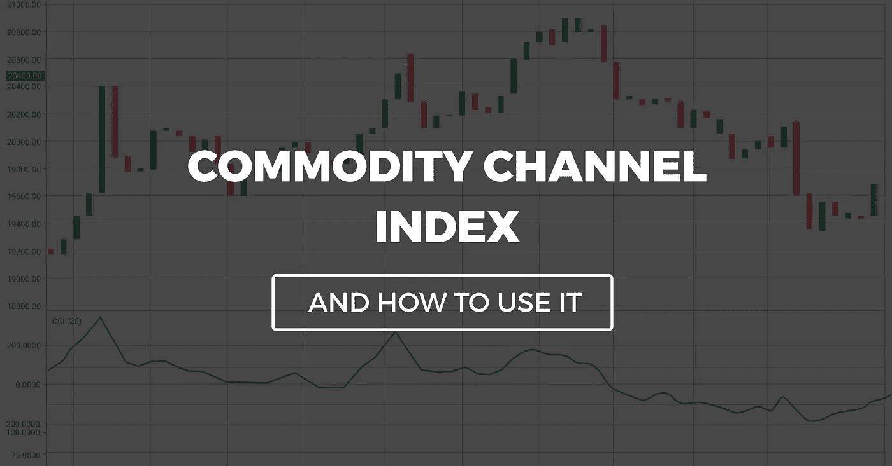
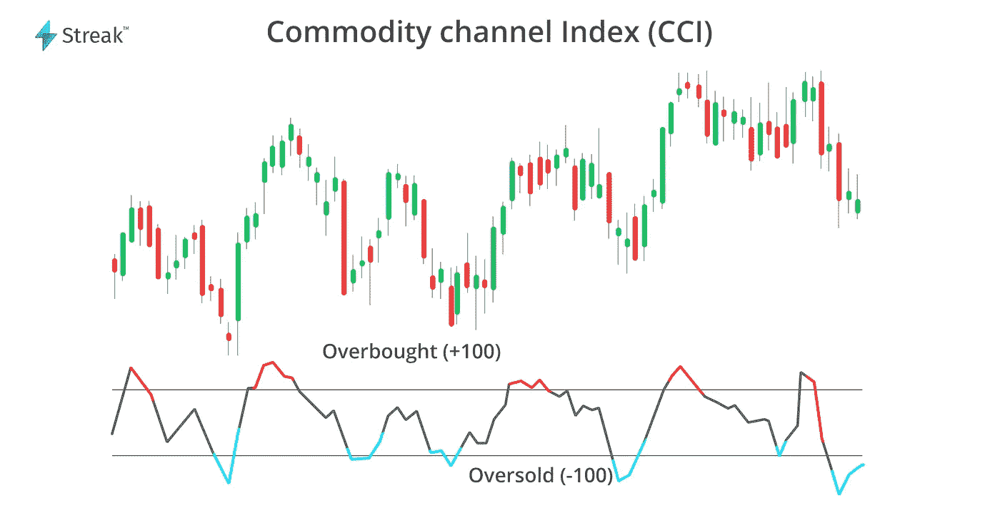
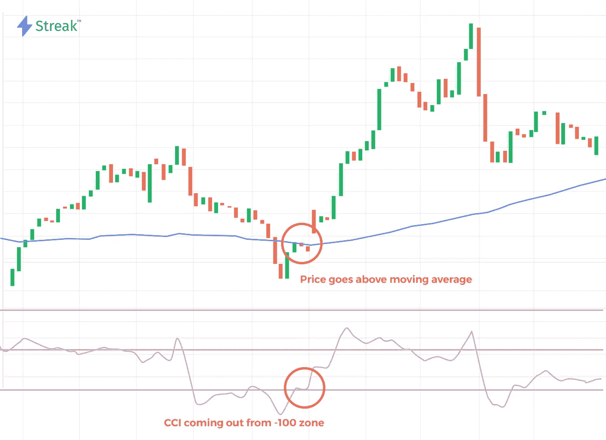
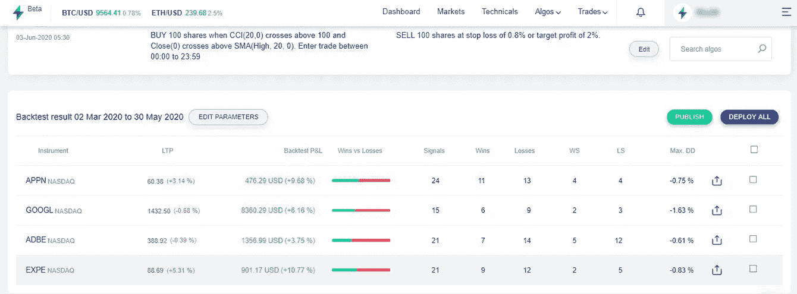

# 商品频道指数(CCI)

> 原文：<https://medium.datadriveninvestor.com/commodity-channel-index-cci-2989f46da3e4?source=collection_archive---------3----------------------->

学习以正确的方式交易。

Illustration 1: Commodity channel index

**CCI** 或**商品通道指数**是由**唐纳德·兰伯特**开发的，他是一位技术分析师，于 20 世纪 80 年代在《商品》杂志上发表了该指数。这是一个振荡指标，最初是为了跟踪商品市场的长期趋势而开发的。自从引入以来，该指标在交易者群体中有了深刻的发展，尽管它的名字，它可以用于任何市场，而不仅仅是商品市场。

CCI 是一个振荡指标，有助于识别周期性趋势。它在+100 和-100 之间振荡，基数为零。像任何其他振荡指标一样，它给我们超买和超卖的信号。

 [## 使用谷歌搜索趋势预测首次申请失业救济人数|数据驱动的投资者

### 几年来，我的重点一直是使用多种替代数据来预测宏观经济统计数据…

www.datadriveninvestor.com](https://www.datadriveninvestor.com/2020/03/25/using-google-search-trends-to-predict-initial-jobless-claims/) 

CCI 指示器的默认设置是 14 个周期，如果设置较短的周期，指示器的信号数量和灵敏度将会增加。

接下来，我们将讨论 CCI 指标，也称为商品通道指数；我们将讨论 CCI 背后的理论，然后突出一些真实的交易例子，向你展示 CCI 是如何运作的。

# 商品渠道公式

根据以下公式绘制 CCI

**CCI =(0.015×标准差)/(典型价格— SMA)**

这里，

0.015 =确定常数

典型价格=最高价+最低价+收盘价/ 3

SMA =它是给定期间绘制的简单移动平均线

标准差=它是一个简单的按价值绘制的移动平均线(典型价格 SMA)。

# 解释

大多数交易者和投资者使用这个 CCI 指标，因为它有助于他们识别价格反转、趋势强度和价格极限。像所有动量指标一样，CCI 将与其他指标结合使用，以从该指标中获利，我们应该寻找超买或超卖市场时期价格趋势的背离(正背离或负背离)。

让我们仔细看看它是如何工作的，

Illustration 2: Overbought and oversold zones

CCI 通常在零线上下波动。当 CCI 指标高于+100 时，价格进入超买区，当读数低于-100 时，它表明超卖区。与其他超买/超卖指标一样，它意味着价格将调整到相应的水平。这意味着，如果读数处于超买区(高于+100)，价格将会修正并回落至其标准范围，反之亦然。

# 如何在日内交易中使用 CCI？

现在我们知道了 CCI 的基本原理，让我们讨论一下如何在日内交易中使用这个流行的指标。如前所述，如果结合使用，该指标会产生更好的结果，并且需要与其他工具结合使用。

在这篇文章中，我们将讨论 CCI 与一个移动平均线。

我们将使用默认设置添加一个简单的移动平均值来提高信号质量。

Illustration 3: CCI with moving average

**买入信号:**当 CCI 从超卖区出来，价格应该从下方突破移动平均线。

**卖出信号:**当 CCI 走出超买区时，价格应该突破上方的均线。

我还将它与 [Streak.world](https://streak.world/) 结合起来，以评估这一策略在现场市场的表现。这是在上述条件下对每日时间框架内的策略进行的回溯测试。止损和目标利润分别为 0.8%和 2%。

Illustration 4: Backtest result of CCI with moving averages using [Streak.world](https://streak.world/)

# 外卖食品

商品通道指数 CCI 是一个有效的指标，因为它能够识别趋势反转和趋势强度。CCI 策略的首要原则也可以应用到你的交易策略中。所有的市场都是周期性波动的，所以我建议将 CCI 指标与更长的时间框架结合使用，因为根据回溯测试结果，这将产生更好的交易表现。