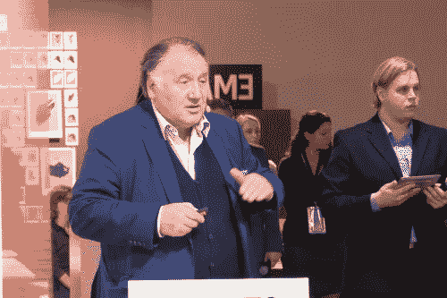
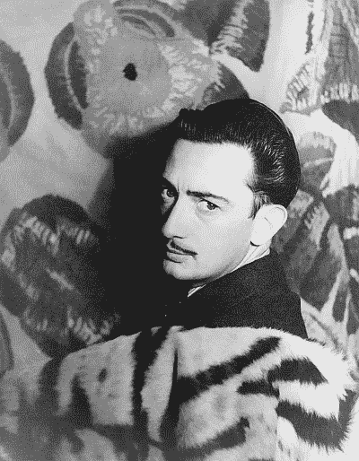

# 艺术、科学和梦想的共同本质

> 原文：<https://medium.datadriveninvestor.com/common-substance-of-art-science-and-dreams-88fa7682a40b?source=collection_archive---------16----------------------->

## **“日光之下并无新事”(**传道书 1:9 **)**

Stil from [‘Active Water’ commercial](https://www.mrmoco.com/first-3d-animation-made-entirely-water-droplets/)

强大而无限是人类的梦想。这个形而上学的思想世界可能是最持久的，它存在于有限的技术可能性、自然灾难和人类危机之外。

最近看了一个广告，用下落的水滴做投影面。

艺术家、设计师和科学家组成的团队使用 3D 技术、动作捕捉、频闪观测仪和良好的相机装备，实现了一个惊人的结果:3D 水动画:

有趣的是，这个想法并不新鲜。几年前，在法兰克福书展(这也是全球最重要的媒体峰会之一)[上，我参加了**ZKM(**](https://merzdadaco.hypotheses.org/729)[**Zentrum für Medien und Kunst Karlsruhe**](https://zkm.de/en)**)**在**法兰克福书展**上的数字艺术项目展示。这个与媒体艺术高度相关的机构的代表是其首席执行官兼媒体科学家彼得·韦贝尔。

Peter Weibel (Photo: Merzmensch)

在各种项目的展示中，他还提到了**朱利叶斯·波普**和他的精彩装置 [**比特·法尔**](https://www.illuminateproductions.co.uk/bitfall) (2010):

二维的文字和符号被投射在下落的水滴上，让第三维空间发挥作用。这个装置有一个[哲学和媒体批判的背景](https://www.illuminateproductions.co.uk/bitfall):

> *机器是一种象征，这些意义或价值可以变化得非常快；今天对我们重要的事情，明天可能会完全不同。(* [*【尤利波普】*](https://www.illuminateproductions.co.uk/bitfall) *)*

液态介质和光的结合完美地展示了数字时代价值观和信息的短暂性。

但是这个想法背后的历史可能起源于 20 世纪。超现实主义者萨瓦尔多·达利在他的日记中描述了 1949 年的一个奇怪的梦(他也做了奇怪的梦)。醒来后，他把他的梦转移到一种艺术方法上:

*Salvador Dalí 1939 (*[*Source*](https://en.wikipedia.org/wiki/Salvador_Dal%C3%AD#/media/File:Salvador_Dal%C3%AD_1939.jpg)*)*

这是我的食谱:你把五袋鹰嘴豆放进一个更大的袋子里，这个袋子可以装下所有的鹰嘴豆；你从 35 英尺的高度扔下豌豆；用一盏足够强的电灯，你可以在落下的小鸡豌豆上投射出一个圣母像…”

每个粒子只反射整个图像的一部分。录下后倒放，会变成一个假设玛丽的假象。

([天才日记，1966/1986](https://books.google.de/books?hl=de&id=a3MxAQAAIAAJ&focus=searchwithinvolume&q=chick)

因此，超验的经验将成为视觉的。

同样的技术方法可以应用于形而上的，艺术的，甚至是营销的需要。

的确，日光之下并无新事。但是旧的方法会变成新的。每一个想法——无论是天才的微小火花还是复杂的概念——都不是原创的，而是人类思维和我们文明的一部分。即使我们没有意识到我们在时间和空间上的永久联系。

【DataDrivenInvestor.com】这篇文章还发表在