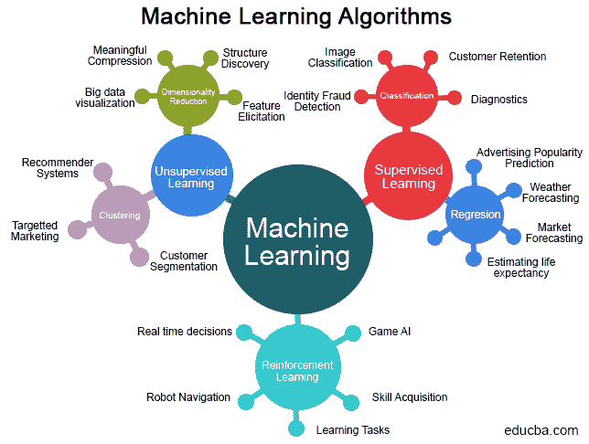

# 成功候选人在机器学习面试中表现出的共同特征

> 原文：<https://medium.datadriveninvestor.com/common-traits-successful-candidates-display-in-machine-learning-interviews-bd481a6b1106?source=collection_archive---------12----------------------->

在人类身上有一些每个人都欣赏的特质和特征，即使他们是 ML 工程师(大脑嫉妒是真实存在的)。

以下是大多数成功候选人似乎共有的特质。

要合作。机器学习不是一个人的游戏。这更像是一项团队运动。当你找到一份 ML 工程师的工作时，你可能会与技术人员和非技术人员一起工作。此外，你还应该具备出色的沟通和领导技能，以便与团队合作并领导团队。

另一个重要的特征是自我意识。拥有从错误中学习的能力很重要。为自己的错误辩护不会让你走得太远。这只是告诉世界你不能接受你的失败的一种方式。

最后但同样重要的是，保持谦逊，对自己的工作充满热情，因为这是你做出积极贡献的方式。为了说明我的意思，我将引用 Deep Dhillon 的话，他是 Xyonix 的创始人。

> **人才难求。他们现在得到了过高的报酬，却没有得到充分的利用。脸书、谷歌和亚马逊正在招聘所有的顶尖人才。博士毕业生去这些公司是为了提高营销活动、广告收入和点击率，而他们可以像我们在 Xyonix 一样从事其他项目。我们永远专注于人工智能。其中一些项目包括:**
> 
> *● *医院单位患者人口普查预测器**
> 
> *● *基于智能手机和音频的异常心跳检测器**
> 
> *● *体内手术的自动视频注释和分割引擎**
> 
> *● *摇滚明星观众自然语言文本对话解析器和自杀意念检测器**
> 
> *● *用于情感和自动化洞察提取的医疗手术文本审查解析器**
> 
> *如果你想在一家大公司工作，使用大型数据集，这没问题。他们的一些项目不仅仅是营销和销售。不管怎样，这都没有错。我的挑战是问你自己，“你真的对此充满热情吗？”机器学习工程师和数据科学家需求量很大。去哪里做什么都不重要。你会得到很高的报酬，你会挣到可以维持生活的工资。区别在于你如何影响世界，以及你在日常生活中使用技术做什么。”*

* [## 机器学习和人工智能如何改变电子商务的面貌？|数据驱动…

### 电子商务开发公司，现在，整合先进的客户体验到一个新的水平…

www.datadriveninvestor.com](https://www.datadriveninvestor.com/2020/11/19/how-machine-learning-and-artificial-intelligence-changing-the-face-of-ecommerce/) 

# 错误的采访和应该避免的

面试中你应该避免犯的三个最大的错误是什么？

微软需求优化主管阿尼班·森古普塔(Anirban Sengupta)表示，潜在候选人的三大死罪是:为了给面试官留下深刻印象而放弃重大条款，关注工作的数量而不是质量，以及无法描述你过去的项目。

这些错误听起来确实很糟糕。但是也有错误——比如人们匆忙做事，没有花时间正确回答问题。让我这么说吧，如果你不知道所有的事情也没关系，只要你非常了解一些事情。始终关注质量。如果你不知道什么，直接承认并展示你的学习热情。通过这个过程向潜在雇主证明，如果可以的话，你可以在整个过程中学到一些新东西。在我们与一些 ML 领导者的交谈中，有一种趋势，ML 工程师会显示他们快速学习新东西的能力，这显示了学习的高度。

此外，试着不只是一个回答问题的机器人参与者。你不应该回避问自己的问题，例如，如果你不确定面试官想要什么，就告诉他们。公开你知道或不知道的事情。面试官想体验一下每天和你一起工作的感觉。如果你在面试中缺乏合作或澄清问题的能力，他们自然会认为你在工作中避免问澄清问题。

面试官通常感兴趣的是判断你的分析能力，以及你如何处理问题。他们想测量你的思维过程。这就是为什么诚实和精确是一个好主意。哦，恢复通货膨胀是一个大禁忌。说真的，不要这样做。如果你撒谎，很快就会被发现。面试官会深入一个你不完全理解的话题，当你说出你的想法时，这一点很明显。

## 访问专家视图— [订阅 DDI 英特尔](https://datadriveninvestor.com/ddi-intel)*