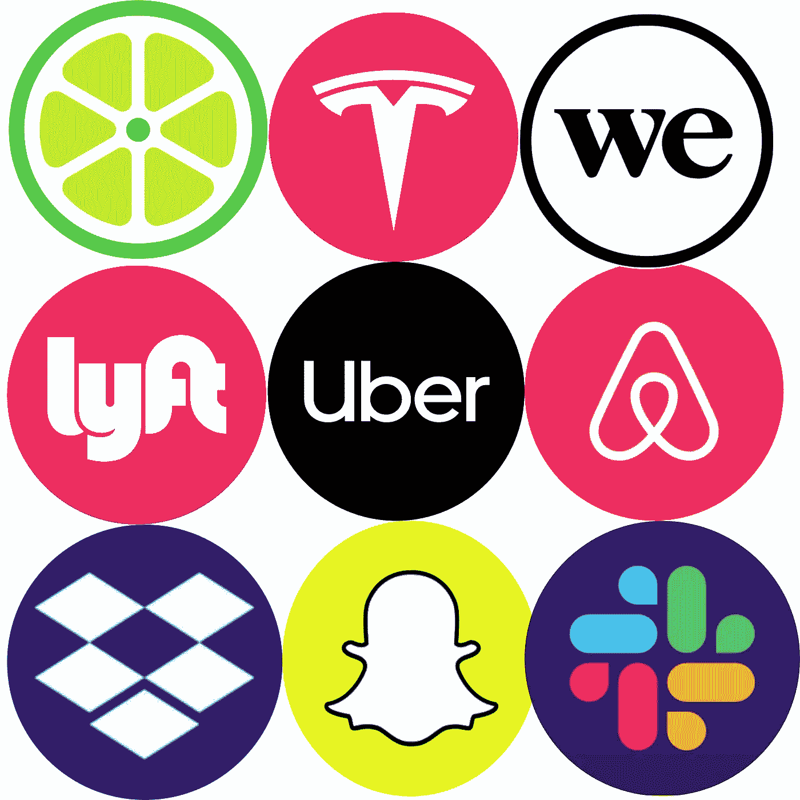

# 不盈利的公司受到了太多的关注

> 原文：<https://medium.datadriveninvestor.com/companies-that-dont-make-a-profit-are-given-way-too-much-attention-ce97e8fee831?source=collection_archive---------46----------------------->

Designed by ME!

你会一直听到这句话。*这是下一个大事件*。*认真地。*你会在体育赛事中听到:*下一个迈克尔·乔丹…下一个贝比·鲁斯…* 这些流言蜚语的球员经常以退出赛场而告终，再也没有人听到他们的消息。

投资股票也是如此。彼得·林奇在他 1994 年出色的白宫演讲中提到了这一点。

优步、Lyft、Airbnb 和 WeWork 经常因成为“下一个大事件”而成为头条新闻，尽管它们都连续多年亏损。他们基于的想法可能很棒。可能有很多用户喜欢这个产品，但事实是它赚不到钱。

优步平均每辆车损失 58 美分。这太可怕了，而且这是一家上市公司。它目前的交易价格比其 IPO 价格高出 20%，这正好证明了人们会支持任何能产生一定压力的东西。Airbnb 也在亏损，但它本周才上市，所以我们还不能对此做出判断。任何公司都不可能在这种情况下长期生存

亏本出售产品的公司不是盈利公司，而是自称为“公司”的慈善机构。

# WeWork:一个巨大损失的案例

WeWork 成立于 2010 年，是一家完全基于千禧一代的公司。首席执行官亚当·诺伊曼(Adam Neumann)明白，要让他们的公司(只不过是一家大规模转租公司)与众不同，他们需要专注于自己的品牌。诺伊曼和另一位联合创始人米格尔·麦凯尔维(Miguel McKelvey)观察了当前蓬勃发展的一代，即千禧一代，意识到他们需要将业务重点放在他们身上。

看看他们的网站，你会发现共同工作空间里摆满了沙发、看起来不像椅子的椅子，还有无数次提到他们的“环保工作站”他们理解千禧一代。

然而，亚当·诺依曼将此提升到了一个全新的高度。

他们称自己的算法为“社区技术”，可以在网上为你找到房间下面是诺伊曼的一段话。

> "我们的使命是提升世界的意识。"—亚当·诺依曼

哇，我想我的眼睛在我的后脑勺转了一下。太多了？还有更多。

> “WeWork 其实并不是一家房地产公司。这是一种意识状态，是一代相互联系的情商企业家。”—亚当·诺依曼

上帝啊。

WeWork 的商业模式没什么特别的。他们所做的只是与业主签订一份超长租约，然后以更小的月租形式加价转租给他人。没有什么能阻止这栋楼的主人自己做同样的事情。因此，WeWork 的价格通常比其他产品更贵。当你的价格更高时，再多的环保椅子也不会吸引顾客。

WeWork 继续在巨额亏损的情况下运营，然后决定做一件事，将他们的公司从濒临死亡的边缘拯救出来。

他们开办了一所学校。

是的，你没看错。WeGrow 是一所耗资高达 42000 美元的小学**。真是天才之举。**

**抱歉，我刚意识到讽刺不能通过文字很好地翻译。让我重新措辞。**

**这是一个可怕的举动，只是最坏的。**

**我们的工作只能持续这么长时间。它很快获得了这个名字，“[世界上最被高估的创业公司](https://www.youtube.com/watch?v=DwAyUV6hTf8)”，估值高达 470 亿美元。**

**然后，一切都变成了现实。**

**WeWork 在 2018 年亏损超过 20 亿美元，即便如此，他们还是申请了 IPO。470 亿美元的估值暴跌至 100 亿美元左右，显示出它的实际估值有多高。诺伊曼辞去了首席执行官的职务，公司停止了他们正在进行的所有无用的激情项目，比如 WeGrow，他们把它卖给了诺伊曼的妻子:Rebekah Neumann，WeWork 的第三位联合创始人。**

**2020 年 5 月，WeWork 的估值跌至 29 亿美元，是人们所说的其峰值价值的 6%。**

**像 WeWork 和优步这样的公司以低于生产成本的价格出售产品，希望借此获得市场份额。这通常不起作用(尤其是在优步的情况下)。优步的市场份额一直在稳步下降。**

**我们讨论了公司这样做的原因。现在让我们来看一下如何做。**

# **怎么做**

**下一个出现的问题是“怎么做？公司怎么会长期奉行这种赔本赚吆喝的策略呢？”**

**答案是 1560 亿美元的软银。软银是所谓的“控股公司”:拥有公司的公司，就像沃伦·巴菲特的伯克希尔·哈撒韦公司一样。**

**软银有一只基金，名为“愿景基金”，主要由阿联酋和沙特阿拉伯出资。如果你的公司产生了大量的媒体报道，并经常被称为“下一个大事件”，软银感兴趣。到目前为止，他们已经投资了优步、ARM Holdings、DoorDash，当然还有 WeWork。当然，他们投资的远不止这些，但这些都是大牌。**

**软银向优步和 WeWork 投入了大量资金，尽管它们目前处于亏损状态，希望以后能赚钱。这些公司用投资者的钱作为实际收入的 T2 替代品。因此，该公司的目标最终不是盈利，而是说服尽可能多的投资者加入进来。**

# **会发生什么**

**优步目前正尽力停止依赖投资者狂热，开始盈利。这主要是在他们更换首席执行官和他们的 IPO 不成功的事实之后，这是一个现实，即他们的天价估值只能在私人阶段为他们服务。**

**唯一的问题是，大多数投资者仍在追随炒作机器。像优步和 Airbnb 这样的公司是革命性的，但在没有历史数据支持的情况下，仅仅希望未来收益的投资并不是一种谨慎的投资。**

**当一家公司处于亏损状态时，它仍然未经考验。那家公司仍处于成熟期，是一项风险极高的投资。如上所述，当人们团结一致支持“下一件大事”时，最大的例子就是 WeWork。它当着所有人的面爆炸了。**

**真正“下一个大事件”的公司应该能够盈利。**

**我不是说优步不具有革命性，我是说在优步能够真正让 T4 扭亏为盈之前，这不是一个好的投资，我很确定这要求不高。**

## **但是风险投资呢？**

**这是必然的最后一个问题。"*为什么我们不能投资一家不盈利的公司？风险投资家一直都在这么做！*”**

**[风险投资人投资负责人](https://www.preferredcfo.com/12-things-venture-capitalists-look-for/)。他们花时间试图了解创始人和首席执行官。如果他们认为负责人是个好领导，那么他们就会投资这家公司。**

**大多数投资者没有那样的关系。他们不能去硅谷的咖啡馆，与世界各地的新创公司创始人接触。大多数投资者唯一的资源就是看新闻和财务报表。**

**你不能通过几次电视采访来判断达拉·科斯罗萨西(Dara Khosrowshahi)是什么样的领导人。这是不可能的。**

# **底线**

**我以前说过，现在再说一遍。优步和 Airbnb 在联系人的方式上是革命性的，但对于没有任何联系的普通投资者来说，投资一家不赚钱的公司不是一个好主意。**

**我支持优步和 Airbnb，我个人使用它们。但是，基本的事实是，对于普通投资者来说，投资任何一家仍处于亏损状态的公司都不是一项明智的投资。**