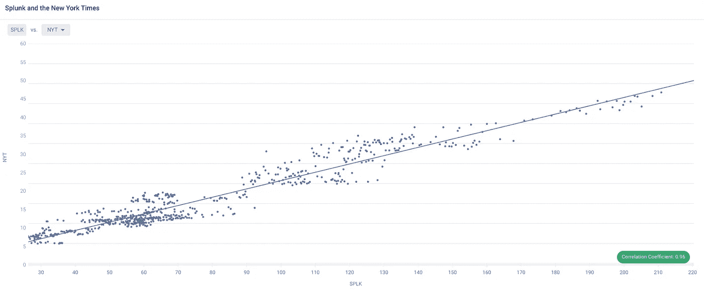
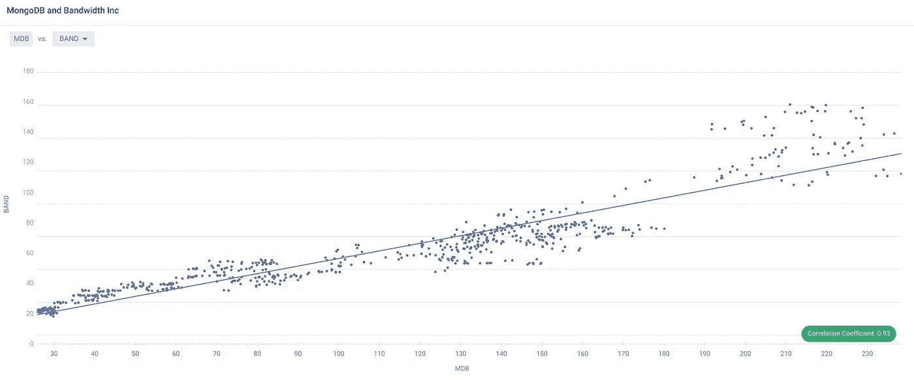
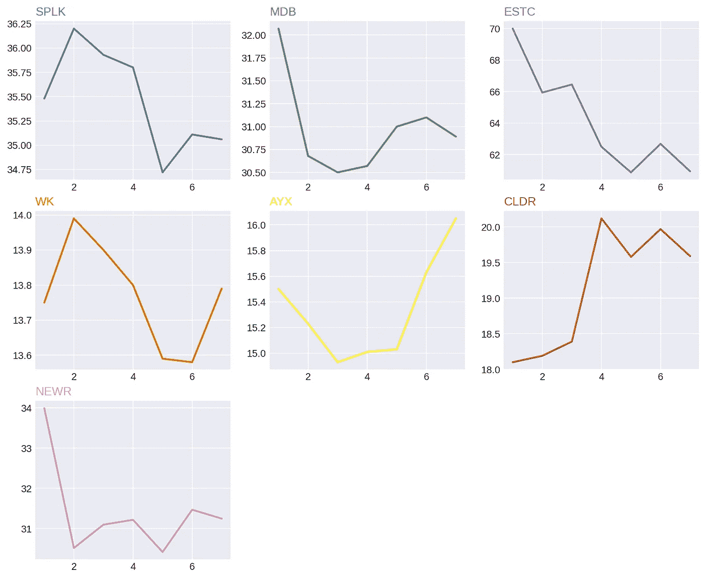
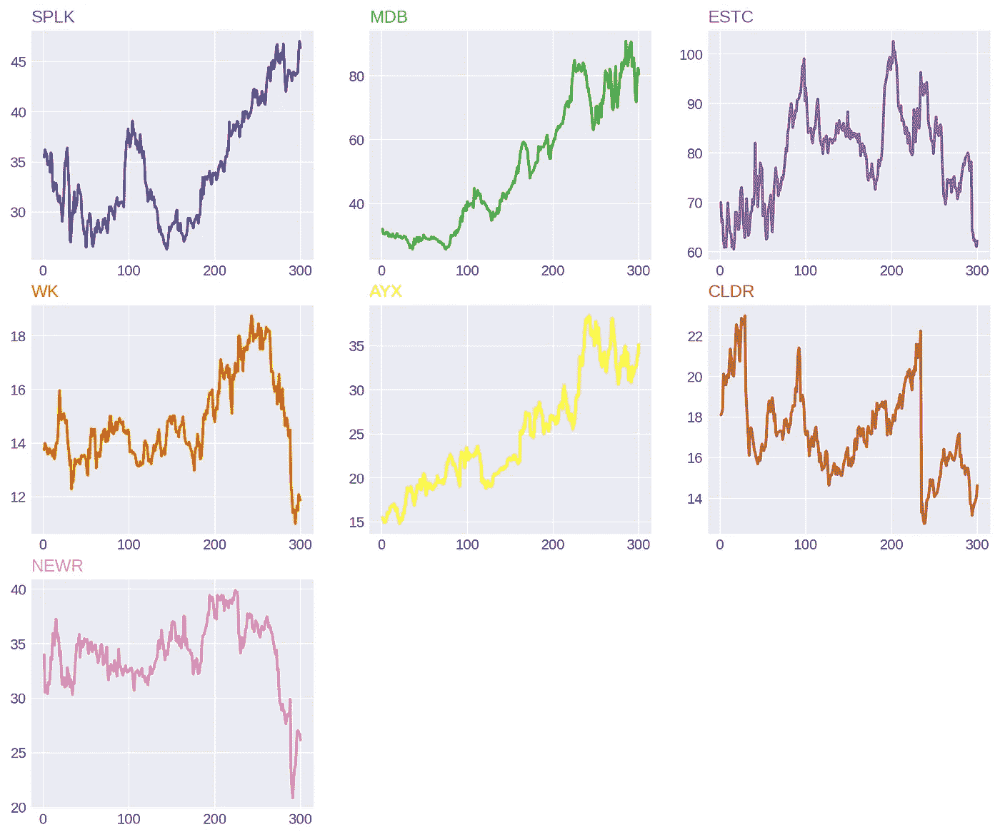
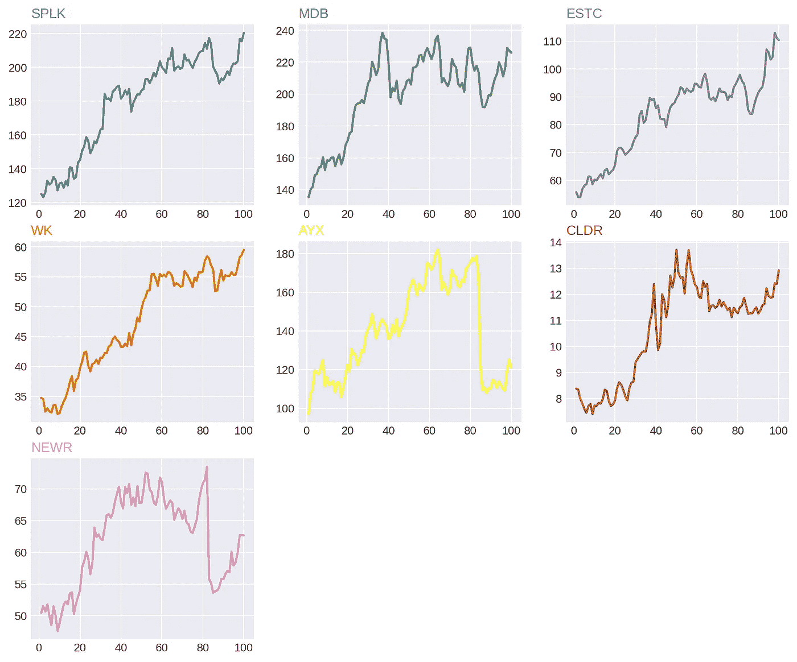

# 对比 2020 年数据 IPO:Palantir 与雪花

> 原文：<https://medium.datadriveninvestor.com/comparing-2020-data-ipos-palantir-vs-snowflake-46651c628605?source=collection_archive---------2----------------------->

## 分析两大数据巨头。


Photo by [Darius Cotoi](https://unsplash.com/@dariuscotoi?utm_source=medium&utm_medium=referral) on [Unsplash](https://unsplash.com?utm_source=medium&utm_medium=referral)

八月下旬，阿兰蒂尔的 IPO 文件被[泄露](https://techcrunch.com/2020/08/21/leaked-palantir-s-1-shows-company-has-125-customers-after-17-years/)。讽刺的是，帕兰提尔以其隐秘著称，有很多猜测，却没有很多答案。他们为银行和政府等大客户收集数据，并于 7 月提交了 IPO 申请。

估值 200 亿美元，客户包括默克、空客和法拉利，我们期待一些令人印象深刻的财务指标。事实正好相反。以下是泄露文件中的三大惊喜:

*   他们**只有 125 个客户**。
*   他们的年销售额不到 10 亿美元(2019 年为 7 . 42 亿美元，低于预期)。
*   他们报告称，2019 年净亏损 5.8 亿美元。

此外，Palantir 几乎所有的销售都来自现有的政府客户，因此他们并不是一家高增长公司。帕兰蒂尔也充满了丑闻。更不用说，他们的实际产品——数据收集和分析架构——收到了[可怕的](https://www.quora.com/What-are-ten-of-the-worst-things-about-working-at-Palantir-that-only-an-ex-Palantirian-would-know) [评论](https://news.ycombinator.com/item?id=12286512)。

# 雪花

雪花是另一个被大肆宣传的即将到来的数据 IPO。他们成立于 2012 年，旨在为云重塑数据库。

与 Palantir 不同，它们发展迅速，提供相对便宜的产品。截至 2020 年初，他们拥有超过 3400 名活跃客户——因此他们对个人客户的依赖程度远低于 Palantir。他们今年的收入有望达到 4 亿美元，年增长率高达 121%左右。

此外，雪花公司的首席执行官弗兰克·斯洛特曼已经有了两次成功的科技 IPO。IPO 是高度不确定的投机性市场事件，所以绝对没有保证，但雪花和帕兰提尔就像白天和黑夜。

# IPO 数据分析

为了帮助了解这些即将到来的 IPO 的潜在结果，我分析了其他 7 家数据公司过去的 IPO 数据:

```
Splunk ([SPLK](https://research.investors.com/quote.aspx?symbol=SPLK)). IPOd April 19, 2012.
MongoDB ([MDB](https://research.investors.com/quote.aspx?symbol=MDB)). IPOd Oct 19, 2017.
Elastic ([ESTC](https://research.investors.com/quote.aspx?symbol=ESTC)). IPOd Oct 5, 2018.
Workiva ([WK](https://research.investors.com/quote.aspx?symbol=WK)). IPOd Dec 12, 2014.
Alteryx ([AYX](https://research.investors.com/quote.aspx?symbol=AYX)). IPOd Mar 24, 2017.
Cloudera ([CLDR](https://research.investors.com/quote.aspx?symbol=CLDR)). IPOd Apr 28, 2017.
New Relic ([NEWR](https://research.investors.com/quote.aspx?symbol=NEWR)). IPOd Dec 12, 2014.
```

我用雅虎财经(Yahoo Finance)检索了这两家公司从 IPO 日期到 2020 年 8 月 31 日的股票数据。

然后，我通过将数据上传到 Apteo T1 来探索相关性。

[](https://www.datadriveninvestor.com/2020/06/19/artificial-intelligence-and-the-new-frontiers-of-brainsourcing/) [## 人工智能和“智力资源”的新领域|数据驱动的投资者

### “智力来源”是最近由赫尔辛基大学的研究人员开发的一项技术，它使用…

www.datadriveninvestor.com](https://www.datadriveninvestor.com/2020/06/19/artificial-intelligence-and-the-new-frontiers-of-brainsourcing/) 

## 相关

自上市以来，Splunk 的每日收盘价与《纽约时报》的每日收盘价之比为 0.96。这可能是因为它们都是“用数据讲故事”的公司(如果你还不是读者，就看看 NYT)，大投资者可能在相同的投资组合中拥有它们——所以买卖活动是相似的。

Splunk 和 NYT 可能也有我们不知道的联系。例如，Splunk 在 NYT 上有 [7 功能](https://www.nytimes.com/topic/company/splunk-inc)。

或者——可能只是巧合，让我们进一步探究。



我还发现 MongoDB 的每日收盘价与 Bandwidth Inc 的每日收盘价有 0.93 的 r。与 Splunk 和 NYT 一样，它们大致属于同一类别。在这里，它是数据基础设施。此外，带宽[在内部使用 MongoDB](https://www.bandwidth.com/blog/opkit-a-new-devops-bot-for-slack-optimize-communications-for-performance-and-reliability/) 。



Elastic NV，一个数据摄取平台——以前的 elastic search——与 Sprout Social 的 r 为 0.73，Sprout Social[使用 Elasticsearch](https://github.com/sproutsocial/eunomia) 。

根据 [Glassdoor 招聘公告](https://www.glassdoor.com/job-listing/director-sec-reporting-technical-accounting-caredx-JV_IC1147412_KO0,43_KE44,50.htm?jl=3561513462)，报告合规公司 Workiva 和使用 Workiva 进行 SEC 报告的 CDNA 的 r 为 0.94。

身份管理公司 Okta 和 alter yx——两个常用工具[一起使用](https://community.alteryx.com/t5/Alteryx-Server-Knowledge-Base/Configuring-SAML-on-Alteryx-Server-for-Okta/ta-p/175197)——的 r 值为 0.95。

GoDaddy 和 New Relic——另一对互补工具——的 r 为 0.87。

如果这种历史上的强相关性在 IPO 期间成立，如果你正在考虑 Palantir 或 Snowflake，那么看看其他数据公司的股价将是明智的。

## IPO 表现

现在，让我们来看看 7 家 IPO 的表现——从开始日期到一个交易周之后。



我们可以看到，在 IPO 后的头几天，3 只股票的价值上升，而 4 只股票的价值下降。在第一个交易周之后，七分之一的人保持不变(每周美元)，七分之四的人下降，只有七分之二的人略有上升(CLDR 和 AYX 美元)。显然，数据 IPO 远非“轻松赚钱”的保证。

帕兰提尔和雪花都有可能。

然而，在 IPO 期间买入股票，然后在一周后卖出，这更像是投机交易，而不是投资——所以让我们看看 300 个交易日之后的 7 宗 IPO。



现在，我们看到 3 只股票有非常强劲的涨幅，但这仍然是一个掷硬币的过程。$ESTC、$WK、$CLDR 和$NEWR 在 300 个交易日之后都下跌了。回想一下，$CLDR 实际上有一个积极的第一周，$WK 大致持平，而$MDB 和$SPLK 表现不佳，但经过 300 个交易日的巨大收益。

早期表现显然不能代表长期表现。

## 当前市场

有一点是肯定的，当前的市场是一个疯狂的牛市。虽然有些人认为这只是一个“牛市陷阱”，但股票正在飙升，包括上述所有 7 家数据公司。让我们看看他们的最后 100 个交易日(截至 2020 年 8 月 31 日)。



所有这些公司都经历了非凡的增长——甚至 AYX 在经历了暴跌之后也在上涨。

如果在 Palantir 和 Snowflake 首次公开募股期间牛市持续，市场的普遍乐观情绪可能会压倒一切。

# 摘要

至于 Palantir 和 Snowflake 的 IPO 结果如何，目前还没有明确的答案。只比较财务指标，雪花看起来像一个明显的赢家。然而，正如我们所见，数据 IPO 基本上是一场掷硬币的游戏，可能会随着整体市场情绪的方向而波动。

**访问专家视图—** [**订阅 DDI 英特尔**](https://datadriveninvestor.com/ddi-intel)