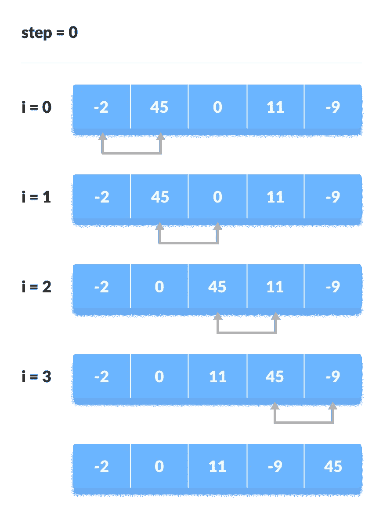
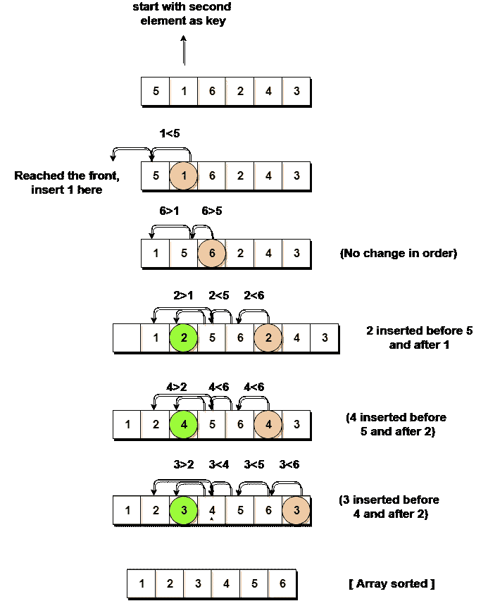
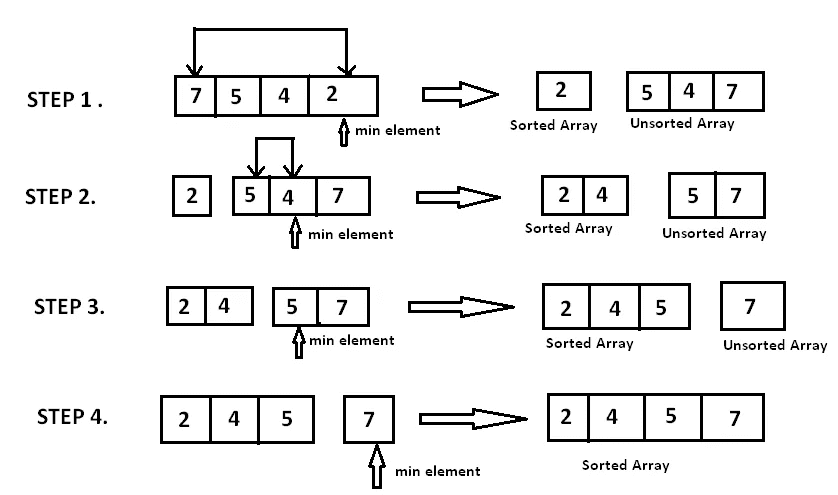
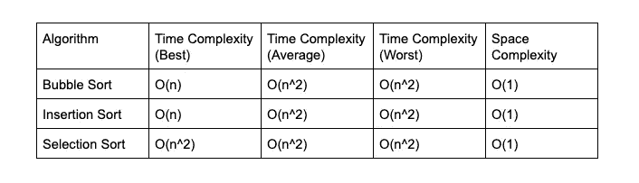

# 比较冒泡、选择和插入排序

> 原文：<https://medium.datadriveninvestor.com/comparing-bubble-selection-and-insertion-sort-11012f7736ee?source=collection_archive---------1----------------------->

Photo by [Jason Dent](https://unsplash.com/@jdent?utm_source=unsplash&utm_medium=referral&utm_content=creditCopyText) on [Unsplash](https://unsplash.com/s/photos/compare?utm_source=unsplash&utm_medium=referral&utm_content=creditCopyText)

我想比较三种基本的排序算法，冒泡排序、选择排序和插入排序。它们是基本的排序算法，但在数据集较小时更胜一筹。

# 冒泡排序

Bobble sort，有时也称为 sinking sort，反复遍历列表，比较相邻的元素，如果它们的顺序不对，就交换它们。重复遍历列表，直到列表被排序。该算法是一种比较排序算法，因较小或较大的元素“冒泡”到列表顶部而得名。

bubble sort

# 插入排序

插入排序一次构建一个最终排序的数组。它进行迭代，每次重复消耗一个输入元素，并生成一个排序后的输出列表。在每次迭代中，插入排序从输入数据中删除一个元素，找到它在排序列表中的位置，并将其插入到那里。它重复进行，直到没有输入元素。

Insertion Sort

# 选择排序

选择排序是一种就地比较排序算法。该算法将输入列表分为两部分:在列表左侧从左到右构建的已排序项目子列表，以及占据列表其余部分的剩余未排序项目子列表。

 [## 算法诱人的商业逻辑|数据驱动的投资者

### 某些机器行为总是让我感到惊讶。我对他们从自己的成就中学习的能力感到惊讶…

www.datadriveninvestor.com](https://www.datadriveninvestor.com/2019/03/22/the-seductive-business-logic-of-algorithms/) 

该算法通过找到未排序子列表中的最小元素，将其与最左边的未排序元素交换，并将子列表边界向右移动一个元素来进行。

Selection Sort

现在，我会告诉你它们都有二次的平均时间复杂度。

这是他们的大 O 对比。

在最好的情况下，它们的时间复杂度有一个不同。在几乎排序的数据中，冒泡排序和插入排序需要很少的交换。然而，选择排序需要相同数量的搜索过程，即使是在几乎排序的数据中。使用这个链接:【https://www.toptal.com/developers/sorting-algorithms】的，你可以看到他们每个人表演的动画版本。如果您需要对数据进行连续排序，插入排序非常有用。它只需要一条路径。另一方面，如果我们使用插入排序，我们将重新排序整个事情。它无法立即确定具体需要去哪里。

现在，**的空间复杂度**，它们都一样。这是因为这些算法并没有占用太多的空间。一切都发生在一个地方，我们实际上并没有创建新的阵列。我们不是为每个元素创建一个变量。