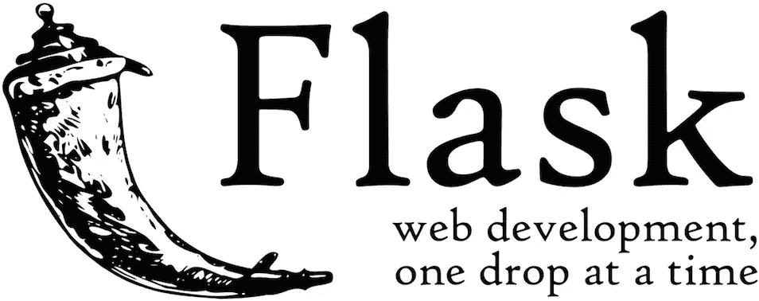

# FastAPI 和 Flask 的比较。简单解释！

> 原文：<https://medium.datadriveninvestor.com/comparison-of-fastapi-and-flask-simply-explanation-c8c075f6aa80?source=collection_archive---------1----------------------->

每当开发人员开始机器学习或深度学习时，都有一些东西被认为是必不可少的。他们中很少有人是

*   机器学习的概念。
*   Python 或 R 语言——被认为是 ML 中最重要的语言
*   Tensorflow 或 Pytorch —面向 ML 和 DL 的端到端开源平台
*   Flask——为了生产 ML 模型，我们通常将模型包装在 REST API(主要是 flask)中，并将其作为微服务。
*   docker——使用操作系统级虚拟化来交付软件包(称为容器)的平台。

让我们讨论一下 Flask micro 服务的一个更好的替代品 FastAPI。

## 如果你赶时间，跳到 FastAPI 和 Flask 的比较，这会给你一个简单的概念。

[Source](https://mc.ai/how-to-learn-machine-learning-from-scratch-and-for-free/)

我想是时候学习新东西了。让我们开始吧…

# 瓶

Flask 是目前用 python 编写机器学习框架 API 的首选。为什么这样与 Django 相比，Flask 有很多优势。尽管有其他替代方案，但 flask 还是与 Django 进行了比较，Django 具有更多功能，但比 Flask 复杂。

Flask 是一个基于 Python web 框架当前/旧标准的框架:WSGI。

[Source](https://www.fullstackpython.com/flask.html)

据我所知，flask 的主要优点是它的设计非常轻便，而且是 T2 模块式的。它还提供了强大的社区支持，并为开发者开始工作提供了**良好的文档**。flask 100%符合 WSGI，使得**易于部署**用于生产。Flask 与 ORM 无关，开发者可以插入他们喜欢的 ORM。它还可以轻松地处理 HTTP 请求，并且比 Django 更加灵活。最后但同样重要的是，由于大多数数据科学家和机器学习开发人员使用 Python 工作，而 Flask 是用 **python 编写的，**导致 Flask 被广泛使用。但是 flask 也有一些缺点。如果我们在处理一个大项目，很少会浪费时间。此外，flask 依赖于**许多依赖关系**，例如对于管理站点，它使用 **Flask-admin** ，它**没有默认的模板引擎**，而是附带了另一个免费的依赖关系 Flask，即 Jinja2。

 [## 软件开发过程:如何选择正确的过程？数据驱动的投资者

### 软件是任何企业组织成功的生命线。没有软件的帮助，一个…

www.datadriveninvestor.com](https://www.datadriveninvestor.com/2020/01/16/software-development-process-how-to-pick-the-right-process/) 

# FastAPI

FastAPI 是构建在 **Starlette 和 uvicon**之上的框架。 **Starlette** 是一个轻量级 ASGI 框架/工具包，是构建高性能 asyncio 服务的理想选择。**uvicon**是一个**快如闪电的 ASGI 服务器**，建立在 **uvloop 和 httptools** 之上。顾名思义，FastAPI 是最快的微服务框架。

[Source](https://github.com/tiangolo/fastapi)

## Flask 和 FastAPI 的比较

正如我们已经提到的，Flask 是一个基于 Python web 框架当前/旧标准的框架 **WSGI。** FastAPI 是一个构建在 **Starlette 和 uvicon**之上的框架。

几乎所有你在 flask 中能做的事情都可以用 Starlette 来完成，也就是说用 FastAPI。由于 FastAPI 是基于 Starlette 的，所以继承了它的所有特性。包括 WebSockets、GraphQL 支持、模板等。最重要的是，FastAPI 学习了 Flask 并继承了一些东西，包括它的简单性。

## 为什么要选择 FastAPI 而不是 Flask？

*   FastAPI 被认为是最快的 python web 框架。它优于 flask 100%以上。
*   你可以尝试切换的另一个重要原因是**自动缩放**。因为 Flask 是为像 Gunicorn 这样的 WSGI 服务设计的，所以它不提供本地异步支持。对于自动扩展，需要异步计算排队和进行中的请求。
*   FastAPI 为我们提供了强大的依赖注入系统，这意味着**无限插件**。当您使用 FastAPI 时，您的 API 将与 OpenAPI、JSON Schema 和 OAuth2.0 兼容，这将由 FastAPI 处理。
*   减少延迟和高吞吐量是 FastAPI 相对于 Flask 的另一个优势。这将有助于在某些情况下忽略更多的硬件依赖，这也有助于降低成本。
*   将**从 Flask 转移到 FastAPI 非常容易，因为它们提供了几乎相似的代码结构。**

首先，这并不意味着你应该选择 FastAPI 而不是 Flask。因为从 Flask 切换到 FastAPI 非常方便，所以我个人觉得花 20-30 分钟来看看这个新框架是值得的。

希望这个博客对你有用。非常感谢你的时间。有任何疑问或建议，请回来找我。

 [## Raoof Naushad -人工智能工程师- Accubits 技术公司| LinkedIn

### 查看 Raoof Naushad 在世界上最大的职业社区 LinkedIn 上的个人资料。Raoof 有 6 份工作列在他们的…

www.linkedin.com](https://www.linkedin.com/in/raoof-naushad-378432106/) 

**访问专家视图—** [**订阅 DDI 英特尔**](https://datadriveninvestor.com/ddi-intel)