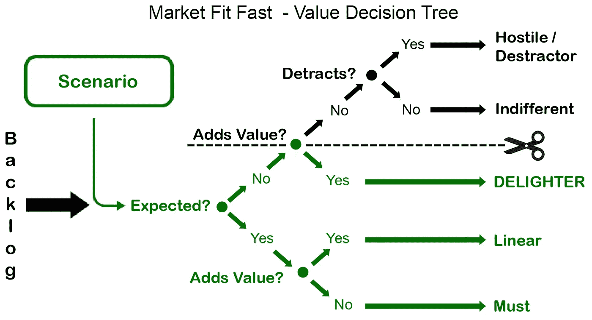
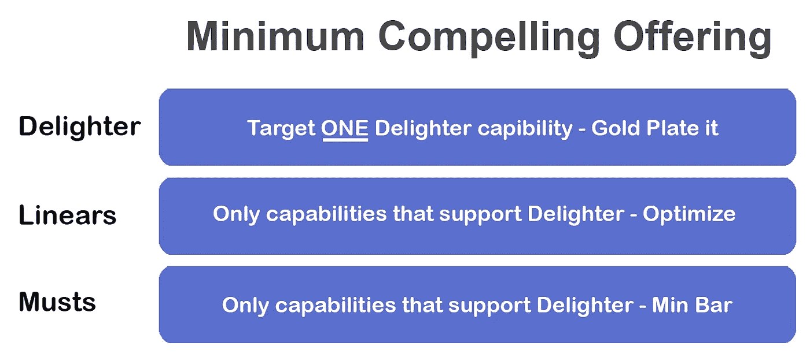

# 引人注目的是新的精益。“可行”是不够的。

> 原文：<https://medium.datadriveninvestor.com/compelling-is-the-new-lean-viable-is-not-enough-9b7ed73db8d5?source=collection_archive---------11----------------------->

# **如何赢得产品创新游戏并加快实现收益。**

大多数突破性的概念失败或成为僵尸，因为团队不知道如何推翻现状。他们不知道怎样才能引人注目。

膨胀的 MVP 是这个致命陷阱的关键指标。在本能水平上，团队知道他们过度构建了所需的特性，但是不知道构建了多少。这些团队正在构建他们不需要的功能，但是不知道应该删除哪些功能。所有这些都需要太长时间。然而，即使付出了所有这些额外的努力，大多数项目还是无法适应市场。

为什么创建一个最低限度的令人信服的产品的精确愿景如此困难(MCO)？

大多数创新者无法精确定义顾客如何评价他们的工作。这是因为他们毫无疑问地使用“高”对“低”的一维尺度，但不知道这是错误的。人们以更复杂的方式感知价值。因此，创新者往往无法提供令人信服的产品。

 [## 夏普比率悖论:为什么还要投资风险资本？数据驱动的投资者

### 夏普比率是一种基于风险量化回报的方法，具体来说，它是超过…

www.datadriveninvestor.com](https://www.datadriveninvestor.com/2020/03/29/the-sharpe-ratio-paradox-why-still-invest-in-venture-capital/) 

有一个更好的方法，一个更好的模型来了解人们如何思考价值，更重要的是，有一种方法来根据这些见解快速提供有吸引力的产品。

# 快速适应市场，最具吸引力的产品:

# 一个卓越的模型，将产品开发与人类真正评估价值的方式结合起来。

Market Fit-Fast 工具套件提供了一套久经考验的决策工具，可以改变团队的思考和行动方式。这种新方法提供了一种统一的语言，可以释放创造力，快速开发出真正有吸引力的产品。

当消费者考虑购买时，从糖果棒到汽车，他们本能地通过复杂的二维棱镜评估产品的每个功能。这个棱镜提供了五种不同类型的价值。

**The type of customer-value your capability delivers**

两个截然不同的值类型示例是:

‘必须’:对于大多数产品功能，它们的*只有*值是负的。他们的缺席是一个潜在的交易杀手，*但是*任何超出最低要求的功能都不会增加价值。这些能力通常是*‘超额交付’*。

“愉悦者”:相比之下，有些功能是不期望的，但是它们的存在可以增加价值。这些都是赢得竞争优势的潜在客户和机会。

一家汽车公司可能会提供一种带有优质车轮、制动器、发动机和底盘的车型。但在今天的家庭轿车市场，这可能并不令人信服——当一家竞争公司，即使基础较差，也提供自动驾驶。

通过将您现有的产品开发模型与市场适应快速决策工具提供的新见解相结合，您的团队可以想象并以新的方式交付引人注目的解决方案。

“快速适应市场”是第一个提供说明性指导的工具集，用于在您的产品路线图、规划流程和团队调整中操作这些革命性的见解。精益和敏捷的团队可以快速将他们的想法转化为精确的、可操作的路线图，发布速度通常会加快 4 倍。

**Deliver a compelling offering in a fraction of the time. Streamline your efforts to how customers value**

**好奇？你想:**

定义并提供一个令人愉快的、独特的、具有吸引力的销售主张？

调整您团队的工作和投资，以快速聚焦并交付最低限度的有吸引力的产品(MCO)？

——“金牌”只是一个引人注目的特性，能让你获得竞争优势？

-砍掉你不需要的，现在？

-现在你能做什么？

本文深入探讨了*客户价值加速器和最具吸引力的产品*，以及它如何影响您的项目: [***用极具吸引力的***](mailto:Replace%20Viable%20with%20Compelling) 替换可行的产品

或者

**如果是这样，请联系 patrick.hogan@gatewayadopters.com 的我**