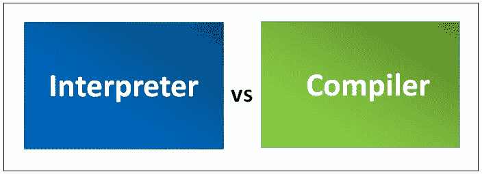

# 编译器 V/s 解释器(带音频)

> 原文：<https://medium.datadriveninvestor.com/compiler-v-s-interpreter-8b25c8b53d5b?source=collection_archive---------11----------------------->

**编译器:**

*   计算机程序将计算机程序的可读人类源代码翻译成处理器可以执行的可读代码。

**翻译:**

*   一种直接运行而不翻译成机器语言的计算机程序，即运行编程指令或脚本指令。
*   单个指令被用作输入。没有创建中间目标代码。
*   解释器生成条件控制语句的比率要低得多。对内存的要求更少。
*   每一次较高级别的程序被翻译成较低级别的程序。
*   显示每个解释指令的错误(如果有)。
*   解释器会自动执行高级程序，所以解释器只在程序员需要在软件创建时添加时使用。

***C++是基于编译器的语言，JavaScript 是基于解释器的语言*** *。*JavaScript 在浏览器中运行。

源代码编译或翻译成机器码只有一次。编译器生成一个单独的可执行文件。运行程序时，你不需要编译器。它独立运行。

*   一个解释器一行一行地翻译和执行。一旦翻译成机器码，它会在你每次执行的时候翻译，直到出错点。它在解释器内部运行。
*   编译程序比解释程序快，因为它们只存在于编译器中。

***基于解释器的语言比基于编译器的语言简单。***

希望你喜欢。

希望得到积极的回应。

请关注我的@Medium 简介 [Yash Kamal Chaturvedi](https://yashkamalchaturvedi.medium.com/)