# 用 Python 实现线性回归与多项式回归的完整指南

> 原文：<https://medium.datadriveninvestor.com/complete-guide-on-linear-regression-vs-polynomial-regression-with-implementation-in-python-964c64c28aa8?source=collection_archive---------0----------------------->

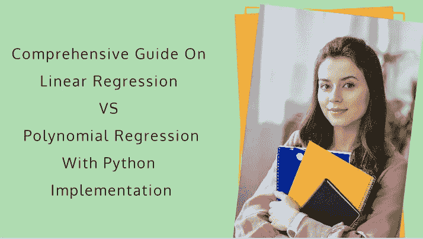

在我以前的文章中，我写了如何为我们的数据集绘制回归线。太酷了，对吧！但是还有一个问题，我们的模型越来越不精确。我们**的最终目标**始终是建立一个精确度最高、误差最小的模型。因此，在本文中，我们将了解如何通过使用曲线来实现最适合我们数据的多项式回归。

在此之前，这里有一些基本的多项式函数及其图形绘制。这将有助于您更好地理解对特定数据集使用哪个多项式。

**享受这篇文章吧！**

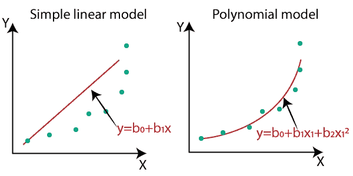

Comparison Between Models

## 多项式函数及其图形；

(1)曲线图为 **Y=X** :

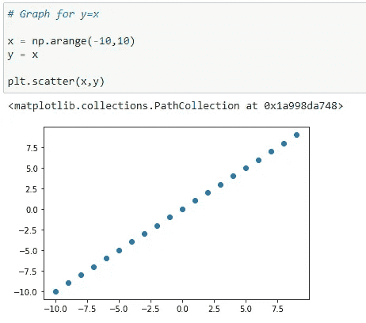

(2)曲线图为 **Y = X** :

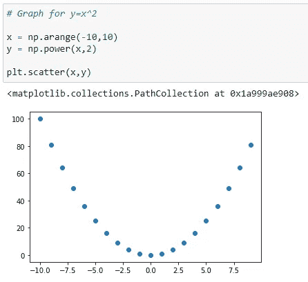

(3)曲线图为 **Y = X** :

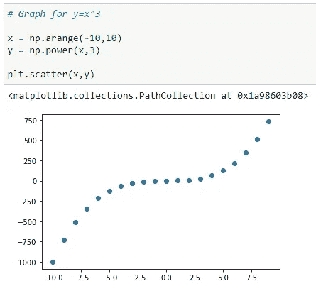

(4)多项式多于一个的图: **Y = X +X +X** :

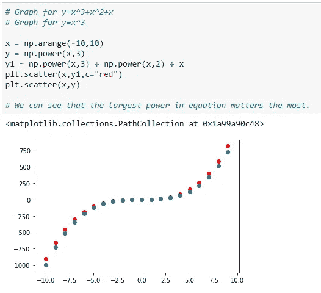

在该图中，您可以看到红点显示的是 Y=X +X +X 的图形，蓝点显示的是 Y=X 的图形。在这里，您可以清楚地看到，最大功率会影响我们的图形形状。

好了，让我们开始酷的部分吧！:)

好了，现在我们来看看为什么我们应该使用多项式(非线性)回归。这里我将举一个例子，对于第一部分，我将找到线性回归线并计算误差，对于第二部分，我将使用多项式回归，并找到最适合它的曲线并计算误差。然后，我们将比较这两个误差，看看哪个模型表现更好。

 [## 认知计算——一套被广泛认为是……

### 作为它的用户，我们已经习惯了科技。这些天几乎没有什么是司空见惯的…

www.datadriveninvestor.com](https://www.datadriveninvestor.com/2020/02/19/cognitive-computing-a-skill-set-widely-considered-to-be-the-most-vital-manifestation-of-artificial-intelligence/) 

在这里，我采用这个多项式函数来生成数据集，因为这是一个示例，我将向您展示何时使用多项式回归。我要加一些噪点，这样看起来更真实！

这里我们要用 [**正规方程**](https://medium.com/@shuklapratik22/multivariable-linear-regression-using-normal-equation-707d19f1c325) 实现线性回归和多项式回归。你可以 [**点击这里**](https://www.youtube.com/channel/UCpRJj1vjQsjCTB3S5ANvNvg) 查看各种机器学习算法的详细讲解视频。

让我们向前看，

正常方程如下:

在上面的等式中:

θ:最佳定义的假设参数。

x:输入每个实例的特征值

y:每个实例的输出值

# 简单线性回归:

**简单线性回归的假设函数:**

**y =β_ 0+β_ 1 * x**

**我们来编码:**

(1)导入所需的库:

(2)数据集生成:

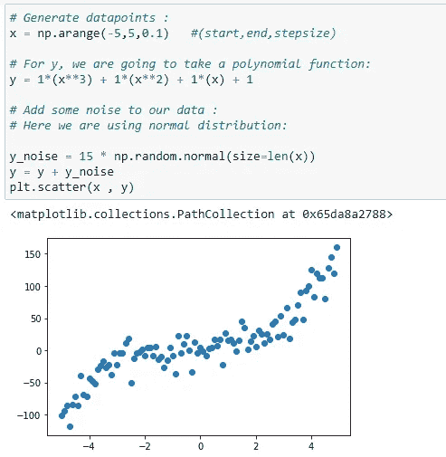

(3)x 的形状:

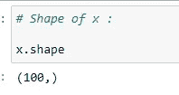

(4)主矩阵的第 1 列:

这里，列-1 将始终是β_ 0 系数的值，该值将始终为 1。但是要创建一个矩阵，我们需要把它看作一列。为了更好的理解 [**，点击这里**](https://youtu.be/wmmUJnmwQho)

(5)x _ bias 的形状:

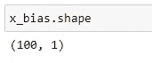

(6)因为我们需要用 x_bias 附加 x，所以它必须具有相同的形状:

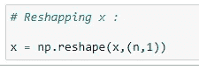

(7)最终矩阵 x:

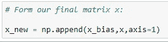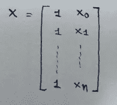

(8)矩阵转置:

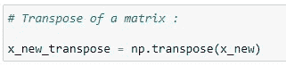

(9)矩阵乘法:

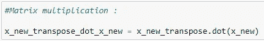

(10)矩阵的逆矩阵:

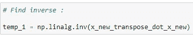

(11)矩阵乘法:

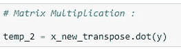

(12)求系数:

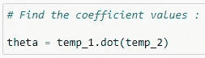

(13)绘制回归线:

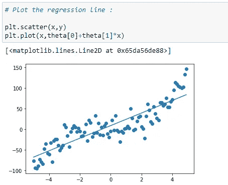

(14)预测功能:

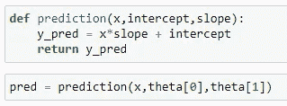

(15)计算均方误差:

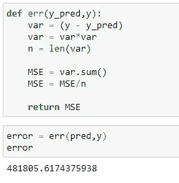

所以这里我们可以看到误差很高。让我们看看如果使用多项式方程会发生什么。

正常方程如下:

# 多项式回归:

## 多项式回归的假设函数:

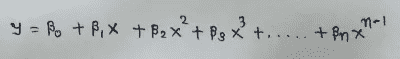

在哪里，

贝塔 _0，贝塔 _1，…是我们需要找到的系数。

x，x，x 是我们数据集的特征。

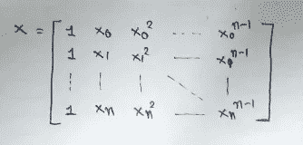

**咱们来码:**

(1)导入所需的库:

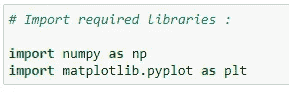

(2)生成数据点:

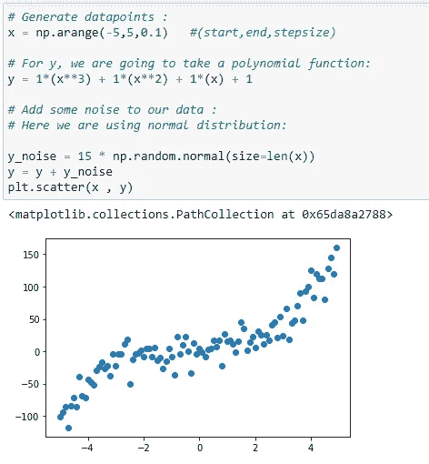

(3)初始化 x，x，x 向量:

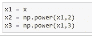

(4)X 矩阵的第 1 列:

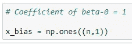

(5)形成完整的 x 矩阵:

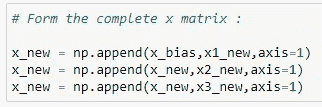

(6)矩阵的转置:

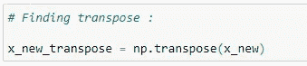

(7)矩阵乘法:

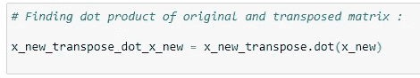

(8)矩阵的逆矩阵:

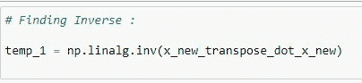

(9)矩阵乘法:

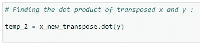

(10)系数值:

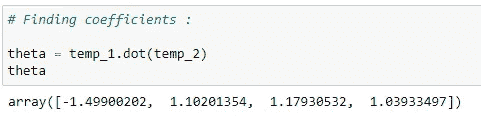

(11)将系数存储在变量中:

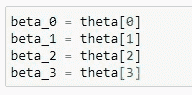

(12)用曲线绘制数据:

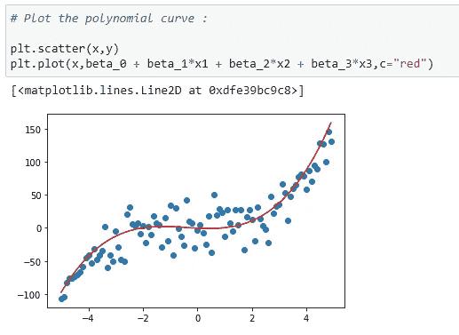

(13)预测功能:

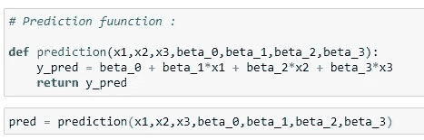

(14)误差函数:

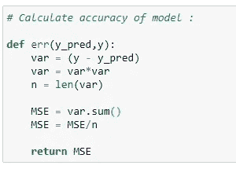

(15)计算误差:

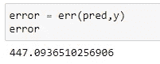

这里你可以看到误差**明显低于线性回归中的误差**。

所以我们可以说它做了一件相当好的工作。因此，总之，我们可以说，如果我们的数据集遵循曲线趋势，那么我们可以使用多项式回归获得更好的结果和准确性。

我希望你们喜欢这篇文章。如果你喜欢，请点击拍手图标。

## 向前看，

在下一篇文章中，我将展示如何用 python 实现其他多项式回归。

我所有的文章都在我的博客上:
[**patrickstar0110.blogspot.com**](http://patrickstar0110.blogspot.com)

**在我的 youtube 频道观看带有解释和推导的详细视频:**

【https://www.youtube.com/channel/UCpRJj1vjQsjCTB3S5ANvNvg**T21**

**(1)简单线性回归解释及其推导:**
[https://youtu.be/1M2-Fq6wl4M](https://youtu.be/1M2-Fq6wl4M)

**(2)如何从零开始计算线性回归中模型的精度:**
[https://youtu.be/bM3KmaghclY](https://youtu.be/bM3KmaghclY)

**(3)使用 Sklearn 的简单线性回归:**
[https://youtu.be/_VGjHF1X9oU](https://youtu.be/_VGjHF1X9oU)

**(4)机器学习数学(矩阵)讲解:**
[https://youtu.be/1MASyeyAydw](https://youtu.be/1MASyeyAydw)

**(5)正规方程的完整数学推导:**
[https://youtu.be/E7Q4UP6bNmc](https://youtu.be/E7Q4UP6bNmc)

**(6)利用正规方程实现简单线性回归:【https://youtu.be/wmmUJnmwQho】** 

## 阅读我的其他文章:

(1)从零开始线性回归:
[https://medium . com/@ shuklapratik 22/Linear-Regression-从零开始-a3d21eff4e7c](https://medium.com/@shuklapratik22/linear-regression-from-scratch-a3d21eff4e7c)

(2)暴力线性回归:
[https://medium . com/@ shuklapratik 22/Linear-Regression-line-Through-Brute-Force-1 bb6d 8514712](https://medium.com/@shuklapratik22/linear-regression-line-through-brute-force-1bb6d8514712)

(3)线性回归完全推导:
[https://medium . com/@ shuklapratik 22/Linear-Regression-Complete-Derivation-406 f 2859 a09a](https://medium.com/@shuklapratik22/linear-regression-complete-derivation-406f2859a09a)

(4)简单线性回归实现从头开始:
[https://medium . com/@ shuklapratik 22/Simple-Linear-Regression-Implementation-从头开始-cb4a478c42bc](https://medium.com/@shuklapratik22/simple-linear-regression-implementation-from-scratch-cb4a478c42bc)

(5)从零开始简单线性回归:
[https://medium . com/@ shuklapratik 22/Simple-Linear-Regression-implementation-2fa 88 CD 03 e 67](https://medium.com/@shuklapratik22/simple-linear-regression-implementation-2fa88cd03e67)

(6)梯度下降及其数学:
[https://medium . com/@ shuklapratik 22/what-is-Gradient-Descent-7eb 078 FD 4c DD](https://medium.com/@shuklapratik22/what-is-gradient-descent-7eb078fd4cdd)

(7)从无到有梯度下降的线性回归:
[https://medium . com/@ shuklapratik 22/Linear-Regression-With-Gradient-Descent-From-Scratch-d 03 DFA 90d 04 c](https://medium.com/@shuklapratik22/linear-regression-with-gradient-descent-from-scratch-d03dfa90d04c)

(8)线性回归误差计算技巧:
[https://medium . com/@ shuklapratik 22/Error-Calculation-Techniques-For-Linear-Regression-AE 436 b 682 f 90](https://medium.com/@shuklapratik22/error-calculation-techniques-for-linear-regression-ae436b682f90)

(9)机器学习用矩阵介绍:
[https://medium . com/@ shuklapratik 22/机器学习用矩阵介绍-8aa0ce456975](https://medium.com/@shuklapratik22/introduction-to-matrices-for-machine-learning-8aa0ce456975)

(10)了解线性回归中正规方程背后的数学(完全推导)
[https://medium . com/@ shuklapratik 22/Understanding-Mathematics-Behind-Normal-Equation-In-Linear-Regression-aa 20 dc5 a 0961](https://medium.com/@shuklapratik22/understanding-mathematics-behind-normal-equation-in-linear-regression-aa20dc5a0961)

(11)使用正规方程(矩阵)实现简单线性回归
[https://medium . com/@ shuklapratik 22/Implementation-Of-Simple-Linear-Regression-Using-Normal-Equation-matrix-f 9021 c 3590 da](https://medium.com/@shuklapratik22/implementation-of-simple-linear-regression-using-normal-equation-matrices-f9021c3590da)

(12)多变量线性回归实现:
[https://medium . com/@ shuklapratik 22/Multivariable-Linear-Regression-using-normal-equation-707d 19 f1c 325](https://medium.com/@shuklapratik22/multivariable-linear-regression-using-normal-equation-707d19f1c325)

Thank You!!