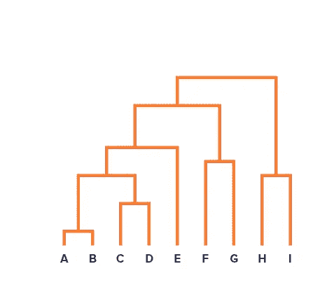

# 集群完全指南

> 原文：<https://medium.datadriveninvestor.com/complete-guide-to-clustering-9f0296596b75?source=collection_archive---------14----------------------->

Photo by [Providence Doucet](https://unsplash.com/@providence) on [Unsplash](https://unsplash.com/)

聚类是一种无监督的机器学习算法，其任务是将数据点分成若干组，使得同一组中的数据点比其他组中的数据点更类似于同一组中的其他数据点。简而言之，它旨在隔离具有相似特征的群体，并将其分配到不同的群中。例如，假设你有很多关于你的博客访问者的数据。您可能想要建立一个聚类模型来尝试检测相似访问者的组。在任何时候，你都不需要告诉模型一个访问者属于哪个群体:它不需要你的帮助就能找到这些联系。例如，它可能会注意到 40%的访问者是热爱科幻的男性，通常在晚上阅读你的博客，而 20%是年轻的漫画爱好者，他们在周末访问，等等。聚类又分为两种:K-means 聚类和层次聚类。

# k 均值聚类

这是一个迭代过程，目的是在每次迭代中找到局部最大值。该算法分以下五个步骤工作:
步骤 1:决定聚类数(k)
步骤 2:随机选择 k 个点，质心(不一定来自你的数据集)
步骤 3:将每个数据点分配到最近的质心(最后，它将形成 k 个聚类)
步骤 4:计算并放置每个聚类的新质心
步骤 5:将每个数据点重新分配到新的最近质心。如果发生了任何重新分配，请转到步骤 4，否则，结束。

 [## 机器学习和人工智能如何改变电子商务的面貌？|数据驱动…

### 电子商务开发公司，现在，整合先进的客户体验到一个新的水平…

www.datadriveninvestor.com](https://www.datadriveninvestor.com/2020/11/19/how-machine-learning-and-artificial-intelligence-changing-the-face-of-ecommerce/) 

## 如何选择合适的集群数？

我们不能为我们的集群数量选择任何随机值。通过计算然后比较聚类内的数据点到其质心的距离来形成每个聚类。计算簇内平方和(WCSS)是确定簇正确数量的一种方法，也称为惯性。它是所有聚类中每个数据点到各自质心的距离的平方和。
目的是降低 WCSS。假设在给定的数据集中有“n”个观察值，我们指定“n”个聚类(k=n ),那么平方和将变为零，理想情况下，这形成了完美的聚类，但这没有任何意义。因此，存在一个 k 的阈值，我们将使用肘点图找到它。

**剪影得分**也是一种评估度量或标准，用于测量聚类技术的好坏。范围在[-1，1]之间。分数+1 表示采样点远离其相邻的聚类，并且可清楚地区分，分数 0 表示采样点位于或非常接近分隔聚类的判定边界，分数-1 表示采样点被分配到错误的聚类中。根据 scikit-learn 官方文档，使用每个样本的平均簇内距离(`a`)和平均最近簇距离(`b`)来计算轮廓系数。样本的轮廓系数是`(b - a) / max(a, b)`。澄清一下，`b`是样本和样本不属于的最近聚类之间的距离。

## 肘点图

我们针对一系列 k 值随机初始化 k 均值算法，并针对每个 k 值绘制 WCSS/惯性曲线。我们根据 WCSS 的下降率来选择 k 的值。

K-means clustering python code file by Author

# 分层聚类

顾名思义，这是一种构建集群层次结构的算法。该算法从分配给它们自己的聚类的所有数据点开始。然后将两个最近的聚类合并成一个相同的聚类。最后，当只剩下一个集群时，该算法终止。

层次聚类的结果可以用树形图来表示。为了得到层次聚类的聚类数，我们使用了一个叫做树状图的概念。

> 树状图是一个树状图表，记录了合并或拆分的顺序。

A Dendogram representing nested Clusters. Photo by Author

可以通过观察树突图来选择能够最好地描述不同组的聚类数目的决定。聚类数目的最佳选择是由水平线切割的树状图中的垂直线的数目，该水平线可以垂直穿过最大距离而不与聚类相交。

## 凝聚层次聚类

在这项技术中，我们将把每个数据点分配给一个单独的聚类。然后，在每次迭代中，我们合并最近的一对聚类，并重复这个步骤，直到只剩下一个聚类。

## 分裂层次聚类

它的工作方式正好与上面提到的凝聚层次聚类相反。我们从单个聚类开始，并将所有数据点分配给该聚类。因此，所有的点在开始时将属于同一个聚类。现在，在每次迭代中，我们将分割聚类中最远的点，并重复这个过程，直到每个聚类只包含一个点。

Hierarchical clustrering Python code file by Author

## K 均值和层次聚类有什么区别？

I)层次聚类不能很好地处理大数据集，但是 K 均值可以，这是使用 K 均值优于层次聚类的优点。这是因为 k 均值聚类的时间复杂度是线性的，而层次聚类的时间复杂度是二次的。

ii)k 表示聚类，因为我们从随机选择的聚类开始，所以多次运行产生的结果可能不同。而分级聚类的结果是可再现的。

iii)当簇的形状是超球面的(像 2-D 中的圆形或 3-D 中的球形)时，发现 K 均值工作良好。

## 访问专家视图— [订阅 DDI 英特尔](https://datadriveninvestor.com/ddi-intel)