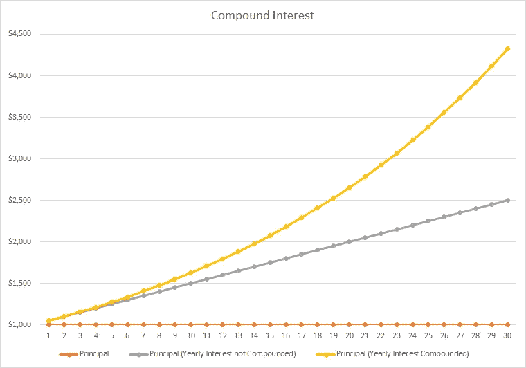
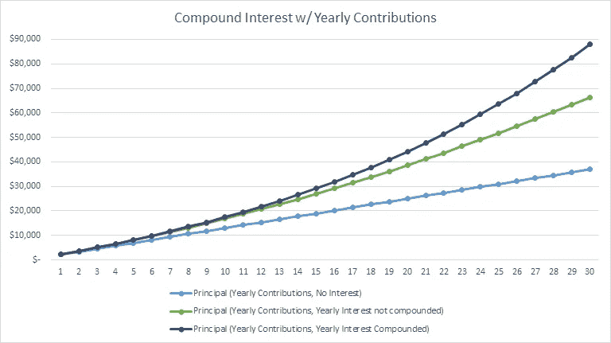
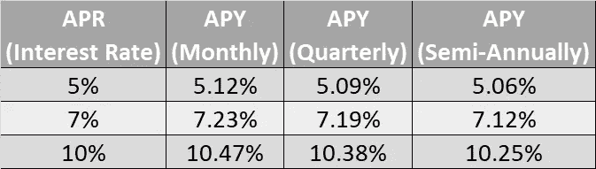
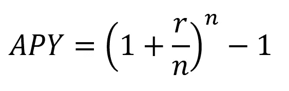
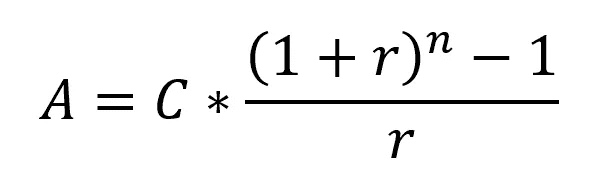
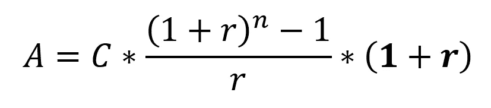
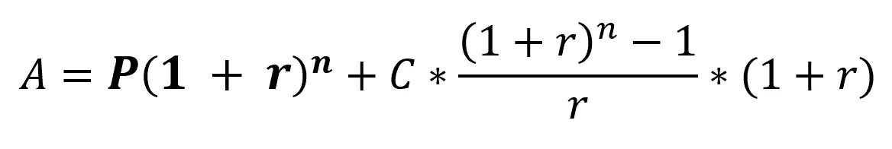

# 复利和 APY 解释说

> 原文：<https://medium.datadriveninvestor.com/compound-interest-and-apy-explained-6f3e9b6fcc56?source=collection_archive---------2----------------------->

## 强大但简单

你可能已经看到抵押贷款、贷款、信用卡、投资和储蓄账户的利率以年利率、APY 或两者兼而有之的形式表示。但是它们是什么意思，它们有什么不同？理解这些的关键是复利，那就从这里开始吧…

# **什么是复利？**

复利是指本金本身获得额外利息后所获得的利息的累积效应。也就是说，赚取的利息被加到原始金额上，以便根据新的基数/本金计算下一次增加的利息。实际上，这意味着你的钱被保留在投资中，任何收益/股息都被再投资，而不是花在其他地方。

*让我们用一个例子来说明。*

如果我们从 100 美元开始，每年赚取 5%的利息，在第一年的年末，我们赚取 5 美元的利息，因此余额为 105 美元。如果没有复利，我们将简单地从 100 美元的基数中每年赚取 5 美元。但是加上复利，第二年我们实际上赚了 5.25 美元。这是 105 美元新余额的 5%。第三年我们赚 5.51 美元，110.25 美元的 5%，以此类推。

每次在先前利息的基础上获得的额外利息的复利真的开始快速增加。这有滚雪球效应，意味着你的钱是指数增长而不是线性增长。

当你以复利计算 30 年后，你会真正看到结果。例如，如果你在 20 多岁时开始存钱，并想看看 50 多岁时会是什么样子。



假设期初余额为 1，000 美元，利率为 5%，不计算复利，则 30 年后的结果是 2，500 美元。加上复利，这就变成了 4321.94 美元。赚取两倍多的利息。将这一期限延长到 40 年，不计算复利的话，只需 3000 美元，而不计算复利的话，则需要 7039.99 美元。

## **不断储蓄和投资**

如果复利加上持续的储蓄和投资，那么随着时间的推移，你真的可以开始看到效果。通过每个月增加一点本金和复利，我们可以通过每个月只存一点点开始为退休做准备。

让我们再举一个例子。

假设我们有同样的 1000 美元初始存款，年收益率也是 5%，但现在我们每月增加 100 美元(每年 1200 美元)。经过 30 年的复利，我们最终得到 88，034 美元。相比之下，如果不计算复利，则只有 66，400 美元。所有这些都是基于我们自己实际贡献的 37，000 美元。



正如你所看到的，这种效应就是你如何从随着时间的推移而增长的金钱中获得巨大的收益。现在，你不太可能在一笔简单的存款中获得 5%的利息，但是复利的概念适用于任何获得回报率并且收益可以再投资的投资。这可以从支付股息的股票或支付回报的基金投资中看出(当然假设这些投资回报率为正，但这并不保证)。

[](https://medium.com/@royherrod/membership) [## 通过我的推荐链接加入媒体-罗伊·赫罗德

### 作为一个媒体会员，你的会员费的一部分会给你阅读的作家，你可以完全接触到每一个故事…

medium.com](https://medium.com/@royherrod/membership) 

这种复利适用于你的债务和投资。当你看到信用卡、抵押贷款和任何种类的贷款上的利率广告，宣传为年利率或 APY 时，这一点很重要。

# APR 和 APY 怎么样？

到目前为止，我们只讨论了每年计算的复利，但有时回报(或债务利息)会在一年内定期计算多次。常见的例子有每月一次(每年 12 次)、每半年一次(每年 2 次)或每季度一次(每年 4 次)。这就是一只**四月债券(*年化利率* )** 和一只 **APY ( *年收益率* )** 的区别所在。APR 表示正在应用的年利率。当你看到两个利率广告，一个年利率和 APY，这是因为 APY 代表了实际利率，你最终支付了一年，当利息在一年中定期累积和复合。

*我们再看一个例子。*

如果我们有一笔 100 美元的债务，年利率为 5%，那么一年后你将会欠 105 美元。但如果所欠利息按 0.417% (5%除以 12 个月)按月计算和计提，一年后的结果其实是 105.12 美元。我们是如何到达那里的？第一个月之后，利息计算为 0.42 美元(0.417% * 100 美元)，因此我们现在欠 100.42 美元。第二个月的利息计算为 0.42 美元(0.417% * $100.42)，请注意，由于四舍五入，该值是相同的。但是，到了第 6 个月，利息计算为 0.43 美元(0.417% * $102.53)，到了第 12 个月，利息为 0.44 美元。这个每月的小增量导致实际年利率为 5.12%。这就是 APY 的计算方法。本例中的年百分比收益率(APY)为 5.12%，而年化利率(年利率)为 5%。

APY 会根据利息计算和累计的周期而有所不同。上述示例基于每月一次(每年 12 次)，但如上所述，也可以是每半年一次(每年 2 次)或每季度一次(每年 4 次)。作为一个简单的参考示例，下表显示了基于这些时期的一些不同年利率的 APY。



# **公式**

如果你想更深入一点，理解这些计算背后的数学，那就继续读下去；如果没有，请随意跳过这一部分。

## **复利公式**

给定周期数的复利计算公式为:


其中:
A =最终余额
P =初始本金
r =每期利率(以小数表示，如 5%为 0.05)
n =期数

例如，要计算从 1，000 美元(P)开始的余额，并在 30 年(n)内每年赚取 5%的利率(r ),我们将有:

```
A = 1000 * (1 + 0.05) ^ 30
A = 4321.9424 = $4,321.94
```

在本例中，我们将每期利率和期数的*期*都视为年。如果我们想在按月计息时使用这个公式，我们就必须修改这两个值。每期利率将是我们的原始年利率除以 12(每年新的期数)。我们的周期数将乘以 12(因为我们现在有 12 倍的周期数)。结果将是:

```
A = 1000 * (1 + (0.05 / 12)) ^ (30 * 12)
A = 1000 * (1 + (0.00417)) ^ (360)
A = 4473.08654 = $4,473.09
```

## **年收益率公式(APY)**

给定年利率，计算 APY 的公式为:



其中:
APY =年百分比收益率(APY)
r =年化利率(APR)小数形式，例如 0.05 表示 5%
n =一年中的期数

例如，之前我们计算了 APY，假设每月复利为 5%(n = 12)。使用该公式，我们将得到:

```
APY = (1 + (0.05 / 12)) ^ (12) - 1
APY = 0.0512 = 5.12%
```

## **供款复利公式**

现在，计算复利和每月供款的余额就有点复杂了。有 3 个阶段，取决于我们是否有起始本金，以及供款是在每个周期的开始还是结束时添加(例如，给定周期的利息是否包括该周期供款的新利息，或者是在利息之后进行的供款)。从最简单的场景开始，初始本金为 0 美元，在每个周期结束时添加供款，公式为:



其中:
A =所得余额
C =每期供款额
r =每期利率(以小数表示，如 5%为 0.05)
n =期数

例如，假设每年计算的利率(r)为 5 %, 30 年内每年的供款为 1，200 美元，我们将得到:

```
A = 1200 * ((((1 + 0.05) ^ 30) - 1) / 0.05)
A = 79726.617 = $79,726.62
```

如果在每个周期开始时缴款，我们必须将这个结果乘以(1 + r)，得出的公式为:



对于给出的例子，结果变成:

```
A = 1200 * ((((1 + 0.05) ^ 30) - 1) / 0.05) * **(1 + 0.05)**
A = 83712.9479 = $83,712.95
```

如果我们在这个开始有一个非零的本金，那么我们必须把那个部分的计算加到这个公式中。其计算方法是上面给出的本金复利公式，即:


将这个加到公式中，我们得到一个最终公式:



继续这个例子，但是增加 1000 美元的初始本金，因此我们得到:

```
A = **(1000 * (1 + 0.05) ^ 30)** + (1200 * ((((1 + 0.05) ^ 30) - 1) / 0.05) * (1 + 0.05))
A = 88034.8902 = $88,034.89
```

这个版本的公式每年应用一次缴款和利率。如果我们想按月计算供款和利率，那么我们需要将每期利率(r)除以每年的期数(每月 12)，然后将期数(n)乘以每年的期数(每月 12)。

所以你有它，APY 代表了一年的实际利率，当年利率在一年内的多个时期计算和累计，利息是复合的。复利只涉及如何将本金的利息应用于应计利息，随着时间的推移，会对最终余额产生指数效应。

**进入专家视角—** [**订阅 DDI 英特尔**](https://datadriveninvestor.com/ddi-intel)