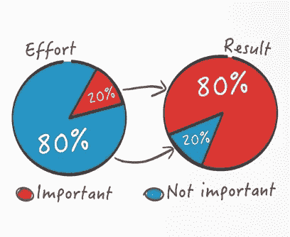
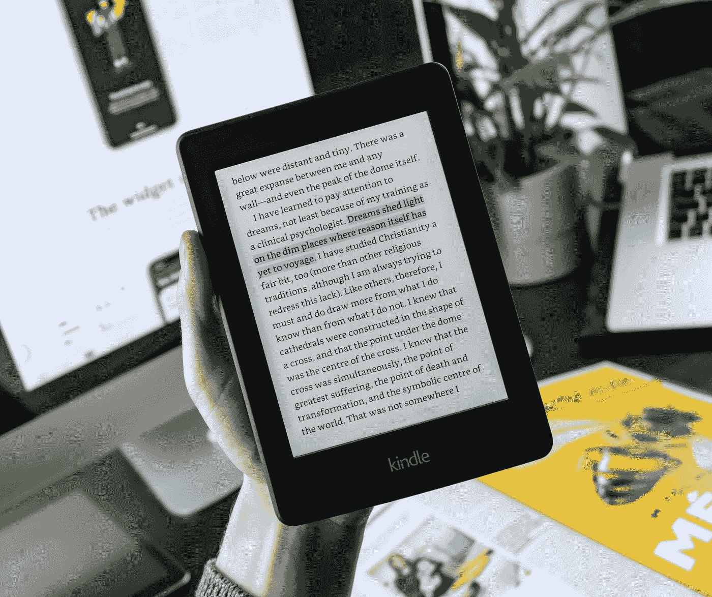

# 为没钱的学生提供全面的被动收入指南

> 原文：<https://medium.datadriveninvestor.com/comprehensive-passive-income-guide-for-students-with-no-startup-money-2d35a36c9beb?source=collection_archive---------0----------------------->

## 如何以最小的努力创造没有钱的被动收入？探索创造被动收入的创意

被动收入似乎是当今个人理财中最热门的话题之一。然而，大多数被动收入专家和 T2 指导都专注于投资你自己的钱来获得被动收入。作为一个没有任何经验或手头没有现金的学生，所有这些流行的被动收入策略，如投资、出租物业和网站托管，都显得太麻烦和高风险。

今天，我想解决一个每个学生在谈到被动收入时都会遇到的问题:

> 没钱怎么创造被动收入？探索被动收入的创新思路

# 正确的心态

被动收入不是完全被动，你确实要做一些工作。归根结底是工作与收入的比例问题。在蒂姆·费里斯的《4 小时工作制:逃避 9–5**，**一书中，他高度赞扬了 [***帕累托法则******(80/20 法则)*** 的概念。](https://mroutsource.com/blog/tim-ferris-discusses-the-paretos-principle-8020-rule/#:~:text=Tim%20Ferris%20discusses%20at%20length,that%20produce%20significant%20overall%20effect.)

 [## 使用谷歌搜索趋势预测首次申请失业救济人数|数据驱动的投资者

### 几年来，我的重点一直是使用多种替代数据来预测宏观经济统计数据…

www.datadriveninvestor.com](https://www.datadriveninvestor.com/2020/03/25/using-google-search-trends-to-predict-initial-jobless-claims/) 

简单来说，思路就是只做 20%的工作，就能产生做整个工作 80%的收益。将此应用于工作与收入的比率，通过投入 20%的工作来获得 80%的结果，我们将有更多的时间来做其他事情和享受生活。这也是我们希望被动收入最终达到的目的。

在传统意义上的被动收入中，人们通过债券、股息和房地产等低风险投资来增加资本。尤其是在房地产领域，你只需要支付大约 20%的预付款，就可以开始利用银行的资金通过租金创造收入。你不必通过工作来获得收入，你的基础资产的价值也会以稳定的速度增长。可以说，这是被动收入的*圣杯*……对于那些有前期资本的人来说，不幸的是我们不是其中之一。

作为千禧一代的产物，像我这样的 Z 世代孩子不得不忍受婴儿潮一代的住房市场价格和竞争激烈的后千禧一代就业市场。如果我用传统的方式投资来获得被动收入。我可能一辈子都会负债。

没有任何前期资本，似乎不可能产生被动收入。但是，我们确实有一些优势，其他年龄段的人没有:

1.  作为学生，我们有充足的时间
2.  **我们精通数字技术**
3.  **我们是快速学习者**

# 有了这三个优势，我们就可以开始创造我们的被动收入流。

Money bed -breaking bad

# 1.出售你的总结/学习材料

如果你做笔记或者做总结来帮助你取得好成绩，你还不如卖掉它们来获得被动收入。

大学课程的平均教学大纲在这些年里并没有真正改变，它们只是更新了一些次要的东西。这也适用于大学教科书，新版本通常只改变章节的格式或更新数字。整体理论并没有真正改变，尤其是历史、商业和金融相关的课程。一旦你准备好你的笔记和总结，你可以将同样的总结在至少三年内循环给新生。

在脸书推销你的笔记:你不应该低估脸书大学团体或大学市场的力量。这绝对是最好的起点，没有中间人。你不必做市场调查来寻找你的目标受众，因为你的购买者可能已经是这些群体中的一员了。

**在脸书上推销的小技巧:**当你在大学脸书小组里为你的学习笔记发布帖子时，你可以让几个朋友对帖子发表评论，比如说:

> ***“伟大的总结”|“这个有帮助”|“推荐”。***

大学生在准备考试时经常依靠口口相传。如果有其他竞争对手出售笔记和摘要，当有一些参与度时，你的帖子肯定会脱颖而出。

**卖给学习小组/社团:**有的高校学习小组购买总结。我已经把我的一些总结卖给了我的大学学习小组，卖了不少钱。他们做的格式化和其他事情，所以它削减了一些工作。

## **最终提示:**

1.  你应该每年花一两个小时来更新你的总结。只需重新注册相同的课程，并检查教学大纲的变化。
2.  确保它们是高质量的。你希望你的买家回来。
3.  在最后有一个最后的部分，包括“期末考试提示”，“考试练习”，“解答练习”，以提高你的总结质量。

总的来说，对于那些已经做好学习材料的人来说，这是非常简单的工作。如果你不是自己做学习资料的类型，或者不擅长做笔记。开始永远不会太晚，它会让你有动力做好笔记，这也可以帮助你取得好成绩，并在未来几年获得良好的被动收入。

# 2.写下并在博客上记录你的旅行经历

Photo by [Anastasia Petrova](https://unsplash.com/@anastasia_p?utm_source=medium&utm_medium=referral) on [Unsplash](https://unsplash.com?utm_source=medium&utm_medium=referral)

是的，你可能已经读过关于博客和创建一个基于搜索引擎优化的利基网站来产生流量，并通过亚马逊联盟和谷歌 Adsense 获得报酬。这个过程看起来如此简单和直接，而且在互联网上有很多利用利基网站创造被动收入的成功故事。然而，这些成功的故事都没有告诉你他们做了什么样的定位，或者他们是如何找到定位的。仅仅为了让你的网站在谷歌搜索中排名靠前而做的大量工作似乎不值得。

此外，你不能只注册亚马逊联盟和谷歌 Adsense。你需要已经有一个网站有足够的流量。我的意思是，这只是工作的基调，你不可能知道你的利基是否会成功。这根本不符合我们创造被动收入的 80/20 法则。

另一方面，作为一名学生，你可能喜欢偶尔去旅行。在旅行之前，你可能还会对你的旅行路线进行研究并做出决定。 ***把这一切都记下来！***

写下你的实际经历:你住过的酒店，餐馆。把所有的都写下来，并提供你的行程。

你甚至不需要创建一个网站，只需要在 Medium 或其他旅游网站上写一篇文章，并添加一些好看的图片。

你不必擅长写或描述一个地方的美丽。实际一点就好。写下你是如何做出某些决定的:

1.  你为什么选择这家酒店而不是其他的，结果怎么样
2.  为什么你首先参观这个地方而不是这个城市的其他景点？
3.  你花了多少钱，值吗？

如果人们在互联网上搜索某个特定的地方，他们可能已经下定决心要去那里。你不用说服他们，只要提供实用的信息就可以了。

**以下是你赚钱的方法**

只需在文章底部放一个代销商链接，并友好地鼓励你的读者通过代销商链接预订酒店。这些程序都不需要最低流量，如果你刚刚开始，这是一个完美的地方。

1.  [猫途鹰代销商项目:](https://www.tripadvisor.com/affiliates?tab=faqs)当有人点击代销商链接时，你将获得猫途鹰收入的 50%。
2.  [旅舍会员计划](https://www.hostelman.com/about/work-with-us/affiliate-program/):一旦通过 paypal 预订，您将获得 50 美元或 72 %的收入分成。
3.  [Agoda 附属合作伙伴:](https://partners.agoda.com/en-us/login.html) 5%佣金。这可能看起来很少，但如果他们在一周内预订了几家酒店，这是一笔不错的被动收入。

## **最终提示:**

1.  大多数旅行者不应该相信任何没有日常工作的旅游博客。如果他们全职写旅游博客，他们可能会因为给出好评而获得报酬。在你的旅游文章中，你可以强调你的身份，这样你的读者会越来越喜欢你，也越来越愿意听你的建议。
2.  在谷歌上回顾你去过的地方，并在评论的最后贴上你文章的链接。
3.  如果你碰巧去了一个不寻常地方，你的文章可能会吸引更多的读者。

如果我不旅行怎么办？

写下你现在在哪里。你可以写你当地的黑客。如果你用你的个人经历来描述你的大学区域，你可以吸引交换生或新生。特别是对于国际学生，他们不熟悉当地文化，你的文章可能是他们的首选。

# 3.练习你的技能并获得报酬

Photo by [Brooke Cagle](https://unsplash.com/@brookecagle?utm_source=medium&utm_medium=referral) on [Unsplash](https://unsplash.com?utm_source=medium&utm_medium=referral)

如果你的大学课程要求你学习一种特定的技能，你也可以用它来做一些自由职业。这并不完全是被动的，但它提高了你对这个学科的知识，增加了你毕业后的就业机会。

> 学习的同时获得一份被动收入？这是一个完美的双赢。

你可以在你的简历/作品集上添加你的自由职业工作，向你未来的雇主展示你在你的领域是一个有能力的人。

## **编程— WebDev**

在一切都数字化的今天，对开发人员的需求很大。但是许多小企业负担不起全职开发人员来创建他们的网站。这就是你从事自由职业的地方。这是一个很好的实践，你可以在以后寻找全职工作时在你的简历上展示你的网站开发产品。

**如果不熟悉编程。你应该现在就开始，任何时候都不晚。YouTube 上有很多关于编程的免费视频。我最喜欢的是科里·斯查费。我从他那里学到了所有的基础，仅用了不到 3 个月的时间就完成了我的涉及 python 的学士论文*。***

**学编程不需要数学很好**。它本质上是一种与计算机交流的语言。对你来说，从学习前端编程开始可能更容易:这完全是关于网站的外观。不需要学习很多算法或者很难的后端理论。

## 装帧设计艺术

平面设计自由职业非常适合练习和展示你的技能。随着一切都数字化，企业正在寻求营销他们的产品。他们总是在寻找设计师来设计他们的标志、传单和海报。

## 语言

有很多小众博客将写作外包给作家。如果你擅长写作，为什么不写作并获得报酬呢？ [Hireawriter](https://www.reddit.com/r/HireaWriter/) 是一个雇佣作家的子网站。如果你对某件事充满热情，或者熟悉某个领域，你可以从你的文章中获得数百美元的报酬。

如果你精通一种以上的语言，你也可以做翻译工作。我过去做过几份翻译工作，都很枯燥。额外的好处是你开始熟悉语言和文化，因为两者是密不可分的。

你也可以在网上教英语。我在一个台湾网站教了 6 个月的英语，给一个没有执照或经验的老师每小时 9 美元。这有点重复，但这是一个很好的侧推。

## 去哪里报名自由职业？

1.  [Fivver](https://track.fiverr.com/visit/?bta=122588&brand=fiverrcpa) : [Fivver](https://www.fiverr.com/?utm_source=122588&utm_medium=cx_affiliate&utm_campaign=&cxd_token=122588_5812574&show_join=true) 是想购买自由职业作品的人的首选网站之一。该网站因提供 5 美元的自由工作而广受欢迎，但你可以随时要求更多。
2.  Upwork 的工资比 Fivver 高一点，但是竞争很激烈。如果你只是刚开始，那就不适合你。然而，如果你已经掌握了自己的手艺，你肯定可以继续从事 Upwork，从外包自由职业的知名大公司获得报酬。

# 4.写一本 Kindle 电子书

Photo by [Balázs Kétyi](https://unsplash.com/@balazsketyi?utm_source=medium&utm_medium=referral) on [Unsplash](https://unsplash.com?utm_source=medium&utm_medium=referral)

亚马逊正在不断向新的国家扩张，自从 Kindle 被锁定以来，越来越多的用户开始使用它。如果你擅长写作，这是你应该做的。

> 第一步:写一些人们会读的东西。

无论你是一个多么好的作家，如果你不写一些看起来有趣的东西，没有人会读你的书。

作为大学生，我们可能还没有老到有一个值得讲述的故事。那么为什么不把你的故事讲到现在呢？如果是在一个口碑不错的大学读书。告诉人们你是如何得到它的。

大卫·卡达维在 6 个月内出版了 3 本书。以下是他的一些建议。

1.  **一本书可以短小精悍:**不需要一定的页数。你可以像写博客一样写书。他从他的博客中什么也没赚到，但是当他把他的文章出版成书时，他赚了 700 美元。
2.  **通过关键词和口碑卖书:**你可以根据发明一个想法或解决一个问题来推销你的书。后者更容易，人们通过阅读来获取知识。
3.  Kindle 是最好的起点:Kindle 占据了英语电子书市场 82%的份额。从 Kindle 开始，你不需要太担心你的书的营销。人们很可能会找到你。

# 5.利用你的爱好

Photo by [Marco Xu](https://unsplash.com/@marcute?utm_source=medium&utm_medium=referral) on [Unsplash](https://unsplash.com?utm_source=medium&utm_medium=referral)

如果你有一个多年来一直感兴趣的爱好，你可能想开始从中赚些钱。

## 摄影

作为一名摄影师，你可以在 Shutterstock 上将你的照片/视频作为库存照片出售。然而，这是一个竞争激烈的市场。大多数专业摄影师都有制作专业照片的昂贵设备。没钱的时候，你可以通过你的 ***位置来区分自己。*** 如果你有一张你所在地的标志性照片，可以卖到 100 ~ 150 美元，如果每个月都有一个人买，这就是你的被动收入。

> 位置销售

## 插图

与摄影相比，插画有较低的进入门槛和启动成本。我的一个朋友正在出售印刷插图作为库存插图，每月获得大约 120 美元的被动收入。

***你不需要知道怎么画:*** 你可以在建模软件中下载一个物理引擎，创建很酷的 3D 排版插图。如果你不知道怎么画？别担心，电脑会帮你画图的。

下载 [Blender](https://www.blender.org/) 来创建你的排版。完全免费！

**利用**[**Ets**](https://www.printful.com/integrations/etsys)**y:**作为艺术家，你可以在 Etsy 上出售你的照片、设计或插图。

Etsy 是独立艺术家出售作品的市场。如果你擅长摄影/插画，找一家附近的印刷店，把你的照片印在大幅印刷品(海报等)上，放在你的 Etsy story 里出售。如果你的作品引人注目且独一无二，你可能会卖出你的产品，并获得不错的月被动收入。

## 音乐

**流媒体:**作为一名音乐人，你可以把你的音乐放在 Spotify 和 Youtube 上，从每月的听众那里获得收入。Spotify 为 100 万个视频流支付大约 4000 美元。如果你每月能获得 6 位数的听众，你将会获得不错的被动收入。你也可以直接在 BandCamp 上出售你的音乐作为数字专辑来获得被动收入。

[Spotify 有一个关于如何将你的音乐发布到他们平台的指南。](https://artists.spotify.com/guide/your-music)

**卖循环:**制作人不断寻找有旋律的声音包。如果你演奏任何一种乐器，录下循环并在网上出售。拼接是一个很好的起点。

**获得更多听众的技巧:**

1.  Soundcloud 是一个很好的起点，而且是免费的。与其他制作人/歌手分享你的音乐。
2.  进行现场表演和街头表演:去你当地的酒吧，要求做一个简短的表演，并告诉人们在哪里可以找到更多你的音乐。如果你确信大多数人都能听到你的音乐，你也可以在街头卖艺。

> 如果你投入足够的时间，为你的艺术培养出相当规模的观众，它可能会创造足够的被动收入，让你的爱好成为你的全职工作。

# 结束语

除了我们的常规工作，被动收入还提供现金。当你大学毕业时，你被期望做一份典型的朝九晚五的工作，缴纳 40 年左右的税，直到退休。

正如费里斯所说:“怎么可能世界上所有的人都正好需要 8 个小时来完成他们的工作？它不是。9–5 是任意的。”

朝九晚五的生活方式是社会对我们的期望，但对一些人来说却不符合(包括我自己)。你不需要把你的生活和幸福推迟到退休。所以为什么不现在就开始你自己的被动收入来源，掌控你的生活。

# 如果你真的喜欢这篇文章，你可以捐一杯咖啡:)

 [## 给伊恩买杯咖啡。ko-fi.com/pleaseandthankyou

### 和 Ko-fi.com 一起给伊恩买杯咖啡

ko-fi.com](https://ko-fi.com/pleaseandthankyou) 

**访问专家视图—** [**订阅 DDI 英特尔**](https://datadriveninvestor.com/ddi-intel)