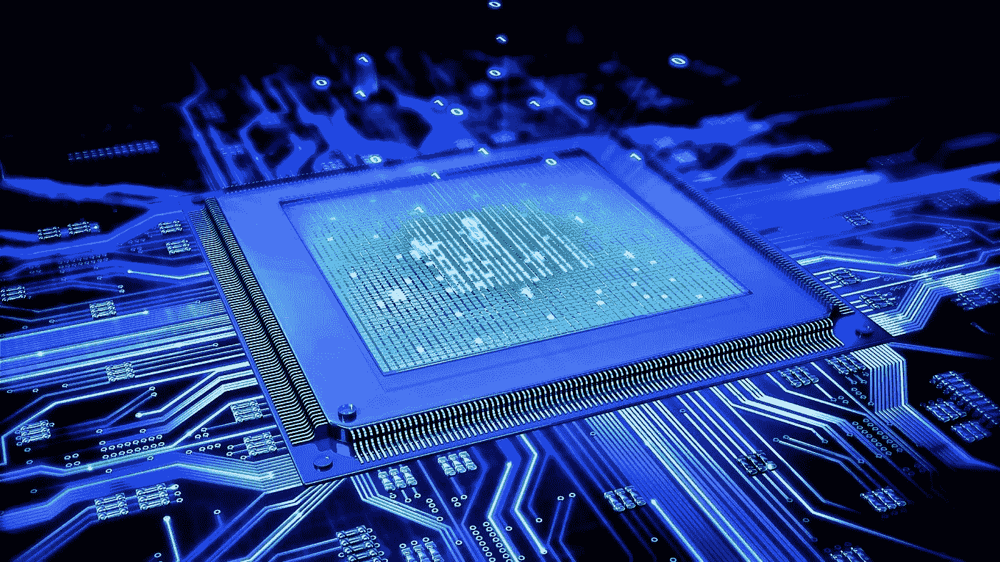

# 使用 Python 的计算机视觉项目

> 原文：<https://medium.datadriveninvestor.com/computer-vision-projects-with-python-4aa451fcc6a2?source=collection_archive---------9----------------------->

## 9 个使用 Python 和机器学习的计算机视觉项目

计算机视觉是机器学习的一个领域，它处理图像来解决真实的视觉问题。在本文中，我将向您介绍一些非常有用的计算机视觉项目和任务，它们将帮助您提升您的投资组合。

# 什么是计算机视觉？

人类在识别物体和周围环境方面没有问题。然而，对于计算机来说，识别和区分环境中的各种模型、视觉、图像和对象并不容易。这就是计算机视觉派上用场的地方。

最简单地说，计算机视觉是机器学习的一个广泛领域中的学科，它教会机器看东西。它的目标是从像素中提取意义。

# 面向初学者的计算机视觉项目/任务

## 使用网络摄像头进行人脸检测

使用 python 中的开源计算机视觉库(OpenCV)进行人脸检测，我们将使用 OpenCV 通过网络摄像头检测我们的人脸。

OpenCV 旨在为计算机视觉应用提供一个公共基础设施，并加速机器感知在商业产品中的应用。作为一个 BSD 许可的产品，OpenCV 使得企业利用和修改代码变得很容易。你可以在这里 看到关于使用网络摄像头进行人脸检测的完整文章 [**。**](https://thecleverprogrammer.com/2020/05/09/face-detection-using-webcam-in-python/)

## 用于机器学习的 OpenCV

[**OpenCV**](https://opencv.org/) 是一堆主要处理你电脑上的图像和视频的东西。这是用于 Python 任务的计算机视觉的标准库。

也许这是我想到的根本问题。嗯，这意味着“开源计算机视觉库”由一些狂热的编码人员在 1999 年推出，将图像处理纳入各种编码语言。OpenCV 不仅限于 Python，它还支持 C 和 C++。从 [**这里**](https://thecleverprogrammer.com/2020/08/31/opencv-with-python-tutorial/) 可以学习机器学习的 OpenCV。

## 图像处理

利用机器学习的 HOG 特性，我们可以用任何图像处理估计器建立一个简单的人脸检测算法，这里我们将使用线性支持向量机，其步骤如下:

1.  获取一组人脸的图像缩略图，构成“正”训练样本。
2.  获取一组非人脸的图像缩略图，构成“阴性”训练样本。
3.  从这些训练样本中提取 HOG 特征。
4.  在这些样本上训练线性 SVM 分类器。
5.  对于“未知”的图像，在图像上通过一个滑动窗口，使用该模型来评估该窗口是否包含人脸。
6.  如果检测重叠，将它们合并到一个窗口中。

从 [**这里**](https://thecleverprogrammer.com/2020/06/25/image-processing-with-machine-learning-and-python/) 可以学习机器学习对于图像处理的实现。

# 计算机视觉高级项目

完成以上计算机视觉项目后，你会学到很多关于计算机视觉及其与机器学习的实现。从上面的计算机视觉项目和任务中，你会明白如何在现实世界的任务中实现计算机视觉的机器学习。现在让我们来看看一些先进的计算机视觉项目。

## 基于机器学习的图像识别

人类没有努力去区分狗、猫或飞碟。但是这个过程对计算机来说很难模仿:它看起来很容易，因为上帝把我们的大脑设计得非常好，可以识别图像。

机器学习图像识别的一个常见例子是光学字符识别。在这个基于计算机视觉的机器学习任务中，我将带您通过使用 PyTorch 的机器学习来构建图像识别模型。完整项目[见**此处**](https://thecleverprogrammer.com/2020/08/26/image-recognition-with-machine-learning-using-pytorch/) 。

## 图象分割法

作为机器学习的从业者，你一定经历过图像分类，目标是给输入图像分配一个标签或类别。现在，假设您想要获取对象在图像中的位置、对象的形状或者哪个像素代表哪个对象。

在这种情况下，你必须处理图像的片段，我的意思是给图像的每个像素加一个标签。图像分割的目标是训练一个神经网络，该网络可以返回图像的逐像素掩码。完整项目 [**见此处**](https://thecleverprogrammer.com/2020/07/22/image-segmentation/) 。

## 人脸标志检测

你有没有想过 Snapchat 是如何根据你的脸来应用令人惊叹的滤镜的？它已经被编程来检测你脸上的一些标记，并根据这些标记投射一个过滤器。在机器学习中，这些标记被称为面部标志。在此任务中，您将学习如何使用机器学习来检测人脸标志，从而实现机器学习。完整项目[见**此处**见](https://thecleverprogrammer.com/2020/07/22/face-landmarks-detection/)。

## 数据扩充

数据扩充是深度学习中的一项技术，它通过添加从各种来源收集的信息来提高组织的数据质量，从而帮助我们的基本数据集增值。数据扩充是使数据非常信息化的最重要的过程之一。

改善数据对每个企业都非常重要，因为数据被视为企业的石油。数据扩充可以应用于任何形式的数据集，主要包括文本、图像和音频。请参见图像数据扩充的实现。完整项目 [**见此处**](https://thecleverprogrammer.com/2020/07/20/data-augmentation-in-deep-learning/) 。

## 图像特征提取

局部图像特征是图像中的一小块，它与图像缩放、旋转和光照变化无关。就像下图中的塔尖或者窗户的角落。在这个计算机视觉任务中，我将带您完成使用机器学习提取图像特征的任务。完整项目[见**此处**](https://thecleverprogrammer.com/2020/09/13/image-features-extraction-with-machine-learning/) 。

## 使用 Python 进行颜色识别

在这个计算机视觉项目中，我将带你通过 Python 完成一个颜色识别任务。这个过程也称为颜色检测。我们将创建一个基本的应用程序，帮助我们检测图像中的颜色。该程序还将返回颜色的 RGB 值，这很有用。完整项目 [**见此处**](https://thecleverprogrammer.com/2020/09/14/colour-recognition-with-python/) 。

我希望你喜欢这篇关于机器学习的计算机视觉项目的文章。欢迎在下面的评论区提出你有价值的问题。