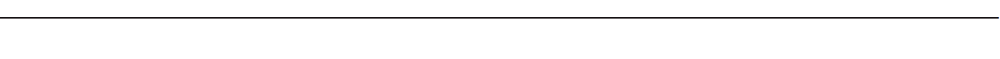
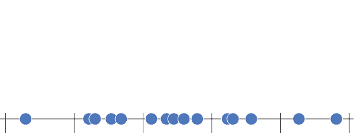
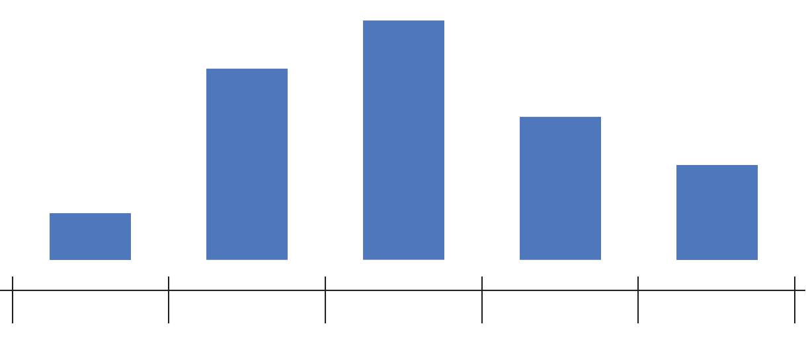
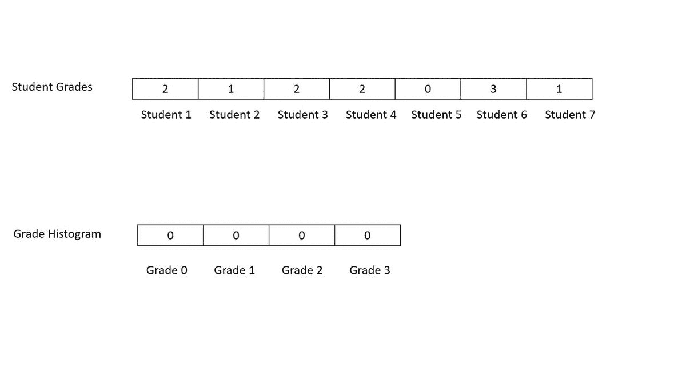
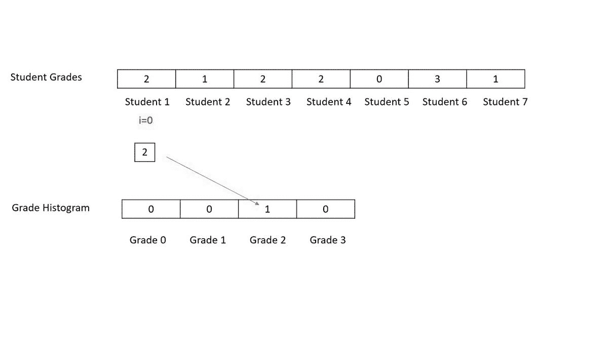
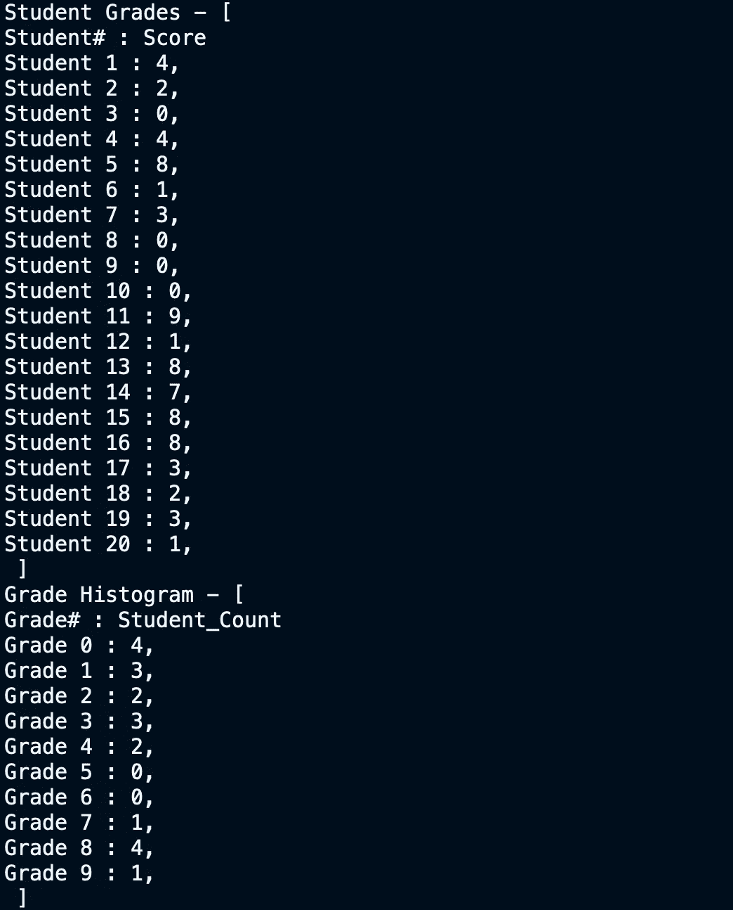
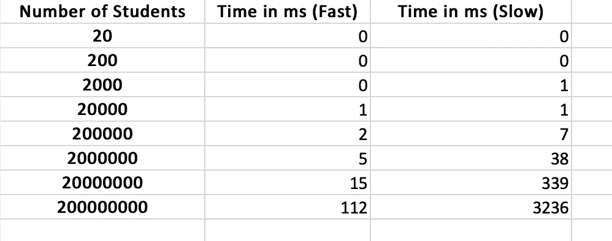
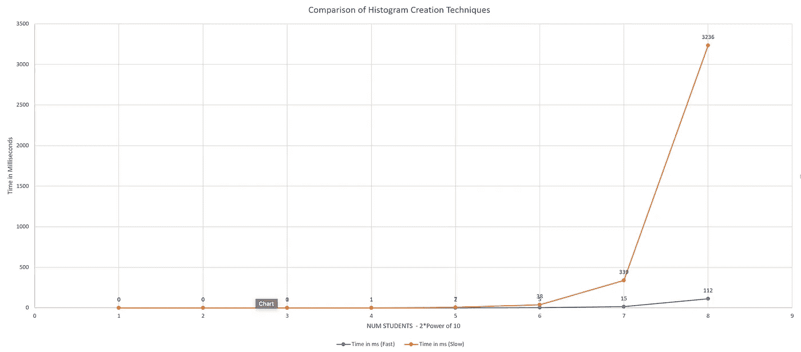

# 使用 Java 数组计算直方图

> 原文：<https://medium.datadriveninvestor.com/computing-histograms-using-java-arrays-7f81e08ed602?source=collection_archive---------1----------------------->

## 编程；编排

## 直方图清楚地显示了数据的分布情况。


Photo by [Lukas Blazek](https://unsplash.com/@goumbik?utm_source=medium&utm_medium=referral) on [Unsplash](https://unsplash.com?utm_source=medium&utm_medium=referral)

直方图用于将数据组织到不同的桶中。例如，您可能想要显示大学博士生的年龄范围。你可以选择 20-25 岁、26-30 岁、30-35 岁等等年龄段。如果你计算每个桶或箱中的学生人数，你就有一个直方图。

[](https://www.datadriveninvestor.com/2019/03/25/a-programmers-guide-to-creating-an-eclectic-bookshelf/) [## 创建折衷书架的程序员指南|数据驱动的投资者

### 每个开发者都应该有一个书架。他的内阁中可能的文本集合是无数的，但不是每一个集合…

www.datadriveninvestor.com](https://www.datadriveninvestor.com/2019/03/25/a-programmers-guide-to-creating-an-eclectic-bookshelf/) 

假设你要根据学生的 SAT 成绩对他们进行分组。首先，你把所有的 SAT 分数画在一条线上，然后把这条线分成 400 个片段

*   400 到 799
*   800 到 1199
*   1200 年到 1599 年等等



[Source Plotly](https://help.plot.ly/histogram/)

在每个碎片/桶/箱中收集所有这些分数，并将其绘制为条形图，并在图上添加一个刻度



[Source Plotly](https://help.plot.ly/histogram/)

今天我们将看到给定一个数字数组，我们如何在 Java 中计算它的直方图数组。

完整的 github 代码如下

我们将使用两种不同的方法来计算直方图。其中一个比另一个慢得多。我们主要使用 2 个阵列

1.  输入数组—这是包含每个学生分数的数组，名为 **student_grades**
2.  输出数组——这是一个直方图数组，它告诉我们有多少学生得到了哪个年级的分数，它被称为 **grade_histogram**

我们以下列方式启动阵列

```
**//Generate a random array of student grades**
int[] student_grades   = 
random.ints(NUM_STUDENTS, 0,HIGHEST_GRADE).toArray();**//Generate an empty histogram array. Each element represent how many students scored that grade
**  int[] grade_histogram   = new int[HIGHEST_GRADE];
  int[] grade_histogram_fast  = new int[HIGHEST_GRADE];
```

## 较慢的方法

```
**//Function to compute histogram O(N^2)**
 public void getHistSlow(int iArr[], int oArr[])
 {
  int i,j;
  for(i=0;i<HIGHEST_GRADE;i++)
  {
   int count=0;
   for(j=0;j<iArr.length;j++)
   {
    if(iArr[j]==i)
    {
     count++;
    }
   }
   oArr[i]=count;
  }
 }
```

在这里，我们检查了**学生成绩数组**的每个元素，并检查该元素还匹配了多少其他元素。然后，我们根据每个等级获得的匹配数量创建直方图。在下面的示例**中，年级 2** 由学生 1、3 和 4 评分。因此，等级 2 得到 3 个匹配，并且其对应的直方图柱反映 3。

*   我们与所有其他元素进行比较的元素位于索引 **i**
*   与 **i 进行比较的元素位于索引 j**



我们可以看到，这是一种浪费的方法，因为我们多次检查 2 级。这个**反复扫描**使程序运行在 O(N)中。我们不需要一遍又一遍地扫描这个数组。

让我们看看 O(N)方法。

## 快速方法

```
**//Function to compute histogram faster O(N)**
 public void getHistFast(int iArr[], int oArr[])
 {
  int i;
  for(i=0;i<iArr.length;i++)
  { 
   oArr[iArr[i]] = oArr[iArr[i]] + 1;
  }
 }
```

在这个方法中，我们访问学生成绩数组中的每个学生，并查看其成绩。我们转到相应的等级直方图元素并更新等级计数。



# 分析

当我们取 20 名分数在 0-9 之间的学生时，我们得到以下输出



## 转速试验

我们通过增加学生的数量来比较快速和慢速方法。虽然我们看不到慢速方法的 O(N)行为，但它肯定比快速方法慢很多倍。

