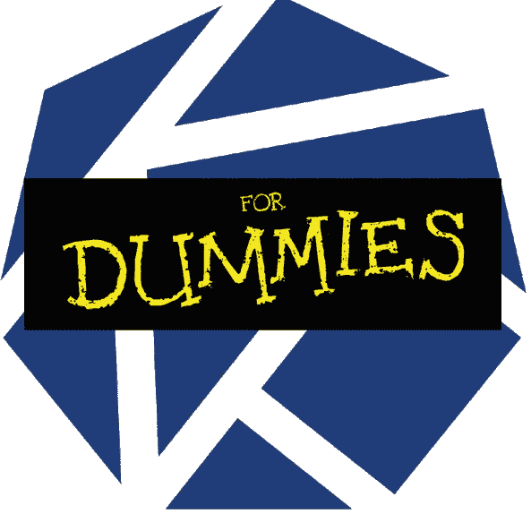
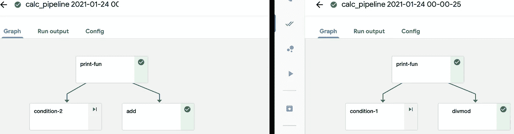

# 用于虚拟对象的条件库贝流管道

> 原文：<https://medium.datadriveninvestor.com/conditional-kubeflow-pipeline-for-dummies-972fd81f9de2?source=collection_archive---------2----------------------->



此管道描述了如何使用条件运算符`kfp.dsl`和运行时管道参数来分支管道。Kubeflow DSL 不支持使用常规的`if:else`语句来定义管道图。为了实现这一点，我们可以传递一个决定性的参数，它的值定义了管道图的执行流。
这在下面使用简单函数来举例说明，该简单函数用于相对于传递给管道的期望运行时间计算变量来计算加法或除法。

```
import kfp
import kfp.components as comp
```

# 定义三个简单的函数

```
def print_fun(calculation: str) -> str:
"""
simple print function
"""
	print("Calculation Type: ",calculation)
	return calculationdef add(calculation: str, a: float, b: float) -> float:
"""
calculates sum of two arguments
"""
	print("Calculation Type: ",calculation)
	print("Sum: ",a+b)
	return a + bdef div(calculation: str, dividend: float, divisor: float) -> float:
"""
Divides two numbers and calculates the quotient
"""
	print("Calculation Type: ",calculation)
	quotient = dividend/divisor
	print("Quotient: ",quotient)
	return quotient
```

# 将函数转换为管道运算符

```
print_op = comp.func_to_container_op(print_fun)
add_op = comp.func_to_container_op(add)
divmod_op = comp.func_to_container_op(div)
```

# 定义管道

管道函数必须用`@dsl.pipeline`装饰器和管道函数内部使用的`dsl.Condition`来装饰，以创建管道图。

使用`if:else`语句无法定义管道执行的方式

```
import kfp.dsl as dsl
@dsl.pipeline(
	name="calculation pipeline",
	description="A toy pipeline that performs arithmetic calculations."
)def calculation_pipeline(calculation: str, a: float, b: float) -> None:
"""
This function defines the pipeline graph and uses dsl conditions that
need to be evaluated on runtime to decide the execution flow of the pipeline
"""
print_task = print_op(calculation)# defining the branching condition
with dsl.Condition(print_task.output=="add"):
	add_task = add_op(print_task.output, a, 4).after(print_task)
with dsl.Condition(print_task.output=="div"):
	divmod_task = divmod_op(print_task.output, a, b).after(print_task)
```

这里要考虑的一点是，两个分支操作必须在同一个操作之前。这将确保所形成的图具有从根节点生成的 2 个叶节点。

有了`dsl.condition`语句和传递的动态参数，我们可以确定只有一个叶节点会被执行。这模拟了一个简单的`if:elif`语句执行，但是使用了`dsl.condition`

# 提交执行参数集 01 的管道

```
#Specify pipeline argument values
arguments = {"calculation": "add" ,"a": "7", "b": "8"}
#Submit a pipeline run
kfp.Client().create_run_from_pipeline_func(calculation_pipeline, arguments=arguments)
```

# 提交执行参数集 02 的管道

```
#Specify pipeline argument values
arguments = {"calculation": "div" ,"a": "7", "b": "8"}
#Submit a pipeline run
kfp.Client().create_run_from_pipeline_func(calculation_pipeline, arguments=arguments)
```

# 管道输出

找到两个参数的管道运行的屏幕截图，如下所示:

