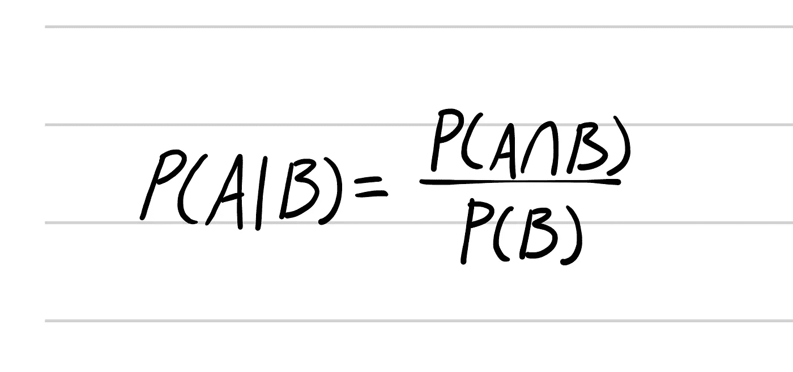
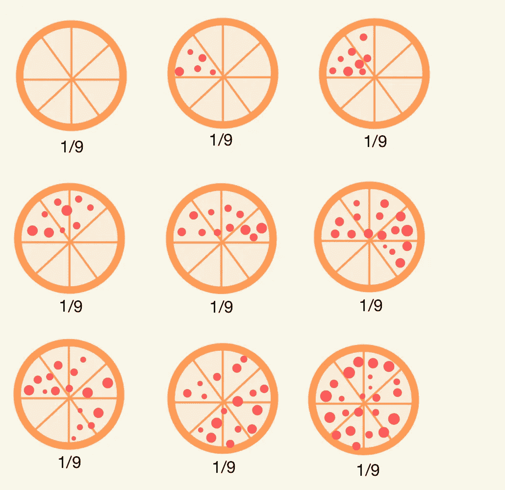
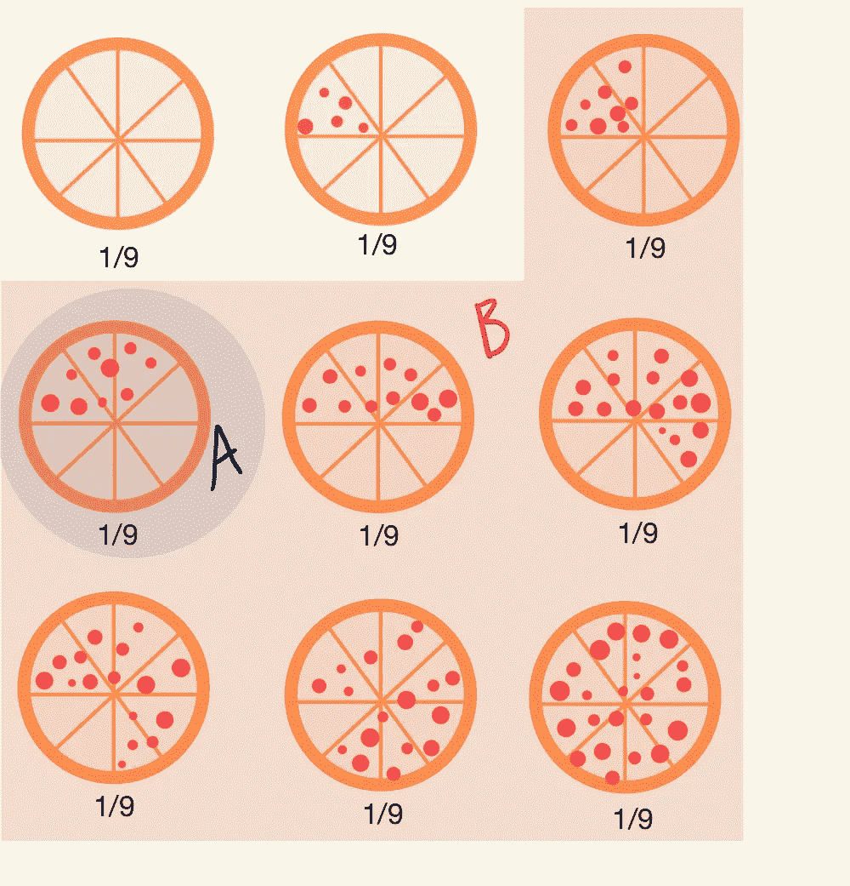

# 条件概率变得简单

> 原文：<https://medium.datadriveninvestor.com/conditional-probability-made-simple-fbb47c3277ad?source=collection_archive---------9----------------------->

[https://unsplash.com/photos/cHhbULJbPwM?utm_source=unsplash&utm_medium=referral&utm_content=creditShareLink](https://unsplash.com/photos/cHhbULJbPwM?utm_source=unsplash&utm_medium=referral&utm_content=creditShareLink)

作为一名本科生，条件概率对我来说是最复杂的话题之一，所以我想让它变得简单一些。我认为学习条件概率最好的方法莫过于用我们都喜欢的东西来教它，那就是比萨饼。那么，为什么要关心条件概率呢？嗯，条件概率在机器学习中无处不在。比方说我们要分类一个图像是猫还是狗。我们只是求解如果 P(狗|图片)> P(猫|图片)。条件概率在机器学习中还有许多其他应用，但我们将在本系列中进一步讨论这些情况。现在，让我们开始理解条件概率。

# 条件概率

Conditional Probability Equation

这是条件概率的公式，但是在我们深入这个公式之前，让我们快速复习一下概率。a 和 B 是产生一系列结果的事件。∩符号读作“and ”,代表联合概率。联合概率是两个事件的串联。嗯，下面例子中联合概率的一个用例。我知道，这不是对基础概率的最好描述，但如果你需要更详细的概率核心基础的解释， [toppr](https://www.toppr.com/guides/maths/probability/introduction-to-probability/) 有一些很棒的教程。所以，让我们来看看这个例子，希望它能澄清一些事情。

# 条件概率示例

这里我们有 9 个比萨饼，每个比萨饼上有不同数量的意大利香肠片。每个比萨饼有 8 种可能的比萨饼切片。所以，让我们进入问题。我们将有两个事件，A 和 B，其中 A 是比萨饼有 3 片意大利香肠的事件，B 是比萨饼至少有 2 片意大利香肠的事件。P(A|B)是什么？

我们知道事件 A 只有一个元素，那就是有 3 片意大利香肠的比萨饼。我们可以看到事件 B 包含所有带有 2 到 8 片意大利辣香肠的比萨饼。披萨总数，叫做宇宙，有 9 个披萨。事件 A 只有一个披萨，事件 B 有 7 个披萨。所以回到条件概率的方程，我们需要求解两个概率，P(A ∩ B)和 P(B)。

P(B) = 7/9(事件 B 中的 **7** 披萨和披萨宇宙中的 **9**

P(A ∩ B) = 1/9(有 1 个披萨与事件 A 和 B 相交，在披萨的宇宙中有 9 个披萨)

所以，P(A|B) = (1/9)/(7/9) = 1/7

这个其实超级直观。假设我们只看 B 中的选项，A 的概率是多少？这就是概率的全部要求。

# **深入研究条件概率**

如果我们引入另一个事件呢？让我们假设这个事件:比萨饼至少有 3 片辣肠比萨饼，但不超过 6 片辣肠比萨饼。因此，事件 C 将包含 4 个比萨饼。P(A|B，C)和 P(A，B|C)是什么？

P(A|B，C)= P(A∩B∩C)/P(B∩C)=(1/9)/(4/9)= 1/4

P(A，B | C)= P(A∩B∩C)/P(C)=(1/9)/(4/9)= 1/4

为什么这些是一样的？我们来看 P(A∩B∩C)。所有这些事件的交集减少到 a。同样的逻辑可以应用于 P(B∩C)。在这种情况下，两种不同的概率是相同的，但是不要期望这种情况会发生。

# 包装东西

咻…太多了！希望你们都喜欢这个话题。如果你真的按了拍手按钮！下周我们将学习贝叶斯定理。如果我需要解释更多的数学知识，请告诉我，如果我需要写另一篇关于条件概率的文章，我一定会这样做。

感谢阅读。