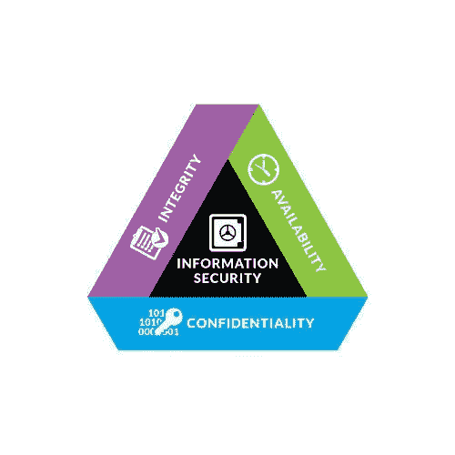
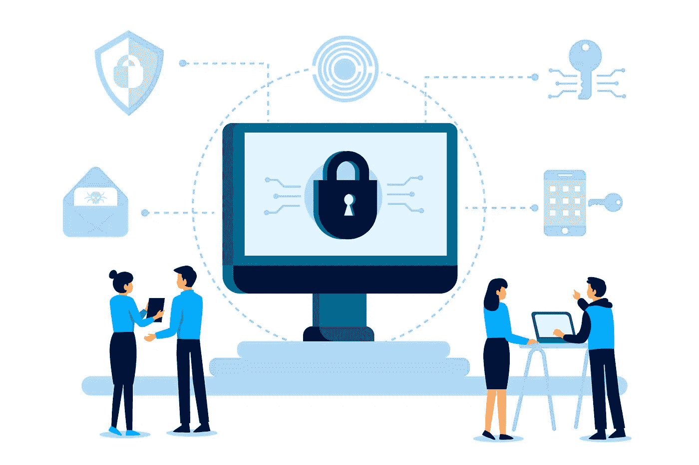

# 机密性、完整性、可用性(中情局三位一体)——网络安全的支柱

> 原文：<https://medium.datadriveninvestor.com/confidentiality-integrity-availability-cia-triad-the-backbone-of-cybersecurity-8df3f0be9b0e?source=collection_archive---------0----------------------->

## CIA triad 对网络安全至关重要，因为它提供了关键的安全功能，有助于防止执法问题，保持业务连续性，并避免声誉受损。

网络安全仅仅意味着保护信息免遭犯罪或未经授权的使用，并采取措施实现这一目标。

CIA Triad

在分析网络安全时，首先要看一下 CIA triad，这是一个众所周知的网络安全发展模型。这些安全概念指导着网络安全政策，但它们不是唯一的。

机密性、完整性和可用性，也称为 CIA triad，是一种旨在指导组织策略和信息安全的模型。CIA 三位一体的目标是确保信息被准确一致地存储，直到做出授权的更改。由于组织负责生成、处理和存储的信息类型，这些信息必须保密。

机密性是指不向未经授权的人、程序或过程披露信息的能力。它与信息安全有关，因为它要求控制对受保护信息的访问。保密性要求采取措施确保只有授权人员才能访问信息，而未经授权的人员则无法访问。简单来说，保密就是有些东西是秘密的，不应该传给无意的人或组织。如果机密性受到损害，这可能会导致隐私的丧失和机密信息向公众或其他人的泄露。有许多信息可以被视为机密，例如财务信息、医疗信息和其他敏感信息。有些信息比其他信息更敏感，需要更高的保密级别。

完整性是指防止信息被不正当地修改和破坏，确保信息不能被更改而不被发现，并确保信息的完整性。这意味着网络威胁或网络攻击的脆弱性可以通过损害一个或多个原则来衡量。完整性基于加密和散列，以确保针对网络攻击和网络威胁(如网络间谍)的最佳保护。

可用性确保需要的人可以获得信息，包括及时可靠的访问，而不受时间、居住地、位置或其他因素的影响。

 [## 提高网络安全的最低成本和最有效途径|数据驱动型投资者

### 在组织在 2020 年面临的诸多挑战中，网络安全(或缺乏网络安全)已成为新闻报道的焦点…

www.datadriveninvestor.com](https://www.datadriveninvestor.com/2020/09/04/the-lowest-cost-most-effective-path-to-better-cybersecurity/) 

信息的准确性和完整性对于组织的运作至关重要。注重完整性，确保数据真实可靠，不可篡改。应当注意的是，为了保护使用中的数据，不仅在组织的管理中，而且在其他组织和个人使用中，完整性都是重要的。

在中情局，保密性、完整性和可用性是信息政策中最重要的概念之一。美国中央情报局及其在确保合法利益的网络和信息安全中的作用。目前，你可能因违反一项或多项与网络威胁或网络攻击漏洞相关的原则而被判有罪。

简而言之，机密性、完整性和可用性合在一起被称为安全三元组，这三个安全目标可以帮助您在各自的上下文中理解和管理您的数据。

**引用来源**

*   https://flank.org/faqs/what-is-the-concept-of-cia
*   【https://www.eosgmbh.de/en/protection-goals-cia-and-ciaa 
*   [https://devqa.io/confidentiality-integrity-availability/](https://devqa.io/confidentiality-integrity-availability/)
*   [http://pan more . com/the-CIA-triad-机密性-完整性-可用性](http://panmore.com/the-cia-triad-confidentiality-integrity-availability)
*   [https://www1.udel.edu/security/data/](https://www1.udel.edu/security/data/)
*   [http://www . e2college . com/blogs/risk _ management/confidential _ integrity _ avail ability . html](http://www.e2college.com/blogs/risk_management/confidentiality_integrity_availability.html)
*   [https://www . technology gee . com/confidential-integrity-avail ability-concerns-comptia-it-fundamentals-fc0-u61-6-1/](https://www.technologygee.com/confidentiality-integrity-availability-concerns-comptia-it-fundamentals-fc0-u61-6-1/)
*   [https://www . kv ausa . com/data-security-confidential-integrity-and-avail ability/](https://www.kvausa.com/data-security-confidentiality-integrity-and-availability/)
*   [https://www.upguard.com/blog/cia-triad](https://www.upguard.com/blog/cia-triad)
*   [https://what is . techtarget . com/definition/confidential-integrity-and-avail ability-CIA](https://whatis.techtarget.com/definition/Confidentiality-integrity-and-availability-CIA)
*   [https://www . hut six . io/information-security-principles-what-is-the-CIA-triad/](https://www.hutsix.io/information-security-principles-what-is-the-cia-triad/)

**访问专家视图—** [**订阅 DDI 英特尔**](https://datadriveninvestor.com/ddi-intel)