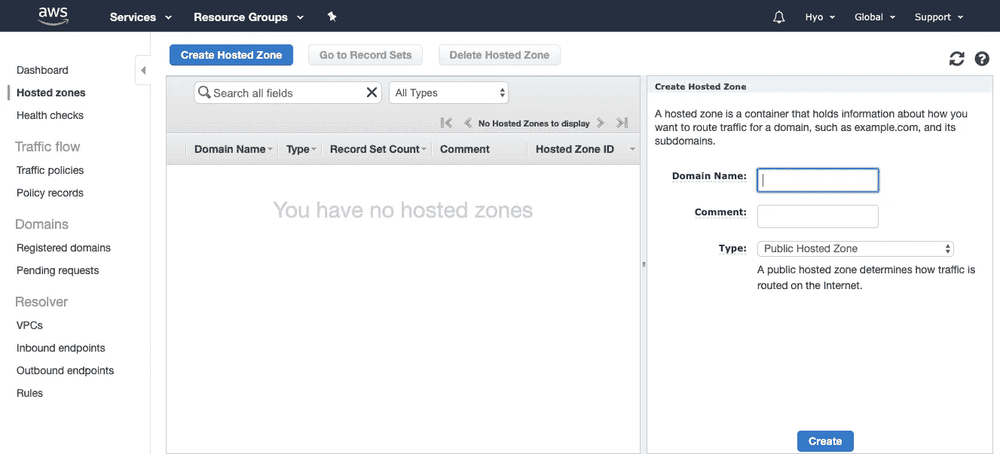
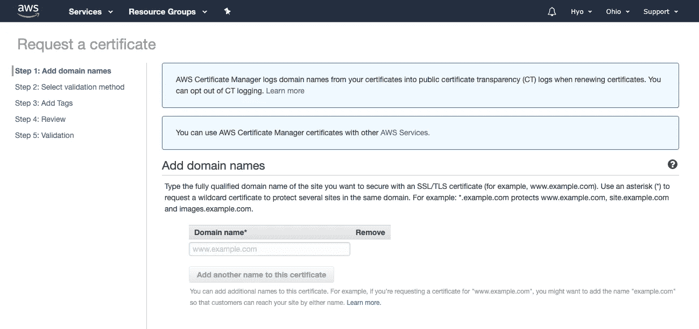

# 配置路由 53 并添加 SSL 证书

> 原文：<https://medium.datadriveninvestor.com/configurate-route-53-and-adding-ssl-certificate-145d8a317d91?source=collection_archive---------1----------------------->

我们将继续“向 AWS Cloud 的 API 添加自定义域”的讨论在这次会议之后，你现在可以使用 AWS 服务使用你自己的域名了！

Photo by [Aaron Huber](https://unsplash.com/@aahubs?utm_source=unsplash&utm_medium=referral&utm_content=creditCopyText) on [Unsplash](https://unsplash.com/s/photos/custom?utm_source=unsplash&utm_medium=referral&utm_content=creditCopyText)

## 亚马逊 53 号公路

是一个可扩展的云域名系统(DNS) web 服务。在这里，您可以注册新的域名或管理域名的 DNS 配置。

如果您还没有自己的域名，您可以使用域名注册部分轻松购买一个。如果您有自己的域名，请访问 DNS 管理部分。

 [## 信息图:云之旅|数据驱动的投资者

### 聪明的企业领导者了解利用云的价值。随着数据存储需求的增长，他们已经…

www.datadriveninvestor.com](https://www.datadriveninvestor.com/2018/09/22/infographic-journey-to-the-clouds/) 

在 DNS 管理部分，您必须首先创建托管区域。

通过点击**“创建托管区域**”，您可以输入域名。

域名应该与我们在无服务器模板中指定的相同。一旦你点击了**创建**按钮，就会创建一些 DNS 记录。然后，您可以在 DNS 管理仪表板中更新 DNS 记录。就是这样！您还可以测试测试响应的记录集。

接下来，我们使用 AWS 证书管理器(ACM)将 SSL 证书添加到自定义域中。

## AWS 证书管理器(ACM)

是一种服务，允许您使用 AWS 服务轻松地提供、管理和部署公共 SSL 证书。

在我们开始之前，**总是总是**让你在美国东 1 或北弗吉尼亚地区！因为那里是边缘位置，并且您的大多数云服务将要求您的证书安装在 US East 1 或北弗吉尼亚地区。

然后，按“提供证书”部分下的“开始”按钮。在这里，我们可以请求一个公共证书。我们必须提供一个域名和您的域的任何子域。

接下来，我们必须使用 DNS 验证或电子邮件验证这两个选项之一来验证该域的所有权。

如果您使用的是 DNS 验证，这样会快一点，您必须提供一些 DNS 记录。

在本例中，DNS 提供商是 Route 53，因此我们只需点击名为“在 Route 53 中创建记录”的按钮它会自动为我们创建必要的 DNS 记录。同样，我们可以对每个域都这样做。

在这一步之后，如果你回到 53 路控制台并刷新，你可以找到新的 CNAME 条目。

回到 ACM 控制台，如果验证状态是 pending，那就很好。几分钟后，我们应该有一个活动状态。

这里还要补充的一点是**姓名标签**。记住，在我们的无服务器应用程序代码中，我们添加了 **certificateName** 。我们复制该名称，并用我们放入 **certificateName** 中的名称编辑名称标签。这将为我们设置证书名称。

## 现在，是时候完成向 API 网关添加自定义域了。

在应用程序代码控制台中，您可以使用无服务器框架来实现这一点。只需运行命令“ **sls create_domain** ”它将使用我们在 serverless.yml 文件中指定的配置在 API 网关中创建一个自定义域名。

它还将为我们添加必要的 53 号公路记录。现在我们的自定义域名已经创建，这可能需要大约 40 分钟来初始化。

让我们回到 API 网关控制台来验证这一点。当您刷新页面时，您将能够看到自定义域确实正在创建。

真的就这样结束了！非常感谢您关注我的文章，并希望您的自定义域名设置现在就可以投入使用！