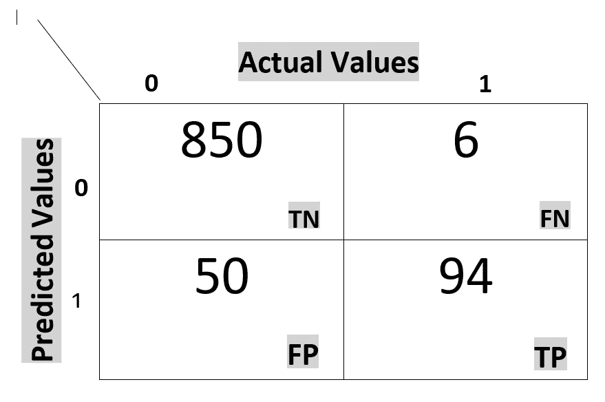

# 混淆矩阵(TPR，FPR，FNR，TNR)，精确度，回忆，F1 分数

> 原文：<https://medium.datadriveninvestor.com/confusion-matric-tpr-fpr-fnr-tnr-precision-recall-f1-score-73efa162a25f?source=collection_archive---------0----------------------->

融合矩阵用于衡量分类模型的性能。通过准确性检查我们的模型性能当我们有不平衡的数据时，有时会产生误导。你可以在这里阅读更多关于准确性的信息。

那么**什么是混淆矩阵？**

这是性能矩阵，以衡量分类模型的输出是二进制或多类。它有一个包含 4 种不同组合的表格。

上图中有两件事需要注意

*   预测值-由模型预测的值。
*   实际值-数据集中实际存在的值。

 [## 金融中的机器学习|数据驱动的投资者

### 在我们讲述一些机器学习金融应用之前，我们先来了解一下什么是机器学习。机器…

www.datadriveninvestor.com](https://www.datadriveninvestor.com/2019/02/08/machine-learning-in-finance/) 

这里，我们采用二元分类来理解模型。正分属于正类，负分属于负类。所以可以通过这 4 点来理解。

1.  **真正(TP):实际为*正*和预测为*正*的**值。
2.  **假阳性(FP):实际为*阴性*但预测为*阳性*的**值。
3.  **假阴性(FN):** 实际为*阳性*但预测为*阴性的值。*
4.  **真负值(TN):实际为*负值*且预测为*负值的***值。

速率是混淆矩阵中的一个度量因子。它也有 4 型 TPR，FPR，TNR，FNR

> **真阳性率(TPR):真阳性/阳性**
> 
> **假阳性率(FPR):** 假阳性/假阴性
> 
> **假阴性率(FNR):** 假阴性/阳性
> 
> **真阴性率(TNR):** 真阴性/阴性

为了获得更好的性能， ***TPR，*** 应该为高*，* ***FNR，*** 应该为低。

假设我们有 100 n 个点，我们模型的混淆矩阵看起来像这样。

现在，

> TPR = TP/P = 94/100 = 94%
> 
> TNR =总氮/氮= 850/900 = 94.4%
> 
> FPR = FP/N = 50/900 = 5.5%
> 
> FNR = FN/p =6/100 = 6%

这里，TNR 的 TPR 很高，而 FPR 的 FNR 很低。因此，我们的模型不在欠拟合或过拟合。

## **精度**

它用于信息检索、模式识别。*精度是所有被声明为正的点，但其中有多少百分比实际上是正的。*

> 精确度=真阳性/预测阳性

## 回忆

这是所有的点实际上是积极的，但百分之多少宣布积极。

> 回忆=真实肯定/实际肯定

## f1-分数

它用于测量测试准确度。它是精确度和召回率的加权平均值。当 F1 值为 1 时是最好的，为 0 时最差。

> F1 = 2 *(精度*召回)/(精度+召回)

*   精确度和召回率应该总是很高。

参考资料:

 [## sk learn . metrics . f1 _ score-sci kit-learn 0 . 22 . 1 文档

### sci kit-learn:Python 中的机器学习

scikit-learn.org](https://scikit-learn.org/stable/modules/generated/sklearn.metrics.f1_score.html) 

[https://en.wikipedia.org/wiki/Precision_and_recall](https://en.wikipedia.org/wiki/Precision_and_recall)

 [## 混淆矩阵

### 在机器学习领域，特别是统计分类问题，混淆矩阵，也…

en.wikipedia.org](https://en.wikipedia.org/wiki/Confusion_matrix)