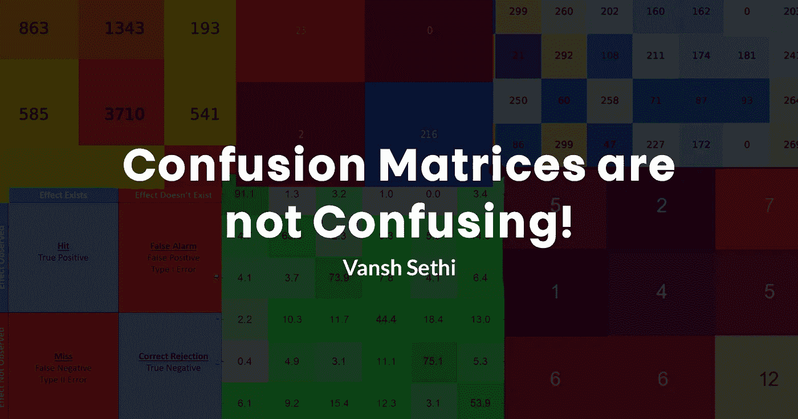
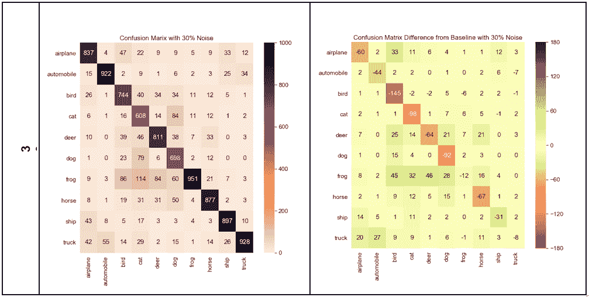
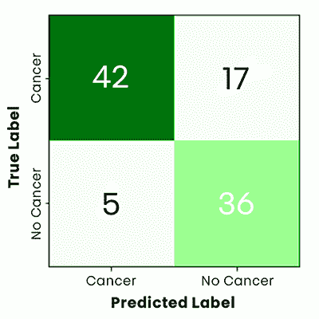

# 混乱矩阵不混乱！

> 原文：<https://medium.datadriveninvestor.com/confusion-matrices-are-not-confusing-2a6a9302c2?source=collection_archive---------9----------------------->

## 解释这些机器学习模型的重要视觉表示是如何工作的。

# **数据科学家的困境**

大公司正以前所未有的方式参与机器学习。特别是随着大公司对数据科学家的需求稳步增长，数据科学家在机器学习咨询领域承担了一项重要工作。大公司的数据科学家产生的一个问题是与公司其他分支机构的沟通问题。数据科学家和非数据科学家之间的错误沟通和误解耗费了大量的金钱和时间。问题变成了，数据科学家如何向高层管理人员传达关于他们当前项目的报告和指标？答案曾经是在公司建立一个有很多混乱的结构，然而最近，公认的媒介已经变成了**混乱矩阵**(这是一个糟糕的名字)，它是机器学习模型的视觉表示。

# **混淆矩阵——一般解释**

为了清楚地理解混淆矩阵是如何工作的，首先重要的是理解任何机器学习模型的目标。机器学习模型接受输入并产生输出。机器学习是我们让这个过程变得更好的地方，并教会模型如何每次都给出期望的输出。输入有一个标签，即真实标签和预测标签，即模型的输出。**混淆矩阵是模型对于测试集的精确程度的可视化表示。**混淆矩阵将模型的真实标签与预测标签进行比较。它向 N×N 网格的某个部分添加一个值，其中 N 表示测试集中标签的数量。以下是混淆矩阵的案例:

*   **真阳性:**真标签与预测标签相同，标签代表数据中的阳性匹配。
*   **真阴性:**真标签与预测标签相同，标签代表数据中的阴性匹配。
*   **假阳性:**真实标签不同于预测标签，真实标签是数据中的阴性匹配，而预测标签是数据中的阳性匹配。
*   **假阴性:**真实标签不同于预测标签，真实标签是数据中的阳性匹配，而预测标签是数据中的阴性匹配。

创建混淆矩阵并用值填充的方式是模型测试阶段的一部分。该模型基于预定义数量的数据点运行，并对每一个数据点进行预测。对于每个数据点及其预测，将填充以下情况之一，并且对应于该情况的网格将增加一个。这种情况会一直发生，直到整个测试集被迭代，网格被填满。

 [## 成为数据科学家所需的 8 项技能|数据驱动型投资者

### 数字吓不倒你？没有什么比一张漂亮的 excel 表更令人满意的了？你会说几种语言…

www.datadriveninvestor.com](https://www.datadriveninvestor.com/2019/02/07/8-skills-you-need-to-become-a-data-scientist/) 

重要的是要知道混淆矩阵的案例数量随着标签数量的增加而增加。标签越多，混淆矩阵必然越复杂。

# **一个实际的例子**

让我们分析一个使用混淆矩阵的实际例子。

这里我们用一个模型给猫和狗分类。在模型的测试集中有 100 个数据点。你可以看到上面的细目分类，但只有 25%的数据点被猜对了。这被认为是一个糟糕的模型，因为它没有正确地获得大多数数据点。

## *一抹色彩！*

颜色在混淆矩阵中很常见。使用颜色是因为需要用图形来传达这些模型，并且更容易传达给上层管理人员。颜色通常代表某个网格被预测了多少。通常，颜色越深，网格的值越高。使用颜色，可以更容易地看出一个模型有多好。

**专家提示:当有强烈颜色的对角线时，通常意味着模型是好的，因为那些是真正的正网格。**

## **让我们创建一个混淆矩阵！**

让我们创建一个图像上癌症检测的混淆矩阵。这是参数。

*   测试集中有 100 个数据点
*   2 类；一类表示图像中有癌症，另一类表示图像中没有癌症

因为我们知道有两个类，它必须是一个 2 乘 2 的网格，有四个部分。由于有 100 个数据点，我们必须在每个数据点上测试我们的模型，并向网格中添加值。完成 100 个数据点并将其添加到混淆矩阵后，我们得到:

这是我们创建的混淆矩阵。正如你所看到的，我们有对角线颜色的变化，这很容易看出这是一个很好的模型！

# **弥合机器学习的鸿沟**

混淆矩阵让任何人都更容易理解一个模型的表现有多好。所以下次你看到混淆矩阵时，你可以评论这个模型。混淆矩阵从根本上使上层管理人员和其他非机器学习开发人员更容易理解这些模型是如何工作的，这节省了大量的金钱和时间。这是混乱矩阵的奇妙世界。