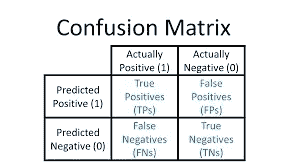
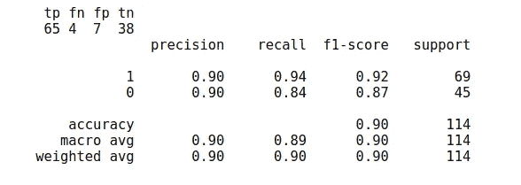
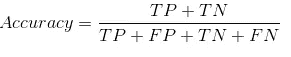
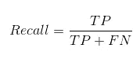
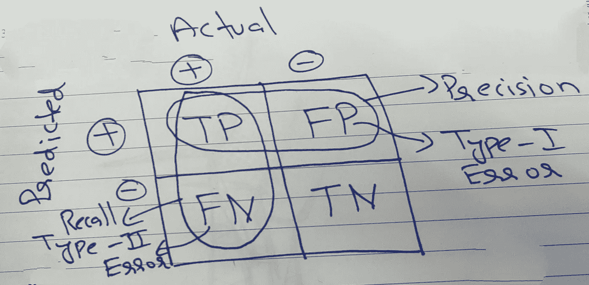

# 混淆矩阵

> 原文：<https://medium.datadriveninvestor.com/confusion-matrix-27e480d2663e?source=collection_archive---------10----------------------->

混淆矩阵是用于评估模型性能的度量。此指标用于分类问题。混淆矩阵是一个 N×N 矩阵，其中 N 是目标类的数量。混淆矩阵给出了分类模型的性能以及它正在产生何种错误的总体视图。

对于二元分类，混淆矩阵是 2×2 矩阵。

Google Image

根据混淆矩阵，有两个目标变量，即**正**和**负。**行代表预测值。列表示目标变量的实际值。混淆矩阵提供了大量信息，矩阵的每个单元都用于某种度量计算。下面是混淆矩阵中每个单元格的含义。

## 真阳性(TP)

该值表示实际值为正且预测值也为正的实例数。

## 假阳性

该值表示实际值为负但预测值为正的实例的数量。这也被称为**I 型错误。**

## 假阴性(FN)

该值表示实际值为正值而预测值为负值的实例数。这也被称为**类型 II 错误。**

## 真阴性(TN)

该值表示实际值和预测值都为负的情况的数量。

让我们借助一个例子来理解这一点…

上述代码的输出如下

上述混淆矩阵的不同值说明了以下问题:

1.  真阳性= 65，表示有 65 个案例实际上是阳性的，并且它们的预测值也是阳性的，这些被模型正确分类。
2.  假阳性= 7，表示有 7 个病例被错误地分类为阳性。
3.  假阴性= 4，表示有 4 种情况应该是阳性的，但它们被模型预测为阴性。
4.  真阴性= 38，表示有 38 个病例为阴性，并被正确预测为阴性。

让我们看看可以从混淆矩阵中得到的更精确的度量。

## 准确(性)

这一术语说明了模型的表现如何，它从预测总数中正确预测了多少个实例。

Google Image

从数学上来说，精确度被定义为总正和总负的总和除以总预测的总和。
在这种情况下，精度将为 **0.90**

## 精确

这个术语告诉我们有多少预测的阳性病例实际上是阳性的。

Google Image

在这种情况下，精度将为 **0.90**

## 回忆

召回被称为**灵敏度**或**真阳性率**。这一术语表示在实际的阳性病例中，模型正确预测了多少病例。

Google Image

在这种情况下，召回将是 **0.94**

所有这些指标都有它们自己的重要性，对于某些问题，召回优于精确，在某些情况下，精确优于召回。

召回是首选，在那些假阴性可能有害的情况下，如在医疗中，**假阴性**可能被证明是危险的，在医疗情况下，**实际阳性**不应未被发现。

## 出错率

这个术语表示在分类总数中有多少个案例被错误分类。

Google Image

在这种情况下，错误率将是 **0.09**

## f 值(F1 值)

当我们不知道在召回率和准确率之间应该优先选择什么的时候。然后结合这两个指标。

Google Image

这是召回率和精确度之间的权衡。它的**谐音表示**的召回和精确。当精度等于召回率时，它是最大的。
在我们的例子中，F1 分数将是 **0.92**

# 结论

有许多度量来评估分类模型的性能。但是根据模型选择正确的度量是重要的一步。通常我们使用**准确性**作为通用指标，但是正如我们所看到的**精确度**、**召回**和 **F1 分数**也是重要的指标，可以更好地理解模型并产生更好的结果。

如果你喜欢并欣赏这本书，👏👏鼓掌，分享。

你可以在这里找到 的代号[。
可以在](https://github.com/pranavkriya/statistics/blob/main/confusion_matrix.ipynb)[**Linkedin**](https://www.linkedin.com/in/pranavgarg1506/)**上联系我。**