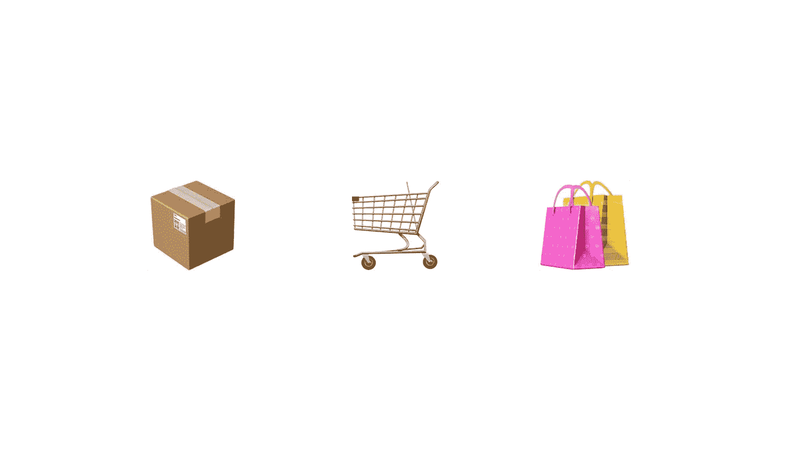

# 互联智能包装 101

> 原文：<https://medium.datadriveninvestor.com/connected-smart-packaging-101-d64d62d90e91?source=collection_archive---------3----------------------->

## 新包装技术如何改变商业

# **互联包装是如何工作的？**

关联包装清单和工作有多种形式。这个术语目前对任何主动或被动连接到互联网的包都有点笼统。所有连接的包装最终会增强包装的功能。最终目标是为制造商、零售商、品牌或最终消费者增加价值。根据利益相关方的不同，这意味着支持物流、防止盗窃、增加参与或增强体验。

连接的打包要么由用户的操作(如扫描或点击)触发，要么由时间、接近度或温度自动激活。这里有几个例子…

对于可能是当今最普遍的激活，印有 QR(快速响应)码的连接包装允许消费者用他们的移动相机扫描条形码来打开体验。 [19 罪](https://www.19crimes.com/living-wine-label)，一种葡萄酒标签，允许饮酒者扫描瓶子，通过应用程序中的 AR 将印刷的字符栩栩如生。它已经被下载了近 50 万次，并帮助建立了 19 个犯罪作为一个可识别的品牌，在一个不知道忠诚的类别。

连接包装的另一个例子包括 NFC(近场通信)标签。消费者无需扫描二维码，只需将设备轻触包装，即可激活体验。NFC 标签可以提供新颖的在线或 AR 体验，或者检测产品篡改。去年，卡夫亨氏将 NFC 技术集成到其[单身奶酪](https://www.nxp.com/company/blog/nfc-gets-cheesy-with-kraft-singles:BL-NFC-GETS-CHEESY-WITH-KRAFT-SINGLES)产品中，让消费者可以立即获得优惠券进行结账。

我们可以看的第三个例子是智能药瓶，它可以跟踪一个人的制度，如果他们错过了一个剂量，就会提醒他们，或者当病人准备再补充时，就会提醒处方医生。相对于前面的例子，智能药瓶被动地、在幕后工作，并且具有救生而不是新颖的含义。

# **这些年来发展如何？**

连接包装的演变取决于品牌的创造力和可用的技术。有很多方法可以思考它的发展。

互动印刷品(小册子、海报、广告等。)诞生了交互式包装。与一对多的体验不同，在一对多的体验中，像传单这样的固定机会可以接触到许多消费者，各种形式的无处不在的包装可以接触到更多的人，因为他们会将产品带回家。这可以发展更丰富、更亲密的经历。

可以说，亚马逊的 Dash 按钮可能是 Tide 包装的延伸。点击以重新排序。在这种情况下，我们意识到如何扩大连接包装的起源，以及它可以采取多种形式。

今天，互联包装正在超越其新颖性的低谷，并引入一个显着的投资回报率领域-改善库存管理，跟踪可持续性，提高安全性，并提高体验。

# **互联包装如何基于数据帮助品牌与其消费者建立关系？**

包装是一个品牌的无声推销员。它代表一个公司被动地工作。连接包装有助于加强公司的作用，振兴产品的目的，价值和与消费者的关系。

实施数据采集后，包装在客户旅程中扮演了更加积极的角色。品牌将能够跟踪消费者行为，并跨细分市场进行分析，最终实现更好的产品开发和营销。互联包装打开了个性化的闸门。

# **品牌和代理商是否应该更加认真地对待关联包装？**

连接包装仍然是一个困难的赌注，因为它是一个“鸡或蛋”现象。你是等到大规模采用和正常化，还是第一个将创新的例子推向市场，成为头条新闻？

令人兴奋的是这些技术变得如此廉价和普遍。由于几乎所有的消费者都有办法用 NFC 和 QR 激活包装，所以只需要一些品牌进行足够响亮的宣传，并创造性地提供小费。当我们考虑生产连接包装技术的持续降低的成本，预计增加的功能，以及由此增加的投资回报率时，连接包装作为一项有价值的投资是有意义的。

关联包装本身应被视为现有渠道战略之间的桥梁。你如何将你的零售策略与你的社交媒体或消费者个性化策略联系起来？互联包装就是这条路。在疫情，餐馆严重依赖二维码菜单，食客扫描代码在线访问菜单，避免了对实体菜单的需求。这有助于扫描行为的普遍化。

连接包装是一项伟大的投资，因为它解决了购买前和购买后的时刻。包装可以帮助正在购物的顾客销售产品，也可以加强他们购买产品后的家庭关系。

当我们认识到所有相关方时，我们就可以考虑互联包装未来成功的复杂性和吸引力。它依赖于品牌、零售商、消费者、包装商和运输商，以及管理传感器、存储、计算和分析的技术专家。

# **为什么说连接包装正在兴起？**

随着相关技术变得大众化，连接包装正迎来一个重要时刻。苹果和安卓设备都支持 QR 和 NFC 技术。我们谈论的是超过 20 亿台设备。此外，通过苹果的 ARKit，应用程序开发者和品牌有机会创建由包激活的新的沉浸式体验。竞争压力也加剧了跳上连接包装的动机。

连接包装目前提供的价值取决于新颖性和重要性。访问回收说明、截止日期和使用指南是连接包装更实质性的使用案例。当这些体验被升级和无缝访问时，就是它起飞的时候。

# **互联包装的未来是什么？**

与在线打开食谱或目睹静态 ar 体验等单一体验不同，互联包装将成为通向可能性生态系统的大门。想象一下，把新买的食材带回家，它会与你的智能厨房互动，并触发烤箱准备。或者想象一下，能够检查一件衣服的供应链和碳足迹，以告知你在商店的购买决定。

最终，连接包装将真正走向后台。包装本身变得次要了。人们正在通过标签追踪你的苹果来自哪个农场。不需要包装就能获益。

RFID(射频识别)传感器将越来越多地进入市场。与 NFC 技术相比，这些传感器可以远距离传递信息。运输三文鱼的包装可以提醒收货仓库哪些特定的三文鱼暴露在过高的温度下，然后他们可以消除受损的产品，而不会影响整个运输。这里真的有无限的可能性。