# 连接真实世界:Amap 背后的算法和创新

> 原文：<https://medium.datadriveninvestor.com/connecting-the-real-world-algorithms-and-innovations-behind-amap-4776f0d2fa85?source=collection_archive---------6----------------------->

*作者任晓峰来自* [*Amap Tech*](https://community.alibabacloud.com/users/5241164025409916) *。*

旅行是我们日常生活的重要组成部分。我们习惯了导航工具，但你知道支撑一个导航 app 所需要的底层数据和算法吗？你知道算法如何改善和创新旅行体验吗？在最近阿里巴巴首席信息官学院关于对抗疫情技术的直播中，Amap 首席科学家任晓峰通过查看地图制作、搜索推荐、路线规划和其他高级功能，解释了 Amap 背后的[创新算法](https://www.alibabacloud.com/product/machine-learning)的演变和创新。

 [## 算法是如何将个人和社区置于危险之中的？数据驱动的投资者

### 尽管数学方程看起来遥远而冷漠，但它们通常也与可靠的硬科学联系在一起…

www.datadriveninvestor.com](https://www.datadriveninvestor.com/2020/05/18/how-could-algorithms-put-individuals-and-communities-in-harms-way/) 

# 什么是 Amap？

[Amap](https://www.amap.com/) 前身为高德，是阿里巴巴集团旗下的一款地图应用，是中国领先的地图服务提供商。它已经成为中国旅行的热门工具，日活跃用户超过 1 亿，月活跃用户超过 4 亿。Amap 的服务涵盖信息服务、驾驶导航、共享出行、智慧公交、智慧景点、骑行、步行、长途旅行。Amap 不仅仅是一个导航工具，还是一个互联网基础设施。就像淘宝建立消费者和产品的关系，支付宝建立人和资金的关系，Amap 建立人和地点的关系。更重要的是，它建立了人与现实世界之间的关系。Amap 的使命是连接世界，让旅行更精彩。Amap app 只是冰山一角，大家都能看到的我们工作中的少数。有大量的工作隐藏在每个人的视野之外，例如定位，路线规划，路况检测，预计到达时间(ETA)，在线乘车，货运，基于位置的服务(LBS)游戏，以及基于供应和需求的路线规划。所有这些都需要大量的技术支持。

# 用算法连接世界

## 1)地图制作

地图制作是一个非常复杂的过程。如下图所示，我们首先要收集信息，然后用算法自动识别感兴趣的物品。目前，还没有实现全自动识别。在将信息导入地图服务之前，仍需要进行手动校正。

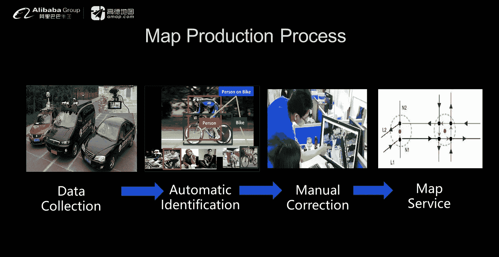

**地图制作算法:**地图制作算法大致可以分为两类。首先是路标识别，算法识别限速标志和禁止停车标志，如下图所示。除了道路信息，兴趣点(POI)标志的识别算法还用于识别沿路的商店和其他兴趣点。这两类算法的实现必须克服现实应用中的许多困难。

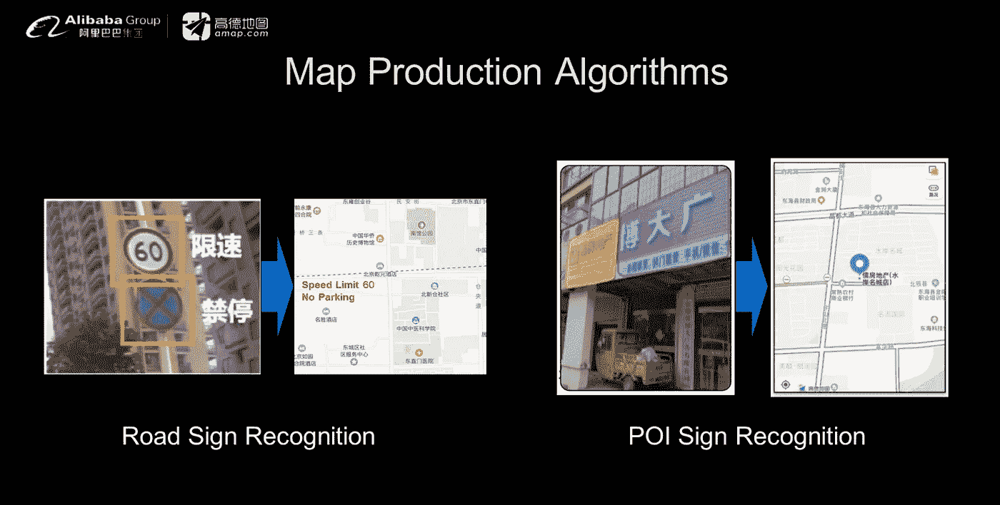

**路标识别:**如果我们考虑路标识别，如下图所示，我们首先需要使用一种目标检测算法来识别图像中的路标。然后，我们必须对检测到的标志进行分类，比如识别下图中的请勿入内标志。然后，我们必须进行文本识别，以识别标志的具体内容，表明它适用于 2:00 至 5:00 期间的长途汽车。路标识别过程看似简单，但我们必须克服各种困难来实现它。

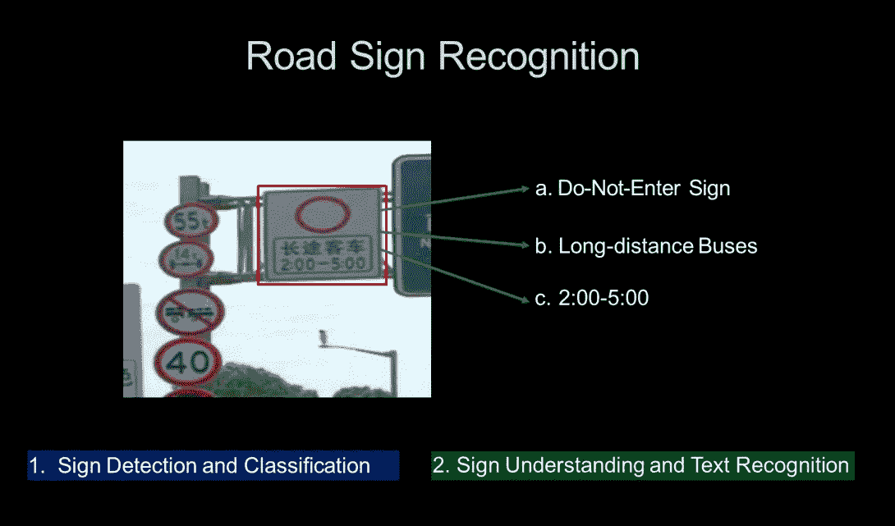

**路标识别的挑战:**

(1)现实世界中有很多种路标。下图中显示的迹象甚至不是所有可能的迹象。不同道路标志的数量对分类任务提出了重大挑战。

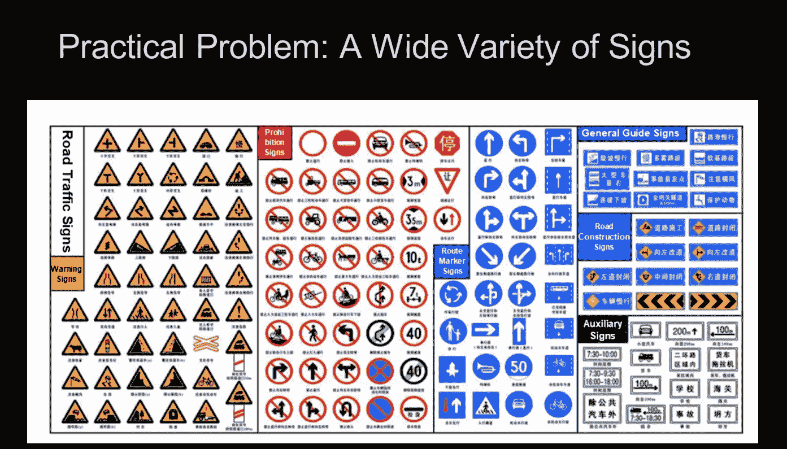

(2)图像质量差也增加了路标识别的难度。图像质量问题包括失真、反射、遮挡、低分辨率和图像压缩。光照条件和天气的影响会导致图像质量非常差。

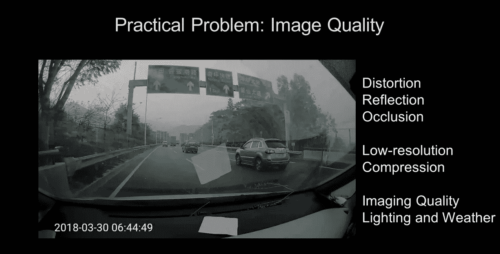

图像畸变的解决相当于摄像机自动标定的过程。这个过程必须考虑相机的内部参数，如焦距、中心和失真，以及未知的外部参数，如位置和角度。为了确保图像的标准，必须使用校准算法来校准每个摄像机，这是不可行的。目前，我们可以使用多源图像匹配和质量更好的相机在相当程度上解决相机自动标定问题。

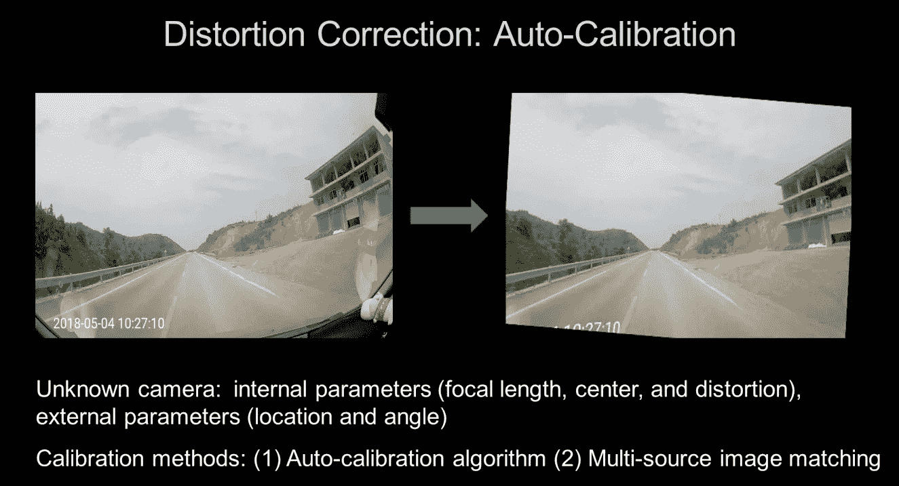

我们可以使用图像质量增强方法来解决图像质量问题。在下图中，源图像位于左侧。您可以放大源图像以查看一些文本，但一些细节并不清楚。右图显示了通过图像增强可以使文本更加清晰。图像增强可以提高识别算法的准确性。它还可以用于模糊检测，提高人工识别的效率。

(3)需要检测小目标是图像检测领域的一个普遍问题。在下图中，您可能会猜到高亮显示的对象是一台相机，尽管它非常小。但如果放大，分辨率会很差，小目标本身包含的信息非常有限。外围信息有助于探测小目标。因此，我们引入注意机制，并利用先验知识，如摄像机的分布、高度和大小，来帮助解决小目标检测问题。

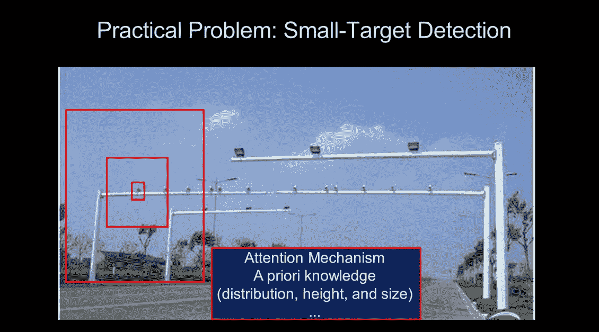

(4)在实际应用中，小目标的检测比变化的检测更重要。例如，由于时间、天气、使用的相机和其他因素的变化，人类很难区分下面两幅图像中的相机是否相同。相比之下，算法可以检测位置、相关联的车道和摄像机结构类型，并执行场景分析以确定两个图像是否属于相同的摄像机。

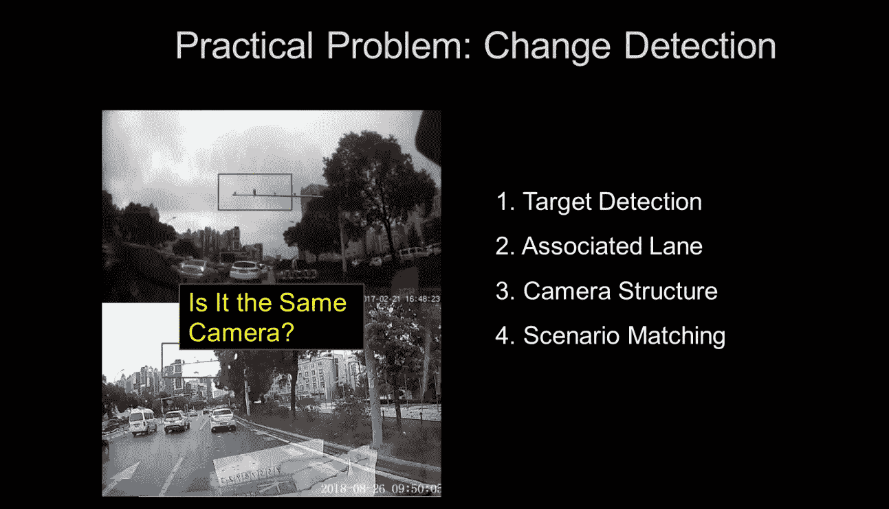

**POI 标识的识别算法:**在真实的街道环境中，一条道路沿线的商店等 POI 的标识非常复杂密集，因此 POI 标识识别仍然面临很多实际问题。

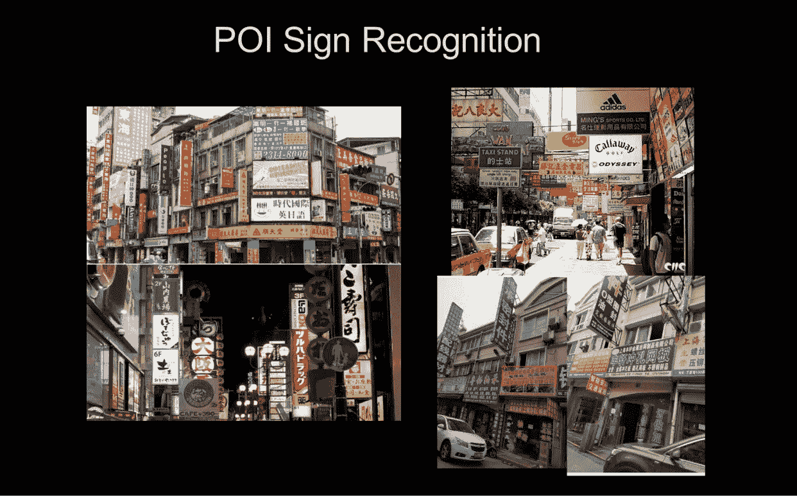

**兴趣点标识的挑战:**

(1)在实际街道上，poi 以各种方式标记其位置，如拱门、铭牌、悬挂标志或建筑物上的文字。许多看起来像 POI 标志的物体并不是，例如带有标语的横幅、广告牌、涂在墙上的标语、交通标志、对联和车牌。

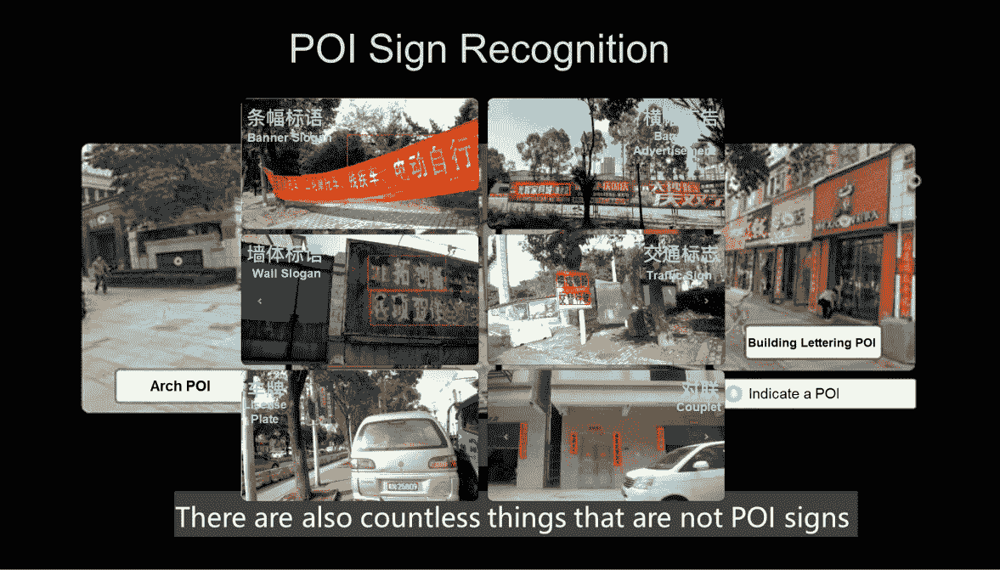

(POI 识别后，必须进行文本识别和提取。对于这一过程，除了 POI 标志类型多样外，还存在标志密度不均、形状特殊、标志不清晰不完整等问题。这些复杂的问题需要结合多种技术来解决，如多级级联检测模型、文本检测与识别、三维重建位置匹配、模糊和遮挡文本检测技术等。

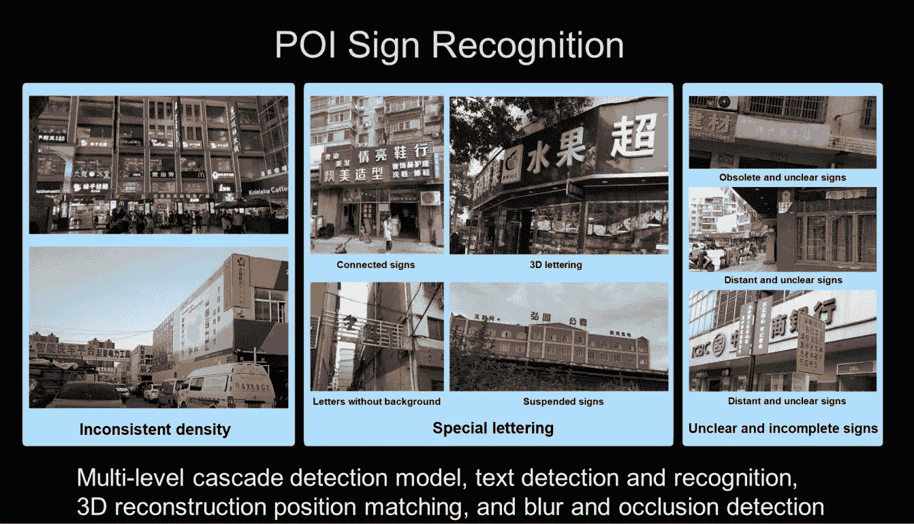

(3)POI 排版识别除了文字识别之外，还需要对招牌的正面进行分析，了解招牌上的总店名称、分店名称、联系方式、经营范围、非 POI 文字。因此，POI 文本识别需要先识别属性，根据文本语义、图像、位置整合特征，再根据场景理解和周边上下文信息确定上下文。

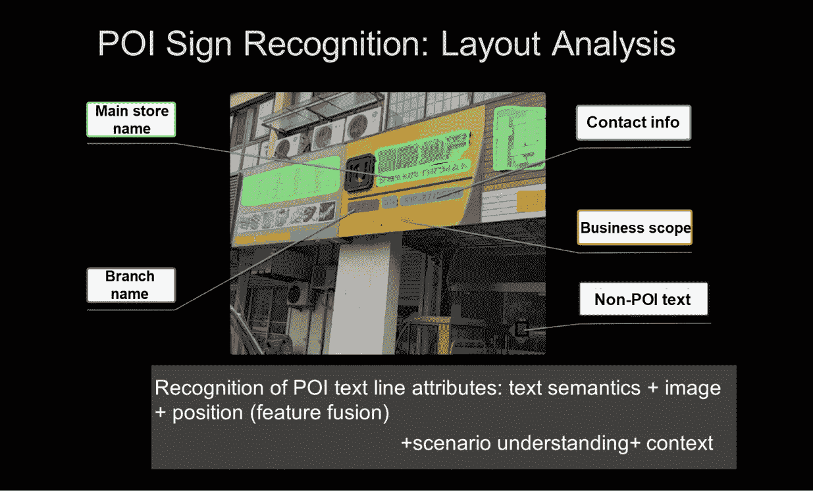

总的来说，要保证和提高地图数据的精度，基于影像的地图自动化生产的程度和效率是非常重要的。除了集中精力改进算法和多源数据，Amap 还不断推出新技术。未来，Amap 希望将其算法放在终端上，以帮助我们更好地实时了解道路场景，并以更快、更准确的方式收集地图信息。

## 2)搜索推荐

我们的地图应用程序提供多种类型的搜索功能。首先，用户可以输入目的地的简短描述，以允许应用程序在地图上执行更精确的搜索并返回结果。用户还可以通过输入“餐饮”或特定的娱乐品牌，按类别或品牌进行搜索。在旅行期间，该应用程序还提供在途导航搜索功能。

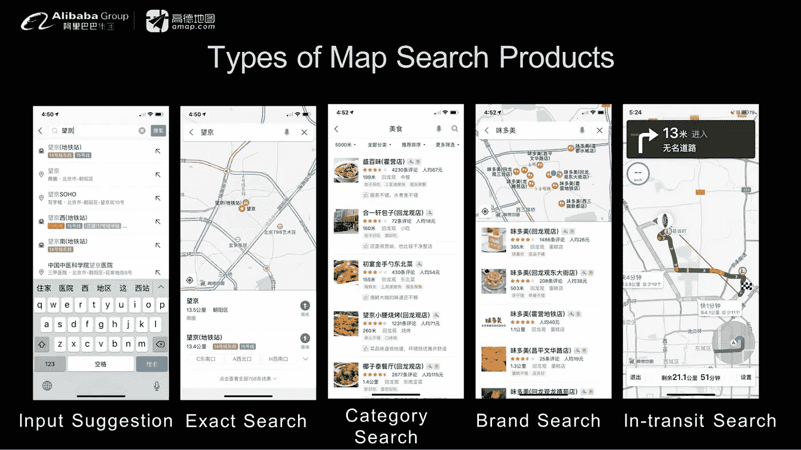

**地图搜索的特点与挑战:**下图从技术角度对比了地图搜索与传统电商、网页搜索。首先，网页搜索在非常大的范围内扫描长的非结构化文本，有数千亿个可能的结果。电子商务搜索扫描数十亿件产品，并返回一系列图片。相比之下，地图搜索的输入是描述兴趣点的一小段结构化文本，搜索必须扫描数千万个兴趣点。然而，地图搜索的准确度必须相对较高，并且必须收集地图位置信息以支持搜索算法。

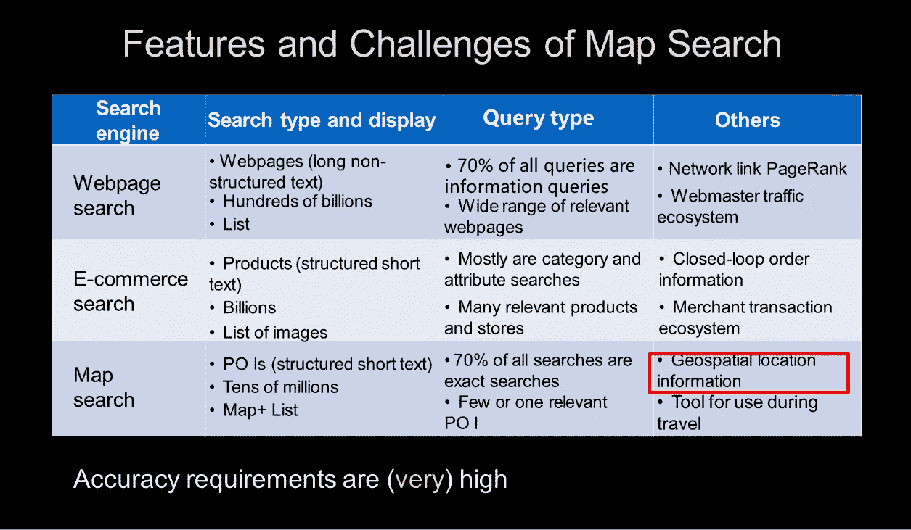

**Amap 搜索技术的演变:** Amap 于 2010 年开始建设搜索系统。自 2014 年以来，我们引入了一系列高端技术来构建搜索专家系统。我们已经完全整合了机器学习和深度学习，以构建搜索中端，并创建端到端的业务渠道平台。我们还支持神马、菜鸟、斑马、Ele.me 等服务。

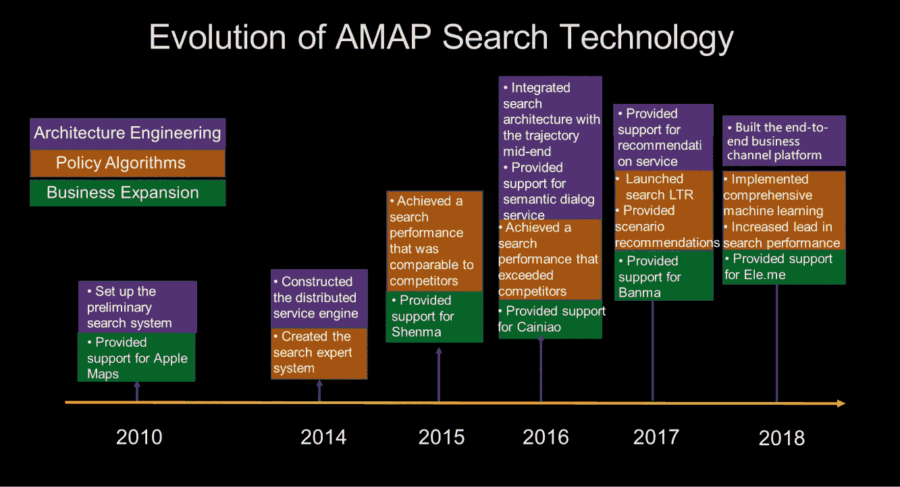

**Fuzzy search example:** The following figure shows a search for “Hunan Provincial Human Resources and Social Security Hall” (湖南省人力资源社会保障厅). If the input statement is completely correct, the system can directly find the destination. However, input statements often contain mistakes, so the search algorithm needs to introduce geographical error correction for high and low frequency error correction, apply semantic rewriting through semantic matching, and establish a spatial model of the text through spatial relations. The search algorithm not only solves simple sentence matching but also identifies the intention of the search. This includes judging whether the search scope falls into the current region or an external region, whether an exact search or reverse search is required, whether the search is for real-time information or research, and whether the purpose of the trip is tourism or business.

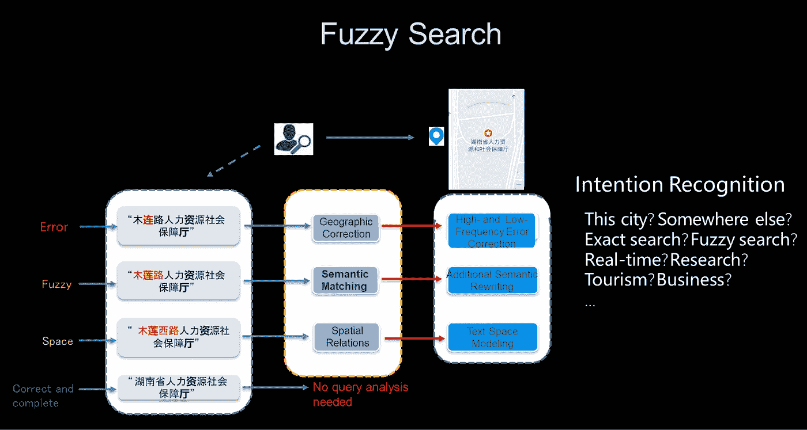

**多源地理信息数据库:** Amap 希望建立一个基于地理位置的综合信息数据库。这里，地理位置信息包括位置、道路网络、建筑物、房间和其他信息。它还包含名称、类型、功能、时间和注释信息。这些信息从许多来源获得，包括图像获取、文本大数据、搜索大数据、轨迹大数据、用户输入和行业信息。使用算法的一个主要挑战是找到整合多源信息的方法，以建立一个准确而丰富的综合信息数据库。

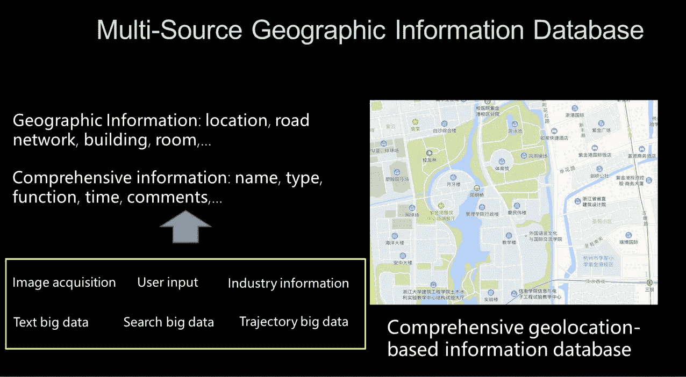

## 3)路线规划

**Amap 路线规划的演变:**下图是 Amap 路线规划的演变。Amap 从 2004 年开始提供路线规划服务。随着算法的不断改进和进化，Amap 目前正在研究多目标算法，可以用来满足用户的需求，快速规划更好的路线。

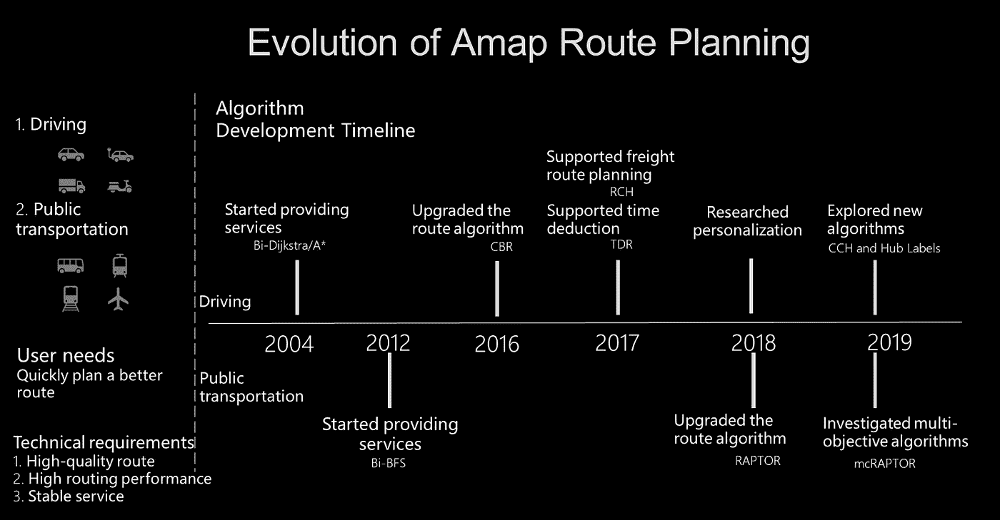

**路径规划挑战:**在现实场景中，路径规划技术需要解决超大规模的实时路径规划问题。具体来说，路线规划问题包括大规模的道路网络。例如，中国有 4000 多万条道路。第二，道路属性变化频繁，每季度约有 10%的道路更新。路况信息必须每隔几分钟更新一次。

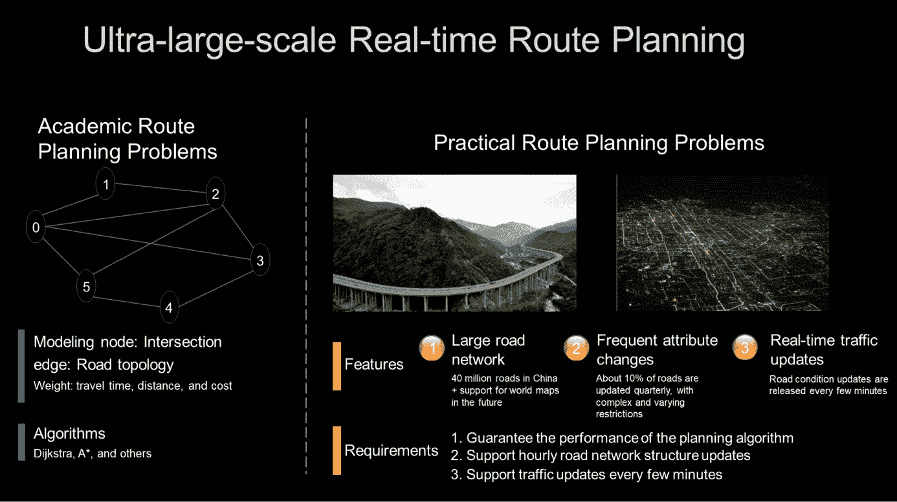

作为一个实际问题，超大规模实时路径规划与学术界研究的最短路径算法有很大不同。提高标准算法效率的一个重要方法是引入预处理，这有助于解决大规模实时路径规划的困难。有许多预处理算法，如弧标志和多层。

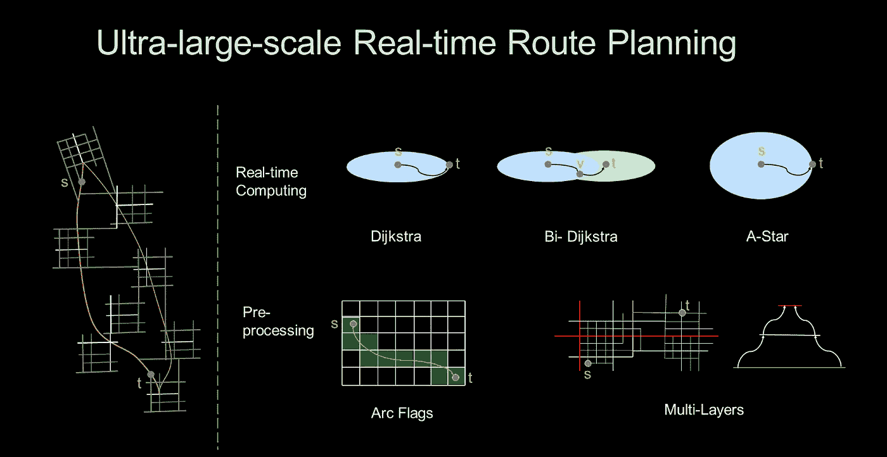

学术界针对超大规模最短路径问题提出的一些较好的算法有 TNR、CH 和 CBR。因此，我们必须找到一种方法来选择将在现实世界场景中提供最佳结果的算法。我们需要根据规模、实时性能、路况更新等实际需求，在算法性能和预处理性能之间取得平衡。

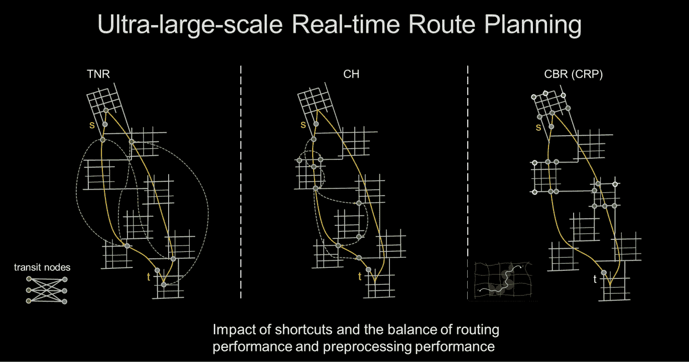

要满足实际要求，首先要保证规划算法的性能。需要满足实时性要求，比如每小时的路网结构更新，每隔几分钟的路况更新。本质上，对强实时性能的需求促进了算法设计的改进。基本算法一般是分层的。划分多个单元进行预计算，以找到最短路径。基于道路网络结构对像元进行划分，并更新其权重。在硬件方面，我们的系统支持基于大内存的多核并发和缓存优化。

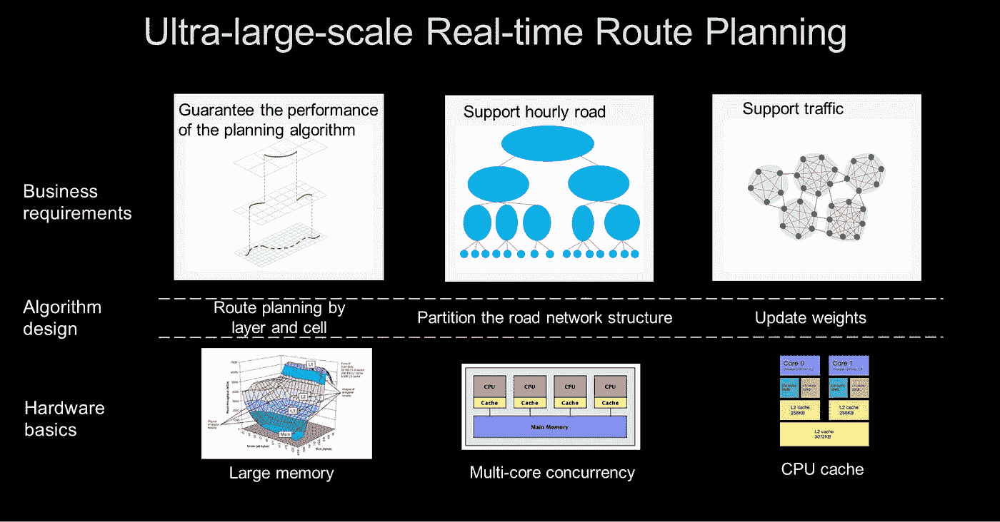

## 4)数据挖掘

现实生活中会产生大量的路径信息。我们必须找到一种方法，从时空大数据中挖掘出我们需要的特定信息。具体来说，我们需要挖掘关于兴趣点、新道路、事故和拥堵的信息。

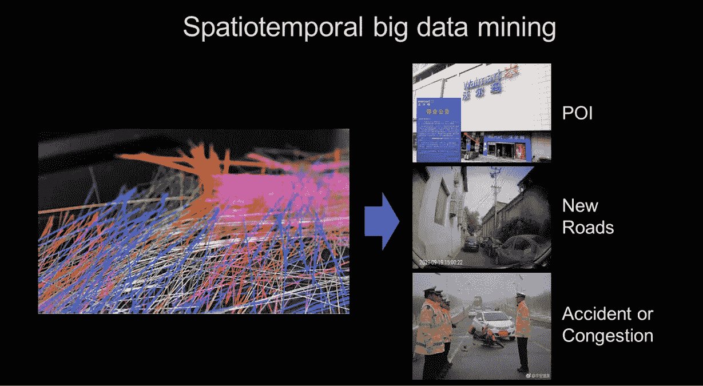

**时空大数据挖掘的挑战:**

在现实应用中，数据挖掘必须克服许多挑战，如不准确的轨迹、复杂的行为和苛刻的时效性要求。目前，通过多源信息集成和时空模型，如 RNN、LSTM、CTC、TCN 和 GCN，特定的模型改进可以为反馈循环和数据回流提供支持。

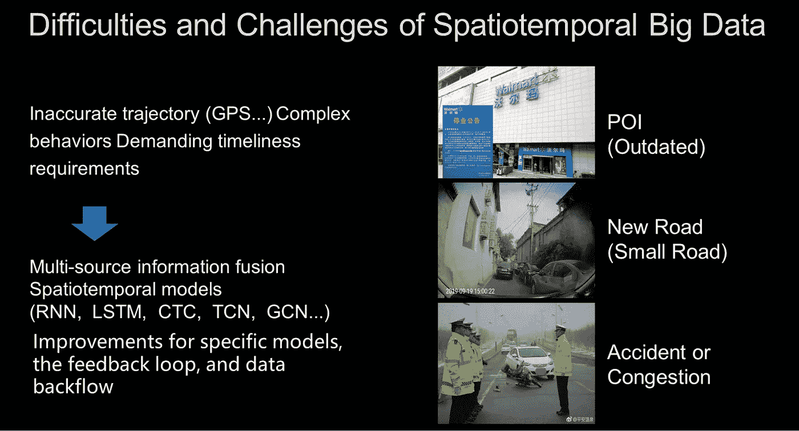

**过时的兴趣点挖掘示例:**过时的兴趣点挖掘以空间拓扑描绘和来自多个来源的特征的集成为特征。在这种情况下，我们可以使用 Wide & Deep 模型，用 Wide 模型处理 poi 的静态特征，用 deep network 处理时序流量特征。Amap 在这一领域也发展了多种模型。例如，我们从递归神经网络(RNN)升级到 DeepTCN，以更好地挖掘 POI 到期信息。

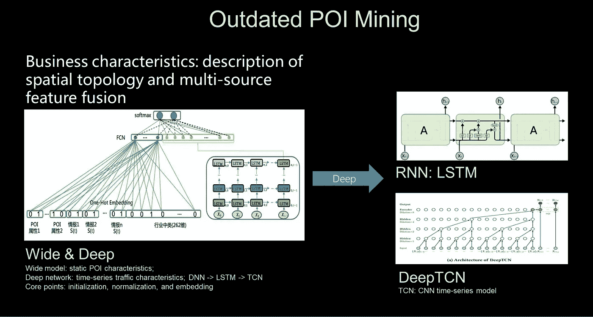

**新道路挖掘的例子:**为了解决新道路的问题，除了针对特定问题设计算法，还需要容错，例如来自不同缩放的轨迹特征，通过均值漂移轨迹获得的种子点，以及主曲线。我们还可以对短路、连接路和其他特定场景使用概率模型。此外，CNN 端到端模型从热图像和卫星图像中收集空间描述信息，并通过轨迹和道路网络连通性描绘驾驶行为。

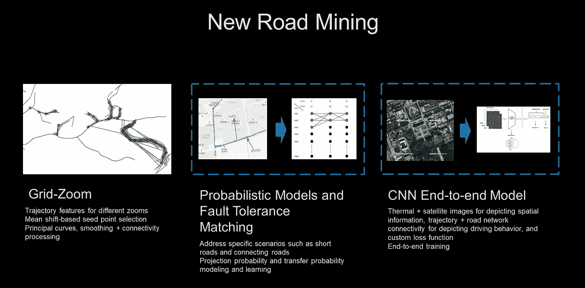

# 用算法创造旅行的未来

## 1)高精度地图

高精度地图是自动驾驶的基础。自动驾驶系统对准确性提出了苛刻的要求，需要地图来正确反映现实世界。这包括完整准确地描绘道路、车道和周围环境。Amap 要求位置读数精确到 10 厘米以内。采集高精度地图数据后，我们需要解决以下问题:

高精度地图面临的挑战:

**(1)数据对齐问题:**即使给定高精度信息和高精度车辆位置，误差仍然大于 1 米。通过对齐从多个来源收集的数据，我们可以将精度提高到 5 厘米以内。我们还需要处理植被覆盖和其他场景，同时保持轨迹的刚性。对于不同的上下游观察角度和点云，前端需要进行迭代最近点(ICP)、语义、特征、形状的匹配，然后在后端进行大规模的比对和比对信息的平滑。

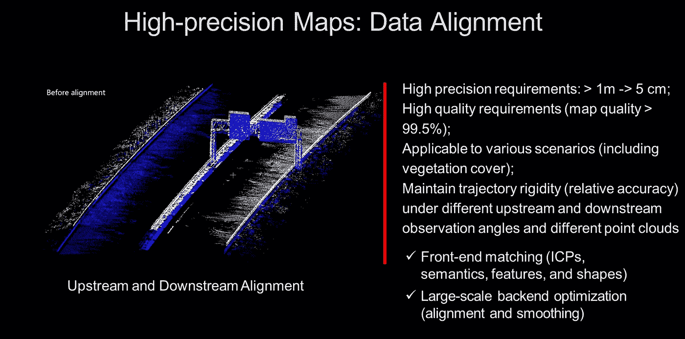

**(2)识别:**需要识别道路上的很多物体，比如车道线、道路边缘、道路上的标线，以及包括电线杆、标志、桥梁在内的 OBJ 物体。识别精度要求召回率在 99%以上，位置精度必须在 10 厘米以内。然而，由于场景的频繁变化，训练样本非常有限。通过整合点云与图像算法，并将深度学习与传统算法相结合，Amap 重用了常规地图中的度量数据和模型，以支持具有先验信息的数据回流和模型迭代。

**(3)从高速公路到城市:**前面的问题在高速公路上并不是很严重，但在城市驾驶中，我们必须处理许多不同道路类型的复杂网络，包括高速公路、主干道和小路。许多不同的迹象是复杂的，经常变化，有复杂多变的情况，拥挤和堵塞。

## 2)视觉定位(GPS)

在四面高楼林立的城市峡谷中，定位不准的问题经常发生。在下图中，红点表示真实位置，而黄点表示 GPS 位置。正如你所看到的，两者之间有很大的偏差。

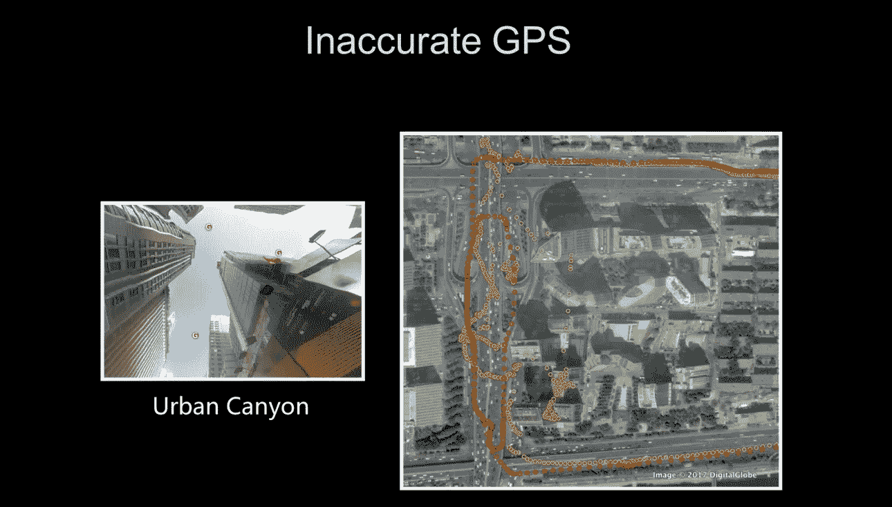

视觉定位方法可以帮助解决定位不准确的问题。目前，所有的手机都有摄像头，越来越多的汽车也有摄像头。对于我们来说，我们正在考虑如何利用图像和视频技术，建立一个通用的车辆和人的视觉定位方法，无论是室内还是室外。具体来说，有几个技术选项可供选择。同步定位和绘图(SLAM)和视觉惯性里程计(VIO)是定位相对位置的方法。为了定位绝对位置，可以使用从稀疏特征加上透视 n 点(PnP)的 3D 重建方法来获得更精确的结果。另一种选择是矢量地图+实时监控算法方法，用于检测标志、线条等物体。这些算法需要很高的计算能力和准确性。Amap 也在探索可以平衡准确性和鲁棒性的深度学习方法。

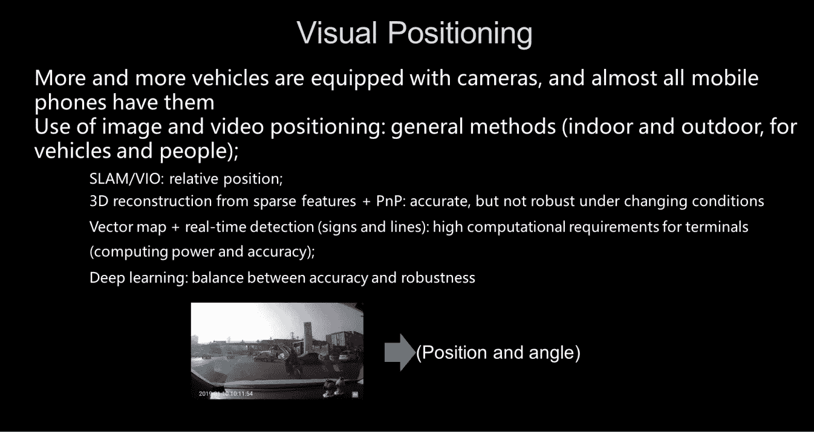

如果给我们一张照片，我们想知道它的位置和角度。为此，我们需要一个位置已知的参考图像。然后，我们可以使用实时图像来获得高效的定位性能，在任何天气条件下以毫秒为单位提供整个道路网络的结果。

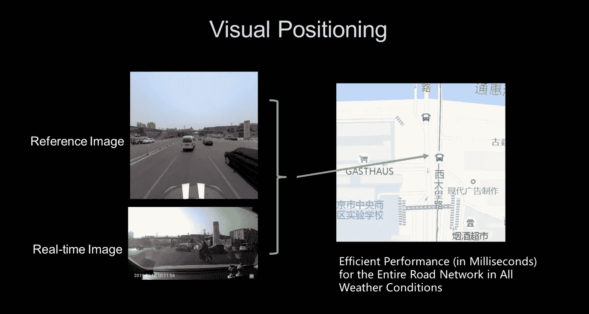

## 3)增强现实导航

导航体验如何提升？在现实世界中，我们会遇到很多复杂的场景。Amap 希望提供“所见即所得”(WYSIWYG)的导航体验。传统导航系统输出的图像类似于下图左侧所示的图像。使用增强现实(AR)输出如右图所示的导航图像会更好。

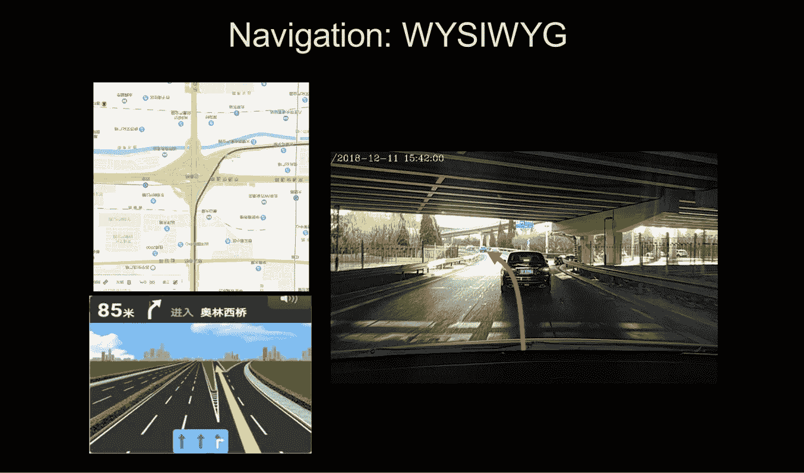

Amap 在 2019 年 4 月发布了一款 AR 导航产品。下图显示了我们的 AR 导航系统提供的导航视图。绿色路线引导汽车，并指示它应该如何转弯。还有基于你与前车的距离的检测和碰撞警告功能，以及驾驶辅助安全功能，我们正在努力逐步改进。

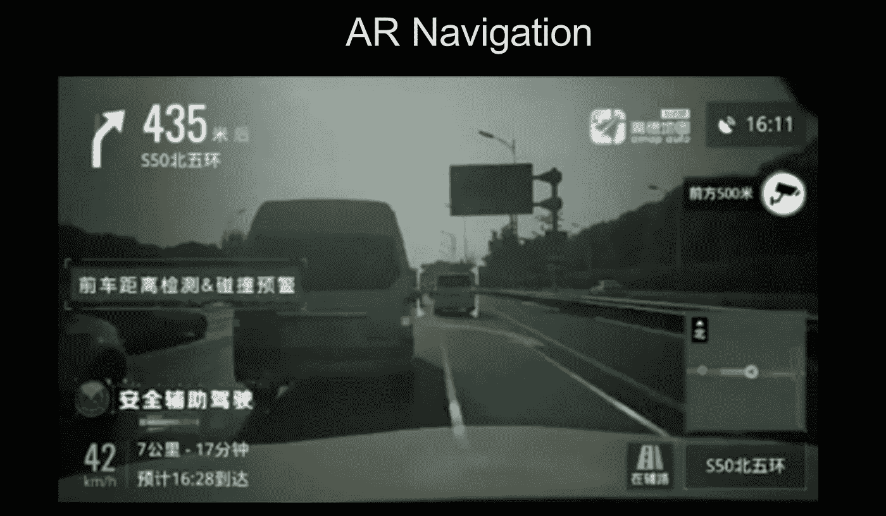

与目前的自动驾驶技术不同，AR 导航希望通过更简单的手段解决技术问题。目前，Amap 的单摄像头传感器可以提供更好的导航性能，同时只使用一个手机芯片五分之一的计算能力。

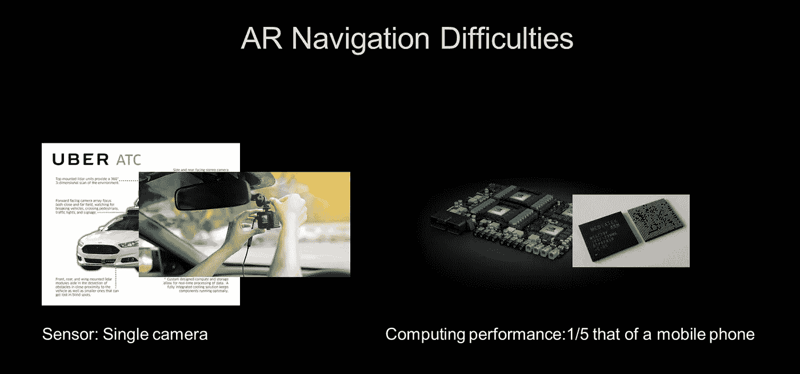

**AR 导航车辆检测示例:**如下图所示，导航系统检测到你前方的车辆。为了有效地检测前方的车辆，必须使用先验比例对模型进行压缩、训练和优化。可以基于检测来执行实时轨迹跟踪。

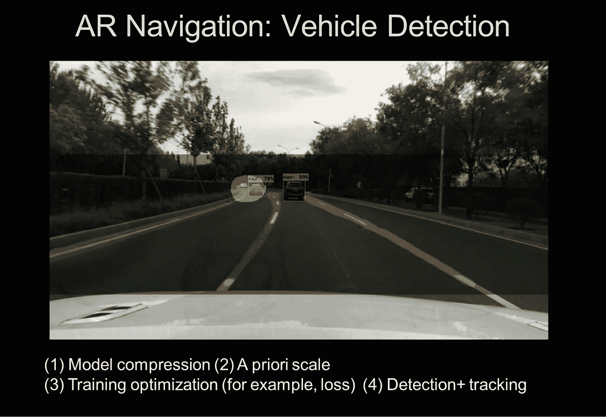

**分割 AR 导航车道线的例子:**车道线检测和车辆检测遵循相同的原理。首先，模型被压缩。然后，基于多任务模型，集成多种目标检测算法以提高模型的可重用性。最后，我们训练和优化模型，执行曲线拟合，并集成检测和跟踪。

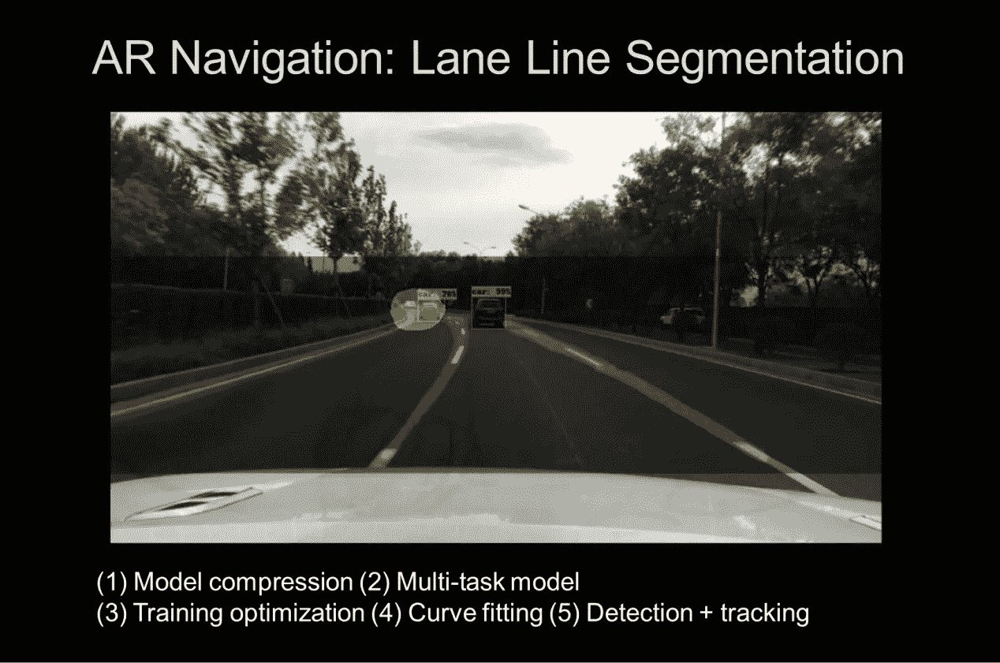

**AR 导航指引线示例:**基于语义分割和回归模型，AR 导航视图中的指引线与传统 GPS 导航相结合，提高了模型的性能。

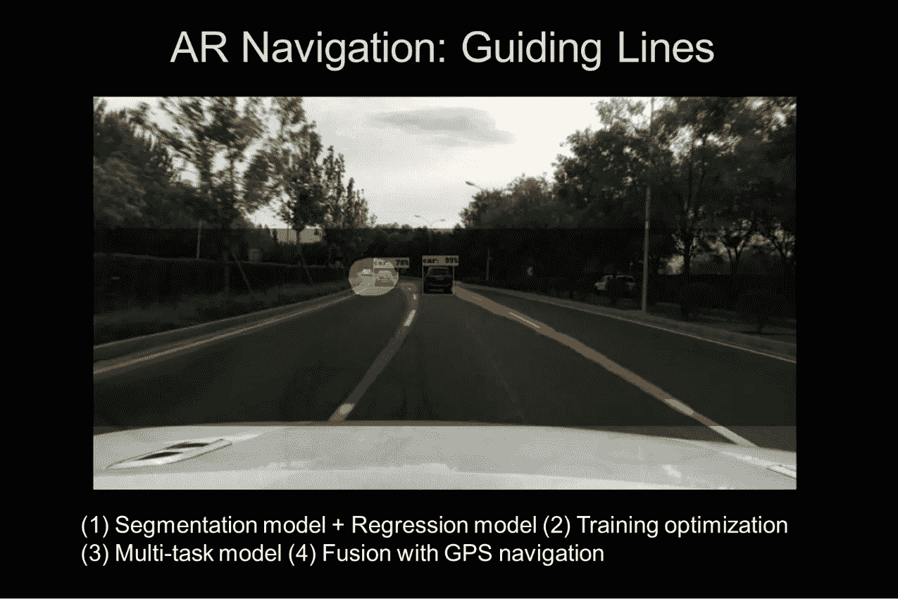

下图显示了 Amap AR 导航系统的实际显示。AR 导航可以实时警告行人，或者提醒你某个红绿灯变了。

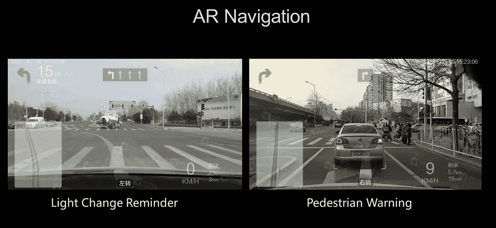

*在* [*我们的科技秀系列*](https://resource.alibabacloud.com/webinar/topic/tech-show.html) 上，从阿里巴巴的顶级资深专家那里了解我们的核心技术和最新产品更新

# 原始来源:

 [## 连接真实世界:Amap 背后的算法和创新

### 阿里巴巴云 2020 年 6 月 17 日。旅行是我们日常生活的重要组成部分。我们是…

www.alibabacloud.com](https://www.alibabacloud.com/blog/connecting-the-real-world-algorithms-and-innovations-behind-amap_596304) 

**访问专家视图—** [**订阅 DDI 英特尔**](https://datadriveninvestor.com/ddi-intel)