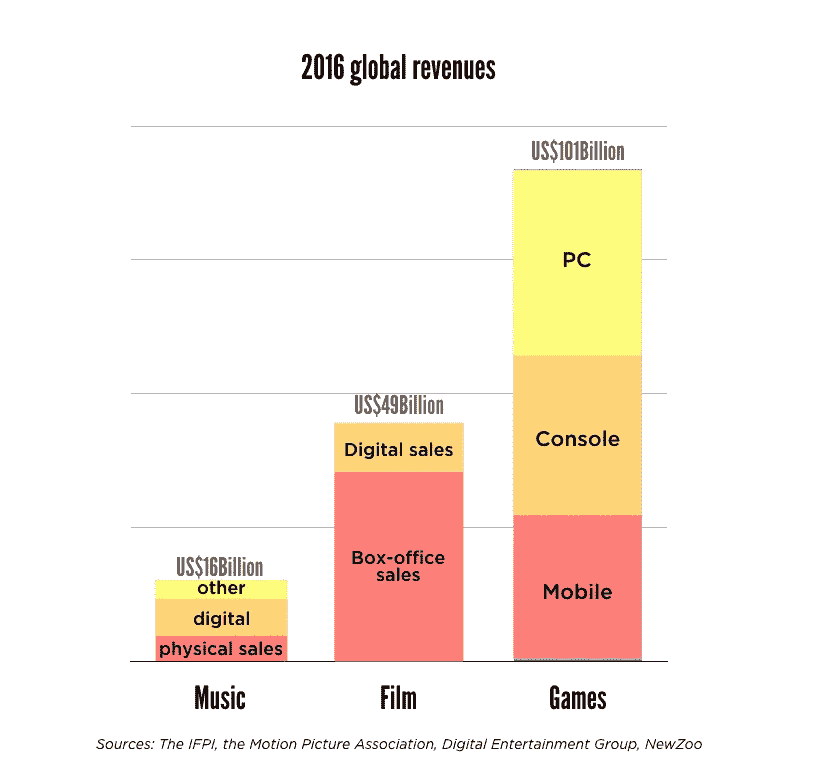
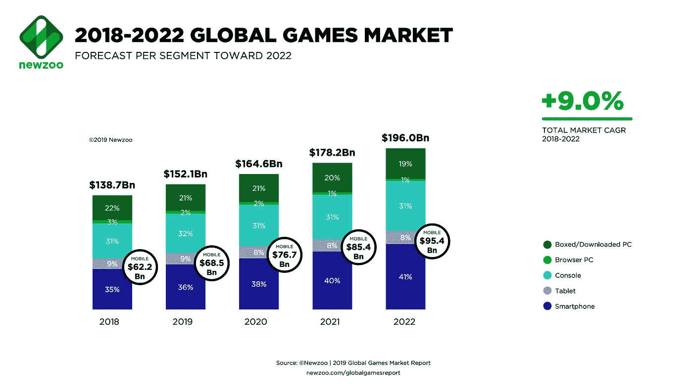
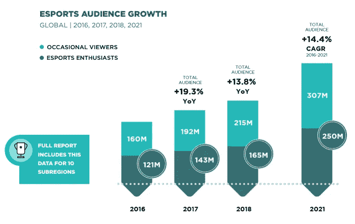

# 考虑投资电子游戏行业。原因如下。

> 原文：<https://medium.datadriveninvestor.com/consider-investing-in-the-video-game-industry-heres-why-c9e98fa23e90?source=collection_archive---------4----------------------->

## 视频游戏和电子竞技投资

## 视频游戏产业…多么巨大的市场啊。

Photo by [Teddy Guerrier](https://unsplash.com/@teddyguerrier)

谁不爱电子游戏？它们很有趣，让你相信你在另一个世界里，这是其他娱乐形式无法做到的。这也是一个非常有利可图的行业。

远远超过电影和音乐产业…合计！

让我们来比较一下历史上*票房最高的电影*和*票房最高的电子游戏*:

*   **《复仇者联盟》结局:**:27.98 亿美元
*   60 亿美元

看出区别了吗？

还不止一倍！

现在让我们比较一下全球 3 个行业**的预计收入**:

Published in [Vanilla Plus](https://www.vanillaplus.com/2018/07/05/40093-video-games-market-worth-music-movies-combined-arent-csps-launching-games-services/)

这三个行业之间有明显的区别。我们没有太多关于视频游戏行业的新闻，所以我们倾向于忽略它，但它实在是太庞大了！

你知道它有多大吗？直到最近我才明白，我一直是电子游戏的粉丝。我只是不知道，直到我开始挖掘一点点。你不需要走很远就能了解它的范围。任何人都可以看到。

自 2016 年以来，每个设备的细分发生了变化，PC 不再处于领先地位。如果我们看看最近几年和预测，我们会发现手机游戏(平板电脑和智能手机)是领先的。

Published in [Newzoo](https://newzoo.com/insights/articles/the-global-games-market-will-generate-152-1-billion-in-2019-as-the-u-s-overtakes-china-as-the-biggest-market/)

我们将首先推出移动设备，然后是游戏机，最后是 PC。这可以给你一些投资哪些公司的指导。我们在这里只看手机视频游戏部分，但是你也可以自己做一些研究。

该行业预计以每年 9%的速度增长，有人说到 2025 年其收入将达到 3000 亿美元！

今天，全球有 25 亿游戏玩家。一个典型的游戏玩家应该是 35 岁，有 13 年游戏经验的男性。现在，性别差距一直在缩小，随着手机游戏的兴起，女性游戏玩家大幅增加。相比其他设备，女性更喜欢手机游戏，因此我们将看到他们在接下来的几年中是否会占据领先地位。

## 移动部分

你在这个板块中有一些看好的股票(排名不分先后):

*   SciPlay 公司。:专注于移动和网络平台的视频游戏，如 Jackpot Party Casino 和 Monopoly Slots。与 2018 年相比，他们 2019 年的总收入增长了 11.9%。
*   Zynga Inc.: 专注于手机视频游戏和网络游戏，如 FarmVille、Words with Friends 和 Zynga Poker。从 2018 年到 2019 年，他们的总收入增长了 45.68%。
*   电子艺界:该公司在多个平台上开发，但当它涉及到手机游戏时，我们有像《星球大战:英雄的银河》、《模拟人生手机版》、《国际足联手机版》等游戏。从 2018 年到 2019 年，他们的总收入下降了 3.88%。但他们报告称，2020 年第一季度已经增长了 12%。
*   **任天堂有限公司**:另一家在多个平台上工作的大公司，旗下有《精灵宝可梦 Go》、《马里奥世界博士》、《超级马里奥快跑》等手机游戏的头衔。2018 年至 2019 年，他们的总收入增长了 13.72%。这种股票在日本市场交易，所以记住额外的货币转换和费用，如果你在日本以外经营。

> **注:**我在这一节不提**动视暴雪**，因为他们负增长，股票高估。尽管如此，值得一提的是，他们拥有国王，该公司负责制作过于著名的糖果粉碎。从 2018 年到 2019 年，他们的总收入下降了 13.48%，2020 年第一季度下降了 2%。按照目前的股价(截至 2020 年 5 月 16 日)，它可能被高估了。

## 交易所交易基金

现在，如果你感觉更舒服，不太倾向于冒险，你可以把投资集中在交易所交易基金上。在这种情况下，与已经提到的那些个股相比，你将投资于多个视频游戏公司。

你有三只交易所交易基金:

*   [**EEfund 视频游戏技术指数【GAMR】**](https://ycharts.com/companies/GAMR)**:**它由全球 36 家公司组成，分别从事硬件制造商、软件和移动应用程序编写。这是 2016 年第一只专注于视频游戏行业的 ETF。在这三年多的时间里，他们的跟踪回报率为 10.36%。
*   [**VanEck Vectors 视频游戏和电子竞技 ETF【ESPO】**](https://ycharts.com/companies/ESPO):它由全球 25 家涉及视频游戏开发、电子竞技以及相关硬件和软件的公司组成。它于 2018 年推出，其追踪回报率为 26.94%。
*   [**round hill bit kraft Esports&Digital Entertainment ETF【NERD】**](https://ycharts.com/companies/NERD):它包括全球 26 家公司，它们更专注于电子竞技，而不是视频游戏制造商。它成立于 2019 年，追踪回报率为 3.7%。

考虑到这最后一只 ETF，有趣的是看到**电子竞技**如何呈指数级增长。这些电子竞技吸引了数百万观众，预计到 2021 年，消费者年增长率将达到 14.4%。甚至非游戏公司也在这个市场下了重注。例如，康卡斯特正在 T2 费城 T3 修建一座价值 5000 万美元的电子竞技体育场。几年前谁会想到这种视频游戏的基础设施？

Graph from [Newzoo’s global report](https://resources.newzoo.com/hubfs/Reports/Newzoo_2018_Global_Esports_Market_Report_Excerpt.pdf?)

随着 Twitch 和 Youtube 等在线平台的领先，电子竞技赛事的报道量有所增加。人们花更多的时间在线观看电子竞技。截至 2019 年，人们在全球范围内观看了 66 亿小时的视频游戏。它一直以每年 10 亿小时的速度增长，因此我们希望品牌能够追随客户，这将给企业带来更多收入。

Photo by [Florian Olivo](https://unsplash.com/@rxspawn)

以下被认为是**顶级电竞股**:

*   **动视暴雪:t** 他们在 2018 年推出了守望联盟，甚至在第一年就产生了利润。他们与迪士尼频道、ESPN 和美国广播公司网络有广播协议，所以你会期待有很多观众。
*   **腾讯控股:**一家大型中国媒体集团，在不同的在线流媒体平台拥有大量股份。他们负责英雄联盟锦标赛，2018 年的决赛有超过 1 亿人观看。电视剧《老友记》上一集多少钱？翻倍就有 LOL 观众了。
*   **Take-Two Interactive:** 旗下拥有 Rockstar Games，负责史上最畅销的娱乐产品(GTA V)。他们不像其他电子竞技玩家那样大牌，但他们对 NBA 2k 联赛的发展是有希望的。
*   **电子艺界:**他们拥有一些最大的游戏特许经营权，比如 FIFA 和 Madden。这些已经被主要的电视网(CW，ESPN 和福克斯)播出了，所以你在那里得到了很多报道。他们还有其他有前途的特许经营权，可能会在未来几年变得巨大:顶点传说和战场。
*   被称为“中国的抽搐”的中国视频游戏内容流媒体公司虎牙近年来销售增长迅速。他们在 2018 年播出了 400 场电子竞技比赛，在全球聚集了 16 亿观众。

这是一个年轻的、令人兴奋的、有风险的市场，但对我们年轻人来说，有很大的投资潜力。这是成为一个新兴行业的第一批人的时候了。你不常得到那种机会。

# 最后的想法

视频游戏产业是娱乐市场的重要组成部分。而且这一天比一天大。仅在 2020 年 3 月，与 2019 年 3 月相比，游戏市场的收入[下降了 35%](https://gamedaily.biz/article/1709/coronavirus-leads-to-35-growth-for-the-video-games-industry) ，主要是受冠状病毒疫情的推动。

投资的方式有很多种，你必须看到什么最适合你。你将不得不考虑自己是想持有某家公司的股份，还是投资 ETF。此外，问问你自己…你更愿意投资视频游戏制造商、硬件制造商、流媒体平台，还是电子竞技管理(甚至是电子竞技团队)？

随着最近所有的社会距离现象和人们越来越依赖内部娱乐，这个行业有很大的增长潜力。如果你是一个狂热的游戏玩家，这里有另一种方式来连接到这个迷人的世界。

有什么不喜欢的？

 [## 想投资？记住这种常见的心理错误

### 不要放松警惕。

medium.com](https://medium.com/makingofamillionaire/want-to-invest-keep-in-mind-this-common-psychological-mistakes-db5f459ab9cd) 

*如果你喜欢阅读这样的故事，并且愿意支持 Medium 上的作家，可以考虑* [*注册成为 Medium 会员。每月只需 5 美元，你就可以无限制地阅读世界各地优秀作家的文章。*](https://pmarinko.medium.com/membership)

 [## 通过我的推荐链接加入 Medium-Pavle Marinkovic

### 作为一个媒体会员，你的会员费的一部分会给你阅读的作家，你可以完全接触到每一个故事…

pmarinko.medium.com](https://pmarinko.medium.com/membership)