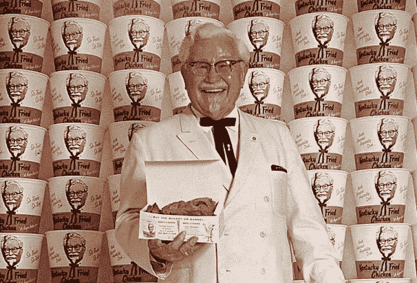

# 一致性是唯一的方法

> 原文：<https://medium.datadriveninvestor.com/consistency-is-the-only-way-964db769554c?source=collection_archive---------34----------------------->

成功取决于一致性

生活在一个崇尚即时满足的社会里，人们经常忽视一致性的概念。给社会贴上标签的最佳术语是微波时代。我们现在就想要东西，我们不想等待。

这是人们犯罪的原因之一。他们不想为了成功而投入大量的时间。每个人都想过非凡的生活，但没人想在实验室里打卡。

人们将艰苦的工作与参与欺诈活动和销售毒品的不适联系在一起，以资助他们想要实现的幻想。

人们容易忘记的成功基于两个原则，耐心和一致性。我总是提到桑德斯上校。众所周知，桑德斯上校开创了著名的肯德基连锁店。

他的梦想直到 65 岁才成为现实。有人想象过自己等了那么久才成功吗？那是当今社会很少发生的事情。许多公司经常拒绝桑德先生的配方。

他相信他的愿景，他的鸡将改变家庭的用餐方式。他沉迷于现实。

这个概念可以应用到人类所知的任何行业。尤其是体育运动，它是一致性通向成功的最好例子。

 [## 不见面就做交易？风投和企业家的 5 个指南|数据驱动…

### 自从 covid 六个月前登陆美国以来，全球的风险投资家和企业家都不得不适应新的现实…

www.datadriveninvestor.com](https://www.datadriveninvestor.com/2020/09/20/doing-deals-without-meeting-in-person-5-guidelines-for-vcs-and-entrepreneurs/) 

迈克尔·乔丹这个名字听起来耳熟吗？迈克尔·乔丹在高中二年级时被高中篮球队除名。迈克尔把他的激情和才华永远不会再被忽视作为他的使命。

三年级和四年级时，迈克尔·乔丹是班上最好的球员之一，他成了一名麦当劳的美国人。然而，迈克尔的道路上仍然存在障碍。乔丹先生直到 28 岁才在公牛队看到冠军。他为这个组织忠诚了七年，直到他实现了赢得 NBA 总冠军的梦想。

对于所有想让自己的作品受到关注的媒体同行来说，获得你应得的认可的唯一途径就是坚持不懈，相信自己的能力。你可能需要六个月甚至一年的时间才能得到你应得的曝光率。

永远记住，光明确实在隧道的尽头。不要因为失败而停止追求目标。目标是有步骤的，你必须采取每一个行动，成为你注定要成为的最好的作家。

对于所有想进入软件领域的有抱负的程序员，投入时间，不要放弃。编程是有挑战性的，就像一切都是生命一样，但只要你足够有激情，你就会成为一名巨星程序员。

你们中那些已经在这个行业中站稳脚跟并且感觉自己是冒牌货的人，不要放弃。重复会让你成为你注定要成为的超级巨星。不要让即时满足的时代阻止你成为最好的自己。

对我所有的 YouTubers 伙伴来说，独特的视频内容需要时间。只要每天都出现，向观众展示你能为他们解决问题。展示你每天都有空，你会有很多观众。

百万富翁平均年龄在 60 多岁是有原因的。增加你的财富需要时间，积累财务稳定所需的知识也需要时间。

避免快速致富的计划；没有这回事。任何来得快的东西都不会持久。我只是不小心押韵了。任何提供捷径的人都不会接受。捷径会毁掉成长过程。如果你不采取措施实现目标，你将如何成为你注定要成为的人。

我们都有同样的 24 小时。你每天都在做什么来完成你想要完成的目标。

你想写的书需要时间，但要坚持写，你想达到的身材需要时间，但你会减肥，你想要的梦想家园需要时间，但要坚持存钱，这样你才能买得起。

没有一夜成功的事，所以一定要每天提醒自己。投入该死的工作，停止抱怨，看着自己成长。

## 访问专家视图— [订阅 DDI 英特尔](https://datadriveninvestor.com/ddi-intel)