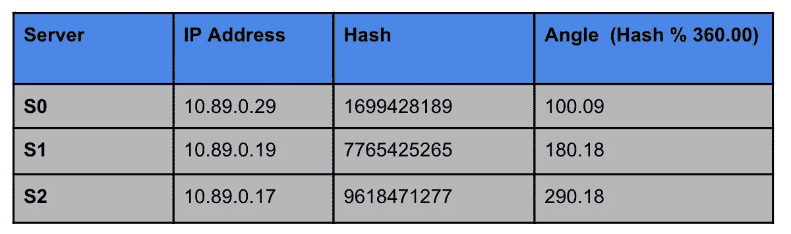

# 一致哈希——一种高效且可扩展的数据分发算法

> 原文：<https://medium.datadriveninvestor.com/consistent-hashing-an-efficient-scalable-data-distribution-algorithm-a81fc5c0a6c7?source=collection_archive---------1----------------------->

*用简单的文字说明一致的散列法*

# 介绍

假设你正在为亚马逊这样的电子商务网站设计一个可伸缩的后端。数据量将是巨大的，并且每年都呈指数级增长。您认为您能够在一台服务器上存储和管理数据吗？答案是否定的。

当您的数据无法容纳在一台机器上时，您将不得不启动更多的机器。最重要的设计目标之一是在服务器之间高效地分配数据。同时，优化从服务器集群中检索数据也很重要。

Instagram、脸书或 Twitter 等社交媒体网站在服务器的文件系统中存储了大量数据。他们使用缓存服务器来快速处理频繁访问的数据请求，例如:病毒性帖子。即使是内存中的高速缓存，对可以存储的数据量也有限制。因此，也有必要水平缩放缓存层。

 [## 算法诱人的商业逻辑|数据驱动的投资者

### 某些机器行为总是让我感到惊讶。我对他们从自己的成就中学习的能力感到惊讶…

www.datadriveninvestor.com](https://www.datadriveninvestor.com/2019/03/22/the-seductive-business-logic-of-algorithms/) 

在本帖中，我们将介绍解决上述挑战的一致性哈希算法。我们将从一个非常简单的解决数据分区问题的方法开始，看看一致性散列是如何克服所有瓶颈的。该算法被许多开源应用程序采用，如 Cassandra、Riak、Dynamo DB 等

# 数据分发策略

## 线性分布

我们有一组服务器，我们想想出一个在它们之间分配数据的策略。让我们从一个非常幼稚的解决这个问题的方法开始。假设，我们一个接一个地填满服务器，也就是说，只有当前服务器变满时，我们才开始向下一个服务器写入数据。

在下图中，我们有一个简单的服务器，一次只能存储 4 条记录。当一个服务器变满时，我们添加一个新的服务器，新的数据被添加到其中。

**Linearly storing data among servers**

嗯，这种方法在任何服务器上写数据时都工作得很好。当你被要求读取一个特定的数据时会发生什么？您需要识别存储给定数据的服务器，然后获取它。如何识别服务器？你会走过所有的服务器，线性扫描每一个吗？这将妨碍读取性能。

例如:-在上面的例子中，如果你被要求查找“*纽约*”，因为在密钥和服务器之间没有直接的映射，你将不得不线性地扫描所有的服务器并搜索这个密钥。

在下一节中，我们将了解一种可以解决这个问题的方法。

## 散列法

在上一节中，我们看到，如果我们有 N 个服务器，获取记录的时间复杂度将是 O(N)。我们希望高效地读写 O(1)中的数据。首先映入我们脑海的是提供 O(1)查找和写入的 HashMap 数据结构。

让我们看看散列法能否解决我们的问题。假设我们有 N 台存储数据的服务器和一个具有分发数据策略的应用程序。这种方法类似于 HashMap 使用的方法。首先，散列关键字，然后确定数据将存放在哪个桶中。应用程序将首先散列密钥，然后通过计算*散列(数据)% N* 来确定哪个服务器。

上述算法将给出数据将被写入的服务器号。此外，在检索数据时，它将使用相同的逻辑，获取服务器号并获取数据。读取和写入都在 O(1)中完成。

让我们来看一个例子。假设我们有三台服务器，分别名为 S0、S1 和 S2。我们的钥匙是世界城市名。使用散列法，我们计算出需要分配密钥的桶或服务器。

**Hashing & Computing bucket of the keys**

**Allocation of Keys**

但是这在分布式系统中会一直有效吗？我们会遇到以下问题

*   如果我们添加更多的服务器，那么*散列(数据)% N* 将会不同。这意味着我们将不得不在添加新服务器时重新分配所有数据。
*   如果其中一台服务器被移除，我们也会遇到同样的问题。因为服务器的数量 N 在这里是可变的，所以所有的键都会受到影响。

下图说明了添加新服务器时会发生什么情况。随着服务器的数量从 3 增加到 4，桶计算逻辑将变为*散列% 4* 。

**Old & New Allocation of Keys**

在添加新服务器时，我们观察到三个密钥中的两个受到影响。如果我们添加一个新的服务器，密钥“ *Madrid* ”的桶将是 0 (S0)而不是 1(S1)。我们必须将这个密钥移动到服务器 S1，以确保我们的应用程序能够找到它。因此，我们必须重新散列所有现有的密钥，并将它们分配给不同的服务器。在最坏的情况下，这会影响系统中的所有键。

# 什么是一致性哈希？

**Consistent Hashing in Action**

当我们想要动态添加或删除服务器时，一致散列法解决了我们的问题。在简单散列的情况下，服务器的添加或移除将影响存储在系统中的所有 M 个密钥。然而，一致散列法确保只有 M/N 个密钥受到影响，其中 N 是服务器的数量。

一致散列使得密钥的分发与系统使用的服务器数量无关。因此，我们可以在不影响整个系统的情况下扩大或缩小规模。

基本上，一致散列使用散列环。该算法将每个服务器映射到圆上的一个点。它首先使用服务器的 IP 地址，计算它的散列值，并在圆上给它分配一个点(角度)。以下是如何为 S1、S2 和 S3 的 3 台服务器计算角度的简单说明

**Assigning servers to points on the Hash Ring**

此外，每个键都使用相同的散列算法进行散列&在服务器上分配一个点。对于每个散列键，我们顺时针方向移动，找到最近的服务器&分配给它。

**Assigning keys to points on the Hash Ring**

我们得到上面一组键的如下分配:-

**Allocation of Keys to Servers**

以下是在散列环上对不同服务器的上述密钥分配的图形表示

**Allocation of Keys to the server on a Hash Ring**

正如你从上图中看到的，我们从每个键开始顺时针方向移动来找到它的服务器。

# 扩展和添加新服务器

如前一节所述，我们首先计算服务器 IP 地址的散列值&找到它在圆圈上的位置。例如:如果我们添加一个服务器 S4，并发现它位于 S2 和 S0 之间的圆圈。此外，我们重新分配 S0 的键，这些键的角度小于 S3，或者换句话说，它们出现在圆上的 S3 之前。

下图说明了添加新服务器 S3 的过程，它位于 S2 和 S0 之间。最初，密钥“ *Mumbai* ”被分配给服务器 S0。除了 S3，我们看到从键“*孟买*”顺时针方向遇到的第一个服务器是 S3，因此我们把这个键分配给 S3。

**Adding a new server S3**

从上面可以看出，添加新的服务器并不会影响所有的键。只有出现在散列环上的两个服务器之间的密钥需要重新分配。

# 删除现有服务器

删除现有服务器时，只需重新分配属于该服务器的密钥。对于属于被移除的服务器的密钥，在顺时针方向上找到散列环上的下一个服务器。此外，然后将密钥分配给新服务器。

下图说明了删除现有服务器的过程:-

**Removal of Server S1**

在上图中，删除了服务器 S1。键“*纽约*”被分配给服务器 S1。删除 S1 后，我们从关键字“New York”中找到第一个服务器，并找到服务器 S2。因此，关键字“ *New York* 被重新分配给服务器 S2。

与普通散列不同，服务器的移除不需要重新散列所有的密钥。只有被移除的服务器的密钥必须被重新分配。

# 虚拟节点

我们看到，当一个节点被移除时，分配给该节点的所有键将被移动到哈希环中的下一个节点。通常，删除一个节点后，数据分布会变得不均匀，其中一个节点上的负载会增加。

在上面的例子中，如果我们从系统中删除 S0，那么键" *London* "将被映射到服务器 S2。最终，我们会发现 S2 处理三把钥匙，而 S1 只管理一把钥匙。因此，数据分布不均匀。

**Removal of S0 places more load on S2**

在理想情况下，当有 *M* 个密钥和 *N* 个服务器时，每个服务器必须有接近 M/N 个密钥。因此，节点的添加或移除会影响系统中最多 M/N 个键。为了确保接近理想的分布，我们在系统中引入了虚拟节点。每个物理节点在哈希环上都有多个虚拟节点。

我们使用多个散列函数来寻找散列环上虚拟节点的位置。每个服务器都用 Sij 表示，其中 I 表示实际的服务器号，j 表示它的虚拟副本。例如:对于第一台服务器，虚拟副本将是 S00、S01、S02、S03 等。我们使用不同的哈希函数来计算每个虚拟副本的哈希。

在上面的例子中，我们得到了虚拟服务器的如下分配

**Virtual servers on a hash ring**

从上图可以看出，服务器 S1 的虚拟副本是 S10、S12 和 S13。这同样适用于服务器 S0。这导致了节点之间近乎均匀的数据分布。

对于给定的密钥，如果散列环中的下一个服务器是 S12，那么它将被分配给第一个物理服务器。概括地说，分配给虚拟服务器 Sij 的密钥将存储在物理服务器 Si 上。

# 一致性散列的应用

1997 年引入了一致散列法。然而，它在许多分布式系统应用程序中得到了发展。它在 Amazon 的 Dynamo DB 中用作分区组件。此外，Apache Cassandra 和 Voldermort 等开源应用程序使用它进行数据分区。

**Applications of Consistent Hashing**

# 参考

*   [一致哈希](https://en.wikipedia.org/wiki/Consistent_hashing)
*   [一致性哈希的终极指南](https://www.toptal.com/big-data/consistent-hashing)
*   [封面图片](https://www.google.com/imgres?imgurl=https%3A%2F%2Fae01.alicdn.com%2Fkf%2FHTB1U33YmFuWBuNjSszbq6AS7FXaq%2FNew-1-1-scale-Iron-Man-Arc-Reactor-A-generation-of-glowing-iron-man-heart.jpg&imgrefurl=https%3A%2F%2Fwww.aliexpress.com%2Fitem%2F32866723610.html&tbnid=j1x6a7eo5CmntM&vet=12ahUKEwjUk-KPtrzoAhXI2nMBHanXBVMQMygdegQIARBn..i&docid=A64T34tdFEqOZM&w=750&h=672&itg=1&q=iron%20man%20heart&ved=2ahUKEwjUk-KPtrzoAhXI2nMBHanXBVMQMygdegQIARBn)
*   [吉菲](https://giphy.com/)
*   [一致哈希&随机树](https://www.akamai.com/us/en/multimedia/documents/technical-publication/consistent-hashing-and-random-trees-distributed-caching-protocols-for-relieving-hot-spots-on-the-world-wide-web-technical-publication.pdf)