# 消费品股票投资概述(沃尔玛、好市多、可口可乐、百事可乐、P&G)

> 原文：<https://medium.datadriveninvestor.com/consumer-staples-stocks-investment-overview-walmart-costco-coca-cola-pepsi-p-g-53c78f48568f?source=collection_archive---------9----------------------->

疫情教会许多投资者的一件事是，在危机时刻，一些行业比其他行业更有弹性。消费品就是人们生存所需的消费品。

不管市场是涨是跌，人们仍然需要食物。像沃尔玛和好市多这样的廉价零售商可以在两端都利用这一点。当人们开始感到手头拮据时，他们提供最低的价格。这份报告中的股票你们都知道。他们在美国有巨大的足迹，在全球都有业务。

我们收集了美国市值最大的五只消费品股票。我们将了解每种方法的基本原理，以及它们在几个指标上的比较，并对股息进行概述。

# 红利概述

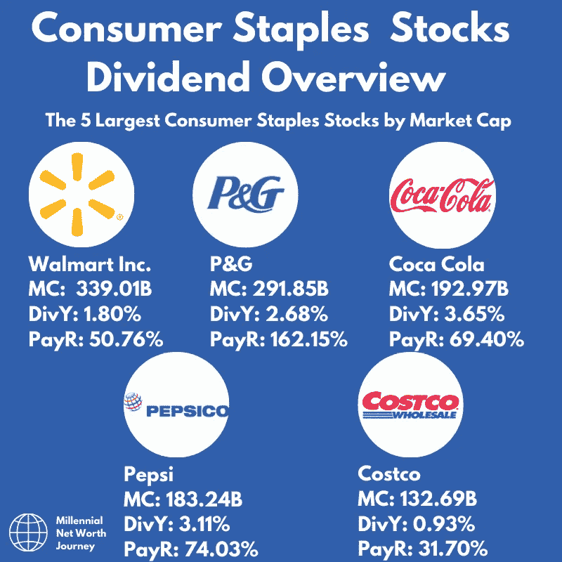

[Post from @millennialnwj on Instagram.](http://www.instagram.com/millennialnwj)

以下是按市值排序的五大消费类股票，显示了它们的股息收益率和派息率。

# 你每年的股息回报

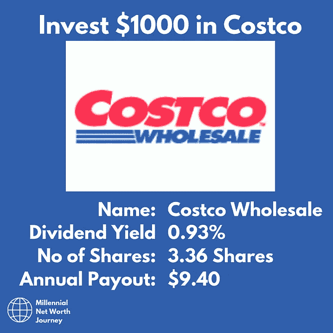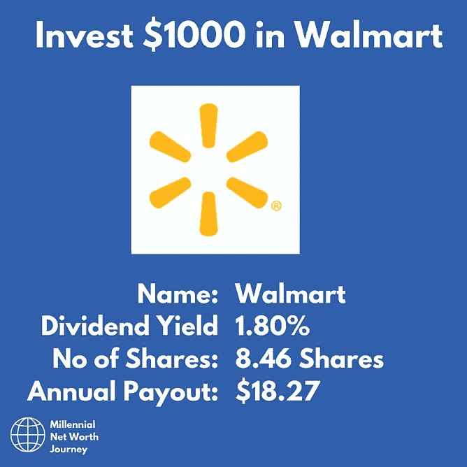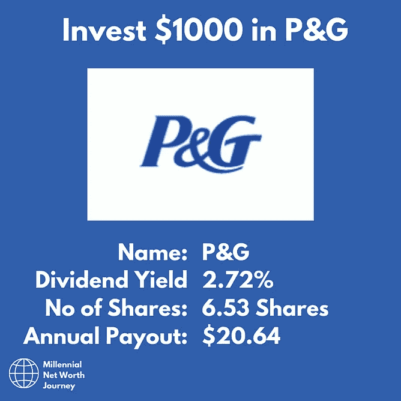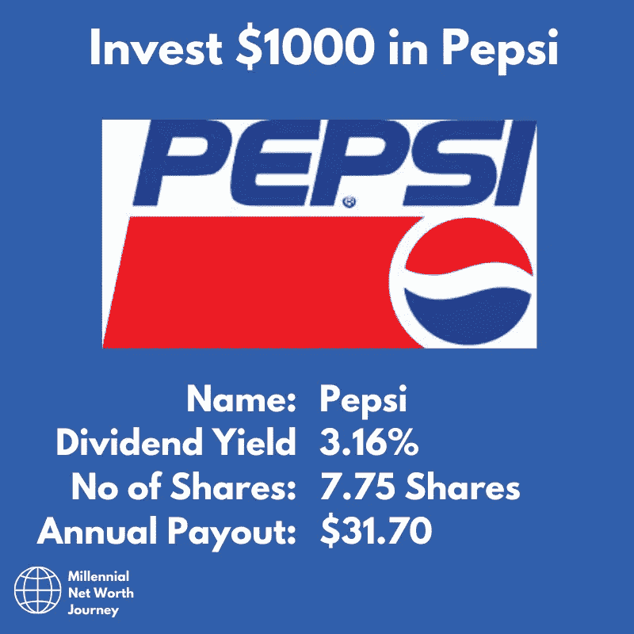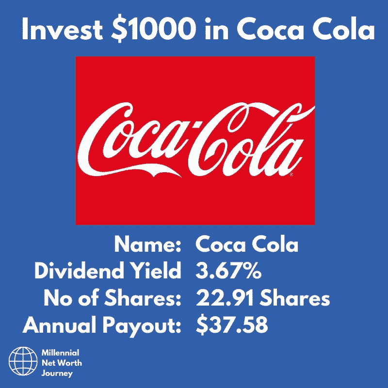

从这些图表来看，从股息的角度来看，最好的投资是可口可乐和百事可乐，股息收益率较高，但不会太高，它们是不可持续的。

# 度量比较

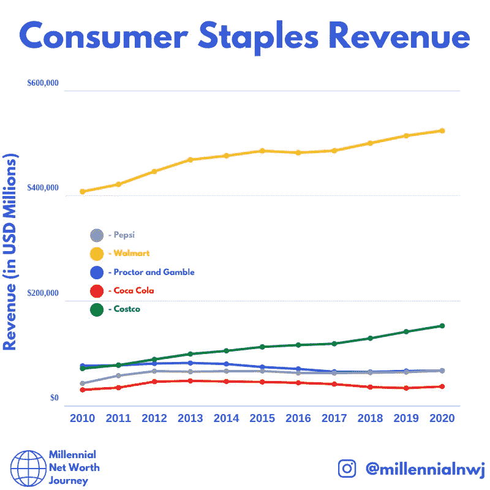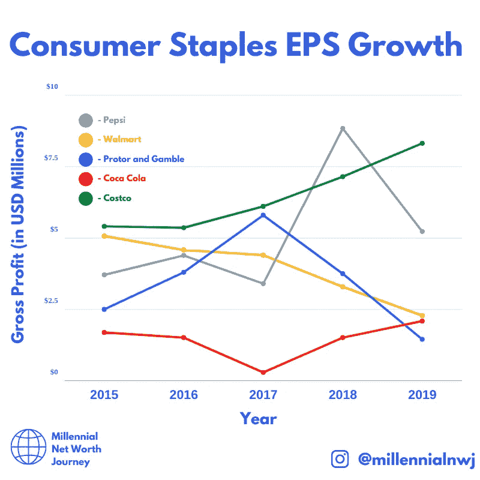

[Post from @millennialnwj on Instagram.](http://www.instagram.com/millennialnwj)

看看所有股票的收入，沃尔玛似乎在收入方面远远超过了竞争对手。它的规模和它在美国和世界其他地方的足迹可以帮助它获得这样的收入。

 [## 利用股市相关性的最佳方式|数据驱动的投资者

### 当阿尔弗雷德·温斯洛·琼斯开创了世界上第一个“对冲”基金(后来“d”被去掉了)时，他让其他投资者大吃一惊…

www.datadriveninvestor.com](https://www.datadriveninvestor.com/2020/02/02/the-best-way-to-use-stock-market-correlations/) 

就整体表现而言，好市多似乎是表现最好的一家，股息支付率较低，过去五年来收入和每股收益都在增加。鉴于好市多的表现，它似乎被略微低估了。

其余的股票似乎正在与每股收益下降作斗争，这通常是一家可能开始挣扎的公司。

现在，让我们进入股票报告。

# 沃尔玛

[Post from @millennialnwj on Instagram.](http://www.instagram.com/millennialnwj)

首先是沃尔玛，世界上最大的零售商。这家折扣零售商的规模大得惊人。每年销售商品的收入超过 5000 亿美元。

除了在美国的大量存在，沃尔玛还在世界各地拥有大量股份。凭借其在英国的 Asda 连锁店，该零售商在英国折扣零售市场也拥有强大的立足点。

虽然沃尔玛有一些竞争对手，但零售商的庞大规模意味着他们可以从“规模经济”中受益，以更低的价格从制造商那里获得产品，削弱他们的竞争。

沃尔玛也是美国最大的私营雇主，许多州都把沃尔玛作为头号雇主。

你几乎找不到比这更美国化的公司了。

沃尔玛在冠状病毒疫情期间也产生了强劲的回报，因为绝大多数美国人在他们的商店购物。

# P&G

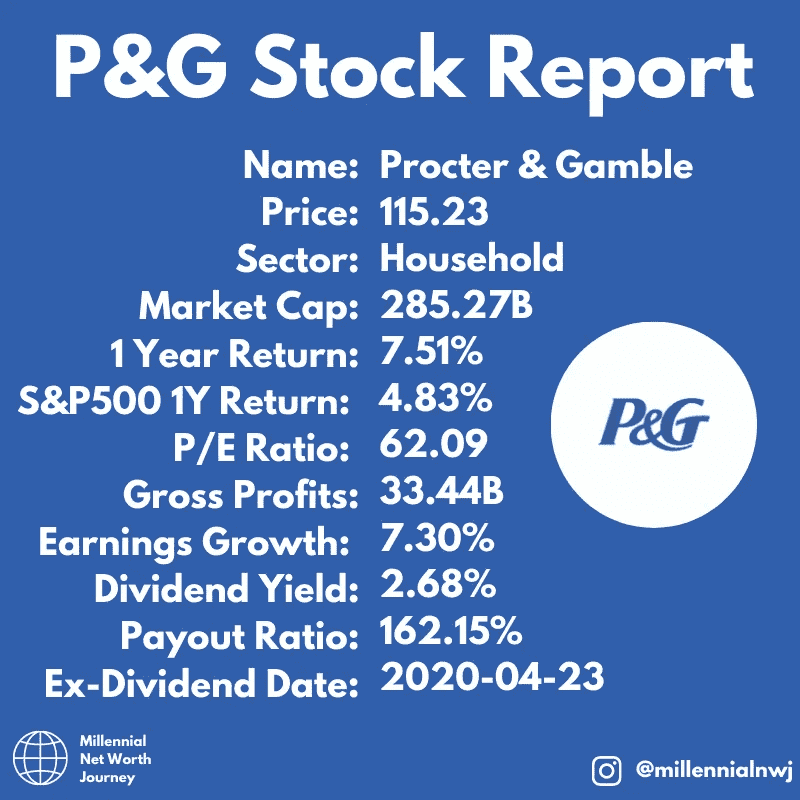

[Post from @millennialnwj on Instagram.](http://www.instagram.com/millennialnwj)

五大消费类股报告中的第二个是宝洁公司。

这家公司出售各种各样的家用和个人护理用品。他们的产品范围涵盖化妆品、化妆品和许多不同类型的清洁产品。

你可能会使用自己的许多品牌，他们拥有吉列，仙女液，Daz，等等。

即使在冠状病毒疫情期间，该公司也一直保持着强劲的收益增长和股价增长。

# 可口可乐

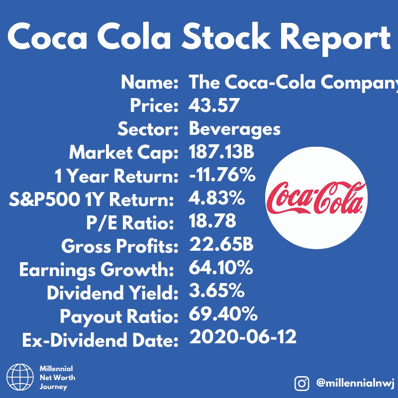

[Post from @millennialnwj on Instagram.](http://www.instagram.com/millennialnwj)

接下来是可口可乐，投资者和口渴的人都很喜欢它。这家公司几十年来一直稳步前进，为投资者创造大量利润。⁣
⁣
由于与沃伦·巴菲特的关系，该公司在投资界更加出名。他们在 80 年代末购买了该公司的大量股份，并经常被拍到喝他们的饮料。⁣
⁣
可口可乐近年来不断扩张，以迎合该行业的新趋势，比如需要更健康的饮料。⁣
⁣
总的来说，这家公司相对稳健，没有太多惊喜，适合做股息股。⁣

# [食品]百事可乐(一种饮料的商标名称)

[Post from @millennialnwj on Instagram.](http://www.instagram.com/millennialnwj)

接下来我们的消费类股报告是百事可乐，世界上第二好的可口可乐饮料。

就规模和销售额而言，百事公司处于其主要竞争对手可口可乐的阴影之下，但它在知名度方面的不足，通过强劲的资产负债表和不断扩大的客户产品得到了弥补。

该公司受到了冠状病毒的严重打击，餐馆老板无法说“百事好吗？”在过去的几个月里，他们的销售额略有下降。

健康且不断增长的 3.11%的股息也很不错。

# 好市多

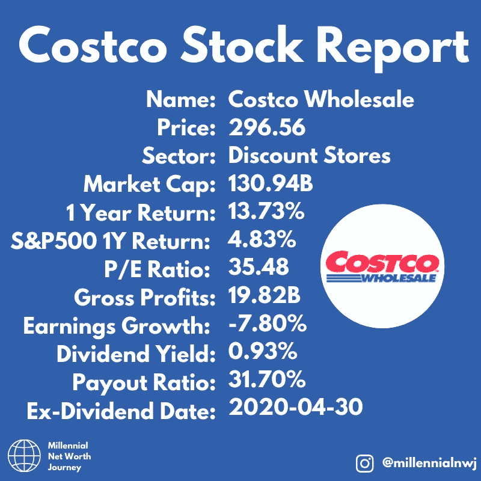

[Post from @millennialnwj on Instagram.](http://www.instagram.com/millennialnwj)

下一个我们的股票报告是好事多，另一个折扣零售商。像沃尔玛一样，它在美国也有相当大的市场份额，并利用其规模与制造商达成最佳交易以保持低价。⁣
⁣
从基本面来看，这只股票似乎状况良好，与公允价值相比，它的价格可能只高了一点点。⁣
⁣
该股目前的股息相对较低，但由于派息率低，利润健康，这可能是未来长期增长的趋势。⁣
有传言称，沃伦·巴菲特可能会考虑对好市多进行全面收购，因为该公司符合他对低负债、高利润和良好长期前景的描述。

然而，他可能在等待价格变得比现在更有吸引力。⁣

# 离别的思绪

作为股息投资者或长期投资者，将这些股票加入你的投资组合可能是一个不错的选择。所有这些股票都有持久的力量，经济护城河，可以在各种经济条件下表现。

可口可乐和 P&G 能够保持股息增长超过 50 年，这是一个不小的壮举。其他三家公司都有超过 25 年的历史，这使它们成为可靠的公司。

如果你喜欢读这篇文章，并且想跟上我的写作，请考虑在这里注册我的邮件列表，谢谢！

 [## 时事通讯注册—千禧净值之旅

### 注册我们的邮件列表，了解我们最新的帖子和深入的投资新闻和分析。我们…

millennialnetworthjourney.com](http://millennialnetworthjourney.com/newsletter-sign-up/) 

**进入专家视角—** [**订阅 DDI 英特尔**](https://datadriveninvestor.com/ddi-intel)