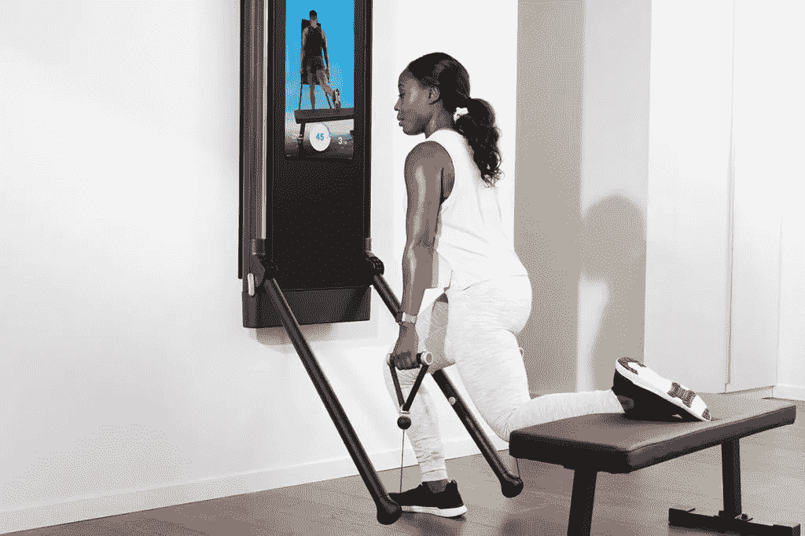
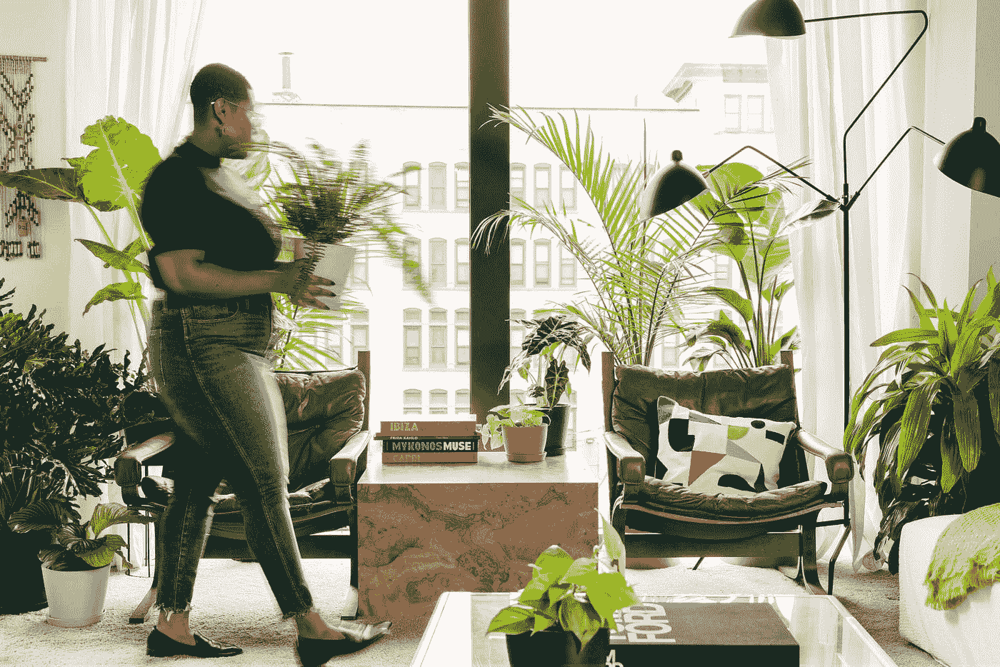
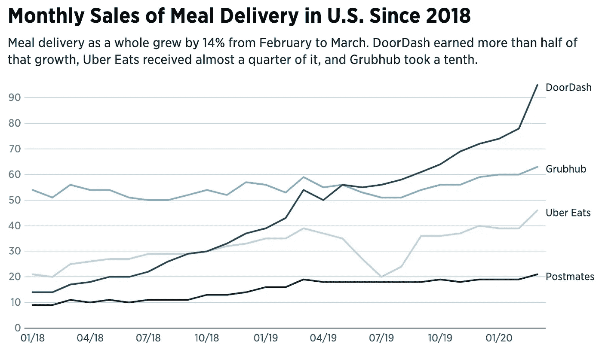

# 冠状病毒带来的消费趋势

> 原文：<https://medium.datadriveninvestor.com/consumer-trends-coming-out-of-coronavirus-53484357e2e5?source=collection_archive---------9----------------------->

Photo: The Sill / Amazon.com

## 品牌和顾客在短短三个月内发生了怎样的变化

不管是好是坏，冠状病毒已经永久性地改变了世界。尽管最近在美国各地发生的事件已经将人们的注意力从疫情转移开来，但一些城市仍在经历停工，只有少数公司回到了办公室，大多数大公司在今年剩下的时间里都在逐步过渡到亲自办公。

就像一些经济危机和现在的生物危机一样，新的创新和习惯出现了。例如，电子商务公司增加的原因是 Shopify 等网站创建技术的可及性、Instagram 等简单营销工具以及人们在 2008 年经济衰退中失业并寻找新的收入来源的混合。

 [## 2020 年最佳短期投资选择精选资源|数据驱动型投资者

### 投资是增加你净财富的一个好方法。如果你通过遵循一个严格的…

www.datadriveninvestor.com](https://www.datadriveninvestor.com/2020/03/28/handpicked-resources-for-the-best-short-term-investment-options-of-2020/) 

同样，新冠肺炎已经对特定的行业给予了优惠。虽然这些好处在短期隔离中可能是指数级的，但某些公司提供的便利可能会将消费者最近的日常习惯转变为持久的习惯。

# 在家工作，呆在家里

冠状病毒的大多数主要趋势都与家庭有关，因为我们无法离开它——在隔离之前，我们已经在那里呆了很长时间。自我保健和健康运动带来了保持脚踏实地的产品，长时间呆在一个地方需要不断努力保持理智。

Photo: Tonal

## 健康

虽然健身房已经关闭，但家庭健身系统和应用程序一直在蓬勃发展。类似于 Peloton 的健身机 Tonal 在一周内[的销售额增长了三倍](https://www.businessinsider.com/tonal-coronavirus-sales-tripled-san-francisco-at-home-workout-2020-3)，Peloton ( [PTON](https://finance.yahoo.com/quote/PTON?p=PTON&.tsrc=fin-srch) )在 6 月初的销售额增长到了 49.01 美元。(它在 2019 年 9 月以不到 26 美元的价格上市。)

然而，除了初始硬件，这些产品确实需要订阅，通常比每月健身房会员更贵。一旦健身房重新开放，可以在离你床 10 英尺远的虚拟社区锻炼的便利可能会导致一个严重的问题，其最大的好处是可以遇到周围邻居的朋友。

健身应用的用户也有所增加。耐克告诉美国消费者新闻与商业频道，其耐克健身俱乐部在美国的日活跃用户增加了 100 %,在中国的锻炼人数在第一季度增加了 80%。他们还免费提供高级订阅。

## 家居装饰

最近几年，家里来了一个令人惊讶的朋友。不是狗或猫，而是植物。 [*国家邮报*](https://nationalpost.com/news/canada/the-houseplant-industry-is-thriving-thanks-to-millennials-and-their-plant-babies#:~:text=Millennials%20have%20made%20a%20wide,instability%20and%20more%20recently%2C%20plants.&text=There's%20the%20monstera%20deliciosa%2C%20the,doesn't%20produce%20any%20figs.) 说“千禧一代痴迷室内植物。对于 20 到 35 岁的人来说，成为“植物父母”似乎已经成为一种时尚。根据国家园艺协会的数据，千禧一代非常喜欢植物，以至于在过去三年里，美国室内植物的销售额增长了 50%，达到 17 亿美元。

Photo: Bloomscape

像 [The Sill](https://www.thesill.com/) 和 [Bloomscape](https://bloomscape.com/) 这样受欢迎的室内植物初创公司已经成为冠状病毒的一些受益者。[*Inc .*](https://www.inc.com/emily-canal/the-sill-houseplants-sales-flourish-coronavirus-pandemic.html)杂志报道 Sill 的网上销售额从 3 月到 4 月增长了 50 %,而[*Business Insider*](https://www.businessinsider.com/plant-companies-like-the-sill-grow-alongside-home-improvement-industry-2020-6)从其中三家公司的首席执行官那里了解到了他们激增的情况。

家具也很受欢迎，因为人们想给他们的住处增添情趣。美国消费者新闻与商业频道说，从年初到 3 月和 4 月，Wayfair 的销售额一直在增长。宜家还发布了几种设计，这样孩子们就可以在家里的堡垒里玩耍。

## 食品配送

这里的一个大问题是，食品配送是否为消费者提供了足够的价值，让他们反复选择，而不是选择外出或用原料准备食物。封锁期间， [*MarketWatch*](https://www.marketwatch.com/story/dominos-pizza-sees-us-sales-tailwind-from-takeout-delivery-during-coronavirus-2020-05-26) 报道称，达美乐在第二季度的前八周，美国同店销售额增长了 14%。费城问询者报称，送餐服务(如 DoorDash)从二月到三月整体增长了 14 %:

Photo: The Philadelphia Inquirer

当人们在家里呆了几个月后准备外出时，我认为一旦餐馆能够营业，销售额将会激增，而且在许多州它们是被允许的。夏季的几个月对餐馆来说可能是令人鼓舞的，所以一旦顾客的涌入减少，看看外卖服务是否能赢得食客的选票将是一件有趣的事情。

未来 12 个月将揭示消费者是会选择呆在家里快速打电话还是和朋友去上动感单车课，房主和租房者是否会选择投资住宅，美食家是否会转向送货便利或外出就餐的体验。