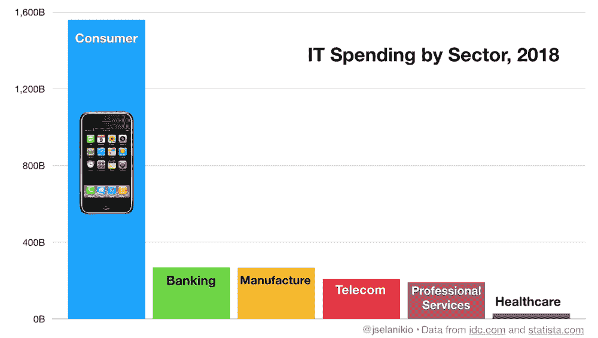
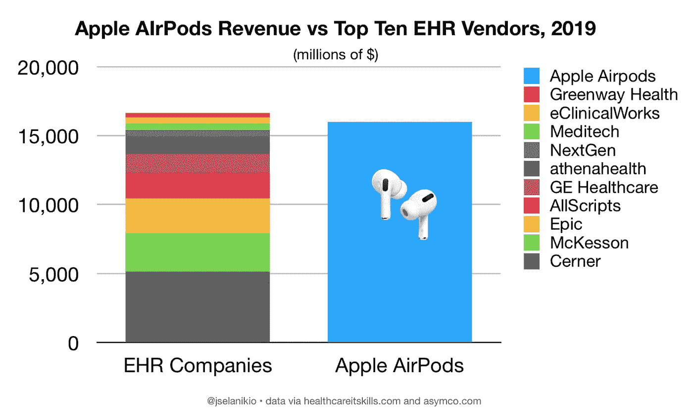

# 消费化在很大程度上影响了健康

> 原文：<https://medium.datadriveninvestor.com/consumerization-hits-health-in-a-big-way-2336bd7f3acc?source=collection_archive---------12----------------------->

上周在拉斯维加斯举行的 CES 2020 上展示了技术消费化，有近 20 万人参加，在 4 天内举行了 300 多场会议。

消费化已经非常明确地主导了技术领域。

但是，我们这些在医疗保健行业工作的人，虽然经常对消费者健康的发展感到兴奋，但对我们在这个科技世界中的地位有一种奇怪的扭曲看法。当我在我的演讲中问与会者和我医院的同事，医疗 IT 支出在更广阔的世界中处于什么位置时，我从来没有得到一个与现实有一点相似的答案。

 [## 幸福的算法？数据驱动的投资者

### 从一开始，我们就认为技术正在使我们的生活变得更好、更快、更容易和更实用。社交媒体…

www.datadriveninvestor.com](https://www.datadriveninvestor.com/2019/03/08/an-algorithm-for-happiness/) 

当我问在医疗技术领域占主导地位的公司是什么时，我得到了一份 EHR 顶级供应商的名单。

但是考虑一下这个按部门划分的 IT 支出图表:

如果你看得太快，你可能会错过最右边的医疗保健栏——因为医疗保健行业(包括 Epic 和 Cerner 及其他 EHR)在 IT 上的支出不到 500 亿美元，已经落后于其他行业，被全球消费 IT 产品(包括手机和越来越多的可穿戴设备)上的约 1.5 万亿美元远远甩在后面。

要真正了解健康在这个世界上的位置，请考虑一下**截至 2019 年，苹果销售 AirPods 的收入(本身可能是一种强大的健康监测技术)大约相当于 EHR 十大供应商的总和**(每年约 160 亿美元):

在接下来的帖子中，我将探索包括 AirPods 在内的消费技术的爆炸对健康技术意味着什么，包括人工智能在健康方面的应用。

*本文原载于*[*future health . live*](https://www.futurehealth.live)*。*