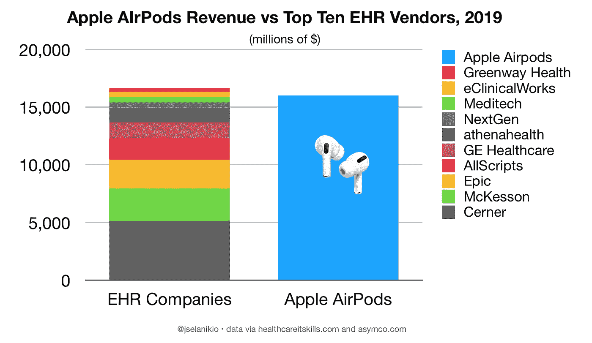
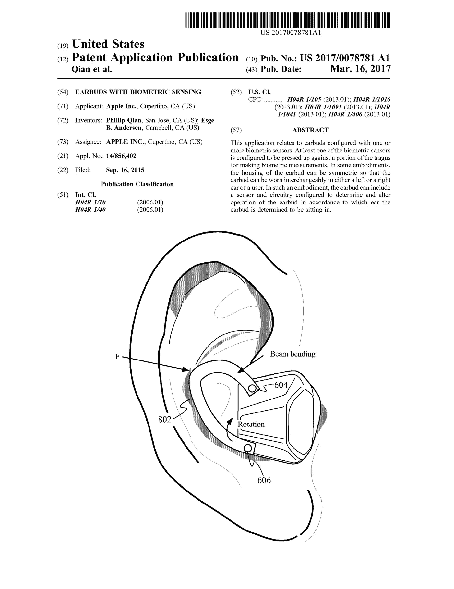
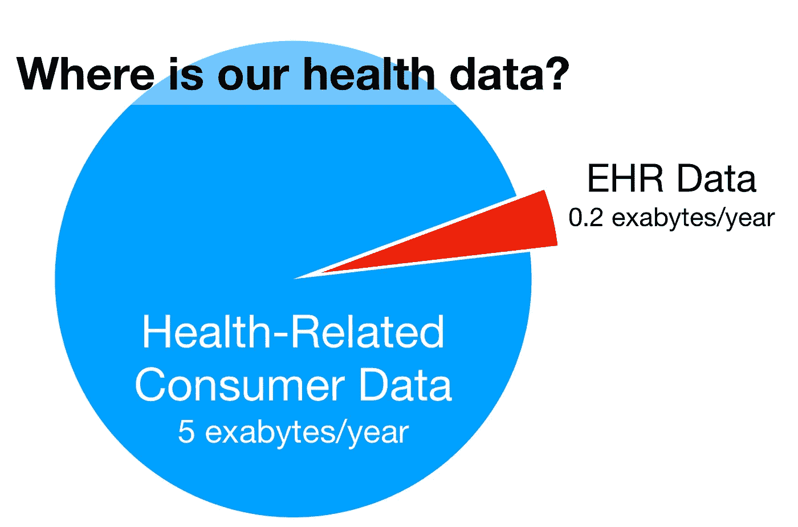

# 消费化冲击健康，第二部分:我们的健康数据在哪里？

> 原文：<https://medium.datadriveninvestor.com/consumerization-hits-health-part-ii-where-is-our-health-data-8bcd633f617d?source=collection_archive---------14----------------------->

# 苹果>>史诗

几周前，我在推特上分享了一张图表(左图)和[，问“当苹果在 AirPods 上赚的钱比 EHR 十大厂商加起来还多的时候，这对健康科技和我们健康的未来意味着什么？”](https://joel-selanikio-w39r.squarespace.com/blog/2020/01/08/consumerization-hits-health)

我得到了一些有趣的评论，大部分是这样的:

> 完全不合理。企业商业软件(针对美国的一个垂直行业)无法与全球销售的消费类硬件设备相提并论。
> 
> -丹·芒罗([@丹·芒罗](https://twitter.com/danmunro))2020 年 1 月 9 日

那么 AirPods 的收入和 EHR 的收入与健康的未来有什么关系呢？不合理？无意义？不:这么说就像是说苹果和 Epic 没有任何关系，因为他们“在不同的领域”。但是 Epic 对提议的 HHS 数据共享规则的强烈抵制表明他们明白这些领域是重叠的。

# AirPods 数据是健康数据

AirPods(以及苹果出售的其他所有东西)和 EHRs 是生成健康数据的引擎。EHR 数据是健康数据。AirPods 数据是健康数据——就像你智能手机上的其他数据一样，以及你的电子邮件、亚马逊和信用卡账户中的数据。

 [## 大笔资金和尖端技术:人工智能/人工智能投资将如何革新医疗保健…

### 在过去几年人工智能(AI)和机器学习(ML)的显著发展中…

www.datadriveninvestor.com](https://www.datadriveninvestor.com/2018/03/22/big-money-and-cutting-edge-technology-how-investment-in-ai-ml-will-revolutionize-the-healthcare-industry/) 

对我们大多数人来说，健康的决定因素与我们在超市买的东西(饮食)、我们每天运动的距离、频率、速度和时间(活动、睡眠质量)、我们说话和打字的方式(精细运动控制和精神状态)以及我们的信用评分(财务、压力)的关系比 EHR 中包含的任何东西都要大。

一方面，AirPods 是听音乐和打电话的工具。在另一个层面上，它们是记录我们说了多少话，使用了什么语言，以及这些东西如何随着时间的推移而变化的设备。在不久的将来(见左边的苹果专利图片)，它们可能还会成为记录我们运动的设备，也许还会记录我们的心律和血糖。它们还与存储更多健康相关数据的其他设备相连，包括越来越多的 EHR 数据。

苹果卖 AirPods 赚的钱多，和苹果能接触到的关于你的数据量有直接关系。随着我们直接进入人工智能时代，这些(健康)数据将成为健康创新中最重要的因素——因此，重要的是要考虑最大份额的数据将在哪里产生。

# 尾巴和狗

那么，我们现在在医疗系统之外的健康相关数据比在医疗系统之内的多多少呢？很难得出好的数字，但以下是我的最佳估计([注](https://joel-selanikio-w39r.squarespace.com/health-data-volume)):

*   每年生成 50EB 的消费者数据
*   每年生成 0.2 的 EHR 数据

因此，作为一个国家，美国的消费者数据是 EHR 的 250 倍。

对于那些说大多数消费者数据与健康无关的人(这就像说“你生活中做的大多数事情都与健康无关”)，好吧:让我们假设其中 90%是无用的或与健康无关的(非常不可能)。让我们假设 EHRs 中的所有数据都是有用的和健康相关的(也不太可能)。

**我们仍然有超过 96%的健康数据。。。在医疗系统之外。**

Note: chart assumes that 90% of total consumer data is unrelated to health or otherwise useless. This is almost certainly wrong: the blue part should be WAY bigger. (with apologies to @cwhogg and probably @EdwardTufte , too).

# 问:如果我们拥有的消费者健康数据至少是 EHR 数据的 25 倍，那么健康创新最有可能发生在哪里？在医院？或者在苹果，谷歌，和数百家创业公司？

# 答:有数据的地方就会发生。