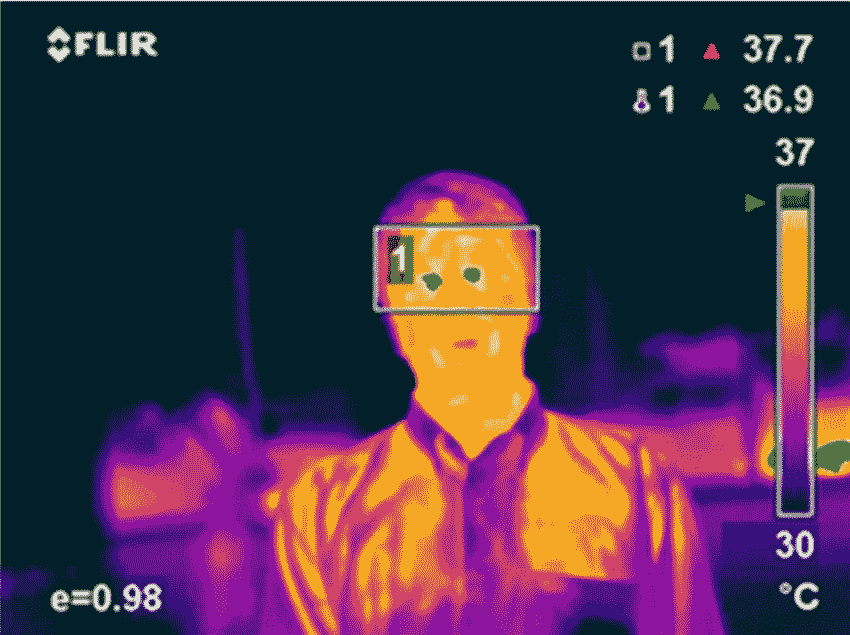
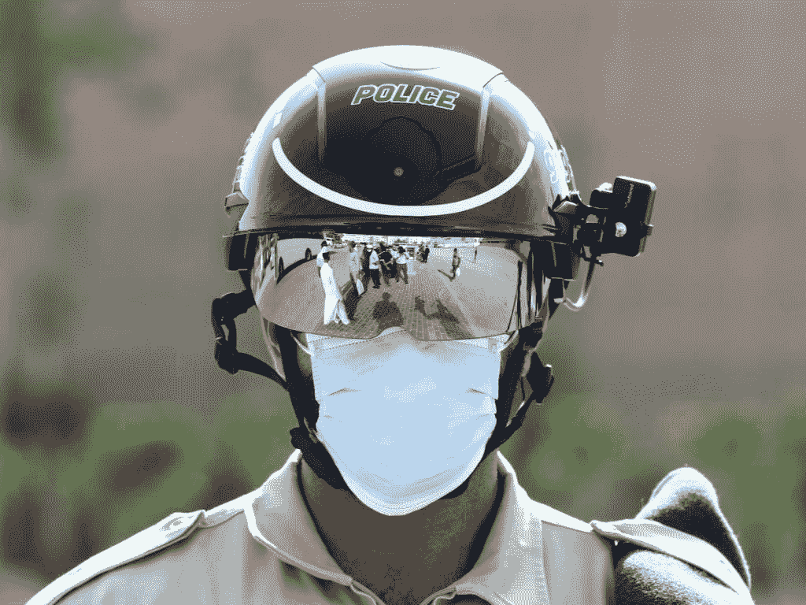
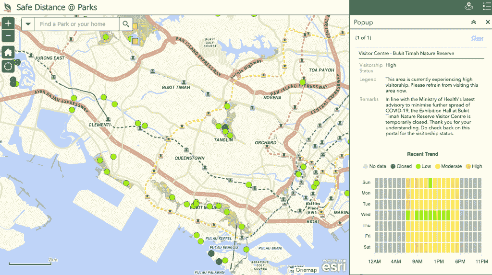

# 接触追踪、机器和公民自由

> 原文：<https://medium.datadriveninvestor.com/contact-tracing-machines-and-civil-liberties-cb1b30eba66a?source=collection_archive---------19----------------------->

纽约州内已经有五个地区重新开业，迎来了“测试、隔离和追踪”的新时代。美国估计将雇佣近 300，000 人成为接触者追踪员，识别潜在的病毒传播者。州长科莫任命前纽约市长迈克尔·布隆伯格领导其追踪者大军，为每个人配备访问公民地理追踪数据的权限。彭博解释说，“当社会距离放松时，接触追踪是我们在病毒出现时隔离病毒并保持隔离的最大希望。”

随着机器人专家和风险投资家加入到用一系列基于传感器的技术来拉平曲线的战斗中，隐私倡导者警告不要效仿中国、韩国和欧洲部分地区的入侵例子。LDV Capital 的 Evan Nisselson 最好地表达了对增加人类追踪器的新创新的乐观态度，“我们今天依赖的许多帮助我们平坦化曲线的技术都利用相机和其他视觉技术来捕捉和分析视觉数据。这些视觉技术可以改变数百万人的生死，这些人将在这次疫情中被感染或接触新冠肺炎病毒。”随着各州竞相采用这种追踪技术，[隐私论坛](https://fpf.org/) (FPF)的政策顾问波利安娜·桑德森(Pollyanna Sanderson)一直在与国会议员协商起草保护公民自由的立法。桑德森与我分享了来自韩国的令人震惊的报告，即通过移动应用程序公开羞辱受感染的个人，以强制遵守隔离规定。“有报道称，一些人因受到羞辱而自杀，韩国人害怕公开羞辱，就像害怕感染病毒一样，”她引用道。

 [## 保护主义、政治和经济动荡|数据驱动的投资者

### 美国股市昨日出现 400 多点的大幅反转，为未来的事情发出了警告信号。市场…

www.datadriveninvestor.com](https://www.datadriveninvestor.com/2018/06/28/protectionism-politics-economic-turmoil/) 

以色列是抗击新型冠状病毒最成功的国家之一，在总共 16，700 例病例中，死亡不到 300 例。本周早些时候，中东民主国家宣布将开始解除全国封锁令，以便重新开放办公室、学校和祈祷服务。它的秘密在于利用其著名的反恐内部安全部队(the Shin Bet)通过利用蜂窝数据来识别和隔离感染，跟踪其所有公民。虽然桑德森报告说，Shin Bet(以色列相当于美国的联邦调查局)因“引起严重的公民自由问题”而受到严厉批评，但政府在 5 月 5 日将其紧急权力延长了三周。据前司法部长兼情报小组成员 Ayelet Shaked 称，“尽管它具有攻击性并有隐私(问题)，但目前没有其他工具。”这一行动紧随以色列最高法院的谴责，命令政府找到“一个合适的替代方案，符合隐私原则。”这使得卫生部推出了自己的自愿应用程序，追踪污染。桑德森解释说，这种开源移动应用程序的用户可以共享他们的“GPS 数据、Wi-Fi 数据、谷歌时间轴历史”卫生部通过蓝牙通知提醒用户已知 Covid 病例的临近。桑德森进一步评论道，“下载量一直乏善可陈，这大大降低了它的效用。暴露通知应用的有效性依赖于广泛的采用。这需要信任……现在判断这种替代方法的效果如何还为时过早。”

其他与不断上升的死亡人数作斗争的国家已经开始在移动机器人和可穿戴设备中嵌入侵入性间谍软件。“中国依靠其庞大的监视网络来对抗新冠肺炎。桑德森报告称:“中国正在混合使用位置数据、数据挖掘和无人机来打击新冠肺炎，但关于中国技术如何运作的公开信息很少。”。她警告说，“当技术被部署时，总是存在固有的‘任务蠕变’的风险；这样政府就可以在将来将数据用于不相关的目的。“隐私倡导者尤其关注中国，”鉴于他们在监控和人权方面的记录。"

在阿拉伯联合酋长国，警察配备了看起来像机械警察的监控头盔来监控行人的体温。桑德森表示，“当与一个人的体温相关的数据与面部识别技术或其他技术相结合以识别个人并将其与他们的体温联系起来时，隐私问题就会出现。”此外，热扫描仪导致了很高的假阳性率。正如 [Vetted Security Solutions](https://www.vigilantsolutions.com/partners/vetted-security-solutions/) 的 Ryan Barnett 所描述的,“发烧检测”设备的营销具有误导性；“这个系统并不神奇。它只是读取外部温度。你不想因为某人的体温过高而公开羞辱他或引起他的负面关注。”高读数可能是由发烧以外的许多因素造成的，如天气、锻炼和饮食。然而，这并没有减缓该行业的发展，因为图像制造商 [FLIR](https://www.flir.com/) 在 2020 年的前三个月已经售出了价值超过 1 亿美元的扫描仪。桑德森强调，许多广泛的扫描仪部署“缺乏数据保护框架或遵守人权。”

在新加坡，官员们利用成群的现场机器狗来监督城市公园内和周围的社会距离政策。本月早些时候，精通技术的亚洲国家[宣布](https://www.tech.gov.sg/media/media-releases/spot-robot-trial-for-safe-distancing-operations)“SPOT 将被远程控制，减少公园巡逻所需的人力，并最大限度地减少工作人员、志愿者安全距离大使和公园游客之间的身体接触。这降低了暴露于病毒的风险。与轮式机器人不同，SPOT 可以很好地跨越不同的地形，并可以有效地穿越障碍，这使它非常适合在公共公园和花园中操作。”在积极应对潜在的批评时，公园当局确保详细说明机械狗的传感器包和具体的任务目标:“SPOT 还将安装摄像头，通过 GovTech 开发的视频分析来估计公园的游客数量。这些摄像头将无法跟踪和/或识别特定的个人，也不会收集任何个人数据。”这些视频分析是市政当局通过其在线门户网站 [The Safe Distance @ Parks](http://safedistparks.nparks.gov.sg) 报告游客数据以实现社会距离规划的更大努力的一部分。利用由 30 架无人机组成的网络，以及现在软银的机器狗舰队，市民能够在开始娱乐活动之前获得最新的游客密度报告。许多公共卫生专家将新加坡作为智能重新开放政策的一个例子，利用机器人和传感器监控安全行为，同时平衡隐私问题。

随着美国即将重新开放，50 个州都部署了自己的战略，桑德森指出，联邦政府在保护公民自由方面有明确的监督作用。在给技术专家的建议中，她建议追踪应用应该“基于用户同意(自愿)”；特征数据最小化；分散的设备到设备信令；设备上处理；透明的源代码；以及防止滥用或误用的技术和行政保障。”她指出，最有争议的问题之一是暴露通知。新加坡、澳大利亚和英国选择了中央系统，将数据直接报告给政府。桑德森称赞苹果和谷歌在设计内置隐私保护的软件方面树立了榜样，“相比之下，苹果/谷歌的 API 并不涉及为政府(或苹果/谷歌本身)创建一个集中的个人信息数据库。这种方法更能保护隐私，并降低了政府或公司将数据用于其他非 COVID 目的的能力。”她指出，奥地利、德国、爱尔兰、意大利、荷兰、瑞士和马来西亚都采用了苹果/谷歌框架。我追问这位 FPF 高管对政府越权的看法，她反驳道:“从 9/11 灾难中吸取教训，在人权和监控之间取得恰当的平衡，这是至关重要的。这需要透明度和监督，数据保留限制，目的限制，应用程序和其他应急技术在即时威胁停止后关闭，政府和公司公开承诺遵守适当的保护措施。”