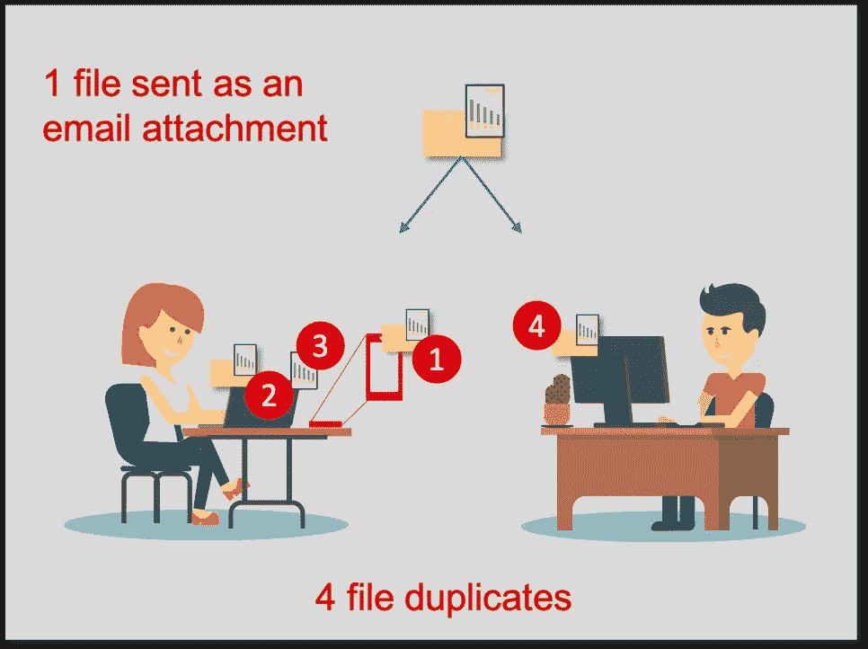
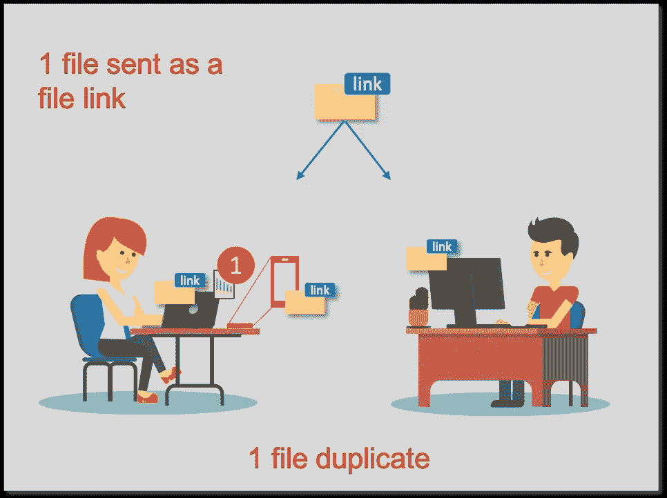
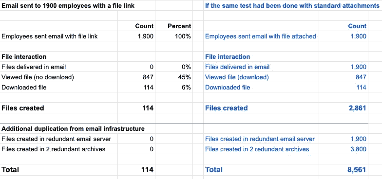

# 遏制新冠肺炎及以后在家工作时代的数据蔓延

> 原文：<https://medium.datadriveninvestor.com/containing-data-sprawl-in-the-work-at-home-era-of-covid-19-and-beyond-abadf23c51c7?source=collection_archive---------6----------------------->

随着组织努力适应远程工作人员，数据蔓延有了新的含义。有一个策略特别突出，可以作为今天和明天的解决方案。

The workforce at home is the new reality. How do organizations protect their data now and going forward?

新冠肺炎把一个新的、突如其来的现实强加给了全球的组织。当我们都在努力适应时，各种规模的公司都面临着一个越来越大的挑战，即当大部分员工突然在家工作时，如何确保他们的运营。在这种新环境下，一个特别危险的威胁是数据蔓延，它会导致数据丢失和被盗。

> 组织防火墙内的数据蔓延已经无法控制。现在它在偏远地区爆炸式增长——一切都完了。

现在不是数据蔓延的好时机。随着用户开始远程访问，公司防火墙后使用的敏感信息现在遍布员工家中、咖啡店和无数未知的场外设备。组织防火墙内的数据蔓延已经无法控制。现在它在偏远地区爆炸式增长——一切都完了。

 [## 为什么数据将改变投资管理|数据驱动的投资者

### 有人称之为“新石油”虽然它与黑金没有什么相似之处，但它的不断商品化…

www.datadriveninvestor.com](https://www.datadriveninvestor.com/2019/01/25/why-data-will-transform-investment-management/) 

这种转变并没有被忽视。最近的报道详细描述了犯罪分子是如何抓住机会，在公司防御之外袭击员工的。[1]

正如我们一直建议的那样，现在比以往任何时候，每个组织都应该放弃已有 50 年历史的文件共享技术，即电子邮件附件。电子邮件及其附件立即成为网络攻击和猖獗的数据蔓延的主要载体，导致数据泄露、知识产权盗窃、违规、勒索和敲诈。[2]

现在是时候用文件链接替换电子邮件附件了。您的组织可能已经拥有的随时可用的服务(例如 Box、Egnyte、MS OneDrive、Google Drive)代表了一种现代化的安全替代方案，可将数据量减少 10 倍以上。在之前的一篇文章中，我们计算出电子邮件每年为每个用户生成令人震惊的 55，000 个重复文件。[3]通过采用文件共享链接，这一数字急剧下降到 5000 左右。

How a single file, sent as an email attachment to remote workers, replicates: Mary & Bob are now working remote. An email with an attachment is sent to both. Mary reads the attachment on her mobile phone (1). She moves to her laptop where the attachment has already been delivered in her email (2). She opens the attachment (3). Bob receives the same email. Even though he ignores it, the email and its file have been delivered to his desktop (4).

通过将文件嵌入到邮件中，电子邮件附件以与电子邮件从发件人到收件人相同的速度自我复制。即使接收方对文件不感兴趣并完全忽略它，这种复制也会发生。在标准电子邮件中，被忽略的文件被发送给最终用户，可能是她的多台设备，并在那里保存，通常长达数年。

通过电子邮件作为文件链接传送的文件会导致非常不同的数据蔓延情形。文件链接只在文件被访问后才生成文件，这种访问是可以保护和控制的，不像标准的电子邮件附件。考虑到电子邮件传递的大量复制，后果是深远的。由于电子邮件中没有文件，因此当邮件在互联网上传播时，文件不再被复制。如果该文件被忽略，则没有文件扩散。

In the same file share scenario as above, here the email is sent with a file link, rather than with an attachment. Mary previews the file, which does not download content to her mobile phone. Interested, she downloads the file from the link to her laptop (1). Bob ignores the attached link, as such, the file is never present on his desktop.

**文件链接预览的威力**

此外，研究表明，大多数访问附件的收件人只是为了查看文件，而不是进行编辑。文件共享链接可以配置为在启用下载之前提供文件预览。一项研究测试了将文件作为链接发送给 1，900 名员工的情况，结果是 51%的员工访问了该文件，其中 87%的员工预览了该文件，只有 13%的员工实际下载了该文件。[4]这项研究表明，通过电子邮件将文件作为文件链接发送会创建 114 个文件(下载)。如果文件是作为标准电子邮件附件发送的，那么最终的副本将是 1，900(每次电子邮件发送)，加上 961(访问该文件以查看或下载的每个用户)或 2，861 个文件—标准附件和文件链接之间的文件副本相差 25 倍！*令人惊讶的是，这个数字没有考虑到由电子邮件系统冗余或存档导致的电子邮件重复，这将导致大约* ***比文件链接多 75 倍的附件重复*** *！*

An experiment conducted by Crescent Electric shows how an email sent with a file shared as a link, to 1,900 employees, resulted in 114 downloads (duplicates) [4]. If we take the same engagement statistics and assume the file was sent as a standard email attachment and account for Crescent’s email infrastructure, the number of files duplicated would have increased dramatically, to 8,561 files or 75 times more than the number of files duplicated using file links!

**结论**

取代电子邮件附件的好处远不止是数据蔓延，还包括防范恶意文件、大文件传输、降低存储和网络成本等等。所有公司都应该将过时的电子邮件附件更换为现代安全的云存储。从提高安全性、信息治理和降低成本的角度来看，这些好处是实实在在且可以量化的。[3]在用户培训方面的更多投资可以帮助用户采用安全链接而不是标准附件的方式发送文件。像 [mxHero](https://www.mxhero.com/) 这样的工具可以自动替换出站和入站邮件上云存储链接的电子邮件附件。让新冠肺炎成为一个更强大、更负责任的组织的催化剂，应对电子邮件过时的文件共享技术固有的广泛挑战。有人说“杀不死我的会让我更强大。”[5]这个疫情会过去的，当它过去的时候，我们会变得更加强大！

**来源**

1.  爆发期间，美国人在家工作，黑客找到了新的目标
2.  [从勒索到敲诈——不断发展的网络攻击以及组织如何使自己成为容易攻击的目标](https://medium.com/datadriveninvestor/extortion-to-blackmail-the-evolving-cyberattack-how-organizations-make-themselves-easy-targets-84b361bb1aba)
3.  [我们对电子邮件附件的危险依赖以及如何应对](https://medium.com/datadriveninvestor/why-we-cant-secure-our-data-with-business-as-usual-b4d13bfcf7d3)
4.  [按需合作伙伴网络研讨会:使用 Box + mxHero 归档电子邮件并消除附件](https://event.on24.com/eventRegistration/EventLobbyServlet?target=reg20.jsp&partnerref=70132000001D76v_OD&eventid=1130395&sessionid=1&key=1D58D67D3B01E8623E5DD869359C465F&regTag=&sourcepage=register)
5.  [偶像的黄昏](https://en.wikipedia.org/wiki/Twilight_of_the_Idols)，弗里德里希·尼采