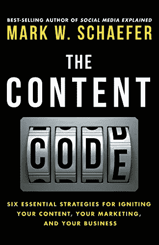
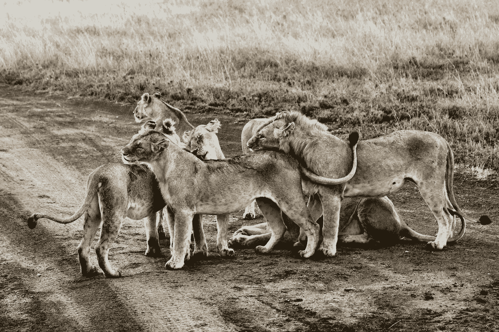

# 坏蛋终于破解了内容代码

> 原文：<https://medium.datadriveninvestor.com/content-code-finally-cracked-by-badass-b81a564ec600?source=collection_archive---------9----------------------->

## 从 [**【内容代码】**](https://www.amazon.com.au/Content-Code-essential-strategies-marketing-ebook/dp/B00ULS1C26/ref=sr_1_1?qid=1578315503&refinements=p_27%3AMark+W.+Schaefer&s=digital-text&sr=1-1&text=Mark+W.+Schaefer) 到**马克·舍费尔**

作为数字化转型项目中的作者、知识管理者和内容传播者，我阅读了许多书籍、文章、博客、行业杂志和科学出版物。他们都提供了有用的见解，并帮助我有效地传达我的信息。然而，我对内容营销的知识和理解受到了挑战，我的信念破灭了，我终于听到了隧道尽头的亮光。

> T 他的帖子是关于我最近读和听的关于内容创建、管理和营销的书**，这本书让我重新思考、重新构建和完善我个人和职业数字生活中的内容策略**、信息传播和知识管理目标。因此，我决定写一篇关于它的文章，并与这个可能从这本有价值的书中受益的社区分享。

Photo by [Fotis Fotopoulos](https://unsplash.com/@ffstop?utm_source=unsplash&utm_medium=referral&utm_content=creditCopyText) on [Unsplash](https://unsplash.com/s/photos/code?utm_source=unsplash&utm_medium=referral&utm_content=creditCopyText)

L et me 介绍[**【内容编码】**](https://www.amazon.com.au/Content-Code-essential-strategies-marketing-ebook/dp/B00ULS1C26/ref=sr_1_1?qid=1578315503&refinements=p_27%3AMark+W.+Schaefer&s=digital-text&sr=1-1&text=Mark+W.+Schaefer) 作者**马克·w·谢弗**。我想分享我对这本书的特殊价值的信念背后的基本原理，并分享我的收获，而不会破坏这本书。

我对外卖的观点不仅是个人层面的，也是组织层面的内容管理和营销。

首先，**这本书从令人信服的商业价值角度巩固了我对社交媒体营销的理解**。这本书强调了社交媒体营销的真正价值，以及个人贡献者和商业组织需要采取的关键步骤，以实现可衡量的结果。

> 在不破坏本书内容的情况下，让我分享我的 10 大收获:

Photo by [Juan Gomez](https://unsplash.com/@nosoylasonia?utm_source=unsplash&utm_medium=referral&utm_content=creditCopyText) on [Unsplash](https://unsplash.com/s/photos/curiosity?utm_source=unsplash&utm_medium=referral&utm_content=creditCopyText)

1.我了解了分享或不分享内容的心理原因。

2.我发现改善内容的 22 个技巧实用而有用。

3.我学会了如何使用聪明地命名为“坏蛋”的公式来设定我的策略，这个公式帮助我破解了自己的内容代码。

> **品牌发展**
> 
> **受众和影响者**
> 
> **分销、广告、推广和 SEO**
> 
> **权威**
> 
> **共享性**
> 
> **社会证明和社会信号**

4.我对 SEO 黑客并不是内容传播的全部的模糊理解得到了验证。与其浪费时间欺骗谷歌，我们可以集中精力开发高质量和独特的内容，这才是真正重要的。

Photo by [joel herzog](https://unsplash.com/@joel_herzog?utm_source=unsplash&utm_medium=referral&utm_content=creditCopyText) on [Unsplash](https://unsplash.com/s/photos/alpha?utm_source=unsplash&utm_medium=referral&utm_content=creditCopyText)

5.我学会了如何建立**“阿尔法观众”**并培养他们。

6.我洞察到了内容点燃的未来。

7.我更好地理解了 Twitter 背后的魔力。

8.我学会了更好地欣赏我的 Linkedin 粉丝。

9.我了解了三种[HHH]内容的区别:

> 卫生内容
> 
> 中枢内容
> 
> 英雄内容

10.最后但同样重要的是，我学会了如何实现**可衡量的**结果。

这本 260 页的合理大小的书中当然有更多有见地的内容。你可能会发现不同的有价值的点为您的领域。如果你读了这本书，我很想知道你的收获。

顺便说一句，当我一个人开车从墨尔本到堪培拉的八个小时里，我也喜欢听马克自己令人安心和愉快的声音，这让我忘记了我的咖啡休息时间。

> 让我们知道你是如何破解内容代码的！

你可以在各种媒体出版物上阅读我的内容，如《意识时代》、《创业》、《数据驱动投资者》、《物联网杂志》、《数据系列》、《一些话》。你也可以看看我的两本出版物《技术卓越》和《超人类主义》。

 [## 卓越的技术

### 本出版物涵盖了新兴市场的领导力、创新、架构和技术主题的高影响力文章

medium.com](https://medium.com/technical-excellence)  [## 理性的生物黑客和超人类主义

### 这本跨学科杂志的重点是日常的变革活动，明智的超人类主义实践…

medium.com](https://medium.com/sensible-biohacking-transhumanism)