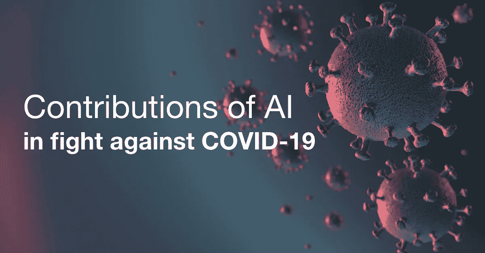

# 艾在抗击斗争中的贡献

> 原文：<https://medium.datadriveninvestor.com/contributions-of-ai-in-fight-against-covid-19-a424c3cc3dd8?source=collection_archive---------25----------------------->

瓦尔迪兹公主

本月早些时候，**世界卫生组织**宣布冠状病毒疾病 2019(**)为疫情，影响188 个国家。截至 3 月 23 日，全球约有 339，710 例报告病例，死亡人数现为 14，704 人。面对如此大量的案例，技术，尤其是人工智能如何提供解决方案？据 **Investopedia** 报道，AI 指的是在机器中模拟人类智能，这些机器被编程为像人类一样思考并模仿他们的行为。以下是它在抗击新冠肺炎的战斗中所做的一些贡献:**

# ****疫情预测****

**数字健康公司 **BlueDot** 设计了一个**疾病监测分析程序**，它使用机器学习和自然语言处理技术来分析来自众多来源的数据，包括来自 65 个国家的新闻报道、机票数据和传染病数据。它正确地预测了病毒将在最初出现后的几天内从中国武汉市传播到其他国家的邻近城市，如曼谷、首尔、台北和东京。**

**2019 年 12 月 31 日，蓝点公司在宣布世卫组织出现新型冠状病毒的九天前，向其客户发出了武汉爆发疫情的警告。**

**在人工智能的帮助下，我们可以预测下一次爆发，以防止它进一步传播。**

# ****诊断****

****华为云**与**华中科技大学&科技**和**蓝源科技**合作，最近开发并推出了**人工智能辅助定量医学图像分析**服务，以帮助使用 CT 特征更快地诊断新冠肺炎。华为云利用其领先的人工智能技术，如计算机视觉和医学图像分析，在短时间内产生准确的 CT 量化结果。这缓解了影像医生不足的问题，可以准确诊断新冠肺炎，并减少医生的繁重工作量。此外，该服务利用华为 Ascend 系列人工智能芯片的强大计算能力，在几秒钟内获得患者的测试结果。**

** [## 模式和机器人:复杂的现实|数据驱动的投资者

### 哈耶克的名著《复杂现象理论》(哈耶克，1964)深入探讨了复杂性的话题，并断言…

www.datadriveninvestor.com](https://www.datadriveninvestor.com/2019/03/04/patterns-and-robotics-a-complex-reality/) 

在一份新闻稿中，华为表示将免费向指定医院提供人工智能辅助医学图像分析服务，并承诺将继续改善其诊断辅助系统，用于所有肺部疾病，包括肺炎、肺结节和肺癌的早期诊断和治疗。

# **数据分析**

最近，一群技术领导者和研究人员，包括美国国家卫生研究院的**艾伦人工智能研究所**、**陈扎克伯格倡议**、**乔治敦大学安全和新兴技术中心**、**微软**和**国家医学图书馆** (NLM)发布了一个**人工智能数据库**、**新冠肺炎开放研究数据集** (CORD-19)，旨在为研究人员提供

该数据库由近 30，000 篇科学文章组成。CORD-19 要求全球机器学习社区帮助开发文本和数据挖掘工具，以分析与冠状病毒相关的大量数据集。这项工作预计将极大地帮助科学家、研究人员和技术人员从大量科学论文中提取关键信息，以快速得出具有数据驱动结果的相关研究。

当涉及到为我们在这场与新冠肺炎的斗争中遇到的问题带来具体解决方案时，人工智能可以提供更多的东西。随着每天报告案件的增长速度，我们需要人工智能技术来帮助我们解决我们在这场危机中面临的挑战。** 

****立即获得免费的机器人流程自动化(RPA)软件！** [下载这里](https://www.raxsuite.com/freedownload?utm_source=Medium%20Post&utm_medium=medium&utm_campaign=medium_footer)**

****来源:****

** [## 一位禽流感流行病学家发出了武汉病毒的第一次警告

### 1 月 9 日，世界卫生组织向公众通报了中国的流感样疫情:一群肺炎…

www.wired.com](https://www.wired.com/story/ai-epidemiologist-wuhan-public-health-warnings/)  [## 人工智能如何帮助对抗冠状病毒

### 想象一个典型的星期二早晨。你把车停在附近的好市多停车场。停车场满了，有辆车…

www.forbes.com](https://www.forbes.com/sites/cognitiveworld/2020/03/19/how-artificial-intelligence-can-help-fight-coronavirus/#718e97564d3a)  [## 这家加拿大初创企业是如何在所有人都知道冠状病毒之前发现它的

### 由于人工智能，初创公司蓝点能够更快地预测冠状病毒的初始传播…

www.cnbc.com](https://www.cnbc.com/2020/03/03/bluedot-used-artificial-intelligence-to-predict-coronavirus-spread.html)  [## 华为云为新冠肺炎推出人工智能辅助诊断，输出 CT 量化结果…

### 华为技术有限公司。公司宣布为新冠肺炎提供华为云人工智能辅助诊断。的…

orangemagazine.ph](https://orangemagazine.ph/2020/huawei-cloud-launches-ai-assisted-diagnosis-for-covid-19-outputting-ct-quantification-results-in-seconds/)  [## 呼吁科技界对新的机器可读新冠肺炎数据集采取行动|白宫

### 今天，来自艾伦人工智能研究所、陈·扎克伯格倡议(CZI)、乔治城大学的研究人员和领导人…

www.whitehouse.gov](https://www.whitehouse.gov/briefings-statements/call-action-tech-community-new-machine-readable-covid-19-dataset/)  [## 呼吁科技界对新的机器可读新冠肺炎数据集采取行动|白宫

### 今天，来自艾伦人工智能研究所、陈·扎克伯格倡议(CZI)、乔治城大学的研究人员和领导人…

www.whitehouse.gov](https://www.whitehouse.gov/briefings-statements/call-action-tech-community-new-machine-readable-covid-19-dataset/)**