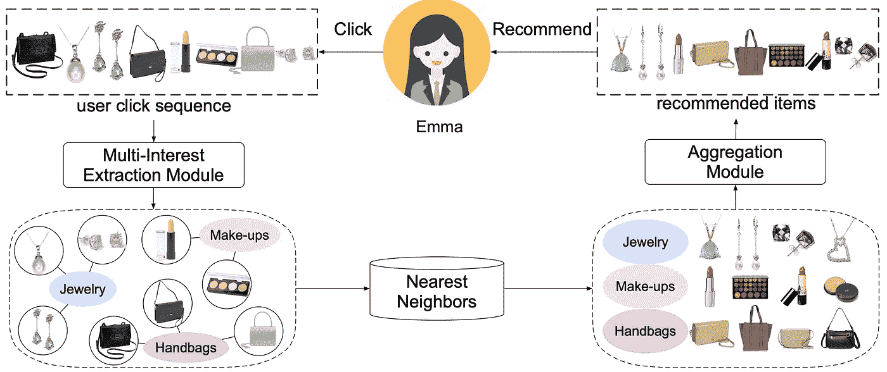
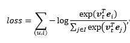
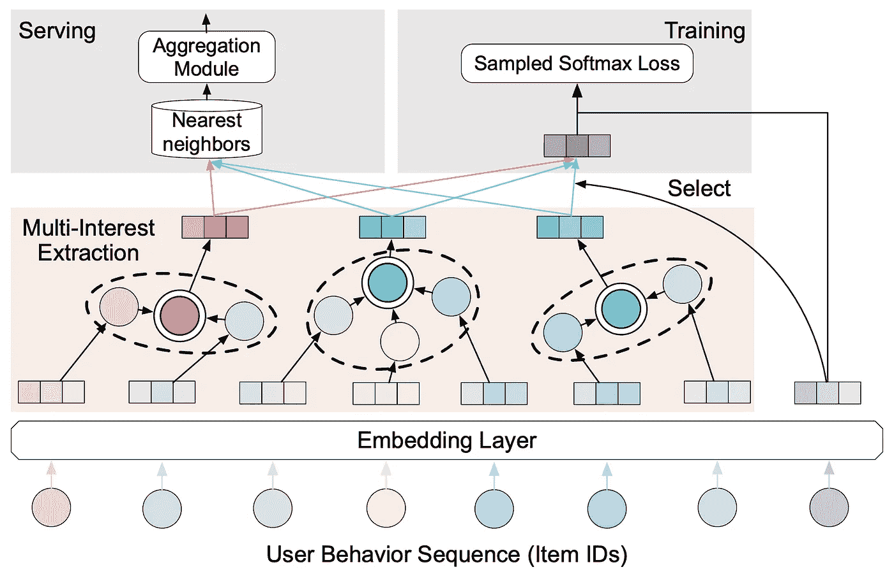
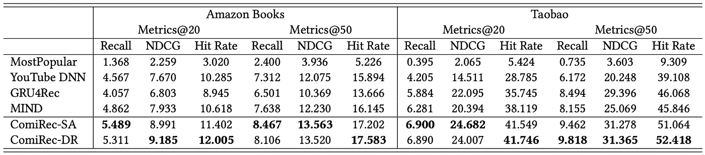
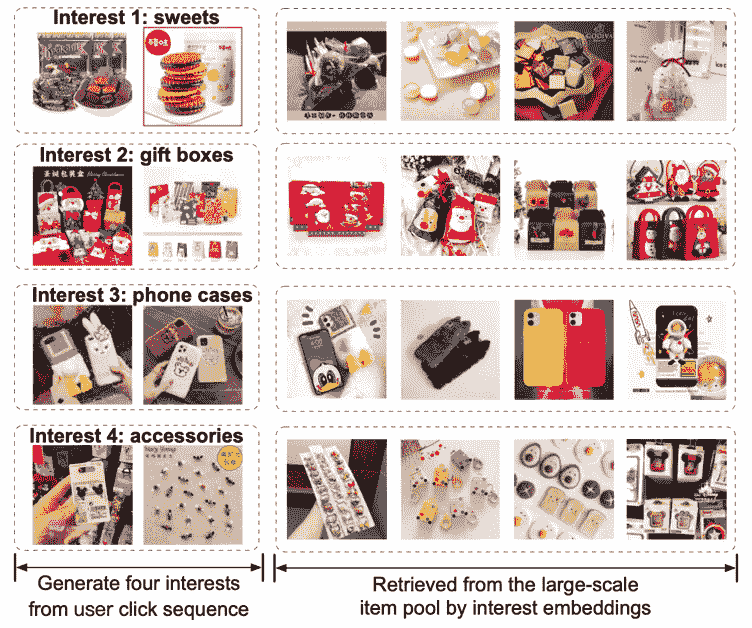
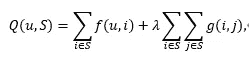
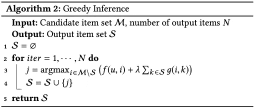
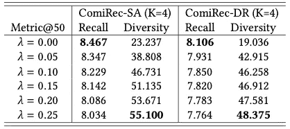

# 可控的多兴趣推荐框架

> 原文：<https://medium.datadriveninvestor.com/controllable-multi-interest-framework-for-recommendation-7fb336592b8d?source=collection_archive---------16----------------------->

*下载“*[*【KDD 论文云知识发现】*](https://resource.alibabacloud.com/whitepaper/cloud-knowledge-discovery-on-kdd-papers_2592) *”白皮书，探索 12 篇 KDD 论文和 12 位阿里巴巴专家的知识发现。*

*岑玉国、、徐邹、常周、、*

本文《可控多利益主体推荐框架》已被 KDD 2020 接受。

近年来，神经网络被广泛应用于电子商务推荐系统中。基于神经网络的推荐算法通常只从用户的行为序列中学习一个用户表示向量。在大多数情况下，这种统一的表示向量无法反映用户在一段时间内的不同兴趣。如下图所示，Emma 的点击顺序反映了她最近的三个不同兴趣:珠宝、手袋和彩妆。我们提出了一个用于推荐的可控多兴趣框架 ComiRec，用于根据用户的点击序列来推荐项目。多兴趣提取模块从用户的点击序列中捕获用户的各种兴趣。这些兴趣可以用来回忆类似的物品。聚集模块将召回的项目聚集到推荐的候选项目列表中，该列表将被下游任务使用。

我们参考现有的动态路由多兴趣网络(MIND) [1]设计了多兴趣提取模块。心智模型通过使用胶囊网络之间的动态路由算法来提取用户的多个兴趣[2]。为了实现多兴趣提取模块，我们研究了动态路由算法和基于自我关注的方法。需要进一步研究，以确定实施这一模块的最佳选择。通过基于用户的历史点击序列预测用户的下一次点击来训练多兴趣提取模块。具体地，对于训练集中的样本对(u，I)，我们可以通过在用户点击项目 I 之前分析该用户的点击序列来获得用户 u 的多个表示 v_1，v_2，…，v_K。然后，我们选择最接近项目 I 的表示 e_i 的用户表示 v_t。下面的负对数似然函数被优化:

其中 I 是项目的集合。分母中的求和公式会导致过多的计算开销。因此，我们使用基于采样的 softmax 技术进行近似计算。经过训练后，多兴趣提取模块可以从用户的历史点击序列中学习用户的多种表示。下图显示了该模块的培训过程。

为了验证多兴趣提取模块的有效性，我们在亚马逊和淘宝的两个公开数据集上进行了实验。根据下表中列出的统计数据，我们的 ComiRec-SA/DR 方法在两个数据集的基础上实现了最佳效果。SA 表示自关注方法，DR 表示动态路由方法。

我们根据实际用户的兴趣进行了案例研究。多兴趣提取模块从用户的历史点击序列中学习用户最近的四个兴趣，包括糖果、礼盒、手机壳、配件。如下图所示，左边部分列出了用户点击的条目，右边部分列出了基于用户兴趣表示从大型条目池中召回的一些条目。

找出一种方法使下游任务能够使用这些多利益表示是很重要的。为此，我们提出了可控聚合模块。给定用户的多兴趣表示 v_1，v_2，…，v_K，分析它们的最直接的方法是将项目-用户相似性定义为与项目最相关的兴趣表示的分数，即，

。这种方法可以最大化推荐准确度，但是没有充分利用多兴趣表示。可控聚集模块可以基于多兴趣表示来调整推荐的准确性和多样性。我们定义了下面的值函数，它显示了用户 u 和项目集 S 之间的关系:

其中 g(i，j)表示 I 项和 j 项之差，例如 g(i，j)=δ(CATE(i)≠CATE(j))。CATE(i)表示项目 I 的类别。δ(⋅是一个指示函数。我们从基于兴趣表示召回的项目中选择了一个项目集 S。这最大化了价值函数 Q(u，S)，允许我们获得一组推荐的项目。我们可以使用贪婪策略来获得这个函数的更好的解。近似算法如下:

在超参数设置中，如果想最大化推荐准确率，设置λ=0。这与上面提到的最直接的方法具有相同的效果。当λ=+∞时，聚集模块找到最多样化的项目集。我们在亚马逊的数据集上测试了可控聚合模块。随着因子λ的增加，推荐的召回率略有下降，但是推荐项目的多样性显著增加。增加推荐项目的多样性，可以在一定程度上提升用户体验。

# 参考

[1]李，晁等.基于动态路由的多兴趣网络在天猫上的推荐."第 28 届 ACM 信息和知识管理国际会议录。2019.萨布尔、萨拉、尼古拉斯·弗罗斯特和杰弗里·e·辛顿。"胶囊之间的动态路由."神经信息处理系统进展。2017.

*本文观点仅供参考，不一定代表阿里云官方观点。*

# 原始来源:

 [## 可控的多兴趣推荐框架

### Alibaba Clouder 年 10 月 15 日 151 下载《KDD 论文中的云知识发现》白皮书，探索 12…

www.alibabacloud.com](https://www.alibabacloud.com/blog/controllable-multi-interest-framework-for-recommendation_596749)