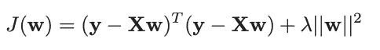
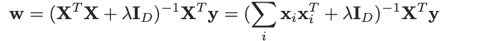
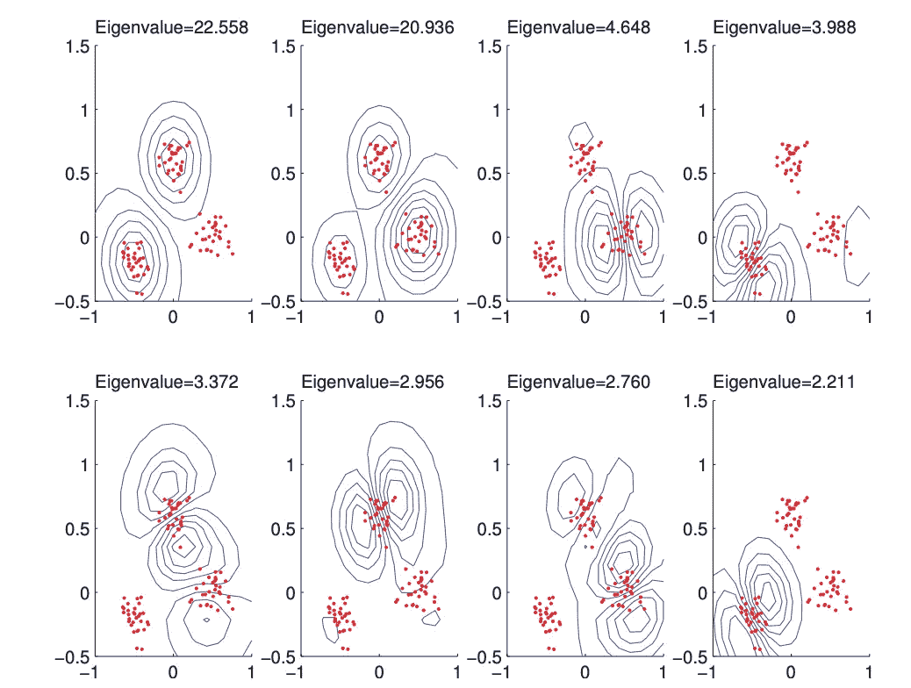

# scikit-learn 监督学习的常规指南—核岭回归(23)

> 原文：<https://medium.datadriveninvestor.com/conventional-guide-to-supervised-learning-with-scikit-learn-kernel-ridge-regression-23-d6a9f64e9c6f?source=collection_archive---------4----------------------->

这是 scikit-learn 指导监督学习的 92 篇系列文章中的第 23 篇，撰写这篇文章的目的是为了能够熟练地将算法应用于生产，并能够解释算法背后的算法逻辑。请在[第一篇文章](https://medium.com/@venali/conventional-guide-to-supervised-learning-with-scikit-learn-getting-started-1-f9abd3f0e6c8?source=post_page---------------------------)中找到所有部分的链接。

让我们从两个术语开始

> 内核
> 
> 假设我们希望以任何方式分类或聚类或处理的每个对象可以被表示为固定大小的特征向量。然而，对于某些类型的对象，不清楚如何最好地将它们表示为固定大小的特征向量。
> 
> 例如，我们如何表示长度可变的文本文档或蛋白质序列？或者分子结构，有复杂的三维几何形状？还是一棵进化树，大小形状都不一样？
> 
> 解决这些问题的一种方法是定义数据的生成模型，并使用推断的潜在表示和/或模型的参数作为特征，然后将这些特征插入标准方法中。
> 
> 另一种方法是假设我们有一些方法来测量对象之间的相似性，这不需要将它们预处理成特征向量格式。例如，当比较字符串时，我们可以计算它们之间的编辑距离，作为抽象空间中对象之间相似性的某种度量，并将这种度量称为核函数

> 核心诡计
> 
> 我们可以用原始的特征向量 x 来代替，而不是用核φ(x)=[κ(x，x1)，…，κ(x，xN )]来定义我们的特征向量，但是修改算法，使得它用对核函数κ(x，x)的调用来替换形式为 x，x 的所有内积。这就是所谓的内核技巧。事实证明，许多算法可以通过这种方式进行内核化

现在我们准备讨论核岭回归

算术地

设 x ∈ RD 为某特征向量，X 为对应的 N × D 设计矩阵。我们想最小化

最佳解决方案由下式给出

这是什么意思？

内核在任意空间学习函数

因此，它在由相应的内核和数据引起的空间中学习线性函数。

对于非线性核，这对应于原始空间中的非线性函数。

简单来说:

KRR 是一种插值方法(将不同性质的东西插入到其他东西中。例如，“将歌曲插入到片段中”)。这里，我们主要关注机器学习逼近(MLA)在插值区域对 f(x)的误差

Visualization of the first 8 kernel principal component basis functions derived from some 2d data. We use an RBF kernel with σ2 = 0.1\. Figure generated by kpcaScholkopf, written by Bernhard Scholkopf.

# 信用

所有的学分都归 Scikit-learn 文档所有的参考资料都符合官方用户指南。

同样，感谢我的朋友，他相信“对我来说，成功就是我创造了足够的影响力，让世界变得更美好”，这激励我从头开始，以便在某个时刻创造不同。

# 关于作者

我是 venali sonone，职业是数据科学家，也是一名管理专业的学生，希望在金融行业发展自己的职业生涯。