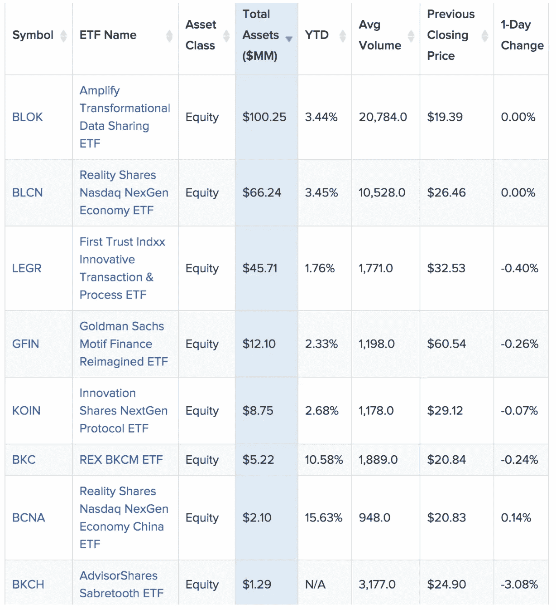
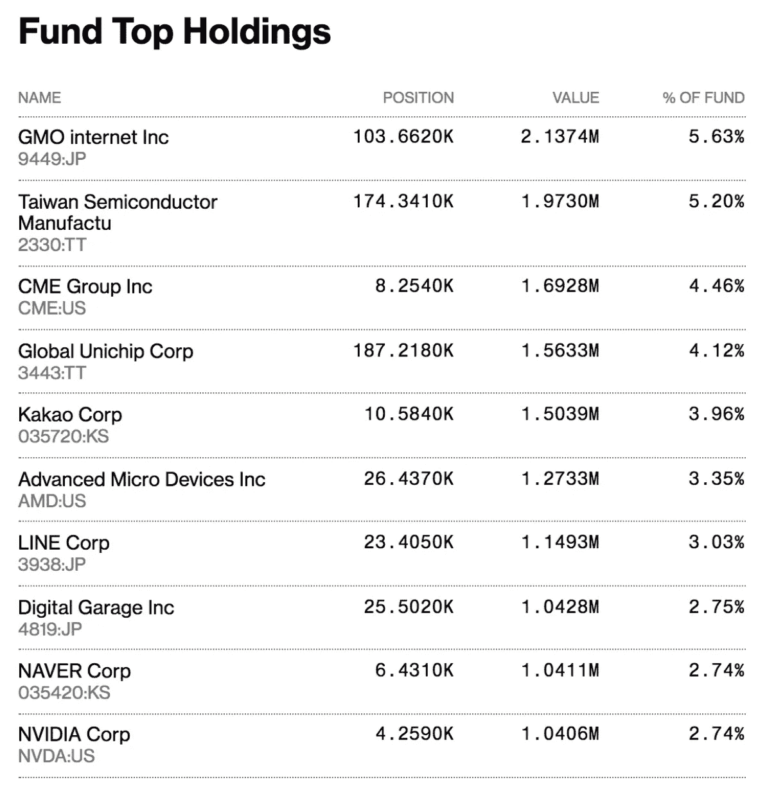
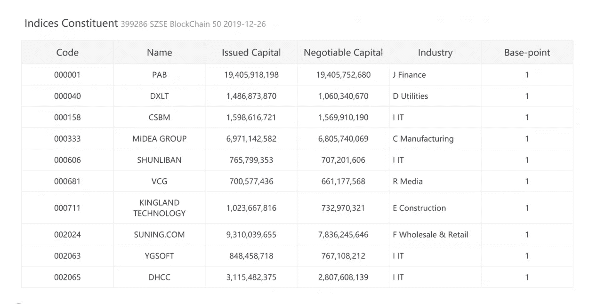

# 通过股权投资区块链的传统方式

> 原文：<https://medium.datadriveninvestor.com/conventional-ways-to-invest-in-blockchain-via-equities-14083e5a3fc5?source=collection_archive---------12----------------------->

通过上市股票投资永远不会消亡。事实上，我预见区块链将使其呈指数级增长。更多上市股票、更多司法管辖区、更好的信息、部分所有权。

目前，参与区块链行业增长的传统方式是购买公开交易的股票。例如，采矿公司、构建企业软件或硬件的公司。Hut 8 是全球大型上市比特币挖矿公司的一个例子。在多伦多证券交易所上市的 Hut 8 Mining (TSXV: [HUT](https://investingnews.com/stock-information/?symbol=hut:ca) )市值接近 1 亿美元。

大多数纯粹的区块链公司资本都很少(甚至不到 1000 万美元)。

因此，市场认为，通过投资对该行业具有重大战略风险的上市科技公司，有更多潜力抓住区块链的上行空间。

[区块链股票](https://blockchainstocks.com/)是一个列出并跟踪此类股票的网站，并显示埃森哲、万事达或基金等公司在该领域的投资；作为他们在区块链股票列表和大盘股列表中的选择。

 [## 5 行业转型区块链应用|数据驱动投资者

### 除非你一直生活在岩石下，否则我相信你现在已经听说过区块链了。而区块链…

www.datadriveninvestor.com](https://www.datadriveninvestor.com/2019/02/13/5-real-world-blockchain-applications/) 

传统投资者还可以考虑通过主题 ETF 公开投资区块链行业。在美国，有 8 只区块链主题 ETF 已经积累了 2.4 亿美元。

Source: [https://etfdb.com/themes/blockchain-etfs/](https://etfdb.com/themes/blockchain-etfs/)

其中只有 4 位成功积累了超过 1000 万美元，没有一位超过 1 亿美元大关。

两个最大的区块链 ETF 的最大持有量是日本 IT 提供商这样的公司— [GMO Internet](https://www.gmo.jp/en/) 和 Digital Garage。

GMO 公司正在为推出第一种日元支持的稳定货币 GYEN 做准备。预计该公司还将推出一款低成本、低耗电的新型比特币挖矿设备——B2 挖矿机。

[数字车库](https://www.garage.co.jp/en/)另一家日本公司(4819-TYO)推出了一款 ADR。他们去年与 Blockstream 合作，为日本该领域的机构需求提供服务。

BLOK ETF 的顶级持股中有超过六家日本公司，如 LINE、KAKAO、SBI 控股和韩国乐天。

BLCN 与一些亚洲公司相比更加多元化，比如京东、百度和 LINE。

所有区块链 ETF 都包含大型科技公司，如 Alphabet，SAP 或 Nvidia。

在欧洲，Invesco Elwood Global block chain UC its ETF 自去年 3 月推出以来，以 3800 万美元的 AUM 在伦敦证券交易所上市( [BCHN:LN](https://www.bloomberg.com/quote/BCHN:LN) )。

顶级持股类似于美国 ETF

在中国，深圳证券交易所刚刚推出了区块链 50 指数，其中包括其交易所在区块链领域的上市公司。

Source: [https://news.bitcoin.com/shenzhen-stock-exchange-launches-index-of-top-50-blockchain-public-companies/](https://news.bitcoin.com/shenzhen-stock-exchange-launches-index-of-top-50-blockchain-public-companies/)

持股比例最高的是平安银行、美的集团-电力公司、东方财富资讯。

深圳证券交易所已向中国证券监督管理委员会申请允许一只区块链交易所交易基金(ETF)在其指数之外上市。

所有这些投资包装本质上都在提供区块链倾斜的技术敞口。

