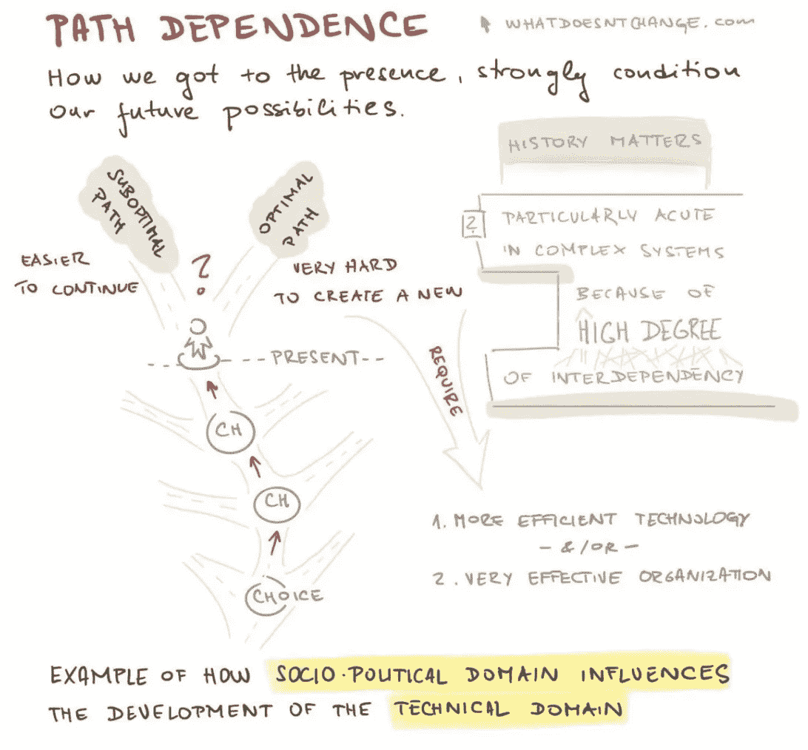
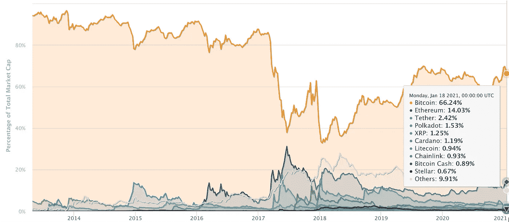

# 比特币会被竞争对手取代吗？

> 原文：<https://medium.datadriveninvestor.com/conversations-with-skeptics-will-bitcoin-be-replaced-by-a-competitor-part-2-of-6-f76ee367826f?source=collection_archive---------19----------------------->

Photo by [Abed Ismail](https://unsplash.com/@abedismail?utm_source=unsplash&utm_medium=referral&utm_content=creditCopyText) on [Unsplash](https://unsplash.com/s/photos/competition?utm_source=unsplash&utm_medium=referral&utm_content=creditCopyText)

鉴于对比特币的两极分化观点，我受到启发创作了一个六集系列。我观察到朋友和家人采取了一些强硬的立场，他们坚持认为这没有任何价值。考虑到价格波动和比特币的抽象概念，这些观点是可以理解的。我们看到了不断的高潮和低谷。有人甚至把比特币比作 17 世纪荷兰的郁金香狂热！

我很感激我的生活中有这些怀疑论者——它给了我继续这条陡峭的学习曲线的能量。

亲爱的怀疑论者，现在重新考虑你对数字资产的假设还为时不晚。

让我们开始吧。

注意:要阅读完整的介绍，请阅读第一篇文章(即第一部分)。在那里，我提供了更大的背景，为什么我决定推出这六个部分的迷你系列。

 [## 与怀疑者的对话:比特币是否太不稳定而不能成为一种很好的价值储存手段？(第 1 部分，共 6 部分)

### 疫情带来了灾难性的后果。政府、公司、个人和法定货币已经…

alexftboyd.medium.com](https://alexftboyd.medium.com/conversations-with-skeptics-is-bitcoin-too-volatile-to-be-a-good-store-of-value-part-1-of-6-6ce50dbba35c) 

**批评之二:比特币将被竞争对手取代**

网络效应使得干掉一个已经站稳脚跟的现有玩家变得极其困难。例如，亚马逊是一个巨大的买卖平台，似乎不可能很快出现另一个平台并成为挑战者。另一个例子是谷歌搜索引擎，它已经成为人们的共同选择，现在是一个常用的动词。竞争对手可以尝试再造比特币，但他们冒着金钱和时间的风险，几乎肯定会失败——这似乎不是很有吸引力。

此外，比特币不是一家公司，也不应与一家公司相提并论。它是独一无二的，不可复制。[知名比特币拥护者罗伯特·布里德洛夫](https://breedlove22.medium.com/)解释了原因:

> **“路径依赖保护比特币免受破坏，因为导致其释放并融入市场的有机事件序列是不可复制的。比特币的货币供应量绝对稀缺；完全独一无二的一次性发现”。**

[https://twitter.com/Breedlove22/status/1244054248670646272/photo/1](https://twitter.com/Breedlove22/status/1244054248670646272/photo/1)

路径依赖意味着事件的顺序和事件本身一样重要:举个简单的例子:

> **“如果你先淋浴，然后擦干身体，与你先擦干身体，然后淋浴相比，你会得到截然不同的结果”。**

然而，竞争对手仍然试图改善比特币的局限性(即可扩展性)——但这对他们来说并不奏效。

[比特币现金](https://en.wikipedia.org/wiki/Bitcoin_Cash) (BCH)就是一个很好的例子。它是由比特币矿工和开发者发起的，他们同样关注这种数字资产的未来及其有效扩展的能力。一个主要的抱怨是比特币交易的处理(和验证)速度。据估计，[每秒可处理 4.6 笔交易](https://towardsdatascience.com/the-blockchain-scalability-problem-the-race-for-visa-like-transaction-speed-5cce48f9d44#:~:text=Bitcoin%20processes%204.6%20transactions%20per,150%20million%20transactions%20per%20day).)，而 Visa 每秒可处理 1700 笔交易。

2017 年 8 月，比特币[分叉](https://www.investopedia.com/terms/h/hard-fork.asp)创造了 BCH。从本质上说，一个分叉意味着相同代码的一个新版本被创建，只做了一些修改:BCH。这是因为，比特币社区的开发者无法就网络的未来达成一致——所以他们产生了分歧。

值得注意的一个重要区别是，BCH 增加了 8 MB 的块大小(而比特币只有 1 MB)，允许在一个块中记录更多的交易。把区块链想象成一本纸质书。每页代表一个块，每页中记录了事务。继续类比，BCH 创造了一种新的纸质书，页数更大。因此，比特币现金网络每秒可以处理比比特币网络更多的交易。这使得 BCH 比比特币更快、更便宜、更具可扩展性。但是——这会让事情变得更好吗？

将比特币目前的市值与比特币现金进行比较就很能说明问题。在撰写本报告时，这两个数字分别为:7500 亿美元和 100 亿美元。因此，比特币比 BCH 大 75 倍。

其原因被认为是:

*   BCH 的投资者信心不足，因为它不如比特币成熟(先发优势和网络效应大有帮助)。
*   两种硬币的开采操作非常相似。因此，矿工有动机开采比特币以赚取更多利润。
*   在交易方面，BCH 的交易对数量远少于比特币，这使得比特币的可交易性更低，因此市场渗透也更加困难。
*   下图显示，截至 2021 年 1 月 18 日星期一，比特币占据了加密货币市场近 70%的份额，其背后的发展势头相当可观，这只会继续增强其主导地位。

[https://coinmarketcap.com/charts/](https://coinmarketcap.com/charts/)

一旦事情获得动力，除非有丑闻或黑天鹅事件阻碍进步，否则这种势头可能会持续下去。比特币正在被个人、金融机构和民族国家采用。

**关键要点:**

*   比特币是**第一种加密货币**(“第一代区块链”)，具有显著的先发优势。它的市值远高于其他加密货币，这反映了这种情绪。
*   比特币具有独特的属性，使其成为理想的价值储存手段:稀缺、分散和不可改变。
*   **路径依赖**意味着一系列独特的事件导致了不可复制的比特币的产生。这个发现是绝对不可复制的。

**来源:**

1.  [https://breedlove22.medium.com/](https://breedlove22.medium.com/)
2.  [https://en.wikipedia.org/wiki/Bitcoin_Cash](https://en.wikipedia.org/wiki/Bitcoin_Cash)
3.  [https://towards data science . com/the-区块链-scalability-problem-the-race-for-visa-like-transaction-speed-5 CCE 48 f9d 44 #:~:text = bit coin % 20 processes % 204.6% 20 transactions % 20 per，150% 2000 万% 20 transactions % 20 per % 20 day](https://towardsdatascience.com/the-blockchain-scalability-problem-the-race-for-visa-like-transaction-speed-5cce48f9d44#:~:text=Bitcoin%20processes%204.6%20transactions%20per,150%20million%20transactions%20per%20day)。
4.  [https://www.investopedia.com/terms/h/hard-fork.asp](https://www.investopedia.com/terms/h/hard-fork.asp)
5.  [https://news . bitcoin . com/Pakistan-to-set-up-two-state-owned-bit coin-mining-farms-to-help-boost-economy/](https://news.bitcoin.com/pakistan-to-set-up-two-state-owned-bitcoin-mining-farms-to-help-boost-economy/)