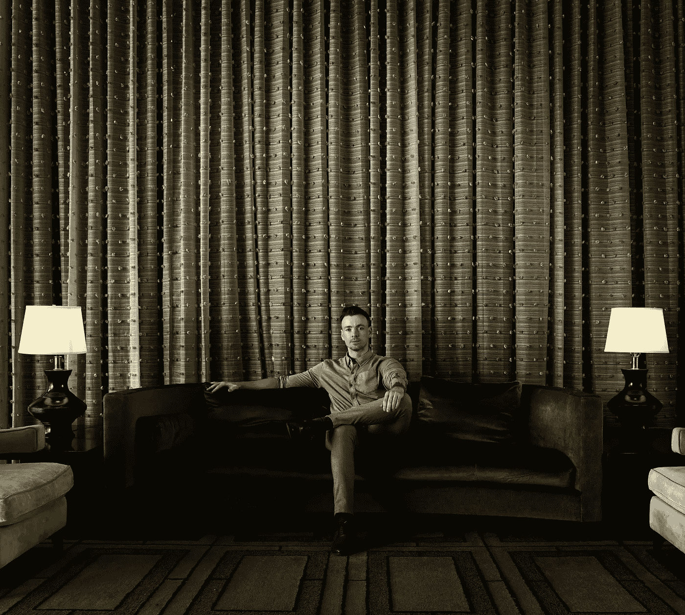

# 一个高转化率网站幕后的一瞥

> 原文：<https://medium.datadriveninvestor.com/conversion-rate-optimization-cro-know-enough-to-be-dangerous-20eed1e93288?source=collection_archive---------39----------------------->

## 转换率优化(CRO)——知道足够危险

Photo by [Gordon Cowie](https://unsplash.com/@gcowie?utm_source=unsplash&utm_medium=referral&utm_content=creditCopyText) on [Unsplash](https://unsplash.com/s/photos/business-man?utm_source=unsplash&utm_medium=referral&utm_content=creditCopyText)

不管你是一家初创公司还是一家老牌公司；CRO 可能是让你实现销售目标的 x 因素。

让我们直接进入一个关于创业公司的故事——不是一个真实的故事，但有可能是。这是一家公司，它有许多我多年来合作过的不同公司的熟悉元素。

假设这家初创公司创造了一种创新的硬件技术，比如更清晰的图像。开始的最初策略是制造一个原型，并专注于建立早期采用者的受众。

下面是漏斗的设计策略。通过重新发布吸引这个群体的故事，建立一个脸书有机运动。定期发布它们来建立脸书页面的追随者。让脸书的广告链接到一个登陆页面(不同于网站),其中包含非常具体的信息，吸引他们并与广告相关联。目标是让他们选择加入早期采用者简讯，并承诺给他们第一次机会购买原型，以换取他们的反馈。新闻提要提供了他们感兴趣的更强大的信息——它还让他们了解原型发布的最新进展。产品准备就绪后，会发送一封电子邮件，其中包含一个链接，指向另一个包含“立即购买”行动号召的登录页面。

为什么我要解释整个漏斗？因为这些因素会影响每个特定登录页面的消息传递。其中一个原因就是所谓的单词连接。如果网页与原始广告有某种联系，点击广告的访问者就不太可能反弹。在同样的前提下，如果你在谷歌广告上做广告，他们会给单词连接好的广告更高的质量分数。

谷歌分析是一个网络分析服务，跟踪和报告网站流量。您可以将它与其他工具和系统结合使用。跳出率报告在这里，告诉我们，如果客户正在与网站互动，或只是点击和关闭。

# 什么是 CRO？

转化率优化是一个系统，以增加网站访客转化为客户。

影响转化率的因素很多。

这篇文章的目的是让你对 CRO 有一个了解，但不要太深入。我认为如今的首席执行官和创始人对数字营销有了更好的理解——有些人甚至达到了专家水平。

这个过程可能看起来有点神秘，取决于你对这个东西的熟悉程度。it 科学中的知识是由工程师、博士和营销专家发明的。这甚至涉及到艺术的层面。

如果你仍然好奇，我们开始吧，好吗？

# 神秘科学剧场？

这里面有一点神秘和科学。提高转化率似乎是一个深奥的过程。为了做到这一点，我们应该考虑使用负空间的构成元素来吸引你的目标人群。此外，我们可以使用颜色作为安慰剂效应来帮助行为购买。呃。

让我们试着解开这个谜。

## 空格

空白也称为负空间。在视觉艺术中，空白是设计的重要组成部分——没有它，页面上的对象就不会存在。在更实际的意义上，它是用来强调一个设计元素。在市场营销中，留白可以帮助你讲述故事。

平面设计师兼广告人 Mark Boulton 解释道:“这种空白空间有助于广告人在特定市场中有效地定位公司产品，并吸引最有可能购买产品的消费者。”

如果有效利用，留白可以帮助企业将观点转化为销售。

## 颜色

> "颜色和特征一样，会随着情绪的变化而变化."——巴勃罗·毕加索

你可能听说过颜色会影响感知。在市场营销中，颜色会影响顾客在你网站上的最初互动。

哈灵顿写了一篇题为*色彩策略:利用色彩为产品和品牌增加和提取价值*的博士论文，她敦促她的客户*而不是*将色彩视为一种艺术选择或偏好，而是一种基于基础的商业决策。

颜色是有语境的。蓝色干净、健康、安全，但在不同的色调和业务中，它传达出稳定和可靠。

“例如，你可能会买亮橙色的洗发水，但你可能不会买同样颜色的汽车。因此，在考虑产品或营销材料的颜色时，重要的是研究竞争对手的典型颜色选择，并了解特定颜色试图向客户传达什么。” [Inc](https://www.inc.com/guides/2010/10/how-to-choose-the-right-colors-for-your-brand.html)

# 世卫组织医生？

1895 年，哈洛·盖尔在明尼苏达大学教授心理学。盖尔是广告心理学的革新者，进行实验研究。他的许多工作涉及品牌资产、广告和测量，至今仍在使用。

当优化一个网页时，人类的行为需要更仔细的观察。制作高转换率网页的心理因素非常强大。营销人员学会用行动号召来讲述一个故事，并利用从众行为现象来说服某人相信你的合法性。

## 社会证明

对于一家致力于建立声誉的公司来说，社交证明至关重要。有效的社会证明的例子有信任标志、证明、案例研究或任何其他认可类型。

Investopedia 一篇名为[从众效应](https://www.investopedia.com/terms/b/bandwagon-effect.asp)的文章很好地解释了社会证明背后的心理学。“消费者通常依靠其他消费者的意见和购买行为来节省收集信息和评估消费品质量的成本。”

## 行动呼吁

有一个令人信服的行动号召(CTA)会将访问者转化为客户。这就是网页的全部意义。专家们知道，使用简洁的语言、表明益处和紧迫感都是被证明有效的策略。

让客户注册或购买产品比按钮上的一行简短文字更复杂。

“ **CTA** 基本上是故事的高潮——登陆页面建立了预期，而 **CTA** 给了我们预期的高潮。在你的故事中，你要尽可能积极乐观地描述用户完成**动作**后会发生什么。”据 SEO pro 称，[埃里克·萨克斯](https://sachsmarketinggroup.com/psychology-calls-action/)。

# 我们需要一个“战争游戏”编码员吗？

《战争游戏》是一部伟大的虚构电影，这部电影影响了罗纳德·里根总统，促使他加强美国国家安全以对抗黑客。但真正的问题是，CRO 有多专业？许多人会说，曾经你需要一个工程学学位才能让一个按钮看起来像一个按钮。用热图分析网络流量似乎是未来的高科技。

有充分的理由关注这些事情。

## 小跟班

你知道吗，我们的大脑认为有些按钮比其他按钮更容易点击？

阴影和高光是让一个按钮脱颖而出的基本元素。有些人还说，跟上现代网页设计的美学潮流是至关重要的。按钮过去看起来是 3d 的，现在看起来更平了。

## 热图

热图有助于可视化登录页面中最热门的元素。这是一种观察人们如何与你网站的各个方面互动的方式。也许他们正在阅读细则，寻找更多信息——这可能解释为什么分析数据显示高跳出率。

就像任何测试一样，你收集的数据越多越好。专家表示，每个设计屏幕和每台设备应该有 2000 次页面浏览，才能获得有意义的数据。

有些悬停地图使用眼球追踪技术，有助于理解用户如何与网站元素互动。一些研究表明，人们的鼠标移动与眼球追踪无关。然而，它是数据，收集得越多，就越好，越有意义。

# 尼奥吃了红色药丸

我们现在知道了 CRO 如何提高转化率的真相。自互联网泡沫以来收集的所有数据已经成为最佳实践。世界各地的 CRO 专家使用这一最佳实践数据来构建假设。

## 标杆管理

盘点正在发生的事情，并对当前结果进行基准测试。

有些人把基准测试称为“麻痹我的分析”，认为太多的报告会拖慢你的速度。但是测试是至关重要的。它帮助我们衡量最佳实践是帮助了还是阻碍了我们的努力。

[Forbes 的一篇文章](https://www.forbes.com/sites/scottlenet/2018/12/12/the-importance-of-benchmarking/?sh=18483dd34245)引用道，“对最佳实践进行基准测试是有充分理由的。随着时间的推移，最佳实践会根据导致成功结果的行动的经验而出现。”

# 测试

为什么要测试？

因为在所有这些科学和人类行为研究之后，你仍然会犯错。

[Michael Aagaard](https://unbounce.com/a-b-testing/failed-ab-test-results/) 在一篇名为《失败的 a/b 测试如何提高转化率》的文章中做了许多 A/B 测试。他举例说，改变一个单词可以提高 26%的转化率。在另一个例子中，术语“垃圾邮件”在“100%隐私-我们永远不会向您发送垃圾邮件”的上下文中转化率降低了 18%。事后看来，这是有道理的——网站访问者不阅读而是浏览文本，不管上下文，看到“垃圾邮件”这个词是有害的。

如果在测试中考虑变量，比如移动和桌面，那是最好的。最重要的因素是为[统计显著性](https://hbr.org/2016/02/a-refresher-on-statistical-significance)收集足够的数据。

# 摘要

回想一下我们的创业示例——我们需要两个设计独特的登录页面和不同的 CRO 策略。初始页面将有一个不同的 CTA，内容，甚至可能是新的社会证明项目。当你了解你的目标听众时，你就能学会如何与他们交谈。

同样，广告策略也是一种讲故事的形式，漏斗的各个层次都应该传达一致的信息。

我希望你发现这篇文章信息丰富。我的博客主要关注针对高管和创始人的营销知识。如果你喜欢它，请关注并通过 LinkedIn 与我联系。

# 额外资源

白色空间广告销售:[https://small business . chron . com/convert-white-Space-Advertising-Sells-38587 . html](https://smallbusiness.chron.com/convert-white-space-advertising-sells-38587.html)

留白设计:你制作优秀登陆页面的秘密武器。[https://www . wordstream . com/blog/ws/2016/05/20/white-space-design](https://www.wordstream.com/blog/ws/2016/05/20/white-space-design)

行动号召:[https://www . optimize ly . com/optimization-glossary/call-to-action/](https://www.optimizely.com/optimization-glossary/call-to-action/)

钩、线和下沉物:[黑仔行动号召的 7 个技巧](https://www.wordstream.com/blog/ws/2014/10/09/call-to-action#:~:text=Use%20a%20strong%20command%20verb,and%20concise%20with%20your%20CTA.&text=Let%20your%20audience%20know%20exactly,CTA%20with%20the%20desired%20action.)

设计更好按钮的快速指南:[https://www . smashingmagazine . com/2016/11/a-Quick-Guide-for-design-Better-Buttons/](https://www.smashingmagazine.com/2016/11/a-quick-guide-for-designing-better-buttons/)

按钮设计最佳实践:[https://balsamiq . com/learn/articles/button-Design-Best-Practices/](https://balsamiq.com/learn/articles/button-design-best-practices/)

HotJar 热图:[https://www.hotjar.com/analytics/](https://www.hotjar.com/analytics/)

https://vwo.com/ VWO—A/B 测试平台: