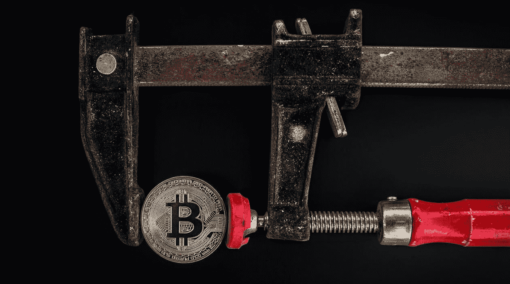
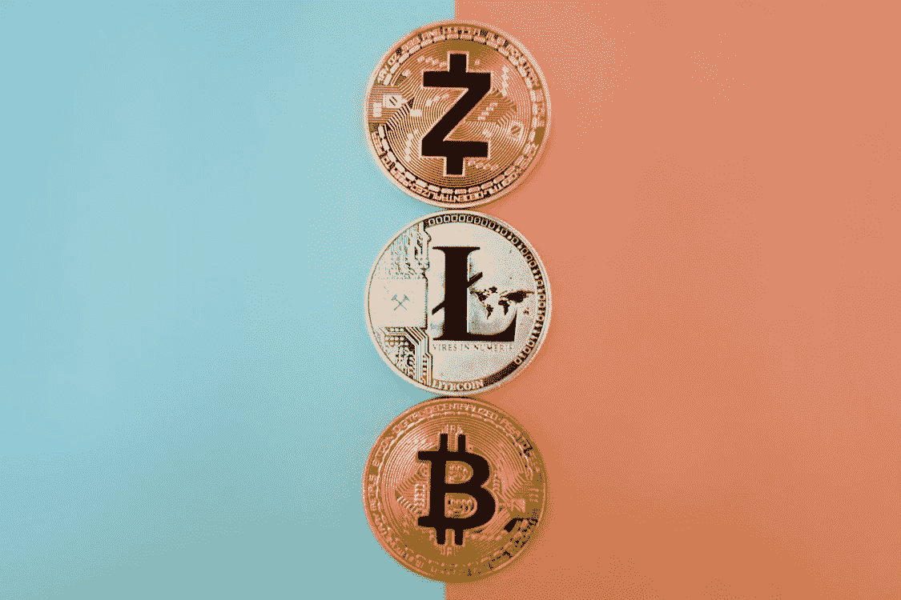

# 转换为加密

> 原文：<https://medium.datadriveninvestor.com/converting-to-crypto-78ec452cfbdd?source=collection_archive---------15----------------------->

我看到了曙光，Dogecoin 是一种入门药物

[Worldspectrum](https://www.pexels.com/@worldspectrum)

我叫贾斯汀，我相信索引。

我相信多元化投资组合中复利的力量，也相信我们的沃伦巴菲特勋爵。

研究具有良好收益和强劲基本面的股票将为未来几代人建立优秀的投资组合和储蓄。

*说到这里，我开始明白加密货币的功能和重要性了。*

# 介绍

关于加密货币的观点就像世界海滩上的沙粒一样多，多一颗又如何？

在我看来，密码、货币和投资证券之间有着明显的区别。密码可以像钱一样用来交换商品和服务。

密码也可以像投资工具一样交易和用于投机经济发展和价格波动。

[Marta Branco](https://www.pexels.com/@martabranco)

我不像外汇交易那样看待密码，因为没有另一方可以与之配对。比特币的价格与以太坊或美元的走势没有直接联系。

> 说实话，我曾经认为加密货币是一个懒惰的无政府主义者的骗局，但我已经意识到我的深刻罪孽。

# 转换

这一切都是从冰岛的雷克雅未克开始的，当时我看了网飞原创的比特币纪录片。这部纪录片让我对比特币产生了很大的焦虑，因为我不喜欢早期比特币运动的反建制心态，因为我认为他们只是在组建另一个建制，以顺应并最终自我击败。

[Vojtech Okenka](https://www.pexels.com/@vojtech-okenka-127162)

但中本聪的故事在我脑海中植入了一个 bug，快进几个互联网深潜，我对区块链技术非常感兴趣。

多亏了 Robinhood，我购买了我的第一枚比特币(和 Dogecoin ),我喜欢观察加密货币的价格走势和演变。

# 接下来呢？

虽然我开始看到加密货币的定性价值，但我还没有决定它在社会中的位置。

像罗宾汉和比特币基地这样的工具创造了一个可以买卖比特币的入口。一旦我们可以在全球范围内使用比特币进行苹果支付，那么我将开始宣扬加密这个词。