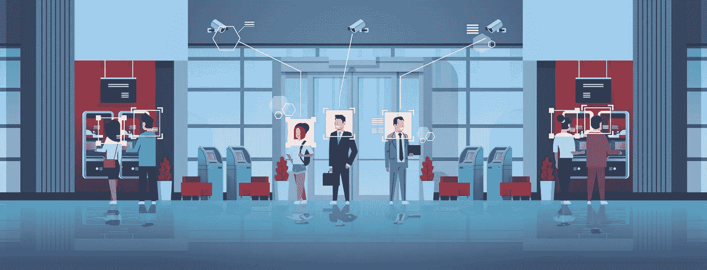

# 卷积神经网络

> 原文：<https://medium.datadriveninvestor.com/convolutional-neural-networks-cnns-17e56da5d288?source=collection_archive---------6----------------------->

## 近年来，神经网络已经覆盖了深度学习和机器学习，以及其他许多领域。神经网络模拟人脑如何解决复杂问题并在特定数据集中找到模式。

在机器学习中，卷积神经网络(CNN 或 ConvNet)是最常用于分析视觉图像的人工神经网络。这是来自图像深度学习算法的输入，该算法有效地对对象进行加权，并将一些图像与其他图像区分开来。该网络嵌入深度神经网络，例如图像和其他数据中的神经网络。

它已经存在了几十年，并且已经被证明在使用大型标记数据集(如图像、视频和其他数据)时非常强大。

CNN 是复杂的神经网络，能够识别数据中的复杂特征。它们被用于从视觉驱动的机器人到自动驾驶汽车的所有领域。它们还可以用于识别和分类图像和对象，例如人脸、动物、路标、场景中的对象以及其他对象。线圈网在图像识别中的有效性是深度学习的有效性震撼世界的主要原因之一。与通过输入数据的小方块学习的图像函数不同，线圈保留了像素之间的关系。图像分类器可以以无数种方式被有效地混淆，例如，对猫和狗进行分类，或者确定大脑图像是否包含肿瘤。

 [## 深度学习用 7 个步骤解释-更新|数据驱动的投资者

### 在深度学习的帮助下，自动驾驶汽车、Alexa、医学成像-小工具正在我们周围变得超级智能…

www.datadriveninvestor.com](https://www.datadriveninvestor.com/2019/01/23/deep-learning-explained-in-7-steps/) 

它们是一个有用且快速增长的领域的主要原因之一是它们对于广泛的应用是有用的，从语音识别和图像处理到自然语言处理，这是它们今天被使用的主要原因。

一个名为 AlexNet 的深度革命性架构被认为是计算机视觉领域最强大的论文之一，它推动了更多利用 CNN 和 GPU 分发的论文，以加快深度学习。

VGG16 也称为 OxfordNet，是一种革命性的神经网络架构，以开发它的视觉几何小组命名。它被用于赢得 2014 年的 ILSVR (ImageNet)比赛。它被认为是一个略微超过其他深度神经网络的优秀视觉模型。Keras 用于通过在 ImageNet 上训练 VGG 16 架构来可视化最大化输入的能力。

CNN 的特性在于它的过滤层，它至少包括一个折叠层。CNN 的输入(例如图像)通过一系列层被路由，以获得可以被分类的带标签的输出。

CNN 在图像分析中的应用从脸书的自动标记算法到更复杂的图像，前者非常适合手写数字等居中的图像，后者则适合人脸等更复杂的图像。为了训练，输入图像通过完全连接的层，并使用 Softmax 函数(将 K 个实数的向量作为输入，并将其归一化为由 K 个与输入数的指数成比例的概率组成的概率分布)来分类概率值在 0 和 1 之间的对象。基于这些值，它将对象分类为一个对象或同一类型的两个对象的组合(例如一辆汽车或一棵树)。

与其他深度学习系统相比，卷积神经网络使用最少的预处理，这意味着网络学习通常手工制作的过滤器——以及在其他系统中开发的过滤器。

CNN 提供了许多优于其他算法的优势，因为它们独立于人类工作。基于 CNN 的架构在计算机视觉领域已经变得无处不在并且如此受欢迎，以至于今天几乎没有人会在不开发这种方法的情况下开发商业应用程序或参与相关的竞争。

## **引用来源**

*   [https://builtin . com/data-science/卷积-神经网络-解释](https://builtin.com/data-science/convolutional-neural-networks-explained)
*   【https://www.doc.ic.ac.uk/~jce317/introduction-cnns.html 
*   [https://ujjwalkarn . me/2016/08/11/直观-解释-convnets/](https://ujjwalkarn.me/2016/08/11/intuitive-explanation-convnets/)
*   [https://hub . packtpub . com/what-a-convolutionary-neural-network-CNN-video/](https://hub.packtpub.com/what-is-a-convolutional-neural-network-cnn-video/)
*   [https://deepai . org/machine-learning-glossary-and-terms/convolutionary-neural-network](https://deepai.org/machine-learning-glossary-and-terms/convolutional-neural-network)
*   [https://blog . keras . io/how-convolutionary-neural-networks-see-the-world . html](https://blog.keras.io/how-convolutional-neural-networks-see-the-world.html)
*   [https://d2l . ai/chapter _ convolutionary-neural-networks/index . html](https://d2l.ai/chapter_convolutional-neural-networks/index.html)
*   [https://vinodsblog . com/2018/10/15/everything-you-neural-networks/](https://vinodsblog.com/2018/10/15/everything-you-need-to-know-about-convolutional-neural-networks/)
*   https://pathmind.com/wiki/convolutional-network
*   [https://heart beat . fritz . ai/a-初学者-卷积神经网络指南-cnn-cf26c5ee17ed](https://heartbeat.fritz.ai/a-beginners-guide-to-convolutional-neural-networks-cnn-cf26c5ee17ed)

**访问专家视图—** [**订阅 DDI 英特尔**](https://datadriveninvestor.com/ddi-intel)