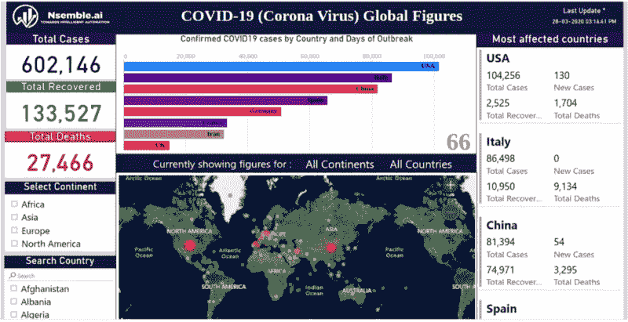

# 电晕病毒和无知的代价

> 原文：<https://medium.datadriveninvestor.com/corona-virus-and-the-cost-of-ignorance-f64c10e08c83?source=collection_archive---------12----------------------->

[https://nsemble.ai/coronalytics.html](https://nsemble.ai/coronalytics.html)

使用 Nsemble [仪表盘](https://nsemble.ai/coronalytics.html)了解 COVID19 全球数据的最新情况

**总结**

新型冠状病毒，导致新冠肺炎的病毒是一种攻击呼吸道的传染病，似乎比季节性流感有更高的死亡率。这种疾病涉及一种未知的威胁，很难检测，很难与其他危害较小的疾病区分开来。大多数感染新冠肺炎病毒的人会经历轻度至中度的呼吸道疾病，无需特殊治疗即可康复。老年人没有强大的免疫系统，所以他们更容易感染这种传染病。他们也更有可能患有心血管疾病、慢性呼吸/肺部疾病、糖尿病或肾脏疾病等疾病，这些疾病削弱了他们身体对抗传染病的能力，因此他们更有可能患严重疾病。

简而言之，我们以游戏结束的心情面对现实生活中的灭霸，所以这个星球上的每个人都需要成为一名复仇者，支持政府，保持清洁和卫生，使用数字工具来提高和传播对这种病毒的认识。最重要的是，我们必须通过 ***呆在家里&保持安全*** 来避免社区传播。

**错误**

1.  在中国的某个地方，一只蝙蝠掠过天空，在它的粪便中留下了冠状病毒的痕迹，这些粪便落到了森林的地面上。一只野生动物，可能是一只在树叶间嗅着昆虫的穿山甲，从粪便中感染了病菌。
2.  这种新型病毒在野生动物中传播。最终，一只被感染的动物被捕获，一个人不知何故染上了这种疾病，然后将它传染给野生动物市场的工作人员。一场全球性的爆发就此诞生。
3.  处于冠状病毒爆发中心的中国城市武汉市市长承认，他对危机的处理受到了批评，并承认信息发布不够迅速。
4.  周先旺戴着口罩进行保护，他告诉中国国家电视台中央电视台:“我们没有及时披露信息，也没有利用有效信息来改进我们的工作。”

**悲剧**

1.  第一例确诊死亡于 2020 年 1 月 9 日在武汉发生。
2.  中国以外的首例死亡于 2 月 1 日发生在菲律宾
3.  亚洲以外的首例死亡于 2 月 14 日发生在法国。
4.  截至 2 月 28 日，伊朗、韩国和意大利各有十几人死亡。
5.  截至 3 月 13 日，除南极洲外，各大洲有 40 多个国家和地区报告了死亡病例。
6.  除了新冠肺炎冠状病毒疫情给人类带来的悲惨后果，它引发的经济不确定性可能会在 2020 年给全球经济造成 1 万亿美元的损失。

# COVIDIOTS:在 COVID19 疫情期间“忽视公共健康或安全警告的人”

我们都能成为勇敢的战士。为此:-

1.  我们应该与政府合作来控制传染病。
2.  我们必须避免在户外寒冷，在餐馆聚会和大规模人群聚集。
3.  我们应该与当地警察合作，因为他们是我们真正的英雄。
4.  我们不能重复在意大利、西班牙和美国犯的错误。
5.  我们必须保持清洁，经常洗手。
6.  别傻了。

中国用铁腕手段拉平了这条曲线，但是现在我们可以向世界展示民主也可以更有效地拉平这条曲线。

愿上帝拯救一切！！！！

总之，正如《错误不能归咎于野生动物》中所说的，信息共享中的疏忽是罪魁祸首。所以，让我们保持警惕，战胜这种威胁。

保持更新，以避免其他国家所犯的错误。

使用社交媒体与受灾地区的朋友和家人保持联系。

随时更新统计数据，并检查病毒在受影响国家的发展情况。您可以使用此[链接](https://nsemble.ai/coronalytics.html)查看新冠肺炎的各种更新。这个交互式[仪表盘](https://nsemble.ai/coronalytics.html)显示了全球范围内与日冕危机相关的重要数字。您也可以将鼠标悬停在国家/地区上查看更多详细信息。

 [## 在医疗保健中使用人工智能的伦理|数据驱动的投资者

### 人工智能(AI)正被应用于任何管理大量数据的行业，在一个…

www.datadriveninvestor.com](https://www.datadriveninvestor.com/2020/03/21/the-ethics-of-using-ai-in-healthcare/) 

PS:在笔记本电脑或 PC 中打开链接，获得最佳体验。如果你使用手机，别忘了切换到横向模式。

**参考文献:**

1.[https://en . Wikipedia . org/wiki/2019% E2 % 80% 9320 _ 冠状病毒 _ 疫情](https://en.wikipedia.org/wiki/2019%E2%80%9320_coronavirus_pandemic)

2.[https://www . the guardian . com/world/2020/mar/17/trump-calls-新冠肺炎-中国-病毒-冠状病毒-北京-升级](https://www.theguardian.com/world/2020/mar/17/trump-calls-covid-19-the-chinese-virus-as-rift-with-coronavirus-beijing-escalates)

3.[https://www . weforum . org/agenda/2020/03/冠状病毒-新冠肺炎-成本-经济-2020-联合国-贸易-经济-疫情/](https://www.weforum.org/agenda/2020/03/coronavirus-covid-19-cost-economy-2020-un-trade-economics-pandemic/)

4.[https://www . the guardian . com/science/2020/Jan/27/China-coronavirus-who-to-hold-special-meeting-in-Beijing-as-death-toll-jumps](https://www.theguardian.com/science/2020/jan/27/china-coronavirus-who-to-hold-special-meeting-in-beijing-as-death-toll-jumps)

# 呆在家里保持安全

**关于 Nsemble.ai**

我们是一家在分析和深度学习领域工作的初创公司。我们帮助企业收集、处理数据，并利用人工智能将数据转化为有价值的技术。我们的专业知识扩展到人工智能技术的 wise 范围，包括数据分析、机器学习、深度学习、自然语言处理、计算机视觉和 nore。

请不吝分享你的疑惑或建议。我们在 [Nsemble.ai](https://nsemble.ai/) ，喜欢利用人工智能来研发具有挑战性的产品。Nsemble.ai 在工业 4.0 和电子商务领域开发了多个解决方案。更多详情请访问官方[网站](https://nsemble.ai/)。

**谢谢！！！**