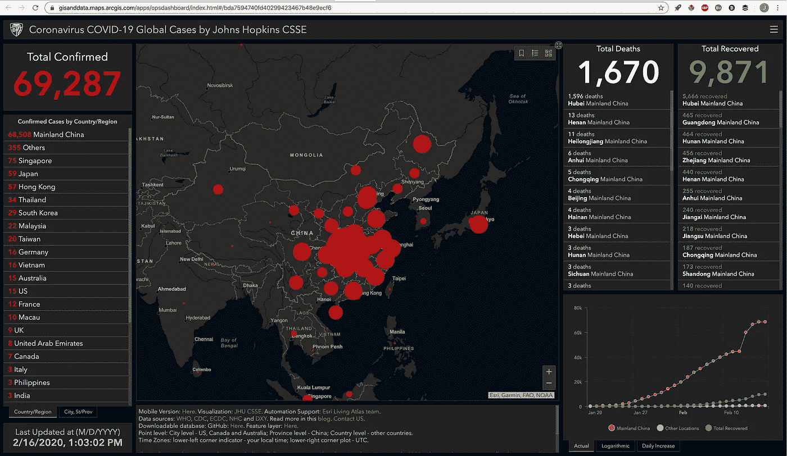
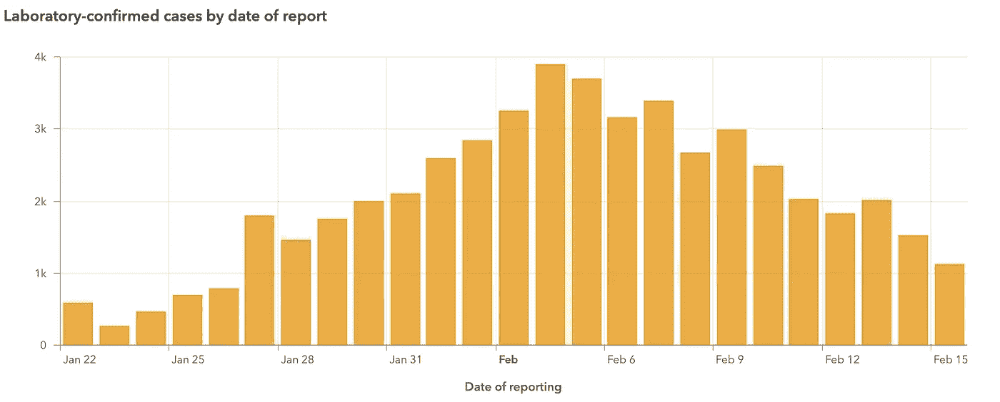
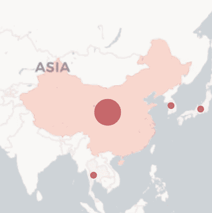
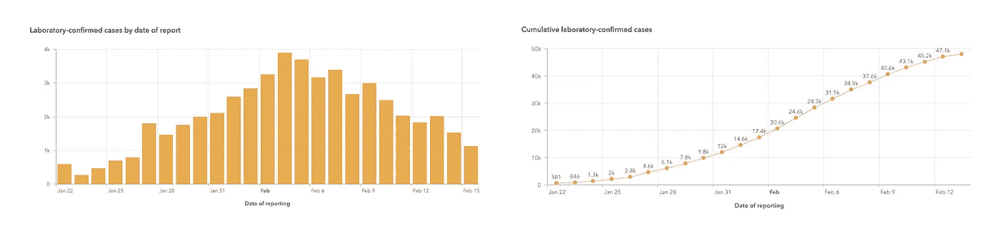

# CoronaGeddon 2019:为什么你看到的每张疫情地图都是错的

> 原文：<https://medium.datadriveninvestor.com/coronageddon-2019-why-every-map-youve-seen-of-the-outbreak-is-wrong-3d8215fb74a1?source=collection_archive---------15----------------------->

一周前，[我讨论了始于中国武汉的冠状病毒爆发](https://www.futurehealth.live/blog/2020/2/10/coronavirus-dataviz-sucks)的数据可视化。我指出了对地图的不幸的过度依赖，指出了以地图为中心的[约翰霍普金斯 CSES 冠状病毒仪表板](https://gisanddata.maps.arcgis.com/apps/opsdashboard/index.html#/bda7594740fd40299423467b48e9ecf6)(下图)的几个缺陷。

在进一步的调查中，我发现我们在霍普金斯网站、纽约时报、世卫组织和许多其他地方看到的地图中的缺陷比我起初理解的要糟糕得多。

我看到的每张地图都掩盖了疫情的发展，而不是提供信息。不只是一张地图，而是所有的。让我来解释一下。

# Epi 曲线显示了随时间的变化；大多数地图显示“现在”

正如我上周指出的那样，跟踪随时间变化的最佳方法是一个简单的旧柱形图:一个显示每天病例数的“epi 曲线”(最好是症状出现后每天的病例数)，就像[世卫组织仪表盘](https://who.maps.arcgis.com/apps/opsdashboard/index.html#/c88e37cfc43b4ed3baf977d77e4a0667)上的这个。

你会立即注意到一些重要的事情:确诊病例在大约两周前的 2 月 4 日达到高峰。这在看霍普金斯地图时是完全看不到的。

这是因为霍普金斯地图只显示“现在”的数据，而不是每天的进展数据。如果你只能看到电影的一帧，你就不能很好地理解情节，是吗？

**这就是“慢性问题”**

霍普金斯地图也有其他问题，包括一个双曲线的配色方案，看起来像是从一个名为“CoronaGeddon 2019”的视频游戏中截取的，以及一个覆盖全国 30%的巨大红色圆圈的规模选择——所有这些都表明疫情比实际情况更广泛(而实际上中国只有 0.002%的人患有冠状病毒)。

但是让我们关注一下慢性问题。

# 动画地图能让事情变得更好吗？

正如我上周解释的那样，总体而言，我并不反对地图，一幅好的地图显然可以强调疾病爆发时的地理因素。然而，慢性问题是一个症结，所以要真正“跟踪爆发”，你需要一个现代地图，让你可以跟踪随着时间的变化。

从理论上讲，这些动画地图可以让你像浏览 epi 曲线一样跟踪进度。谁知道呢，也许加入地理因素会让它们比普通的老式柱形图 epi 曲线更好。

 [## 医疗保健的未来正在被一场大型技术入侵所塑造|数据驱动型投资者

### 过去十年，全球经济的所有部门都经历了大规模的数字颠覆，而卫生部门现在…

www.datadriveninvestor.com](https://www.datadriveninvestor.com/2018/11/02/the-future-of-healthcare-is-being-shaped-by-a-big-tech-invasion/) 

我设法在网上找到了一些，从 [MapBox](https://www.mapbox.cn/coronavirusmap/?%2F=blog&utm_campaign=blog%7Cmapbox-blog%7Ccoronavirus-map%7Cvisualizing-the-progression-of-the-2019-ncov-outbreak-66763eb59e79-20-02&utm_content=visualizing-the-progression-of-the-2019-ncov-outbreak-66763eb59e79&utm_source=mapbox-blog&utm_term=coronavirus-map#3.35/28.47/109.74) (一个地图制作软件专家)，从[伦敦卫生和热带医学院](https://vac-lshtm.shinyapps.io/ncov_tracker/)(一所受人尊敬的公共卫生和热带医学院)，以及从 [HealthMap](https://www.healthmap.org/ncov2019/) (一个由哈佛和波士顿儿童组成的著名地图绘制机构)。以下是显示 1 月 20 日至 2 月 15 日数据的动画 gif:

通过伦敦卫生和热带医学院

通过地图框

经由健康地图/哈佛

除了 MapBox 地图糟糕的配色方案(甚至比霍普金斯还糟糕)，你注意到所有这些地图的共同点了吗？慢慢来，从头到尾观察其中的任何一个，直到它循环回到开始。

**没看出来？这些地图中的每一张都显示疫情一直在恶化——尽管它们绘制的是与上面 epi 曲线中显示的相同的世卫组织数据。**

epi 曲线显示，近两周以来，每日新增病例一直在下降，但这三张图都没有显示这一点。他们显示一切，总是，变得更糟。伦敦学校和 HealthMapper 地图上的每个圆圈总是变大，MapBox 地图上的每种颜色总是变热。

到底发生了什么事？

# 所有的动画贴图都映射了错误的变量

在本文的开头，我展示了来自[世卫组织仪表盘](https://who.maps.arcgis.com/apps/opsdashboard/index.html#/c88e37cfc43b4ed3baf977d77e4a0667)的 epi 曲线:每日新增病例的图表。但是在世卫组织的仪表盘上还有另一个图表:每日新增病例的累积图。让我们一起来看看这两者:

**这两个图表显示完全相同的数据**，但是累积图表不断将新案例添加到旧案例总数中，因此它不会下降。

任何只看累积图的人都会认为情况每天都在变得更糟(更糟)，并可能完全忽略实验室确认病例近两周的下降(阅读本文的统计人员会意识到，新病例的下降反映在累积图的斜率变平)。

因此，所有这些动画图表都是在绘制永不减少的累积数字——导致任何理性的观众都认为我们注定要失败——而不是非累积的 epi 曲线数字。

# 非动画地图也是如此

经过反复检查，我意识到所有的非动画地图都有同样的问题:从世卫组织到纽约时报，所有的“追踪疫情”地图都只是累计追踪疫情。这些地图看起来总是一天比一天差，而且会一直差下去，直到不再有新的病例出现。可能要几个月。

我将与这些组织中的每一个联系，看看他们是否可以开始使用非累积号码。我们会看到结果如何。如果他们改变它们，动画地图实际上会成为观察疾病爆发进程的有用方式。

与此同时，停下来想一想，不断恶化的地图引发了多少不必要的警报。

**重要提示:**随着 SARS(一种相关病毒)的流行，中国的最初高峰后来被全球高峰超过——可能是因为世界上可能被感染的人数比中国多得多。虽然我们没有迹象表明新冠肺炎会出现这种情况，但这当然是有可能的。通过指出迄今为止病例的减少，我并不是说“一切都结束了”——但我知道，如果它在中国以外的地区再次达到顶峰，我们需要使用正确的可视化方法来做出适当的回应。

# 更新——2 月 19 日—[伦敦卫生和热带医学院](https://vac-lshtm.shinyapps.io/ncov_tracker/)悄悄地改变了它的动画地图，显示每日病例数，而不是累计数。这意味着随着疫情的好转，地图上的圆圈会变小。一大进步。