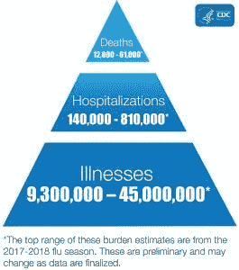
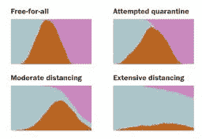

# 冠状病毒；惊慌失措；字里行间的 z

> 原文：<https://medium.datadriveninvestor.com/coronavirus-a-to-panic-z-between-the-lines-bd770208de59?source=collection_archive---------10----------------------->

COVID-19

# 全球流行病频发年表

围绕冠状病毒的话题；更准确地说，新冠肺炎几乎占据了整个新闻预报的头条——不仅在美国国内，而且在国外。该病毒已成为本世纪全球最大的恶魔，德国总理安格拉·默克尔称之为德国自二战以来面临的最重大问题。无论当前的看法是更强大的媒体、对千禧一代越来越高的期望、错误信息还是以上所有因素的结果，新冠肺炎正在对抗人类的前线取得进展。这种微小的有机体不仅作为传染媒介取得了胜利，而且还接管了整个经济、人民的主权、甚至理智。冠状病毒已经成为生物战的一部分，被用来攻击个人自由。

大规模毁灭性武器不再像传统那样通过直接诱发发病率和死亡率而被抛弃。作为一种替代，它也被用来制造恐慌，从而通过合理化他们对政府和公司的完全依赖来消除个人对自己权利的控制。在 48 小时内使用数千个 N95 口罩，过去最多使用几十个或几百个，这就是上述症状。或者在实施社会距离和家庭隔离的过程中为商店里的最后一卷卫生纸而争吵，这是一种可怕的症状，叫做“恐慌”。

人类经历了战争、无情的流行病和远比我们所目睹的更加残酷的自然灾害，这些灾难对新冠肺炎来说是臭名昭著的。但很可能我们所面临的是不成比例的。将传染性流行病甚至大流行病武器化不仅是错误的，而且是对公民尊严的侮辱。

为了阐述我的想法，在这次讨论的背景下，我想吸引每一位细心的读者对四种已知病毒感染进行比较研究。相应地，我想把它们的流行和模式与它们按时间顺序的进化进行面对面的比较。

# 流行病

流行病是指传染病在短时间内在人群中迅速传播的状态。疫情是一种跨越地理边界的疾病的全球爆发。我们见证了历史上各种各样的“大流行”，包括最近我们正在经历的，世界卫生组织(世卫组织)于 2020 年 3 月 12 日宣布的新冠肺炎疫情。

流行病通常会像流行病一样突然爆发。例如，2014 年寨卡病毒爆发始于巴西，以疫情的形式蔓延至加勒比海和拉丁美洲。或者像 2014-2016 年西非埃博拉疫情一样。自 2017 年以来，美国经历了一段时间的阿片类药物流行。同样，新冠肺炎最初在中国武汉流行，后来蔓延到世界各地，成为疫情。

流行病并不总是会转变成大流行，或者即使会，也不一定会是快速或精确的转变。例如，在 20 世纪末成为疫情之前，艾滋病毒曾在西非流行了几十年。

# 回顾一些最近的重大流行病

大多数病毒大流行是由流行性感冒(普通流感)病毒引发的。流感病毒可以通过季节变化或变异引发活力。虽然科学和技术足够先进，可以预测病毒结构将如何转变，但偶尔会出现同一种流感病毒的新毒株，这一过程称为抗原转移和漂移。因此，流感病毒的表现并不出人意料。后者是疫情最有可能发生的时候，因为大多数人通常对这种新病毒缺乏免疫力。

1968 年的疫情流感导致全球超过 100 万人死亡(占世界人口的 0.03%)。它是由东南亚出现的一种独特的 H3N2 病毒株引起的。再说一次，大众疫情因疫情消息的来源而获得声誉，这并不一定是因为感染是从哪里开始的。1918 年的西班牙流感就是这种抗原性转变的一个例子。西班牙流感有 1%到 3%的死亡率。然而，尽管它的名字很突出，这种病毒并不是起源于西班牙。后者感染了约三分之一的世界人口，造成 2000 万至 5000 万人死亡。该国是第一个报道疫情的国家；这就是为什么公众开始称之为西班牙流感。然而，西班牙人认为它起源于法国，因此称之为“法国流感”同样，我们看到中国病毒对新冠肺炎的使用。

根据曾发表在《传染病杂志》上的一项研究，另一种甲型流感病毒(H2N2)毒株导致了 1957-1958 年的疫情。后来被称为在东亚出现的亚洲流感。该病毒也导致全球约 110 万人死亡，死亡率为 0.019%。

最近一次 H1N1 猪流感疫情发生在 2009-2010 年流感季节。它是由导致西班牙流感的同一种病毒的新毒株引起的；H1N1 病毒。猪流感似乎已经感染了 7 亿到 14 亿人，与它的西班牙流感表亲相比，在绝对数字上占了更多。不过，根据《柳叶刀》(the journal of The Lancet)上发表的一篇分析文章，猪流感的死亡率仍然低得多，为 0.01%至 0.08%。

季节性流感是全球流行的一种年度疾病。尽管流感疫苗是有用的，但是死于流感相关疾病的情况仍然存在。季节性流感一直是全球每年死亡的重要原因。

# 历史上其他著名的流行病包括:

*   黑死病是指 1346 年至 1353 年间全球爆发的淋巴腺鼠疫。在 14 世纪中叶，由鼠疫杆菌引起的疾病导致了大约 30%和 60%的欧洲人死亡。
*   1817 年的疫情霍乱源于俄国，在那里有 100 万人死亡。这种细菌被传染给了英国士兵，他们最终把它带到了印度和世界其他地方。
*   1889 年的俄罗斯流感是疫情的第一次重大流感。人们认为它开始于西伯利亚和哈萨克斯坦，然后向西到达欧洲，穿过大西洋到达北美和非洲。杀死了超过 36 万人。

# 冠状病毒大流行

截至 2020 年 3 月 11 日，在世界卫生组织宣布新冠肺炎为“疫情”后，114 个国家报告有 118，000 人感染了新冠肺炎病毒，导致近 4，300 人死亡。在美国，确诊病例刚刚超过 1000 例，已有 29 人死亡，这个数字还在上升。

# 是什么让冠状病毒不同于其他一些感染

世卫组织新冠肺炎的官员与众不同，具有独特的特点。[组织的总干事 Tedros Adhanom Ghebreyesus](https://www.statnews.com/2020/03/03/who-coronavirus-different-than-influenza-can-be-contained/) 在一次采访中表示，“我们甚至没有谈论对季节性流感的控制——这是不可能的。”

“但对新冠肺炎来说是可能的。谭德塞接着进一步补充道，“我们不会追踪季节性流感的接触者——但各国应该为新冠肺炎追踪接触者，因为这将预防感染并拯救生命。遏制是可能的。"

谭德塞认为——发现一种仅仅能够在社区传播的呼吸道病原体并不常见，而且可以通过正确的措施加以控制。根据他的说法，如果当前的冠状病毒大流行是由流感引起的，我们应该预计到现在为止会在全球范围内广泛传播，而减缓或遏制它的努力将是不可行的。

世卫组织应急项目负责人迈克·瑞安说，人们应该努力保护自己免受流感病毒的侵袭。但在社会和全球层面，“我们不一定试图遏制或阻止它们，因为我们从根本上相信它们会有增无减。”

全球爆发的冠状病毒病例超过 9 万例，死亡人数超过 3100 人，这也使其被与流感相提并论。

感染了流感但尚未表现出症状的人推动了病毒的大量传播。世卫组织官员声称，根据中国疫情的数据，只有极小一部分感染者没有表现出症状，而且他们似乎不是许多传播的原因。

一般来说，新冠肺炎病毒似乎比季节性流感病毒引起的疾病更严重，部分原因是人们对这种新型病毒没有免疫保护。谭德塞说，流感感染通常会杀死“不到 1%的感染者”，但截至目前，约 3.4%的新冠肺炎病例是致命的。

# 麻疹、流感、埃博拉和冠状病毒的简单比较

# 类型

麻疹病毒是单链的，属麻疹病毒科；副粘病毒科。它是一种传染性很强的有机体，通过咳嗽和打喷嚏传播，并通过分泌物密切个人互动。麻疹是记录在案的传染性最强的病毒。它可以在那个空域或附近的表面存活长达两个小时。麻疹传染率 90%给附近的非免疫人群。

流感病毒是 RNA 病毒，构成正粘病毒科七个属中的四个。(流感病毒 A、流感病毒 B、流感病毒 C、流感病毒 D)后一种病毒株仅与人类副流感病毒有远亲关系，副流感病毒是儿童呼吸道感染如哮喘病的常见原因。

2016 年发现的第四个流感病毒家族称为 d 型流感。

甲型流感病毒需要密切关注，野生水鸟是其自然宿主。偶尔，病毒会传播给其他物种，在家禽中造成毁灭性的流行病和大流行，或引起人类疫情。根据对这些病毒的抗体反应，甲型流感病毒可以进一步分裂成各种血清型。血清型谱；已经在人类身上得到证实的是:H1N1(1918 年的西班牙流感和 2009 年的猪流感)、H2 N2(1957 年的亚洲流感)、H3 N2(1968 年的香港流感)、H5 n1(2004 年的禽流感)、H7N7(不寻常的人畜共患病潜力)、H1N2(在人类、猪和鸟类中流行)、H9N2、H7N2、H7N3、H10N7、h7n 9(2018 年被评为在 A 型亚型中具有最显著的疫情潜力)、H6N1(仅感染一人

埃博拉病毒包括单链、非传染性 RNA 基因组。它的基因组包含 7 个基因，包括 3′-UTR-NP-VP35-VP40-GP-VP30-VP24-L-5′-UTR。五种不同的埃博拉病毒的基因组是 BDBV、EBOV、RESTV、SUDV 和 TAFV。后面提到的是不同的序列，基因的数量和位置重叠。

冠状病毒是具有球根状表面突起的大型多形性球形颗粒。病毒颗粒的直径约为 120 纳米。在电子显微照片中，病毒的包膜表现为一对明显的电子致密壳。

# 并发症

麻疹可能会很严重，并伴有常见的并发症，如耳部感染和腹泻。严重的并发症包括肺炎和脑炎。每 10 名患麻疹的儿童中就有一名受到耳部感染的影响，并可能导致永久性听力丧失。有些人有患严重并发症的风险，如肺炎和脑炎(脑部感染)。

季节性流感每年影响大约 8%的美国人，其中许多人可以通过充足的休息和液体来对抗流感症状。然而，某些高危人群可能会出现危险甚至危及生命的并发症，如肺炎和严重急性呼吸综合征(SARS)。

埃博拉是一种严重的疾病，也是迄今为止本文描述的所有流行病中最严重的一种。埃博拉病毒感染初期的症状和体征很微妙，没有特异性，因此很难诊断。有一个特殊的先决条件，临床怀疑疾病，以促进诊断，治疗工作和隔离。出于这个原因，在这种情况下考虑埃博拉是当务之急。然而，管理以支持性护理和感染控制为中心，因为没有已知的有效治疗方案。男性幸存者的性传播可能会持续长达 12 个月。

尽管围绕冠状病毒的全球宣传铺天盖地，但大流行的并发症与流感相似。后者通常包括肺炎或 SARS、多器官衰竭和死亡。

# 传播方式

麻疹是一种高度传染性的生物体，因为它广泛存在于受影响个体的呼吸道中。它有通过咳嗽和打喷嚏传播给他人的倾向。麻疹病毒可以在空气中存活两个小时。其他人很容易通过呼吸被污染的空气或触摸被感染的表面，然后触摸他们的眼睛、鼻子或嘴巴而感染。麻疹病毒的传播率高达 90%。感染者可以在发病前 4 天至发病后 4 天内将麻疹传播给他人。

携带流感病毒的人有将病毒传播给 6 英尺以外的人的倾向。许多学者认为流感病毒主要通过飞沫传播。在少数情况下，一个人可能会通过触摸表面或带有流感病毒的东西，然后触摸自己的嘴、鼻子，或者可能是眼睛而感染流感。

许多学者认为，人们最初是通过接触受感染的动物(如果蝠)感染埃博拉病毒的，这种现象也被称为溢出事件。之后，病毒在人与人之间传播，可以想象会影响大量的人。

EBOLA

埃博拉病毒通常似乎通过直接接触传播，例如通过破损的皮肤或粘膜与患者的血液或体液接触，或者死于埃博拉病毒疾病(EVD)。

它似乎也通过被污染的物体传播，如衣服、被褥、针头和医疗设备。其他潜在的传播途径是接触受感染的果蝠、猿和猴子。即使一名男子从 EVD 康复后，埃博拉病毒仍有可能通过精液传播的性传播途径传播。然而，通过性行为或其他方式接触患有埃博拉病毒的女性的阴道液来传播埃博拉病毒是有争议的。

此外，还不知道埃博拉病毒会通过食物传播。然而，在世界的某些地区，埃博拉病毒可能通过处理和摄入感染埃博拉病毒的野生动物肉而传播。通过蚊虫叮咬或其他昆虫传播是有争议的

新冠肺炎病毒在人与人之间传播，即在彼此密切接触的人之间，即在大约 6 英尺之内。受感染者的呼吸道飞沫可以在空气中传播。最具传染性的人是在他们症状最严重或病情最严重的时候。但是在人们出现症状之前，一些传播是可能的。一个人确实可以通过触摸被污染的表面或物体，然后触摸自己的嘴、鼻子，或者可能是眼睛来感染新冠肺炎病毒。虽然每种病毒都是不同的，但导致新冠肺炎病的病毒似乎在一些社区快速持续传播，但不是在世界各地。

# 毒性

麻疹病毒感染会导致短暂而[强烈的免疫抑制](https://www.ncbi.nlm.nih.gov/pmc/articles/PMC4997572/)，从而增加机会性感染的易感性，并增加青年死亡率。病毒在淋巴组织中有效复制。另一方面，流感毒力仅仅由影响病毒与其宿主结合偏好的一系列不同的氨基酸取代决定。不同的毒力因子也决定了它们的菌株；透明质酸，聚合酶蛋白质类，PB1-F2，PA-X，NS1，钠。埃博拉病毒(EBOV)作为丝状病毒科病毒的一员，在没有批准的治疗方法的情况下，在暴发期间引起严重的出血热。埃博拉多功能 [EBOV VP35 蛋白通过拮抗抗病毒信号通路促进免疫逃避](https://www.ncbi.nlm.nih.gov/pmc/articles/PMC3061251/)。

虽然对新冠肺炎的毒力机制知之甚少；然而，关于严重急性呼吸综合征(SARS)相关冠状病毒引起急性肺损伤的机制，目前似乎仍有学者在进行研究。至少在某种程度上，一些假说是由干扰宿主对病毒性肺损伤反应的因子的表达而建立的。这一理论是基于我们的综合观察，即对于肺功能至关重要的表面活性蛋白-B 和-C 的表达在 SARS 患者的肺中减少。此外，冠状病毒似乎抑制病毒和干扰素依赖的信号。新冠肺炎的非结构蛋白在分离时再现了在感染细胞中观察到的抑制作用，并且还抑制了肺泡修复所需的细胞增殖。

# 实验室测试

麻疹感染的病毒检测方法包括在合适的细胞系中培养病毒的标准方法和技术，例如检测麻疹病毒 RNA 的实时 RT-PCR 或 RT-PCR。

麻疹检测捕获 IgM EIA(非定量),其包含重组麻疹核衣壳蛋白。商业的间接 EIA(非定量)分析也用于检测 IgG。

流感诊断试验旨在分子分析(包括快速分子分析、逆转录-聚合酶链反应(RT-PCR)呼吸道标本和其他核酸扩增试验)中发现流感病毒。还提供抗原检测评估，包括快速流感诊断测试和免疫荧光分析。

对埃博拉病毒来说，实验室检测流程和指南极其复杂。[疾控中心关于埃博拉病毒检测的建议](https://www.cdc.gov/vhf/ebola/laboratory-personnel/safe-specimen-management.html#clinical-laboratory-testing)仅适用于符合检测指南且具有兼容临床症状的人员。因此，要求临床实验室做好准备，提供足够的测试，以确保在患者接受评估时，患者护理不受影响。临床医生应根据患者的临床表现和旅行史确定具体的测量方法。

对于新冠肺炎的初始[诊断，CDC 建议](https://www.cdc.gov/coronavirus/2019-ncov/hcp/clinical-criteria.html)采集并检测上呼吸道鼻咽拭子(NP)。痰液的收集也可以从有分泌性咳嗽的受试者处获得。CDC 不建议诱导痰来收集样本，除非下呼吸道标本可用。因此，无论症状何时出现，都要立即从高风险患者身上采集标本。在标本采集期间保持适当的感染控制是强制性的。新冠肺炎诊断检测，由食品药品监督管理局根据紧急使用授权(EUA)授权，正在临床实验室提供。

# 疫苗接种

麻疹疫苗是安全有效的。两剂 MMR 疫苗预防麻疹的有效性约为 97%;一次治疗有效率约为 93%。

CDC 建议在流感季节使用流感疫苗，包括灭活流感疫苗、重组流感疫苗[RIV]或减毒活疫苗(LAIV)。大规模生产的流感疫苗有两个分组。三价(三组分)和四价(四组分)流感疫苗可供接种。一种由佐剂制成的三价流感疫苗(Fluad)，许可 65 岁及以下人群使用。一种高剂量流感疫苗(Fluzone 高剂量)，许可用于 65 岁以上人群。四价流感疫苗包括标准剂量的四价流感疫苗，使用鸡蛋中生长的病毒制造。其中包括四价氟脲嘧啶、四价氟脲嘧啶、四价氟拉伐和四价氟脲嘧啶。不同年龄组的人可以注射不同的流感疫苗。

VACCINATION

经过漫长的斗争，以帮助找到埃博拉病毒的疫苗解决方案，第一个 [FDA 最近才在 2019 年 12 月批准了预防埃博拉病毒](https://www.fda.gov/news-events/press-announcements/first-fda-approved-vaccine-prevention-ebola-virus-disease-marking-critical-milestone-public-health)的疫苗。推迟的理由是没有机会通过细致的测试对试验疫苗进行测试。同样，他们声称他们[很难](https://www.datadriveninvestor.com/glossary/difficulty/)获得惠氏制药公司的批准，使用其平台生产埃博拉疫苗。唯一引起关注的是一家小公司生物保护系统公司(BioProtection Systems Corp ),似乎开发埃博拉疫苗的考虑与疾病本身或平台没有多大关系。相反，该公司只是在寻找方法[改善其投资组合](https://www.statnews.com/2020/01/07/inside-story-scientists-produced-world-first-ebola-vaccine/)。"

目前，市场上没有冠状病毒疫苗，然而许多国家都在争先恐后地进行早期临床试验。甚至 FDA 也取消了某些限制来促进疫苗的开发。

# 发病率

在具有免疫功能的人群中，每 100，000 个病例中的大约数字被确定为 200 例死亡、100 例脑炎、100 例亚急性硬化性全脑炎和 12 例麻疹后免疫遗忘。

MORBIDITY Photo adapted from [https://www.cdc.gov/flu/about/burden/index.html](https://www.cdc.gov/flu/about/burden/index.html)

美国流感疾病的负担波动很大，由几个因素决定。最新的要看流通病毒的特性，季节，疫苗的有效性，接种人数。虽然影响不同，但流感每年都会给人们的健康带来巨大负担。据预测，自 2010 年以来，流感每年导致 900 万至 4500 万人患病，14 万至 81 万人住院，12，000 至 61，000 人死亡。

埃博拉病毒病(EVD)，也称为埃博拉出血热，是一种严重的，经常致命的人类疾病。到目前为止，冠状病毒因[表现出一系列的发病率](https://www.cdc.gov/mmwr/volumes/69/wr/mm6912e2.htm)而臭名昭著，住院患者的比例给人的印象是随着年龄的增长而平行增长，在≤19 岁的人群中为 2%–3%，在≥85 岁的成年人中为≥31%。在已知住院的 12%患者中，9%年龄≥85 岁，36%年龄为 65-84 岁，17%年龄为 55-64 岁，18%年龄为 45-54 岁，20%年龄为 20-44 岁。不到 1%的住院患者年龄≤19 岁。

# 死亡率

在 1963 年引入麻疹疫苗之前，大约每 2-3 年就有一次大流行。麻疹爆发每年导致约 260 万人死亡，2018 年超过 14 万人死于麻疹。疾病预防控制中心估计，美国每年有 3000 到 49000 人死于流感。据说，2017-2018 流感季节在美国经历了前所未有的高死亡人数，估计为 79，000 人。世界卫生组织可信来源估计，全球每年有 290，000 至 650，000 人死于与流感相关的并发症。

埃博拉死亡率从 25%到 90%不等，但根据 2014 年西非的疫情，大多数治疗中心的平均死亡率约为 50%。即使是幸存者也经常会有长期而严重的残疾。

截至[2020 年 3 月 20 日](https://www.worldometers.info/coronavirus/)，全球冠状病毒病例总数估计为 272063 例。其中有 11300 人死亡；90，618 次回收。尽管死亡率似乎在国家和地区之间有所波动，但是，世卫组织估计(截至 2020 年 3 月 3 日)死亡率约为 3.4%。

# 社会认知

根据[的一项调查，只有 30.2%的父母和 12.8%的成年人认为麻疹在发病前可能是“严重的”。在另一项研究中，超过 88%的受访者报告曾被鼓励接受流感免疫接种，尽管只有 43.0%的人报告实际接受了接种。在没有接种疫苗的学生中，49.4%的人认为疫苗可能会让他们感染流感，30.4%的人认为可能会有危险的副作用，28.9%的人认为他们没有感染流感的风险。](https://www.ncbi.nlm.nih.gov/pmc/articles/PMC5396226/)

根据[福克斯新闻频道民意调查，](https://ropercenter.cornell.edu/public-and-ebola-what-polls-say) 31%的人非常担心埃博拉病毒大流行，37%的人有点担心埃博拉病毒会从西非蔓延到美国。就在一个月前，哈佛大学公共卫生学院的一项民意调查发现，只有 19%的学生感到非常不安。18%的人有点担心埃博拉在美国大规模爆发。当时，公众也不是很担心自己的个人风险。

# 媒体和宣传

近几十年来，美国麻疹病例激增。麻疹病例的最后一次上升与麻疹、抗 vaxxers 和互联网上医疗错误信息的传播有关。

[《外交政策》杂志曾声明](https://www.foreignpolicyjournal.com/2018/06/19/how-the-cdc-uses-fear-marketing-to-increase-demand-for-flu-vaccines/)；疾病预防控制中心维持其建议:六个月以上的人口必须每年注射一次流感疫苗，因为这是科学强烈建议的。尽管如此，主流媒体一致通过误导公众关于科学定位的信息来描述疾病预防控制中心的立场。这篇文章指出了疾病预防控制中心如何利用“恐惧营销”来增加对流感疫苗的需求。与此同时,《纽约时报》的一篇文章试图说服读者遵循 CDC 的建议，发表了 Cochrane 协作组织的评论，以支持其对流感疫苗的有效和安全的描述。《泰晤士报》同样说:科学显示了类似的支持。

相反，据《外交政策杂志》报道，科克伦研究人员确实得出的结论恰恰相反。它给人的印象是不鼓励在健康成人中使用流感疫苗作为常规的公共卫生措施。此外，鉴于特定流感疫苗相关危害的严重性，迫切需要评估重要结果并直接比较疫苗类型的大规模研究。这包括疾病预防控制中心对 6 个月大的婴儿进行免疫接种的建议，以及对两岁以下儿童安全性研究的惊人缺乏。

源于中国的新型冠状病毒自首次公布以来，一直占据着全球的头条新闻。新冠肺炎无孔不入的关注一直出奇地强烈。冠状病毒新闻报道甚至超过了刚果共和国更致命的埃博拉疫情，该疫情始于 2018 年，持续至今。

整个 2020 年 1 月，即新冠肺炎疫情爆发的第一个整月，超过 41，000 篇英语新闻文章引用了“冠状病毒”一词据 LexisNexis 报道，几乎有 19，000 家报纸的标题中包含了后一个短语。尽管如此，lone 估计 2018 年 8 月(疫情爆发的第一个月)发表的 1800 篇英文印刷新闻文章提到了“埃博拉”，而只有 700 篇文字说明报道了这种疾病。

# 政治

最近，众议院能源和商业委员会监督和调查小组委员会举行了一次从未得到媒体礼遇的听证会。与此同时，特朗普总统的前私人律师迈克尔·科恩在另一个委员会面前宣誓。当时，这一不为人知的讨论集中在美国持续的麻疹爆发上。巧合的是，在 10 个不同的州确诊了 159 例麻疹病例，比 2017 年全年的病例都多。出席听证会的有安东尼·s·福奇(美国国家过敏和传染病研究所所长)和南希·梅森尼耶(美国疾控中心国家免疫和呼吸疾病中心主任)。

Who is responsible?

来自伊利诺伊州的民主党众议员简·沙科夫斯基(Jan Schakowsky)就疫情背后的罪魁祸首询问了梅索尼埃。Messonnier 似乎委婉地反驳说，没有医疗保险的儿童不太可能接种疫苗。这种反应仅仅表明，与接种疫苗相反，父母的反对并不是接种疫苗的儿童较少的唯一原因。来自福奇新泽西的民主党众议员弗兰克·帕隆(Frank Pallone)在回应最新的问答时，果断地将其称为欺骗和关键问题。他也立即提醒不要责怪那些掌握错误信息的父母。

 [## 身体互联网(IoB):医疗支持的一个关键缺口:又一波技术浪潮…

### 互联网互联网和物联网(IoT)是人类最具革命性的发明…

www.linkedin.com](https://www.linkedin.com/pulse/internet-bodies-iob-key-notch-medical-sustenance-yet-tabriz-m-d-/) 

西班牙流感发生在政治和宣传史上最糟糕的时刻。1917 年春天，美国加入了第一次世界大战，当时伍德罗·威尔逊总统发起了一场可疑的运动，以支撑公众支持并压制批评，希望以此来避免声称他的行动感染了数千名美国士兵。

截至今天，西非仍在为应对埃博拉病毒不力付出代价。第一次干预本可以阻止最严重的埃博拉大流行。所有层面的失败都助长了埃博拉的爆发，暴露了受影响国家的人口和政治派别之间的分歧。2014 年的埃博拉疫情疫情引发了几内亚、利比里亚和塞拉利昂的社会秩序担忧。因此，联合国安理会称埃博拉疫情是对和平与安全的威胁。然而，对政府、政府机构和领导人缺乏信任是一个重要因素。

冠状病毒危机可能会推动政治联盟。可以想象，它驱散了政治辞令上的严肃魅力。例如，新泽西州州长召集了国民警卫队来帮助应对冠状病毒的爆发。新自由主义，尽管参与了先前存在的健康状况，当前的全球疫情增加了其当前挑战的另一个负担。随着冠状病毒爆发，全球 GDP 一度接近历史上的 2008 年，但似乎又开始下降。至少就目前而言，冠状病毒极大地限制了商品和人员的自由流动，而这正是新自由主义者的核心意识形态。

近年来，新自由主义的卫士们表达了他们对政治派别的愤怒，这些政治派别是对民粹主义者、民族主义者等新自由主义破坏的回应。然而，这些政客已经掌握了主动权。事实上，由于高度新自由主义的紧张局势。最新的例子包括金融化经济的经济挫折、大规模移民的中断、专业阶层和蓝领工人之间的两极分化等等。

在世界范围内，新冠肺炎疫情的爆发标志着一些关于全球化重述的采纳。医疗用品真正短缺的风险使立法者更加确信国内工业生产的地位。此外，这一疾病的爆发再次加剧了美国和中国之间的紧张关系。唐纳德·特朗普(Donald Trump)的当选标志着在通往中国的道路上出现了转向加大恐吓的趋势。但是这种趋势现在已经加速发展，刺激了中国当局。后者从事传播不正确的主张，即美国而不是中国武汉是新冠肺炎的基础。

冠状病毒大流行有可能是对地缘政治现状的一个小干扰，一个紧急故障，之后世界最终会恢复正常。然而，这也有助于巩固对当前全球化原型的一些修正。各国可能会为贸易和移民留有一席之地，同时也重新强调其内部的社会和经济基础结构。例如，美国可以同时专注于更积极的产业战略，同时与全球各国进行贸易。事实上，一场重振美国工业基础和工人阶级的更强有力的斗争可能会阻止全球性的紧缩开支；拥有更强大内部基础设施的美国可以更好地履行其国际义务。

Global Pandemic

# 流行病经济学

从广义上讲，经济影响来自两个方面。在经济的供给方面，“疫情”损害了就业流。随着工人和工作时间的减少，经济萎缩。第二个领域是压缩支出，即需求下降。这种疾病的流行导致人们“自我隔离”他们不再去电影院、餐馆、商场和其他公共场所。这幅图像勾勒出了历史上一些最致命的流行病，从安东尼瘟疫到新冠肺炎。

越是文明的人类利用更大的城市，更奇特的贸易路线，扩大与不同人群、动物和环境的接触，流行病就越有可能降临。

在历史上，流行病及其引起的恐惧是公共卫生进步的肥沃土壤。中世纪欧洲的鼠疫流行是公共卫生管理的起源。流感大流行表明需要一个全面的全球卫生战略。

古老的希波克拉底誓言“有时治愈，经常缓解，永远安慰”仍然是医疗保健的核心。没有什么灵丹妙药可以取代敬业的护士和医生的称职护理。在疫情，维持足够的急诊收容能力至关重要。重症监护病床的充分功能和强化的卫生服务可以应对所有类型的紧急情况，而不仅仅是疫情流感。这对于发展中国家较弱的医疗体系来说更是如此。

自第二次世界大战以来，我们每年的敌人——冬季流感致死的人数远远超过了 1918 年疫情的死亡人数。通过提高我们生产疫苗的能力和扩大免疫覆盖面，我们很有可能将对禽流感的恐慌转化为更好的利用。

疫情，即使是医源性恐慌，也需要全球卫生治理和一个在卫生领域拥有国际授权的机构进行干预。然而，世卫组织应该帮助世界领导人加强他们的卫生系统，提高他们目前应对各种紧急情况的能力，而不仅仅是假想的疫情流感，而不是增加恐惧，支持对大量没有明确用途的药物库存的浪费性投资。这包括盲目地将疾病专家的建议与个人收益联系起来。世界卫生组织应该支持开发疫苗的持续能力和更公正、更实用的卫生保健系统的先决条件。

流行病带来的恐慌是人类状况的一部分。这是缺乏真实攻击的总反映，使我们对可能的危险反应过度。不管有没有充分的理由，我们都应该利用恐慌来解决世界上可预防和可治愈疾病的更广泛议程。它始于冬季流感的低疫苗接种率。国际卫生政策应该保持冷静，避免被最新的健康恐慌分散注意力，配合其行业赞助的快速解决方案。通向为全世界所有公民提供充分医疗保健服务的人道主义道路仍然漫长。

# 对流行病的现实审视

全球化正走向重症监护室。现实主义者对待国际政治和外国教条的方法，并不太适用于像新冠肺炎病毒爆发这样的潜在流行病。当然，没有一种理论能解释一切，现实主义主要强调限制无法无天的影响。这正是大国争权夺利的原因，也是国家间实际合作的持久障碍。它几乎没有提到流行病学或公共卫生最佳实践。因此，你不应该让一个现实主义者告诉你，他或她是否应该开始在家工作。

回忆是必要的；冠状病毒疫情提醒我们，政府仍然是世界政治中最重要的艺术家。学者和分析家认为，每隔几年；国家在世界事务中变得越来越无关紧要。非政府组织、跨国公司、国际恐怖分子、全球市场等其他行为者或社会力量正在破坏自我主权，并将国家推向过去的废纸篓。

当新的危险降临到你的脚下时，公众首先指望政府采取防御措施。在世界各地，公民都期待政府官员提供权威信息并做出可接受的回应。作为记者，Derek Thompson 曾在 Twitter 上写道:“疫情没有自由主义者。”

现实主义者强调全球化和国家地位的冲突。在这一点上，冠状病毒提供了又一个光明的备忘录。

更具结构性的现实主义倾向于淡化各州之间的差异，然而，对冠状病毒爆发的反应暴露了不同形式政府的优势和劣势。

学者们最近建议，僵化的独裁政权更容易遭受饥荒、流行病和其他灾难。这主要是因为他们有推翻信息的习惯，而最高层的官员可能意识不到事态的严重性，直到为时已晚，无法阻止。这正是中国和伊朗给人的印象。那些试图拉响警报的国家的人民被嘘或受到纪律处分，高级官员努力隐藏真相，而不是及时行动解决问题。威权政府可能擅长聚集资本，做出雄心勃勃的回应。例如，北京能够隔离整个城镇，并实施其他积极措施，但只有在最高层的人发现并承认发生了什么之后。

因为媒体是独立的，低级别官员可以发出警报而不受惩罚，所以民主国家的信息流动更加自由。因此，他们能够更好地识别问题何时演变。

然而，对于自由而言，在试图设计和实施快速反应时可能会遇到困难。这种赤字在美国可能很严重，因为第一反应者和其他在紧急情况下做实际工作的机构大多在过多的州或地方政府的控制之下。除非有充分的前期准备和中央政府的有效协调。这是一件不容易做到的事情，在无法超越的情况下，即使准确及时的警告，也不一定能产生有效的应急措施。遭到否决，还面临着科学家的评估，它仍然拙劣地组织了一次有效的联邦答辩。

在一个充满竞争的世界里，剧中人会对他人的所作所为做出谨慎的判断，并有强烈的动机去效仿胜利。例如，新的军事发明往往会被其他人迅速采纳。因为未能适应可能会导致一个人拖欠和暴露。随着时间的推移，将会出现一套全球最佳做法，如果各国相互分享确切的信息，并避免将其政治化或利用它来取得领先地位，这一进程将会更快。

 [## “在官僚主义的世界里，保持高效和最有效的微观管理…

medium.com](https://medium.com/@Adamtabriz/in-the-world-of-bureaucracy-maintaining-an-efficient-and-the-most-effective-micromanagement-f09a7640db3e) 

不幸的是，在疫情问题上实现实际的国际协作可能并不可靠，尽管这显然是必要的。合作始终确保规则和制度能够在符合国家利益的时候帮助它们联合起来。但普遍合作往往是脆弱的，要么是因为各国担心其他国家不会兑现承诺，在这种情况下，伙伴关系对其他国家的好处大于回报。

# 字里行间的

外交政策实用主义主张，如果疫情不迅速消退，或多或少地永久消退(就像 2003 年 SARS 疫情那样)，它将强化目前正在进行的去全球化趋势。早在 20 世纪 90 年代，全球化的倡导者认为，贸易、旅游、全球金融一体化和数字革命将世界联系得越来越紧密。

自由资本主义民主的明显优越性决定了我们都将在一个渐进的平面和无边界的世界中变得富有。前几十年显示了与这一愿景的持续矛盾，越来越多的人愿意为了主权和保护有价值的生活方式而牺牲效率、进步和诚实。正如英国脱欧派所传达的，他们想要“夺回控制权”。

# 无论我们是否处于恐慌之中，流行病都会自然蔓延

每一个流行趋势都表明，有科学支持表明，适度或延长的社会距离会:

# 运行新的模拟

关于冠状病毒等流行病如何在各种情况下发展，有四种模拟。这包括一场混战、一次隔离尝试、适度的社交距离和广泛的社交距离。

即使有不同的结局，适度的社交距离通常会胜过尝试的隔离，而广泛的社交距离通常效果最好。

然而，在一个至关重要的方面，所说的模拟并不是现实。新冠肺炎可以杀人，尽管死亡率还不确切，但很明显我们社区的老年人死于新冠肺炎的风险最大。

pandemic

自从[冠状病毒在全球](https://www.smh.com.au/world/europe/herd-immunity-why-britain-is-actually-letting-the-coronavirus-spread-20200315-p54a5h.html)爆发以来的几周里，越来越明显的是，这列货运列车根本无法停下来。

封锁、学校关闭和禁飞将在一定程度上减轻医院的压力，但这些措施不会阻止广泛传播。卫生当局警告说，数亿人可能会被感染，而绝大多数人会活下来。然而，一些最脆弱的社会群体仍将承受冲击，死亡人数可能会从头到脚。在此基础上，必须做出一些艰难的决定。英国已经做出了一些艰难的决定，但其单干的方式带来了巨大的风险，并被证明是分裂的。

简而言之，鲍里斯·约翰逊(Boris Johnson)的政府一直在强调，疫情已经过去很久了，人们实际上有必要让疾病缠身。很多人可能高达全国人口的 70%，或者大约 4700 万。

# 冠状病毒是生物武器吗？

一项名为[功能获得(GOF)研究](https://link.springer.com/article/10.1007/s11948-016-9810-1)的研究最近得到了政府的资助，该研究涉及旨在增加病原体传播性和毒性的实验。这项研究的最终目标是恢复对公共卫生和准备工作的理解，并制定医疗对策。尽管有这些重要的潜在好处，GOF 研究也可能带来生物安保和生物安全方面的危险。

一项研究发表在 2020 年 2 月 10 日的《抗病毒研究》杂志上，由三名来自法国的科学家和一名来自蒙特利尔的科学家进行。该研究将武汉冠状病毒的特征确定为 GOF 诱导的。与其他冠状病毒相比，这种操作使其在人群中传播更有效。

根据《科学》杂志上的另一份出版物，美国官员对新的 GOF 出版物的发布和美国生物防护实验室的一系列事故感到焦虑。尽管白宫在 2015 年通过了一项关于功能获得研究的联邦政策，放肆地停止了资助，但在 2017 年 12 月，美国国家卫生研究院(NIH)解除了对 GOF 研究的禁令。

伊利诺伊大学国际法学院教授、《生物战与恐怖主义》一书的作者弗朗西斯·a·博伊尔(Francis A. Boyle)说，功能增益表明病毒 DNA 被设计成更具致命性和传染性。后一种类型的 GOF 研究非常危险，只能在生物安全级别的 [BSL-3 或 BSL-4 实验室](https://en.wikipedia.org/wiki/Biosafety_level)进行。

武汉是中国唯一申报的 BSL-4 实验室——世界卫生组织(世卫组织)指定研究实验室的所在地。博伊尔认为，世卫组织承认新冠肺炎是生化武器。据说，武汉实验室于 2017 年开业，位于自称是新冠肺炎源头的鱼市场 20 英里处。武汉疾病预防控制中心就在后面提到的鱼市场附近。该中心在实验室里饲养各种动物进行研究，包括捕获 600 只蝙蝠进行病原体收集和鉴定。

博伊尔认为，冠状病毒实际上就是非典。它是一种武器化的冠状病毒，在很短的时间内两次泄露出实验室。这种病毒被赋予了功能增益的特性，不仅能够在空中飞行超过六英尺。它也被赋予了更强的传播性和致命性。据推测，中国资助了北卡罗来纳大学来帮助他们的研究人员进行这种非常致命的生物战。所以被卖给了中国武汉实验室。托尼·福奇领导下的国家过敏和传染病研究所提供了额外的捐赠。

根据波义耳的说法，福奇欺骗了新冠肺炎掩盖和控制损害的本性。据报道，美国国立卫生研究院(NIH)支持北卡罗来纳大学和武汉大学的科学家研究 GOF 的 SARS 病毒。它进一步出现；北卡罗来纳实验室从迪特里希堡获得了他们的细胞，迪特里希堡是美国储存和研发生物武器的主要设施。北卡罗来纳大学的科学家证实，他们通过 GOF 项目提高了 SARS 的致病性。

或者——这是一种冒险的政治；当然，最近哈佛大学教授和两名中国公民在三个不同的与中国有关的案件中被起诉，这不是巧合。根据法庭文件，自 2008 年以来， [Lieber 博士作为哈佛大学 Lieber 研究小组](https://www.justice.gov/opa/pr/harvard-university-professor-and-two-chinese-nationals-charged-three-separate-china-related)的首席研究员，专门从事纳米科学领域的研究，已经从美国国家卫生研究院(NIH)和国防部(DOD)获得了超过 15，000，000 美元的资助。这些捐款通常需要披露重大的外国财务利益冲突，包括来自外国政府或外国实体的财务支持。从 2011 年开始，Lieber 还成为中国武汉理工大学(WUT)的“战略科学家”，并在 2012 年或 2017 年左右成为中国千人计划的签约贡献者。

 [## 冠状病毒流行；超越社会政治修辞|数据驱动的投资者

### 在过去的几十年里，我们都在考虑新出现的以及重新出现的传染性…

www.datadriveninvestor.com](https://www.datadriveninvestor.com/2020/03/08/coronavirus-epidemic-beyond-socio-political-rhetoric/) 

冠状病毒大流行的“Z”

很明显，对某一流行病的关注在所有国家并不完全相同。媒体、政治和社会认知一直在决定任何“疫情”的紧迫性方面发挥着作用更有甚者，疫情恐慌带来的间接经济和个人损失似乎每次都在累积。那些，如前所述，当然是与被感染的主体无关的，但仍然是环境的受害者。同样清楚的是，正在进行的公共卫生和政府干预可能会减缓疾病的传播，但会延长其病程，在这种情况下，死亡比例在短期内可能会降低。但是话又说回来，甚至更多，人们可能会在更长的时期内遭受痛苦，甚至死于比最初暴露的感染更严重的经济后果。

在所有关于正在出现的流行病的政治和经济混乱中，主要的逆境最终还是在病人身上。冠状病毒政治化的不良后果是瞬间的。然而，公司业务的主导地位可能比实际病毒的致病后果更为突出。新出现的传染病总是在整个时期流行。然而，如果被认为是可行的话，它们只是作为公司的赚钱工具或政客赢得选票的手段而竞争。公众恐慌是理想的策略，而不是舶来品。

感觉到一种坚持不懈的感觉是显而易见的，但恐慌是必须不惜一切代价防止的一个特征。恐慌和混乱会给医生、医疗利益相关者，最重要的是给病人带来更多的问题。社会经济的崩溃是相当大的，受益的是少数公司，而大多数人则陷入困境。

冠状病毒大流行很可能是旨在作为针对全球各种经济体的生物战的非常规用途的附带结果。它是由一个派别设计的，由一个特定的国际政治游说团体策划。最后但并非最不重要的是，我们必须提出问题，连接点，并防止腐败的全球化。尤其是在我们的医疗保健和健康方面。

*原载于 2020 年 3 月 23 日*[*【https://www.datadriveninvestor.com】*](https://www.datadriveninvestor.com/2020/03/08/coronavirus-epidemic-beyond-socio-political-rhetoric/)*。*

 [## 如果资本主义失败了，那么还有什么选择呢？

### 在当前政治领域的修辞之旅中，我们都可以面对面地接触到流行词汇，如…

medium.com](https://medium.com/datadriveninvestor/if-capitalism-is-a-failure-then-what-is-the-alternative-b73b35a0e240)  [## 实验室制造的冠状病毒引发争论

### 更新(2020 年 3 月 11 日):在社交媒体和新闻媒体上，一种理论流传开来，认为冠状病毒是…

www.the-scientist.com](https://www.the-scientist.com/news-opinion/lab-made-coronavirus-triggers-debate-34502)