# 冠状病毒活跃病例图表:不同国家的不同路径

> 原文：<https://medium.datadriveninvestor.com/coronavirus-active-cases-graphs-different-paths-for-different-countries-465a276f7850?source=collection_archive---------9----------------------->

Photo by [Марьян Блан | @marjanblan](https://unsplash.com/@marjan_blan?utm_source=medium&utm_medium=referral) on [Unsplash](https://unsplash.com?utm_source=medium&utm_medium=referral)

*本文所有数据均来自—*[*【https://www.worldometers.info/coronavirus/#countries】*](https://www.worldometers.info/coronavirus/#countries)*—Worldometers 冠状病毒网站。这篇文章也出现在我的博客*[*https://notumignotum . blogspot . com/2020/05/coronavirus-active-cases-graphs . html*](https://notumignotum.blogspot.com/2020/05/coronavirus-active-cases-graphs.html)*。*

下面你可以看到德国活跃的案例。出于基准测试的目的，我将假设德国的数据是可靠的，因为他们有超过 164，000 例病例(在全球确诊病例中排名第六)，他们有一个体面的样本量。

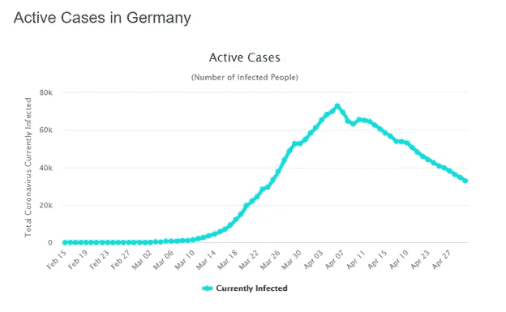

首先，活动案例图表显示了给定日期之前的总案例数减去已康复和死亡案例数。因此，可以用死亡数字来彻底阅读这个图表。然而，这篇短文的目的是比较各国，看看他们在控制疫情方面进展如何。

为此，请注意德国 4 月 5 日左右的顶部和以下确认形态，即顶部已经牢牢确立。此外，德国能够在不屈服于高层或其它任何地方的横向变动的情况下，拿下活跃的案例。每日新增病例的下降和强劲的复苏数字支持了这一点。例如，我们将在意大利看到一个非常不同的山峰。此外，让我们看看峰值出现需要多少天。粗略阅读图表，以德国为例，时间是从 3 月 10 日到 4 月 5 日——因此，大约 26 天的时间足以让德国实现控制。

 [## 冠状病毒；惊慌失措；字里行间的 z |数据驱动的投资者

### 围绕冠状病毒的话题；更准确地说，新冠肺炎几乎占据了整个新闻预报的头条…

www.datadriveninvestor.com](https://www.datadriveninvestor.com/2020/03/23/coronavirus-a-to-panic-z-between-the-lines/) 

请注意，高峰日的计算大致是从这些图表中的起飞点到顶部的转折点。这样做的目的不是为了在数字上非常精确，而只是为了有一个令人满意的比较读数。

作为最后一个观察点，我们应该注意到，更陡峭的活跃病例曲线可能意味着更密集的检测以及更广泛的感染。在这方面，德国的曲线很陡，但下降幅度更大。

所以对德国的总结应该是:

建立峰值:是

活跃的案例堆积:陡峭

高峰确认:对，连续下跌。

达到峰值的天数(大约):26 天

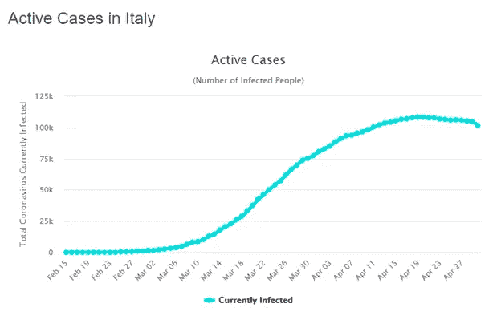

在意大利，请注意活跃案例的缓慢但更长的积累。因此，顶部形成后，德国与大约 43 天，从 3 月 3 日起飞到 4 月 16 日的高峰。此外，峰值确认不是稳步下降，而是比德国更加横向。

所以意大利的总结应该是:

建立峰值:是

活动案例积累:缓慢

峰值确认:是，但横向缓慢下跌。

达到峰值的天数(大约):43 天

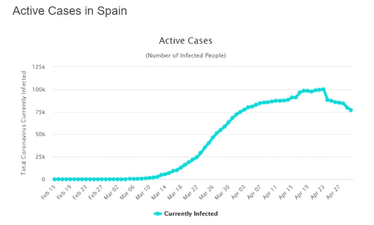

西班牙似乎比意大利好一点，有 38 天的控制时间和更明显的峰值确认。然而，与德国不同，类似于意大利，其峰值的形成需要相当长的时间。

所以对西班牙的总结应该是:

建立峰值:是

活动案例积累:缓慢

峰值确认:是的，但一个横向峰值形成，这是看到了一个回升，最近恢复。

达到峰值的天数(大约):38 天

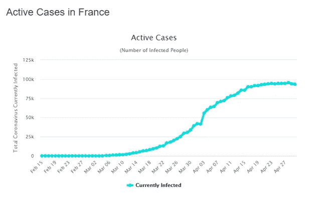

法国看起来与意大利相似，加速较慢，峰值形成偏侧。四月下旬可能已经见顶，但尚未证实。

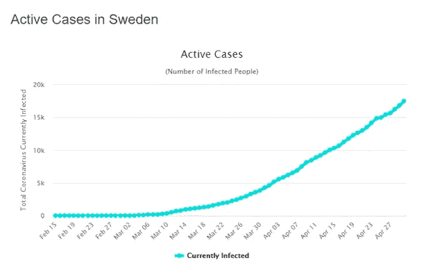

瑞典没有强制实行封锁，其结果也不同于大多数其他国家。它的回升速度很快，已经持续了 46 天，看不到峰值。

虽然我认为更宽松的方法更可取，因为封锁成本巨大；瑞典的例子表明，一个人口更多的国家在这种情况下很容易被淹没。我将在结束前总结说，测试和追踪是控制感染的关键，而不需要诉诸无差别封锁。然而，只有一个对这种情况有所准备的国家尽早采取行动，才能实现这一目标。

Photo by [Hulki Okan Tabak](https://unsplash.com/photos/Q3UmD9eX--A) on [Unsplash](https://unsplash.com?utm_source=medium&utm_medium=referral)

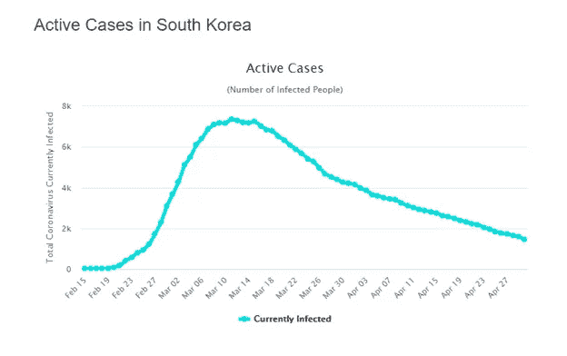

如果我们跨越大洲，看看韩国，它的病例增加很快——比德国更明显。**这进一步证实了一个事实，即更陡的积聚可能与更好的测试性能有关。**其峰值确认清晰，下降平稳。最后，它的高峰期在 21 天左右，这是值得注意的。

所以对韩国的总结应该是:

建立峰值:是

活跃的案例积累:非常陡峭

峰值已确认:是的，有一条清晰的下降路径。

达到峰值的天数(大约):21 天

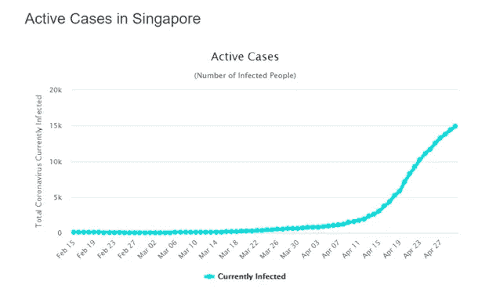

当每个人都在新加坡寻找第二波动态的迹象时，活跃的案例表明，新加坡以前没有经历过有意义的第一波。鉴于感染人数仅在 4 月份有所上升，这一阶段的感染是他们有效的第一波。如果以其他国家为参照，新加坡将会在五月的第二周达到顶峰。

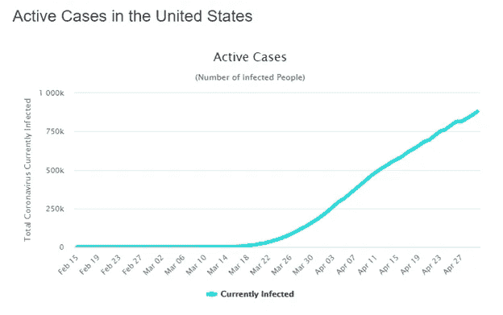

转移到美洲，美国的病例数量正在稳步急剧上升，在起飞后大约 38 天，还没有看到高峰。然而，与意大利的例子一样，美国在 5 月的第二周或最近的第三周达到峰值并不令人意外。

**在这一点上，应该注意的是，不同的国家处于感染周期的不同阶段，但北半球的大部分地区已经在 5 月的某个时候达到高峰或接近高峰。**

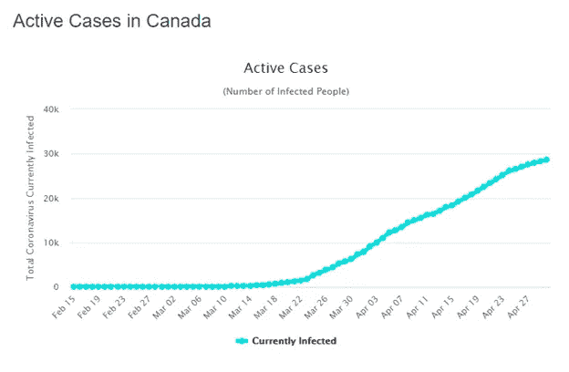

我研究了加拿大，以测试美国的北方邻居是否有不同的模式，答案是否定的。总体而言，加拿大目前与美国非常相似。

请注意，已经见顶的欧洲国家正在显示有控制地放松封锁，而美国正在更努力地解除封锁。然而，考虑到美国的地理分布，从自下而上的角度来看，这听起来更符合逻辑，因为不同地区受到的影响非常不同。

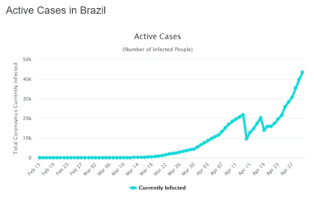

巴西本身就是一个例子。这是一个独特的图表。它有一个我没有观察过的其他国家没有的临时波动，30 天后有一个大的回升。巴西目前没有任何见顶的迹象。鉴于其人口动态和相当宽松的初始反应，可能需要比北美同行更长的时间才能看到巴西的峰值。

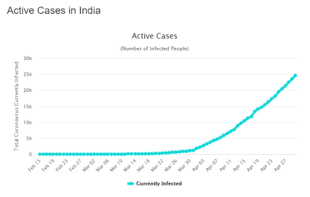

印度尚未见顶，其曲线很陡，鉴于其人口和经济背景，5 月底见顶的可能性似乎比之前更大。

Photo by [Hulki Okan Tabak](https://unsplash.com/@hulkiokantabak?utm_source=medium&utm_medium=referral) on [Unsplash](https://unsplash.com?utm_source=medium&utm_medium=referral)

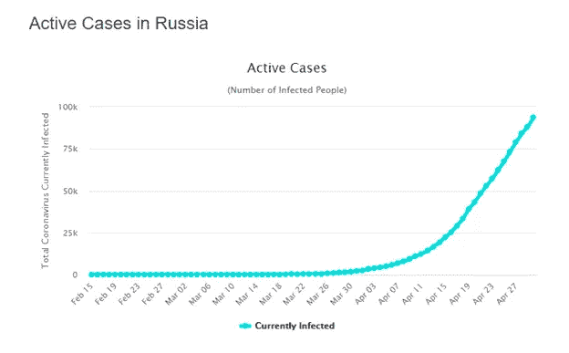

俄罗斯在起飞后的第 28 天，其活跃病例急剧增加。鉴于这种曲率，预计在 5 月中旬左右会出现一个峰值。

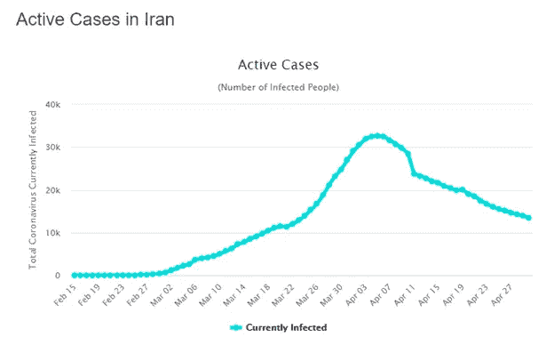

尽管 3 月初对伊朗进行了大量负面宣传，但它已设法在起飞后约 36 天内控制了疫情，并正在经历稳步下降。

所以对伊朗的总结是:

建立峰值:是

活跃案例积累:开始缓慢，然后急剧增加

峰值确认:是，稳步下降。

达到峰值的天数(大约):36 天

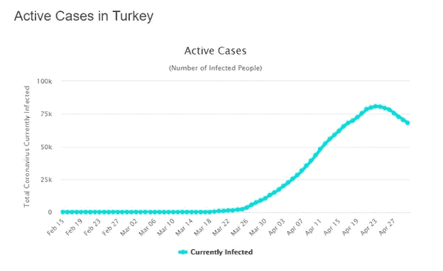

在土耳其，回升幅度很大，在 29 天内达到峰值。这一下降正处于开始阶段，但迄今已观察到稳步下降。

所以对土耳其的总结应该是:

建立峰值:是

活跃的案例堆积:陡峭

峰值确认:是，稳步下降。

达到峰值的天数(大约):29 天

总之，我对感染得到控制感到乐观多了。一旦资源从应对紧急重症监护问题中释放出来，对无症状人群的检测就有可能开始。如果这种检测显示已经感染的比例很高(如果检测可以显示，意味着在过去 6 个月或更早感染)，那么新冠肺炎的实际死亡率将比曾经担心的要温和得多。

**至于实现疫情控制，时机似乎至关重要。将早期反应与包括随机抽样未患病人群的强化测试相结合，可以防止超级传播事件和更低的 R0(传播率)。这一初步行动导致病例数一开始就急剧上升，但随后转化为更早的高峰和更明显的下降。主动接触追踪和采用数字追踪方法在这方面也非常有用。**

未来的历史学家可能会说，如果准备工作到位，全球协调更加有效，最初的反应更加有力和集中，我们会使问题变得更加复杂。如果各国从这一时期吸取了教训，那么健康问题隧道的尽头绝对会有光明。展望未来，必须利用即将到来的感染控制势头来缓解由全面封锁造成的其他问题。

5 月 2 日，伊斯坦布尔

Photo by [Hulki Okan Tabak](https://unsplash.com/@hulkiokantabak?utm_source=medium&utm_medium=referral) on [Unsplash](https://unsplash.com?utm_source=medium&utm_medium=referral)