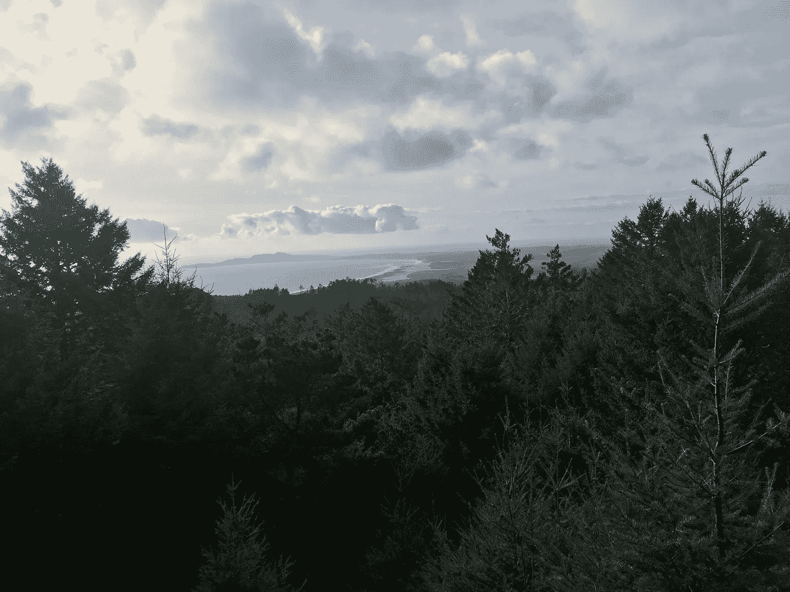

# 冠状病毒和我们与自然的关系

> 原文：<https://medium.datadriveninvestor.com/coronavirus-and-our-relationship-with-nature-54c64ce05d2f?source=collection_archive---------1----------------------->

当我坐下来写这篇文章的时候，是逾越节和复活节的周末。由于冠状病毒引起的疾病和死亡的传播，全世界突然团结起来。我不是一个宗教人士，但我发现自己在思考善与恶的力量，并怀疑我们是否已经进入了一个人间地狱的时代。还是到了救赎的时候了？

终于在“突发新闻”和特朗普总统每天故意分散注意力的表演中筋疲力尽，本周的一个清晨，我拒绝起床几个小时，只是在手机上阅读，希望有人能提供比报道我们防备不周的紧急情况更深入的视角。除了重复不准确的谣言说病毒是中国的阴谋，似乎没有人会问为什么这种病毒会出现，似乎无处不在。为什么是现在？

问为什么需要我们从马戏团和生死攸关的紧急情况中退一步，我们还没有真正拥有这种特权。

 [## 现金为王，比我们想象的更强大|数据驱动的投资者

### 2020 年 3 月 12 日，在川普总统宣布新冠肺炎进入国家紧急状态的前夕，纽约时报报道…

www.datadriveninvestor.com](https://www.datadriveninvestor.com/2020/03/26/cash-is-king-more-potent-than-we-think/) 

凭直觉，我认为病毒的出现与我们对自然的侵犯以及我们快速改变自然环境的方式有关。出于显而易见的原因，人类目前的焦点并不是气候和环境危机。但我想看看是否有人写这种相互联系。毕竟，病毒是自然的一部分，就像我们一样。

我搜索了主要的国际媒体，但我在《T2》杂志的执行主编、电影制片人伊曼纽尔·沃恩-李和了不起的科学作家大卫·奎曼在《T5》的对话中找到了我正在寻找的东西。《涌现》杂志总部位于加利福尼亚州因弗内斯，是一个精美的散文、采访、诗歌和艺术的收藏馆。它珍视书面文字，但让读者沉浸在视觉体验中，并提供音频。后来，我会在做饭的时候回去听沃恩-李和奎曼的对话。但是今天早上，我想读这份记录，因为《涌现》读起来是一种安慰，也因为我厌倦了“消费”媒体。我想仔细思考呈现在我面前的东西。

Quammen 对进化生态学的兴趣和专业知识使他研究并撰写了关于病毒如何进化的文章。2012 年，他写了一本名为*溢出:动物感染和下一个人类疫情*的书。(对，2012 年。许多人知道这一天的到来。)

在我们的总统开始承认这种病毒的危险的几个月前，2020 年 1 月 28 日，Quammen 还在《纽约时报》上写了一篇观点文章*叫做 [*我们制造了冠状病毒疫情*。](https://www.nytimes.com/2020/01/28/opinion/coronavirus-china.html)在这篇文章中，他解释了我们是如何成为 SARS 等人畜共患病毒和 2019 年新型冠状病毒的宿主的。*

*“我们入侵热带森林和其他野生景观，那里有如此多的动物和植物物种——在这些生物体内，有如此多的未知病毒，”他写道。“我们砍树；我们杀死动物，或者把它们关进笼子，送到市场。我们破坏生态系统，我们把病毒从它们的自然宿主身上抖落出来。当这种情况发生时，它们需要一个新的宿主。往往，我们就是它。”*

*在当前的冠状病毒中，有人很可能抓住了一只蝙蝠，并把它带到中国武汉的一个菜市场，然后宰杀了它。在像武汉这样的市场上，各种各样的野生动物堆积在一起，这些野生动物携带的任何病毒最终找到人类宿主的条件已经成熟。然后，当人类跳上飞机，在世界各地移动时，病毒以惊人的速度伴随着他们到达地球的各个角落。*

*吃这些野生动物的人正在吃它们，因为这是它们生存的方式。因此，关闭市场并不是一件简单的事情。但这不仅仅是关于菜市场。一点也不。Quammen 在与 Vaughan-Lee 的采访中说，“我们所做的所有事情都导致了破坏，摆脱了这些病毒，给了它们进入我们的机会，所有我们对世界各地资源的吸引。”*

*他举了开采钶钽铁矿石等矿物的例子，钶钽铁矿石用于制造手机和笔记本电脑。他解释说，钶钽铁矿石的主要产地之一在刚果民主共和国的东南角。劳工营的矿工在热带森林附近工作，那里是东部低地大猩猩的家园。森林也是蝙蝠和其他野生动物的家园，供劳工食用。*

*“所以，如果我们买一部手机，我们就在购买钶钽铁矿石，”Quammen 告诉 Vaughan-Lee，“因此，我们正在把这张破坏之网拉得更紧。我们正在把病毒拉向自己，也许不像中国的蝙蝠消费者那样明显和直接，但尽管如此，我们也是其中的一部分。”*

*这些行为，如在荒野附近开采矿物，使我们更频繁地接触致命病毒，在我看来，如果我们要解决气候变化问题，我们就必须考虑同样的行为，因为在我们追求和开发资源的过程中，气候变化也源于对自然的破坏。科学家们还知道，疾病的传播将是气温升高、洪水和气候变化条件的普遍副作用。病毒和其他疾病的传播与气候变化密不可分。*

*随着全球经济在我们身边崩溃，冠状病毒帮助我们关注美国和全世界更深层次的危机，贫困，不平等，缺乏教育和适当的医疗保健。我们认为这些主要是经济问题，但经济问题和环境问题往往是一回事。例如，在刚果，代表雇主破坏荒野和大猩猩栖息地的劳动者受到经济剥削，他们在不安全的条件下工作，拿着微薄的工资，为我们的手机带来矿物。*

*《纽约时报》最近做了一些非常自我反思的评论，关于我们如何才能摆脱疫情，解决我们经济和文明中的根本问题。在阅读它的过程中，我被它的愿景所打动，并希望我们能够制定一个游戏计划。但是有一件事真的让我很担心。在这份由编委会撰写的名为 [*我们需要的美国*](https://www.nytimes.com/interactive/2020/opinion/america-inequality-coronavirus.html) 的宗旨声明中，该声明试图总结我们需要做的一切，本质上是我们如何开始解决我们所有的经济和社会公正问题，全球变暖被置于文章的最后，只用一句话，作为一个迫在眉睫的单独挑战，我们只有在成功实现经济复苏后才能应对。就好像我们根本不知道驱动我们经济的所有资源实际上都来自自然本身。我们的领导人竞选公职，我们的记者团陷入了当前的政治，很少以任何方式将我们的经济危机与我们与自然和自然资源的失调关系联系起来。这一定是因为我们无法超越眼前的环境。*

*正如我们大多数人从未想象过当前的健康危机，我们被疫情从社会中驱逐出去，我们甚至不可能想象到随着气候变化的全面到来，所有的事情都会变得糟糕。就像我们被这种病毒攻击一样，我们也将被接下来发生在我们身上的事情彻底攻击。但是，就像病毒一样，科学家实际上知道将要发生什么。我们知道，因为我们正在经历它。*

*两年前，当破坏性的野火以不可预见的凶猛在加州肆虐时，有一天我在工作时哭了起来。而我朋友说:“你不安是因为担心自己的安全？”我说，“不。我难过是因为我们将会有人间地狱，而它现在就在我们这里。我们知道它会来，但我们只是一直希望它不会。”当天空是红色的，烟雾弥漫，人们在家中被烧死，我们的医院被占领，这显然是人间地狱的开始。我们正在采取如此少的行动——我们甚至正在逆转已经采取的行动——来防止我们自己的毁灭，这是自然毁灭的一个明显和直接的结果。*

*然而，在加州，我们已经清楚地看到，在这个疫情，个人行动可以立即帮助集体利益。在加利福尼亚州，由于我们的市长和州长的勇敢的早期行动，以及关心员工健康的技术公司的行动，我们很快看到生命得到拯救，因为即使那些可能觉得无懈可击的人也留在室内保护弱势群体。所以，你不必担心你自己的安全，你的家会被烧毁，或者你会感染病毒，生病或死亡，以这样一种方式亲自行动，当每个人都团结起来，立即产生深远的积极影响。你只需要愿意参与，明白你所做的事很重要，不要把自己视为例外。*

*气候活动家长期以来一直认为，个人行为可以帮助或破坏集体利益，因此，当我们看到人们个人所做的事情对集体产生巨大影响时，或许并不感到惊讶。我只是不认为我们意识到这些行动可以很快产生积极的影响。*

*当我写完这篇文章时，地球日就要到了。减去所有的包装和其他来自遥远地方的能源和材料的浪费，减去为我们提供所需服务的服务人员的持续剥削，我们突然变得更像我们应该生活的方式——为无家可归者提供住所，少买垃圾，少开车，少坐飞机，少污染，多吃当地小农场的食物，开始真正重视，至少在精神上重视我们长期忽视的人对社会的贡献。由于我们去了里面，我们还在街上看到了动物。美洲狮、熊和野猪在曾经被窒息的引擎包围的地方游荡，兔子在几乎废弃的公路上奔跑。此外，让我们面对现实吧，老鼠正偷偷溜进空荡荡的餐馆。动物出现在我们废弃的栖息地表明了大自然是如何非常快速地适应新的现实的。我们已经看到我们的天空变得晴朗，碳排放量下降。我们可以多么迅速、多么显著地改变自然！*

*这种病毒让我们很容易看到死亡人数是如何由于我们的忽视和自恋而上升的，我们的领导人否认什么是不方便的，或者只关注我们的经济前景或权力前景。这种病毒也让我们很容易看到我们如何用行动保护活着的人。阻止病毒传播是确保我们经济安全的唯一直接途径，正如阻止气候变化是确保我们经济长期安全的唯一途径。而不是相反。我们现在知道我们的星球到底有多小，我们彼此之间是如何联系在一起的，以及我们与自然、病毒和其他事物之间的联系。仅仅在几个月的时间里，我们已经看到，就像春天里的奇迹，或者各种各样的复活，我们可以拯救自己，自然会随之而来。*

*如果我们想作为一个物种生存下去，我们必须将我们的经济与对自然的破坏分开。让我把这句话变成一句更积极的话:我们必须把保护多样的生态系统与健康的经济联系起来，以便朝着我们为所有人建立一个更加公平、安全、公正和健康的社会的理想取得进展。*

*正如 Quammen 所说，“我们必须记住，当尘埃落定时，nCoV-2019 不是一个新奇的事件或降临到我们头上的不幸。这是——现在也是——我们人类正在做出的选择模式的一部分。”*

*我知道我们会再次选择开车。我知道那些买得起的人会选择买新款 iphone，还有下一款。但我们能做出经久耐用的 iphone 吗？在我们所谓的循环经济中，我们能不能把旧版本的所有部分都做成下一个版本，让我们重新利用和恢复，而不是破坏和剥削？这听起来很简单，但我们确实有技术和必要的手段来变得足智多谋，保护和再利用，以适应和再生，而不是掠夺和剥削人，动物和荒野。*

*随着我们摆脱冠状病毒，我们都想变得更好。我们都希望这场灾难能带来一个更公平、更健康的世界。每份报纸和每篇政治演讲都清楚地表明，美国人民非常希望解决收入、医疗和教育方面的不平等问题。但是，我们还会支持科学吗，不仅是为了预防流行病和其他意想不到的疾病，也是为了理解地球气候与我们健康的必然联系？我们最终会承认我们的经济、健康和幸福与我们与自然和环境的关系密不可分吗？*

*我们会停止使用污染的燃料来驱动我们的生活吗？我们会停止砍伐森林吗？砍伐森林会把病毒带给我们，是温室气体排放的最大原因之一。我们会脱离工业化农业和工厂化农场吗？我们会支持可持续发展的小农场主和小商人并加强我们当地的经济吗？我们能否将此作为经济复苏和追求公平的一部分？*

*最重要的是，我们会记得在这短短的几个月里我们所看到的吗——个人行动，特别是与负责任的企业和政治领导人合作，能够并确实转化为对自然和人类产生深远积极影响的变化，拯救生命并让自然茁壮成长。*