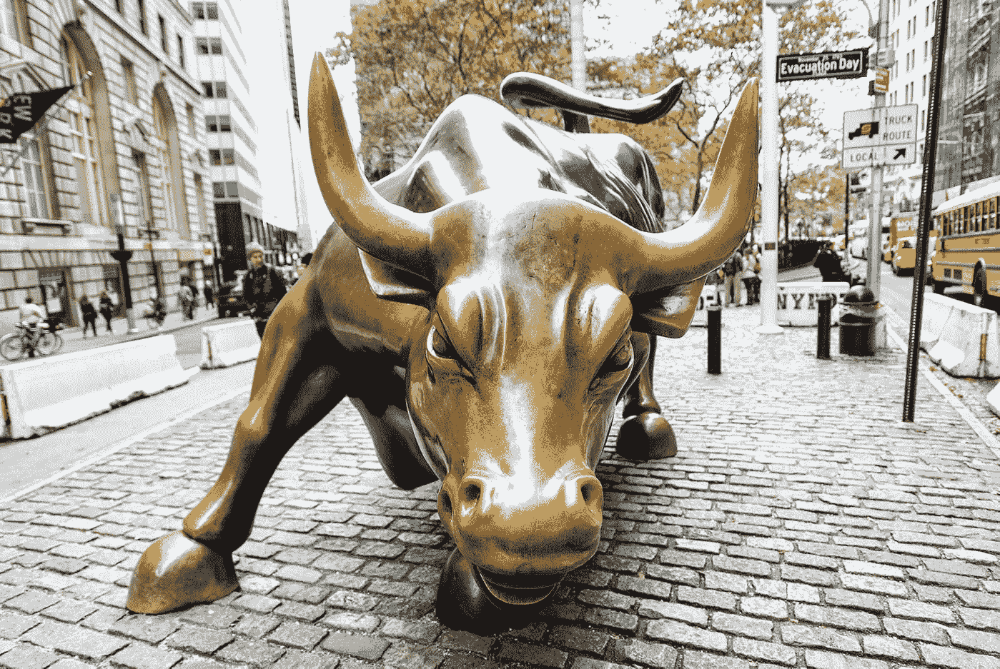
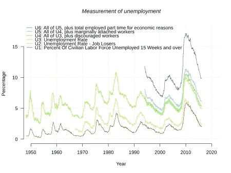

# 冠状病毒和全球经济:经济衰退的时机成熟了吗？

> 原文：<https://medium.datadriveninvestor.com/coronavirus-and-the-global-economy-are-we-ripe-for-recession-caa8f2f2b7d8?source=collection_archive---------22----------------------->

我们现在已经进入全球新冠肺炎疫情一个多月了，而且没有减缓的迹象，对潜在经济危机的担忧正在上升。要求隔离和隔离特定地区的呼声吓坏了投资者，股价以创纪录的速度暴跌。随着股市从高点下跌超过 20%，我们已经进入了熊市，标志着牛市 10 年任期的结束，同时我们正在迅速进入技术性衰退。我们面临衰退的时机成熟了吗？

# 经济的积极迹象

每当你听到“衰退”这个词，你可能会想到两年前的 1929 年和最近的 2008 年。纵观历史，有许多金融危机，它们都有一个共同点，那就是我们度过了危机。不管经济会变得多么糟糕，衰退总有一天会见底，给许多人带来希望。

# 估值没有被拉长

每当经济衰退发生时，你很可能会发现问题表面之下的许多问题。2008 年，是银行。银行尽可能地借钱给任何人。事实证明，这些个人中有许多是高风险的，他们不应该被批准获得抵押贷款。当抵押贷款账单开始到来时，他们通常无法支付，引发了金融系统的突然冲击。

 [## 另一场精心策划的全球经济危机正在逼近？如果我们的数据经济可以帮助它|数据…

### 我们的 DApp 的开发，称为 DECENTR，目前正与我们的 R&D 同步进行，作为我们即将到来的…

www.datadriveninvestor.com](https://www.datadriveninvestor.com/2019/03/06/another-engineered-global-economic-crisis-looming-not-if-our-data-economy-can-help-it/) 

后来变得更糟了。这些抵押贷款中有许多被打包成被称为 CDO(债务抵押债券)的金融产品。投资者能够以(他们认为的)极低的风险购买大量抵押贷款。引用大空头的话，“嗯，它们是抵押贷款。谁他妈的不还房贷？”

事实证明，当抵押贷款得不到偿付时，不仅银行会受到影响，任何投资于 CDO 的人也会陷入困境。

每当股市被高估，人们就会担心类似的事情可能会发生。标准普尔 500 公司的市盈率通常在 15 到 20 倍左右，平均为 15.78 倍。目前，该市场的市盈率约为 20 倍。这意味着股票没有被极度高估，这对经济来说是一个好迹象。

# 消费者工资和信心稳步上升

在过去几年中，失业率一直处于历史最低水平。随之而来的是强劲的工资和可自由支配的支出。美国人的消费比以往任何时候都多，这对商业和整体经济都有好处。

工资依然坚挺，而且最近一直在稳步上升。工资停滞通常与经济衰退联系在一起。尽管对于当前的经济状况来说，这是一个好迹象，但工资增长和失业率的放缓可能会给我们指出一个不同的方向。

# 政府干预

美国政府知道每分钟都在发生和发展什么，这包括经济影响。美联储最近向金融市场注入了 15 亿美元的刺激资金，以保持银行现金流动。此外，所有的学生贷款利息支付已经停止，让那些现金短缺的人可以不用支付学生贷款利息。

如果病毒继续它的毁灭之路，我们可以期待政府宣布对工人阶级和企业主的大规模财政刺激，给市场一个希望的理由。

# 我们不喜欢什么

衰退往往是周期性的。平均而言，每 3.5 年，股市就会暴跌至少 20%或更多。老实说，已经有一段时间了。2018 年，由于对贸易战的担忧成为焦点，市场暴跌 10%。在此之前，直到 2008 年至 2012 年的大衰退，股市才出现如此剧烈的下跌。

# 可能的隔离或检疫

随着快速传播的冠状病毒继续在全球范围内跋涉，一些国家已经开始采取检疫和隔离措施来减缓其传播。

在意大利和西班牙，全国范围内禁止旅行和小型集会，许多餐馆、健身中心、学校和其他公共场所关门，停车场空无一人。随着病毒继续传播，许多国家已经宣布全国进入紧急状态。这可能会对当地和全球经济产生巨大影响。

旅游和休闲公司占了美国国内生产总值的很大一部分，服务业最近一直在蓬勃发展。这些行业的突然停止可能会导致整个经济的混乱，首先是裁员，引发真正的经济危机。

# 消费者支出减少

更广泛的经济通常可以被描述为多米诺骨牌游戏，只需要一个小事件就能推倒第一张多米诺骨牌。在过去的 10 年里，消费者一直是经济的主导者，他们为企业花钱并创造利润。这种消费支出能够掩盖金融体系中更大的问题，比如 2008 年发生的那些问题。

问题？自 1918 年西班牙流感以来，我们从未见过如此广泛的病毒爆发，记住，在没有大规模旅行的情况下，遏制要容易得多。如果全国范围的封锁到位，你可以想象多米诺骨牌游戏，其中所有的棋子几乎立即被击倒，不需要真正的多米诺骨牌效应来造成经济灾难。

# 巨额国债

美国的债务处于历史最高水平。美国欠其他国家和公众的债务超过 23 万亿美元。这是一个没有人愿意提及的令人担忧的领域。这当然是房间里的大象，虽然这本身可能不足以引发经济危机，但这是要记住的事情。

# 可能上升的失业率

随着病毒的传播和公司被迫关闭，我们可以预计失业率会上升。这可能只是导致经济开始倾斜的多米诺骨牌之一。随着失业率上升，消费支出减少，这反过来又导致失业率上升。

# 当前的低利率

美国的货币政策是有限的。在今年几次降息后，美联储正在耗尽应对任何经济危机的弹药。

每当你听到美联储“降低利率”时，这实际上降低了银行隔夜拆借利率，以满足联邦政府对现金储备的限制。

这些利率有几个原因，其中一个最重要的原因是控制通货膨胀率。美国美联储的目标是每年实现 2%的通货膨胀率。通过调整利率，他们可以用更便宜的贷款选项来阻碍或刺激经济。

例如，如果利率是 11%,一个成长中的公司可能不想贷款来发展他们的业务。然而，如果利率是 2%，他们可能会被鼓励花更多。这就是美联储利用货币政策影响经济的方式。

如今，利率很低。这意味着我们没有足够的弹药来刺激经济增长。随着许多国家提供负利率(是的，负利率)，如果经济繁荣没有起色，美国可能会被迫陷入同样的困境。

# 其他经济不确定性可能会引发复杂情况

不幸的是，冠状病毒并不是最近在主要市场引发动荡的唯一新闻。石油、政治和其他一些事件进一步刺激了投资者的经济不确定性。

# 石油战争开始了

你有没有想过是什么导致汽油价格波动如此之大？都是供求关系。每天，世界产出大约 947.2 亿桶原油。这些石油的大部分将被提炼成汽油。

谁控制我们泵送多少石油？全球石油供应有几个主要部分。石油输出国组织(石油输出国组织)和一些美国公司在很大程度上决定我们收集多少石油。

石油输出国组织由 15 个不同的国家组成，包括沙特、委内瑞拉、阿联酋和其他几个国家。这些国家聚集在一起讨论全球石油供应和需求，并设定石油开采量的限制。最近，这些国家中的一些国家和俄罗斯就开采多少石油发生了冲突。没有达成限制石油产量的协议。

因为许多国家的旅游已经暂停或被劝阻，过去几周汽油的使用量已经下降，而石油产量保持稳定。由于这个原因，石油价格急剧下跌，跌幅高达 25%。

## 这对美国石油勘探公司意味着什么？

由于油价下跌，一些美国公司遭受了重大打击。过去一周，雪佛龙、英国石油、Exon Mobile 等公司股价下跌超过 30%。

在目前的价格下，许多这样的公司无法保持盈利。这意味着，按照目前的价格，每生产一加仑石油，该公司很有可能会赔钱。这可能会引发这些公司的大规模去资本化和裁员，进一步加剧冠状病毒的经济影响。

## 这对消费者意味着什么？

对于全国各地的司机来说，有一些好消息，因为油价下跌，你可以期待在加油站得到一些缓解。分析师们注意到，许多地区的汽油价格可能跌破每加仑 2 美元，[价格为 2005 年](https://www.titlemax.com/discovery-center/planes-trains-and-automobiles/average-gas-prices-through-history/)前所未见。

那么问题就变成了，“这些钱会发生什么变化”？一些经济学家预计这笔钱会存在储蓄账户里，直到经济担忧消退，而其他人则预计支出会增加。

# 抗衰退投资策略

对衰退的恐惧会让我们变得更糟。即使是最著名的投资者也可能会试图偏离他们的传统策略，以防止进一步的损失。然而，这是一种被证明有效的方法，可以获得黯淡的回报，限制任何潜在的收益。

# 避免恐慌销售

每当人们感到恐惧时，他们就会卖掉投资，持有被认为更安全的东西，比如现金。这种市场抛售潮会导致你的投资组合价值急剧快速下跌。

每当你恐慌性抛售时，你都有可能失去你抛售后的任何潜在收益。

# 认识到没有任何投资是 100%安全的

人们通常认为现金、美国国债和黄金是完全安全的。这并不完全正确。所有投资都带有某种风险，即使风险极低。

但是有一项投资是安全的。你的知识。你所学到的东西是无法从你身上拿走的，所以在不确定时期，投资自己应该是优先考虑的事情。

# 多样化

保持投资多元化是保持投资稳定的最好方法之一。通过持有各种类型的资产，你可以在一个领域(股票)限制损失，而在另一个领域(黄金)有增值的潜力。

然而，多样化并不能保证回报。正如上面所讨论的，没有投资是 100%安全的，这意味着即使你的投资组合非常多样化，你仍然有可能失去价值。

# 利用低利率

如前所述，利率处于历史低点。这可能是你利用这一优势的好时机。鉴于目前的情况，创办你一直梦想的企业可能比以往任何时候都更便宜，但你应该始终小心谨慎，并有一个计划来确保你的企业成功。

# 如何为衰退做好财务准备

如果衰退真的发生，你需要做好财务准备。这意味着如果需要的话可以有储蓄，如果没有，可以有多种收入来源。

# 确保 6 个月的应急基金(或任何应急基金！)

当你为经济衰退做准备时，你应该确保在你失业的情况下，你有办法支付每月的开支。2010 年，失业率接近 10%，接近历史最高水平。没有收入，你能负担得起每月的开销吗？如果没有，是时候开始存钱了。你不太可能在几个月内存下 6 个月的收入，但是任何[应急基金](https://www.dontworkanotherday.com/how-much-to-save-for-emergency-fund)都比没有应急基金好。

# 创造多种收入来源

如果你从事的是普通工作，这是你建立第二份收入的时候了。它可以是出租你家的一部分，或者创建一个博客，有许多[不同的收入来源你可以建立](https://www.dontworkanotherday.com/use-dividends-to-build-additional-income-stream)来补充你现在的收入。

许多被动收入流不需要在实际地点工作，即使发生经济衰退也能给你带来灵活性。

# 削减开支，然后再削减

如果你不能增加收入，你就需要削减一些开支。这可能是取消你的有线电视，节省油钱，或者像减少外出就餐这样简单的事情，你需要确保每个月底都有正的现金流。[制定每月预算](https://www.dontworkanotherday.com/how-to-create-a-budget)(如果你还没有的话)对保持正现金流至关重要。

你应该寻找任何不必要的花费，并计划消除或减少你目前的花费。咖啡店、名牌食品杂货店和新衣服是你可以消除的一些最简单的东西。

# 考虑债务再融资

如上所述，利率处于历史最低水平，这包括抵押贷款和[学生贷款](https://www.dontworkanotherday.com/reasons-you-should-refinance-your-student-loans)的[利率。现在可能是考虑再融资的最佳时机，尤其是当你的预算不够理想的时候。](https://www.dontworkanotherday.com/should-i-refinance-my-mortgage)

# 结论

没有糖衣，经济衰退导致压力、恐惧，甚至一些人死亡。更糟糕的是，冠状病毒对健康的影响是不可避免的。在此期间，各国需要团结起来抗击这种病毒，以确保经济和卫生繁荣。

你认为我们正走向经济衰退吗？下面评论！

*原载于 2020 年 3 月 14 日 https://www.dontworkanotherday.com**的* [*。*](https://www.dontworkanotherday.com/coronavirus-global-economy-recession)