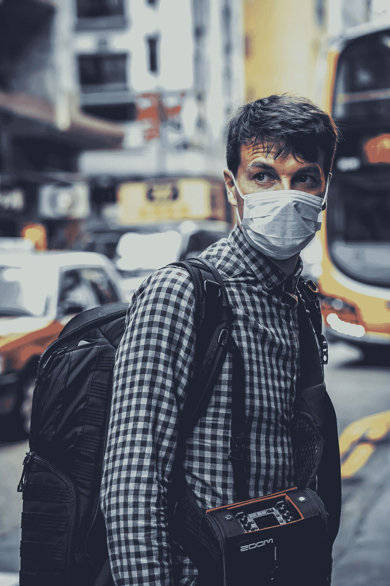
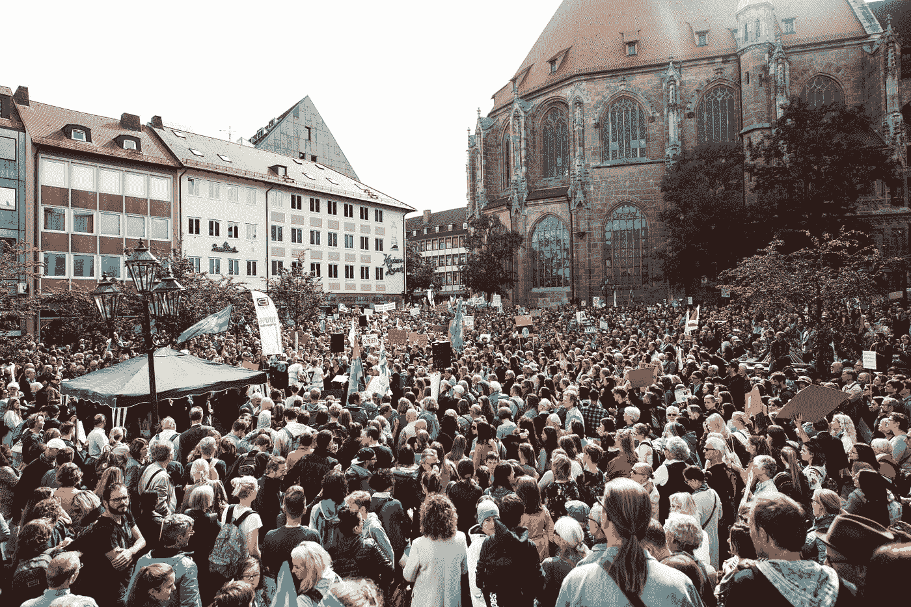
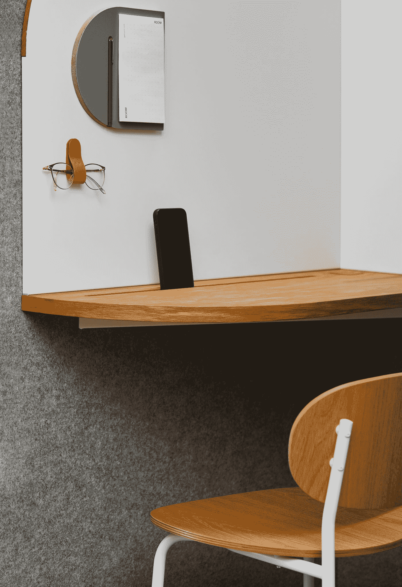

# 冠状病毒和远程工作问题

> 原文：<https://medium.datadriveninvestor.com/coronavirus-and-the-remote-work-problem-20a6e145df7f?source=collection_archive---------14----------------------->

Photo by [Free To Use Sounds](https://unsplash.com/@freetousesoundscom?utm_source=medium&utm_medium=referral) on [Unsplash](https://unsplash.com?utm_source=medium&utm_medium=referral)

随着各组织争相创建分散的员工队伍，新冠肺炎疫情将远程工作问题推到了市场的前沿。

当今的企业领导人面临着使公司政策适应新兴的远程工作趋势的诸多挑战。在让员工开心、培养积极的公司文化和实现绩效目标之间存在微妙的平衡。

 [## 跑步摆脱疯狂:锻炼如何提高你的生产力|数据驱动的投资者

### 没有比锻炼更好的方式来开始一天的工作了。我试着一周至少做四天，在…

www.datadriveninvestor.com](https://www.datadriveninvestor.com/2018/10/23/running-to-get-rid-of-the-crazy-how-working-out-increases-your-productivity/) 

一些企业主和高管选择通过拒绝接受分布式工作场所来完全避免替代工作安排的陷阱。这样做，这些公司将会失去吸引最优秀员工的机会，从而危及他们未来的人才前景。

## 不是所有的工人都喜欢呆在家里

Photo by [Allen Taylor](https://unsplash.com/@allentaylorjr?utm_source=medium&utm_medium=referral) on [Unsplash](https://unsplash.com?utm_source=medium&utm_medium=referral)

除了监控性能和生产力的明显问题之外，还有其他问题在起作用。一些员工可能会担心，如果不在一个共享的办公环境中，他们会被冷落或低估。孤独感会导致缺乏兴趣或参与。

在过去，未来的员工可能会不公平地判断组织的文化是脱节的，甚至是冷漠的。远程工作者可能会担心工作晋升和职业发展的风险。管理需要更多监督的员工、接受培训的员工和新员工可能会被认为太难了。

## 感觉被冷落了

Photo by [Erin Doering](https://unsplash.com/@edoering?utm_source=medium&utm_medium=referral) on [Unsplash](https://unsplash.com?utm_source=medium&utm_medium=referral)

即使有了实体办公环境和远程办公的选择，适应不同的工作方式也会产生不同的方法。这可能会在无意中给主动的人带来优势，他们比需要更多关注的员工更喜欢更自主的环境。

那些从替代工作安排中受益的人可能不愿意这样做，因为他们害怕“错过”在办公室做出的重要决定。如果不是所有的员工都有远程办公的选择，还有一个平等的问题。

在当前的疫情氛围中，员工需要在安全感和融入感之间做出选择。

一些雇主没有直接迎接这些挑战来创建一个充满活力的虚拟工作场所，而是采取了观望的态度。这样做的话，他们就冒着失去最好的员工的风险，因为更敏捷的创业公司已经提供了这种选择。

# 即使新冠肺炎走了，远程工作也不会

Photo by [Dimitri Karastelev](https://unsplash.com/@thedotter?utm_source=medium&utm_medium=referral) on [Unsplash](https://unsplash.com?utm_source=medium&utm_medium=referral)

尽管在 COVID 爆发之前，一些大公司已经减少了远程工作，但他们的员工仍然希望有机会获得替代安排。事实上，一些工作在办公室之外进行的趋势很可能成为未来的默认安排。

一项[调查](https://www.cnbc.com/2017/05/30/job-perks-prodding-millennials-to-work-for-less.html)发现，大约 76%的千禧一代愿意接受减薪以换取灵活的工作时间。千禧一代对工作选择变得如此挑剔，以至于大多数人表示，他们愿意跳槽到能提供工作的雇主那里。他们可能会直观地理解远程工作是一种聪明的做法，可以让他们的口袋里有更多的钱。

> 根据 Flexjobs 的说法，全职远程办公者每年可以节省 4000 多美元，并获得 11 天不浪费在堵车上的时间。

越来越明显的是，劳动力处于主导地位，要求更加灵活的就业环境的压力不会消失。

甚至在病毒迫使工人自我隔离之前，对替代工作安排的需求就在稳步增长。根据[盖洛普的年度工作与教育调查](https://news.gallup.com/poll/1720/work-work-place.aspx)，37%的员工称在新冠肺炎之前曾在家远程办公。这比前二十年增加了 30%。随着隔离措施的出现，更多的工人将面临这种选择。很可能，对在家工作安排的需求将会增加。

时机再糟糕不过了。

## 冠状病毒时代的协同努力

Photo by [Markus Spiske](https://unsplash.com/@markusspiske?utm_source=medium&utm_medium=referral) on [Unsplash](https://unsplash.com?utm_source=medium&utm_medium=referral)

全球化将劳动力市场推向美国境外，而公司则采用有意的劳动分工来提高生产率。一个组织内的专业化促进专注于一个狭窄的技能范围，需要更多的个人齐心协力，以达到目标。所有这些都意味着更加强调协调努力。

因此，这需要员工之间更多的交流，这是分布式工作场所中最大的挑战之一。

在未来十年，提供更多利用这种工作方式的机会，对于寻求吸引顶尖人才和留住最佳员工的公司来说至关重要。

根据流行的自由职业网站 Upwork 的一份报告，预计到 2028 年，73%的团队将拥有远程员工。

## 谁会在家工作？

Photo by [Luke Stackpoole](https://unsplash.com/@withluke?utm_source=medium&utm_medium=referral) on [Unsplash](https://unsplash.com?utm_source=medium&utm_medium=referral)

灵活的工作环境不仅仅适用于低层员工或那些执行重复性、例行任务的员工。不仅仅是因为传染病而被迫呆在室内的人。

创意人员喜欢在一个培养更大自主性和导致创新的环境中工作的机会。管理层和高管也发现每周花一部分时间远程工作的好处。

虽然远程办公自 20 世纪 70 年代就已经出现，但更年轻的员工更有可能接受灵活的工作安排。人们很容易将这一问题描述为影响组织中 20 多岁年轻人的问题，但我们应该记住，Y 一代的前沿正迅速接近中年。随着这些后起之秀进入组织中的权威职位，远程工作预计将成为未来的默认安排。

随着千禧一代开始领导更多提供这种选择的创业公司和小企业，具有传统办公环境的竞争公司将不得不以更高的工资和昂贵的福利来吸引员工。

一旦员工尝到了分布式工作场所的自由，很少有人会选择回到传统的办公环境。

# 远程工作解决方案

Photo by [ROOM](https://unsplash.com/@room?utm_source=medium&utm_medium=referral) on [Unsplash](https://unsplash.com?utm_source=medium&utm_medium=referral)

让员工在整个工作日保持联系和参与是关键。据福布斯 报道，集体工作的意识会带来更好的表现和更高的成功率。

随着雇主雇佣工人来执行专门的功能，团队将需要更大的协作来完成项目。曾经在休息室里的即兴会议将不得不在虚拟环境中进行。位于不同地区和时区的团队的成功完全取决于他们与同事实时互动的能力。

聊天程序和电子邮件很难替代面对面的交流，因为据估计，93%的交流是非语言的。

[加州大学洛杉矶分校心理学荣誉退休教授阿尔伯特·梅拉比安](http://www.iojt-dc2013.org/~/media/Microsites/Files/IOJT/11042013-Albert-Mehrabian-Communication-Studies.ashx)，因 7/38/55 法则而闻名。他发现，在任何交流场景中，7%的信息是通过说话获得的，38%是通过语调获得的，55%是通过身体动作获得的。这一重要信息在完全基于文本的交流中丢失了。

发表在《实验社会心理学杂志》上的一项研究发现，社会线索对动机很重要，即使人们独自工作时也是如此。那些一起完成挑战性任务的人坚持努力的时间更长，表现也更好。这种形式的合作将工作变成了娱乐。

如果公司认真调整他们的组织以适应未来的需求，技术可以被用来解决远程工作的“问题”。

新冠肺炎可能是全球转向远程工作的驱动力。

 [## 迈向更现实的最低工资

### 任何关于提高最低工资的讨论都必须从现实地计算什么是“贫困线”开始。

medium.com](https://medium.com/datadriveninvestor/towards-a-more-realistic-minimum-wage-4bf36dd7c1f7)