# 韩国冠状病毒(新冠肺炎)数据分析和预测。

> 原文：<https://medium.datadriveninvestor.com/coronavirus-covid-19-data-visualization-and-prediction-in-south-korea-b897fadcdaa1?source=collection_archive---------0----------------------->

众所周知，冠状病毒(新冠肺炎)正在全球蔓延。当我写这篇文章的时候，受影响的人数已经超过了 10 万。此时此刻，这是一个非常令人担忧的问题。随着这种病毒的广泛传播，世界各地的人们都非常恐慌。目前，除 Mainland China 外，南韩、义大利、伊朗、法国、德国的病患人数最多。目前，南韩确诊的新冠肺炎患者人数为 6593 人，其中 43 人死亡，108 人康复，是继 mainland China 之后感染人数第二多的国家，同时有超过 14 万人正在接受诊断。朝鲜大部分受感染的患者来自大邱(4693)和庆北(974)地区([来源](https://coronamap.site/))。今天我将尝试探索韩国的新冠肺炎数据集，数据来源是:(韩国疾病控制中心&预防)。我们将可视化数据集，并利用脸书先知( **fbprophet** )库进行预测。没有进一步的讨论，让我们进一步了解数据集。数据集可以在这个[链接](https://www.kaggle.com/kimjihoo/coronavirusdataset)找到。

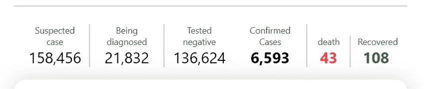

Source: [https://corona-live.com/](https://corona-live.com/)

首先，我们导入了所需的库，我们将使用这些库来可视化数据集以及预测未来事件。

然后我们会读取数据集。根据 KCDC 给定的数据集，有三个 csv 文件:患者、时间和路线。数据集覆盖更新到 3 月 5 日。虽然数据集并不完整，但我们会尝试用可用的信息来可视化。

```
patient = pd.read_csv('patient.csv',index_col="id")
time = pd.read_csv('time.csv')
route = pd.read_csv('route.csv',index_col="id")
patient.head()
time.head()
route.head()
```


Head of patient DataFrame

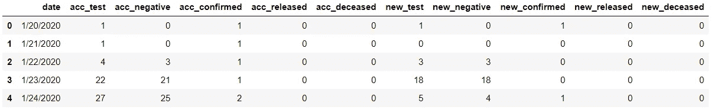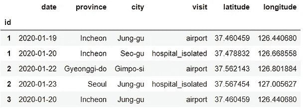

Head of time and route DataFrame

我们有大量信息，如感染患者的性别、出生年份、感染原因、联系电话(确诊为阳性前的联系点)、确诊日期、地区、省、市、纬度、经度、累计死亡人数和确诊病例等。让我们看看一段时间内累计的确诊病例、阴性病例、痊愈病例和死亡病例。

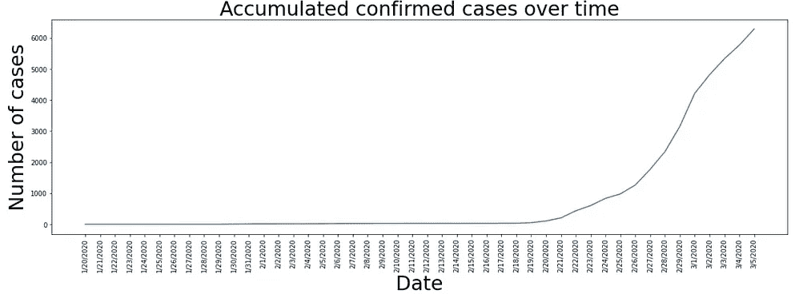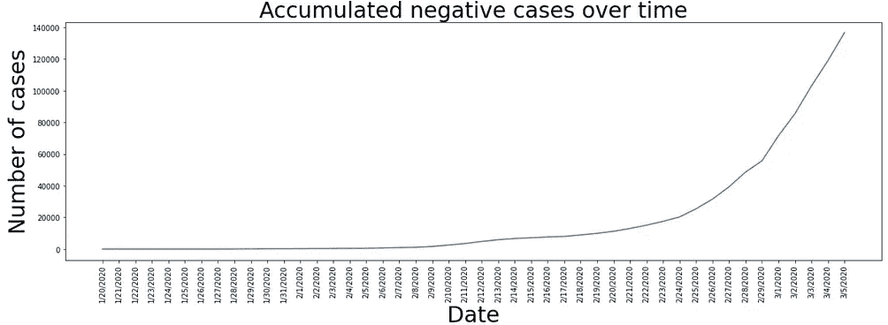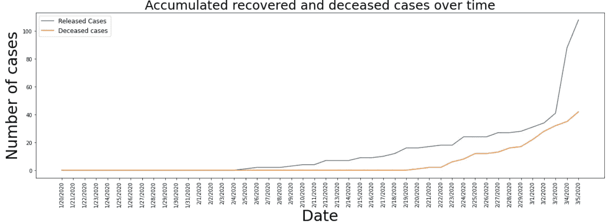

Accumulated confirmed, negative, recovered and deceased case over time.

如果我们更精确地跟踪病人数据，我们可以得到感染病例的原因。像第一个病人在武汉有过一次访问，病毒的源头点。正如我们所看到的，大多数感染者都与确诊患者有过接触，去过大邱，最多的患者都来自那里。

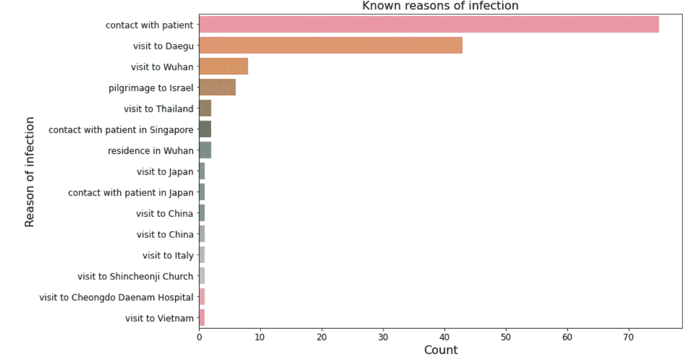

Reason of infection

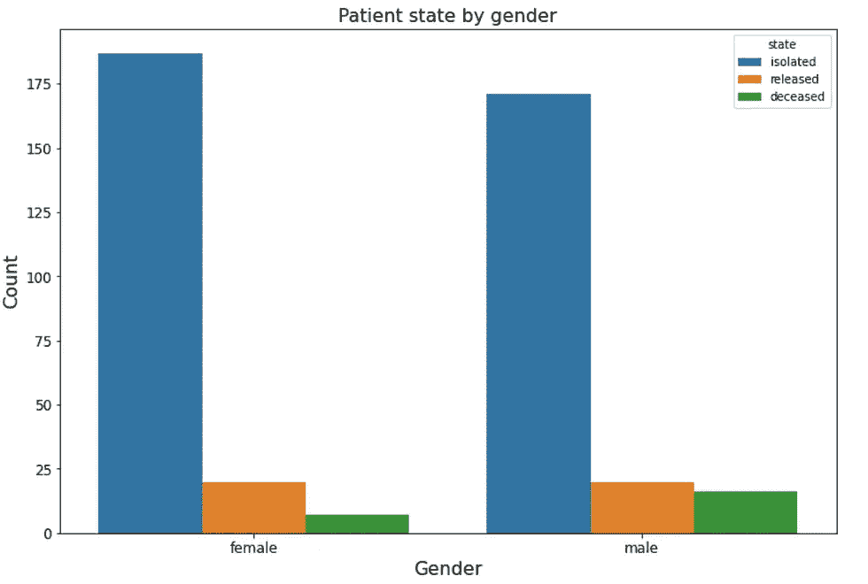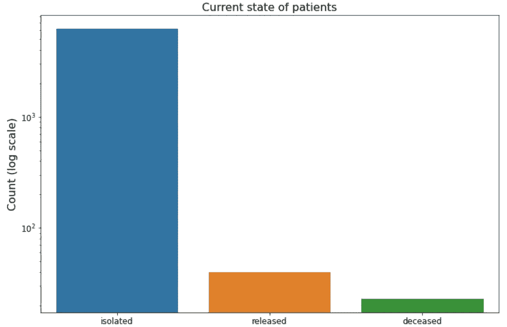

Patient state by gender and current state of patients

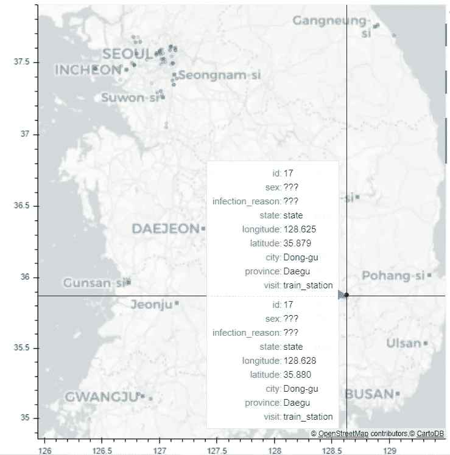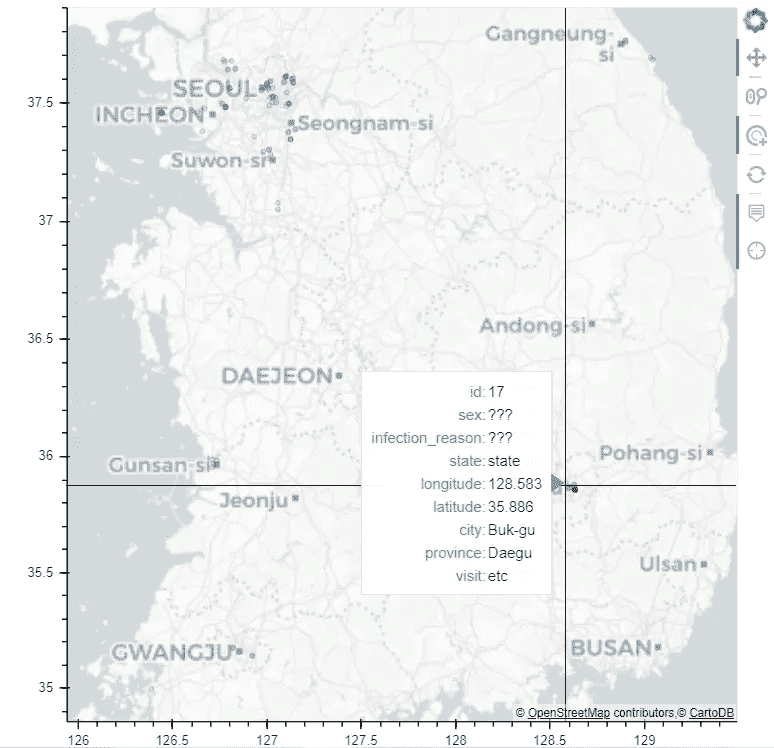

Route details of each confirmed patients with their latitude and longitude information.

根据这里给定的纬度和经度信息，我们在地图上绘制了信息，每个患者的大部分可用信息都可以在地图上找到，如所附照片所示。移动悬停工具，我们可以获得所选新冠肺炎患者的大部分信息。

[](https://www.datadriveninvestor.com/2019/03/25/a-programmers-guide-to-creating-an-eclectic-bookshelf/) [## 创建折衷书架的程序员指南|数据驱动的投资者

### 每个开发者都应该有一个书架。他的内阁中可能的文本集合是无数的，但不是每一个集合…

www.datadriveninvestor.com](https://www.datadriveninvestor.com/2019/03/25/a-programmers-guide-to-creating-an-eclectic-bookshelf/) 

之后，我们定义了一个函数来使用 Plotly 绘制饼图。根据使用 pIf Iie 图的数据集中的可用信息，我们可以观察到 46.7%的受影响患者来自首都地区，尽管大邱的受影响患者最多。这是因为缺乏可用的信息。在韩国，第 31 例患者被称为超级传播者，他在近 1200 时有联系点，并且属于一个宗教团体“新天道”。62%的新川省议员检测呈阳性，接近 3381 人。尽管缺乏信息，但很明显，大约 64%受影响的人来自那个宗教团体。大约 52%的受影响人群直接接触过已经确诊的患者。

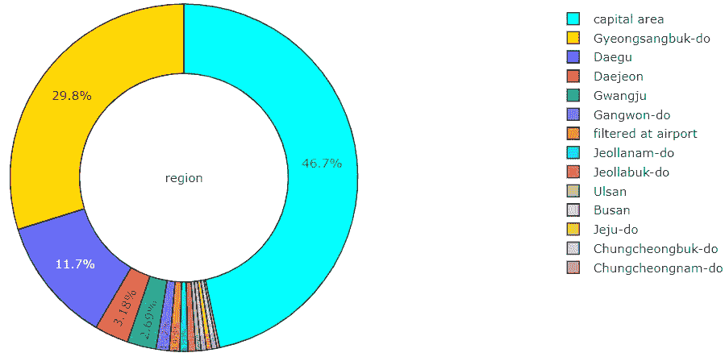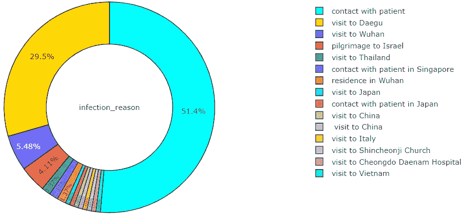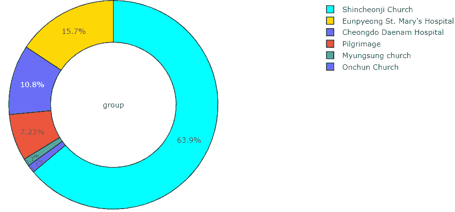

Pie plot for the confirmed patient with respect to several features.

**使用 fbprophet 库在韩国确认的日冕预测:**利用 fbprophet 库，我们做出了一个非常令人满意的预测，并且接近准确的确认案例。根据我们的预测，3 月 5 日确诊的患者应该是 6270，这与确切的病例 6284 太接近了。目前确诊患者为 6593 人，也接近预测。

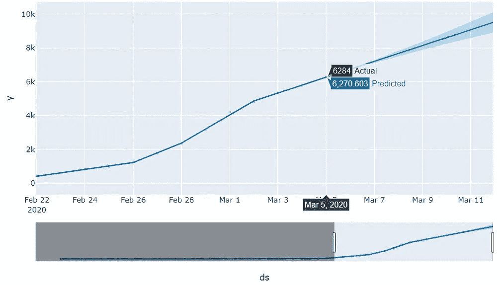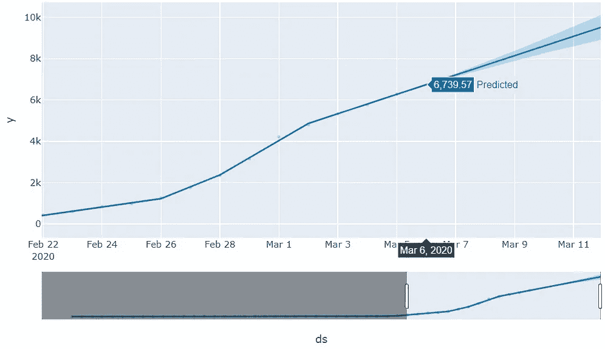

Prediction of the confirmed patient using fbprophet library

全球新冠肺炎确诊病例的实时更新可以在[这里](https://gisanddata.maps.arcgis.com/apps/opsdashboard/index.html?fbclid=IwAR0pxPB6tVBuUPG0yQ2xlnd3tYPqneLV0wwl1V4sM7V0qzRQuaOETc8MVqk#/bda7594740fd40299423467b48e9ecf6)查看。这就是我对南朝鲜新冠肺炎数据的可视化和预测的结束。虽然它在韩国传播很广，但政府采取的措施确实值得称赞。希望有了这些措施和治疗设施，再加上适当的预防措施，我们可以轻松地降低增长率，并有力地抗击新冠肺炎。受影响国家和更具体的受影响地区的每个人都应该避免大规模聚集，如果你感到高烧、咳嗽、呼吸困难，请尽快联系附近的医院。如果你有这样的症状，请在外出时戴上口罩。最后，一些预防措施可以减少被感染的机会。

**保持安全:**
1。每天早上深呼吸，憋气 10 秒以上。
2。至少每隔 15 分钟喝几口水。

如何使用口罩:

希望在不久的将来，我会为确诊病例的预测添加更多的算法。我会尽快添加一个回购协议。非常感谢你的时间。你可以关注我的其他教程简介。我已经发表了**机器学习和数据分析**系列的 4 个部分，这是基于 Inha 大学提供的研究生课程。你可以按照**[**Part-1**](https://towardsdatascience.com/machine-learning-and-data-analysis-inha-university-part-1-be288b619fb5?source=friends_link&sk=583ba29a0766ad36bc993cddc642b11f)**，**[**Part-2**](https://towardsdatascience.com/machine-learning-and-data-analysis-inha-university-part-2-3fb599732021?source=friends_link&sk=80523165c66560e46f907da4c8af0d95)**，**[**Part-3**](https://towardsdatascience.com/machine-learning-and-data-analysis-inha-university-part-3-51cb64c10901?source=friends_link&sk=a735571ab8f7bc418703fc3147eb6ecb)**，** [**Part-4**](https://towardsdatascience.com/machine-learning-and-data-analysis-inha-university-part-4-67aa1aa9c95d?source=friends_link&sk=9f1a2d1a77df1e9019cfea70b9de7edb) 来获得用 Python 进行机器学习移动的起始思路。非常感谢任何建议或批评。**

**[**Part-1**](https://towardsdatascience.com/machine-learning-and-data-analysis-inha-university-part-1-be288b619fb5?source=friends_link&sk=583ba29a0766ad36bc993cddc642b11f)**:**python 基础及安装
[**Part-2**](https://towardsdatascience.com/machine-learning-and-data-analysis-inha-university-part-2-3fb599732021?source=friends_link&sk=80523165c66560e46f907da4c8af0d95)**:**第二章:Python 数据结构—数据类型
[**Part-3**](https://towardsdatascience.com/machine-learning-and-data-analysis-inha-university-part-3-51cb64c10901?source=friends_link&sk=a735571ab8f7bc418703fc3147eb6ecb)**:**Python 中的控制语句(循环)
[**Part:4**](https://towardsdatascience.com/machine-learning-and-data-analysis-inha-university-part-4-67aa1aa9c95d?source=friends_link&sk=9f1a2d1a77df1e9019cfea70b9de7edb)**:**Python 函数【T35**

# **参考链接:**

1.  **[https://www.kaggle.com/kimjihoo/coronavirusdataset](https://www.kaggle.com/kimjihoo/coronavirusdataset)**
2.  **[https://gisanddata . maps . ArcGIS . com/apps/ops dashboard/index . html？FB clid = iwar 0 pxb 6 tvbuupg 0 yq 2 xlnd 3 typqnelv 0 wwl 1 v4 sm 7 v0 qzrquaoetc 8 mvqk #/BDA 7594740 FD 40299423467 b 48 e9 ECF 6](https://gisanddata.maps.arcgis.com/apps/opsdashboard/index.html?fbclid=IwAR0pxPB6tVBuUPG0yQ2xlnd3tYPqneLV0wwl1V4sM7V0qzRQuaOETc8MVqk#/bda7594740fd40299423467b48e9ecf6)**

**3.[https://www . ka ggle . com/arman ruet/冠状病毒-新冠肺炎-可视化-预测？scriptVersionId=29761183](https://www.kaggle.com/armanruet/coronavirus-covid-19-visualization-prediction?scriptVersionId=29761183)**

**4.[https://www . who . int/emergencies/diseases/novel-coronavirus-2019](https://www.who.int/emergencies/diseases/novel-coronavirus-2019)**